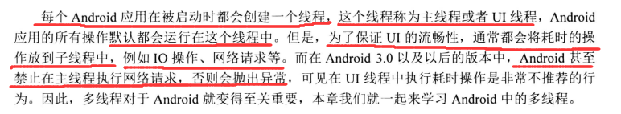

# 第 1 章 

### 服务部分需要日后重新看 不懂 看到项目中涉及到服务的时候再来看

**不懂得主要为绑定服务和AIDL** （11页至17页）

### ContentProvider部分不懂 之后来重新看 

（19页~26页）

# 第 2 章

## ListView与观察者模式（更进一步学习了解下RecyclerView与观察者模式）

 

# 第 3 章 保证 App 流畅的关键因素——多线程

## 3.1 Android 中的消息机制

### Handler、Looper与MessageQueue

