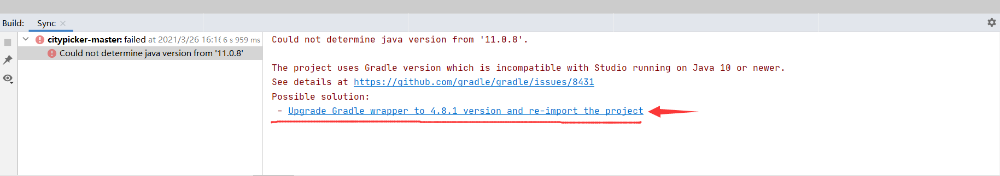
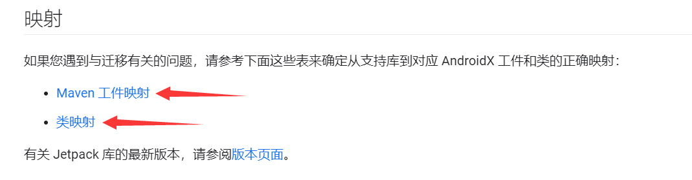

# 如何在本地运行从Github上下载下来的项目

**本质就是看AS下面的Build、Logcat和Run中的报错信息并逐一解决**

## 第一种：AS可自动帮我们完成构建

### 最方便的是打开等待一系列下载加载，即可成功运行

### 打开等待一系列下载加载后，下方显示Upgrade，点击后自动Upgrade完成，即可成功运行

## 第二种：自己本地版本需要使用AndroidX，而下载项目没有使用

#### 使用AS自带的自动迁移前的准备

[是时候迁移至 AndroidX 了！](https://juejin.cn/post/6844904138069770253)

#### 自动迁移后可能还有部分库需要手动修改

[官方文档中关于之前的一些库API对应Android中的映射](https://developer.android.google.cn/jetpack/androidx/migrate)

**官方文档中的如下两段文字点击进入即是所有对应库**

## 遇到的问题

### resource android:attr/dialogCornerRadius not found.

[Android 关于Bug error: resource android:attr/dialogCornerRadius not found.](https://juejin.cn/post/6844903872931201032)

# Failed to open QEMU pipe 'qemud:network': Invalid argument

我重新创建了一个AVD，并在重新创建的AVD中运行我的程序，即问题得到解决并成功运行了