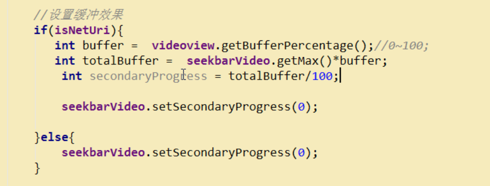

##   drawable-xxx

当需要使用对应分辨率的图片时，需要在res文件夹下创建存放对应分辨率的文件夹


## postDelayed方法

+ 传参：postDelayed中需要传两个参数，一个是Runnable对象，一个是以毫秒为单位的时间

+ 作用：postDelayed经常被用于延时任务，或者定时器。


[postDelayed方法的讲解](https://blog.csdn.net/qq_15110681/article/details/90748985)


## drawable vs mipmap

mipmap文件夹只放应用图标。其他需要使用的drawable资源象之前一样放到对应的drawable文件夹。

[drawable vs mipmap,我的图片该放到哪个文件夹呢？](https://blog.csdn.net/pkorochi/article/details/87162772)


## (底部按钮实现) RadioGroup & RadioButton （包含selector选择器的使用说明）

RadioButton(单选按钮)是一种单选框双状态的按钮，可以选择或不选择。在RadioButton没有被选中时，用户能够按下或点击来选中它。

**RadioGroup和RadioButton的关系：**

> 1、RadioButton表示单个圆形单选框，而RadioGroup是可以容纳多个RadioButton的容器
>
> 2、每个RadioGroup中的RadioButton同时只能有一个被选中
>
> 3、不同的RadioGroup中的RadioButton互不相干，即如果组A中有一个选中了，组B中依然可以有一个被选中
>
> 4、大部分场合下，一个RadioGroup中至少有2个RadioButton
>
> 5、大部分场合下，一个RadioGroup中的RadioButton默认会有一个被选中，并建议您将它放在RadioGroup中的起始位置

**注：** RadioGroup继承至LinearLayout，所以LinearLayout的属性RadioGroup都可以使用。


**RadioButton特殊属性：**

- **android:drawable 设置图片可以选着图片位置**

- **android:checked 控件是否选中**

  + selector状态选择器设置按钮被选择后改变图片

    ```xml
    <selector xmlns:android="http://schemas.android.com/apk/res/android">
        <item android:state_checked="false" android:drawable="@drawable/ic_tab_audio"/>
        <item android:state_checked="true" android:drawable="@drawable/ic_tab_audio_press"/>
     
    </selector>
    ```

    ```xml
    <RadioButton
        ...
    	android:drawableTop="@drawable/rb_video_selector"
    />
    ```

    [selector状态选择器](https://blog.csdn.net/qq_20451879/article/details/80340823)

    [Android中selector的使用](https://blog.csdn.net/wenwen091100304/article/details/49667293?utm_medium=distribute.pc_relevant.none-task-blog-BlogCommendFromMachineLearnPai2-2.control&depth_1-utm_source=distribute.pc_relevant.none-task-blog-BlogCommendFromMachineLearnPai2-2.control)

    [android:drawableTop等布局属性](https://blog.csdn.net/Ada168855/article/details/8648066)

    [drawableTop等属性使用示例](https://shanhy.blog.csdn.net/article/details/39959175?utm_medium=distribute.pc_relevant.none-task-blog-BlogCommendFromMachineLearnPai2-1.control&depth_1-utm_source=distribute.pc_relevant.none-task-blog-BlogCommendFromMachineLearnPai2-1.control)

  + 在活动中判断是否选中按钮，可进行复杂逻辑处理

    + 方法一：(类似按钮监听器的注册即使用)

      ```java
      public class MainActivity extends FragmentActivity {
      
          private RadioGroup rg_main;
      
          @Override
          protected void onCreate(Bundle savedInstanceState) {
              super.onCreate(savedInstanceState);
              setContentView(R.layout.activity_main);
              rg_main = (RadioGroup) findViewById(R.id.rg_main);
      
              rg_main.setOnCheckedChangeListener(new MyOnCheckedChangeListener());	//注册监听器
              rg_main.check(R.id.rb_video);	//设置按钮默认时选中R.id.rb_video(本地视频)
      
          }
      
          //实现监听器接口 重写onCheckedChanged方法
          class MyOnCheckedChangeListener implements RadioGroup.OnCheckedChangeListener {
      
              @Override
              public void onCheckedChanged(RadioGroup group, int checkedId) {
                  switch (checkedId){
                      case R.id.rb_audio://本地音乐
                          ...
                          break;
                      case R.id.rb_net_video://网络视频
                          ...
                          break;
                      case R.id.rb_net_audio://网络音乐
                          ...
                          break;
                      ...
                      default://为默认状态->本地视频
                          ...
                          break;
              }
          }
      }
      ```

      [[Android RadioGroup和RadioButton详解](https://www.cnblogs.com/Im-Victor/p/6238437.html)](https://www.cnblogs.com/Im-Victor/p/6238437.html)

    + 方法二：(没看懂)

      ```java
      public void onRadioButtonClicked(View view) {
          // Is the button now checked?
          boolean checked = ((RadioButton) view).isChecked();	//（当选中时，android:checked 属性值为true，反之为false）
      
          // Check which radio button was clicked
          switch(view.getId()) {
              case R.id.radio_pirates:
                  if (checked)
                      // 
                  break;
              case R.id.radio_ninjas:
                  if (checked)
                      // 
                  break;
          }
      }
      ```

      

- **android:button 隐藏圆圈**

  + 方法一：在RadioButton中定义属性：

    ```xml
    <RadioButton
        ...
    	android:button="@null"
    	android:background="@null"
    />             
    ```

  + 定义一个style并在RadioButton控件中引用

    ```xml
    <resources>
    	...
        
        <style name="bottom_tab_style" >
    		...
            <item name="android:button">@android:color/transparent</item>
            <item name="android:background">@android:color/transparent</item>
        </style>
    
    </resources>
    ```

    ```xml
            <RadioButton
                ...
                style="@style/bottom_tab_style"
     />
    
    ```

    


**实例：**

**RadioGroup & RadioButton & LinearLayout实现底部按钮**

+ \<FrameLayout>中的**layout_weight="1"**是关键，因为其他控件都没有指定layout_weight，即默认为0，故\<FrameLayout>会将屏幕的剩余空间填充满，故RadioGroup会位于屏幕的最下方


## shape绘制背景

使用shape可以很方便的帮我们画出想要的**背景**

**shape可以画四种图形，分别是：矩形（rectangle）、椭圆（oval）、线（line）、圆环（ring）**


[Android Shape详细使用](https://www.jianshu.com/p/ef734937b521)


### 使用步骤

+ **自定义shape**

  实例：

  ```xml
  <?xml version="1.0" encoding="utf-8"?>
  <shape xmlns:android="http://schemas.android.com/apk/res/android" android:shape="rectangle">
      <corners android:radius="12.0dp"/>	//corners：圆角大小
  
      <padding android:bottom="5dp" android:top="5dp" android:left="8dp" android:right="8dp"/>			//padding：设置内边距
      
      <solid android:color="#ff2679ca"/>	//solid：填充颜色
  
  </shape>
  ```

+ **在需要的空间或布局处 通过android:drawable属性引入自定义的shape**

  ```xml
  <?xml version="1.0" encoding="utf-8"?>
  <selector xmlns:android="http://schemas.android.com/apk/res/android">
      
   	<!-- 下面两个item中的android:drawable分别引入一个shape -->
      <item android:state_pressed="false" android:drawable="@drawable/search_bg_normal"/>
      <item android:state_pressed="true" android:drawable="@drawable/search_bg_pressed"/>
  
  </selector>
  ```

  


## 页面的基类 （View）

页面的基类**抽象类BasePager**

```java
package com.atguigu.mobileplayer4.base;

import android.content.Context;
import android.view.View;


public abstract class BasePager {

    /**
     * 上下文
     */
    public Context context;

    /**
     * 视图，有各个子页面实例化的结果
     */
    public View rootView;

    public boolean isInitData = false;

    public BasePager(Context context) {
        this.context = context;
        rootView = initView();//调用孩子的initView();
        isInitData = false;

    }

    /**
     * 强制孩子实现该方法，实现特定的效果
     *
     * @return
     */
    public abstract View initView();


    /**
     * 当孩子需要初始化数据的时候， 重写该方法，用于请求数据，或者显示数据
     */
    public void initData() {

    }
}
```


###  public abstract View initView()

上述中的initView()方法需要return一个View对象，**View一般有以下两种情况**：

+ **返回一个View（.xml布局）**（最常见）

  ```java
  public class VideoPager extends BasePager {
  
      private ListView lv_video_pager;
      private TextView tv_nomedia;
      private ProgressBar pb_loading;
  
  
      public VideoPager(Context context) {
          super(context);
          ...
      }
  
      @Override
      public View initView() {
          View view = View.inflate(context, R.layout.video_pager,null);	//通过View.inflate(Context context, @LayoutRes int resource, ViewGroup root))创建View
          lv_video_pager = (ListView) view.findViewById(R.id.lv_video_pager);
          tv_nomedia = (TextView) view.findViewById(R.id.tv_nomedia);
          pb_loading = (ProgressBar) view.findViewById(R.id.pb_loading);
          ...
          
          return view;	//返回创建的View
      }
  
      @Override
      public void initData() {
          super.initData();
          ...
      }
  	
      ...
      
  }
  ```

+ **返回一个控件**

  实例：

  ```java
  public class AudioPager extends BasePager {
  
      private TextView textView;
  
  
      public AudioPager(Context context) {
          super(context);
      }
  
      @Override
      public View initView() {
          textView = new TextView(context);
          textView.setText("我是本地音频");
          textView.setTextColor(Color.RED);
          textView.setGravity(Gravity.CENTER);
          textView.setTextSize(30);
          return textView;	//返回了一个TextView控件
      }
  
      @Override
      public void initData() {
          super.initData();
          ...
      }
  }
  ```

  


## 实现简单播放器（VideoView）

### 实现简单播放器

**（视频由自定义的播放器播放，但未实现任何如暂停开始，跳转下一个视频，跳转上一个视频，进度条等功能，在后面有补充）**

**新建一个活动，在活动加载自定义的播放器的布局，再在活动中实现播放器的功能**

#### 实例：

```java
//活动部分代码

public class SystemVideoPlayer extends Activity {
    private VideoView videoview;
    private Uri uri;
    
    @Override
    protected void onCreate(Bundle savedInstanceState) {
        super.onCreate(savedInstanceState);
        setContentView(R.layout.activity_system_video_player);	//加载自定义播放器布局
        videoview = (VideoView) findViewById(R.id.videoview);
        uri = getIntent().getData();
        videoview.setVideoURI(uri);

        videoview.setOnPreparedListener(new MediaPlayer.OnPreparedListener() {
            @Override
            public void onPrepared(MediaPlayer mp) {

                videoview.start();//开始播放
            }
        });
        
		//当播放出错的时候回调这个方法
        videoview.setOnErrorListener(new MediaPlayer.OnErrorListener() {
            @Override
            public boolean onError(MediaPlayer mp, int what, int extra) {
                Toast.makeText(SystemVideoPlayer.this, "播放出错了", Toast.LENGTH_SHORT).show();
                return true;
            }
        });
        
		//当播放完成的时候回调这个方法
        videoview.setOnCompletionListener(new MediaPlayer.OnCompletionListener() {
            @Override
            public void onCompletion(MediaPlayer mp) {
                Toast.makeText(SystemVideoPlayer.this, "播放完成", Toast.LENGTH_SHORT).show();
                finish();

            }
        });

        //设置控制面板
        videoview.setMediaController(new MediaController(this));

    }
}

```

```Xml
<!-- 自定义播放器布局代码 -->

<?xml version="1.0" encoding="utf-8"?>
<RelativeLayout xmlns:android="http://schemas.android.com/apk/res/android"
    android:layout_width="match_parent"
    android:gravity="center"
    android:background="@android:color/black"
    android:layout_height="match_parent">

    <VideoView
        android:layout_centerInParent="true"
        android:id="@+id/videoview"
        android:layout_width="match_parent"
        android:layout_height="match_parent" />

</RelativeLayout>
```


#### 调用自定义的播放器

**通过Intent启动自定义的播放器，并将视频的Uri传递过去**

**实例：**

```java
        //设置点击事件
        lv_video_pager.setOnItemClickListener(new AdapterView.OnItemClickListener() {
            @Override
            public void onItemClick(AdapterView<?> parent, View view, int position, long id) {
               //启动自定义播放器SystemVideoPlayer
               Intent intent = new Intent(context, SystemVideoPlayer.class);
               intent.setDataAndType(Uri.parse(mediaItem.getData()),"video/*");//文件
               context.startActivity(intent);

                //传视频列表
                Intent intent = new Intent(context, SystemVideoPlayer.class);
                Bundle bundle = new Bundle();
                bundle.putSerializable("videolist",mediaItems);
                intent.putExtras(bundle);
                intent.putExtra("position",position);
                context.startActivity(intent);
            }
        });
```


### VideoView

#### VideoView使用介绍

Android VideoView类为我们提供了十分方便的视频播放API，其主要方法如下：

- setVideoPath：设置要播放的视频文件的位置
- start：开始或继续播放视频
- pause：暂停播放视频
- resume：将视频从头开始播放
- seekTo：从指定的位置开始播放视频
- isPlaying：判断当前是否正在播放视频
- getCurrentPosition：获取当前播放的位置
- getDuration：获取载入的视频文件的时长
- setVideoPath(String path)：以文件路径的方式设置VideoView播放的视频源
- setVideoURI(Uri uri)：以Uri的方式设置视频源，可以是网络Uri或本地Uri
- setMediaController(MediaController controller)：设置MediaController控制器
- setOnCompletionListener(MediaPlayer.onCompletionListener l)：监听播放完成的事件
- setOnErrorListener(MediaPlayer.OnErrorListener l)：监听播放发生错误时候的事件
- setOnPreparedListener(MediaPlayer.OnPreparedListener l)：监听视频装载完成的事件


除了简单的操作和丰富的API以外，我们在装载视频时，无需进行编码，播放完成后也无需手动回收资源。

除了播放视频，Media Controller类则为我们提供了一个悬浮的操作栏，包含了播放，暂停，快进，快退，上一个，下一个等功能键。甚至连拖动进度条至某处播放都已经实现。在使用前VideoView和MediController需要相互指定控件。其内置方法有如下：

- `boolean isShowing：当前悬浮控制栏是否显示`
- `setMediaPlayer(MediaController.MediaPlayerControl player)：设置控制的组件`
- `setPrevNextListeners(View.OnClickListener next,View.OnClickListener prev)：设置上一个视频、下一个视频的切换事件。`

默认情况下，Media Controller悬浮显示3s后隐藏，触摸响应的VideoView呼出。默认上一个，下一个按钮隐藏。


#### VideoView底层

##### VideoView的介绍

VideoView继承SurfaceView，并且里面封装MediaPlayer


##### MediaPlayer用于播放视频和音频控件

解码-底层C代码-JNI
1.可以用来播放视频
2.用来播放音乐
3.和底层打交道
4.使用它和封装它要遵循机制


##### VideoView

封装了MediaPlayer继承SurfaceView，当封装MediaPlayer的时候，要按照MediaPlayer的状态机制去封装


##### SurfaceView

SurfaceView默认使用双缓冲技术的，它支持在子线程中绘制图像，这样就不会阻塞主线程了，所以它更适合于游戏的开发和视频播放的显示


##### 在Android系统里面，一般提供给开发者开发视频或者音频这方面的：MediaPlayer和VideoView

+ 视频播放器： 
  + 直接使用VideoView
  + MediaPlayer和SurfaceView结合
+ 音乐播放器：
  +  Service和MediaPlayer结合  


[使用VideoView播放视频](https://www.cnblogs.com/renhui/p/9267778.html)

[VideoView详解](https://www.jianshu.com/p/2d3b221a2ee7)


## 完善简单播放器

**播放器一般是全屏的（即需要在活动中设定：android:theme="@android:style/Theme.Black.NoTitleBar.Fullscreen"）,故需要自定义在最右上角实现电量显示和当前时间显示** 

### 简单使用ImageView实现显示电量（包含是否在充电状态）

+ 在xml中设置电量（ImageView）显示的位置

+ 动态注册电量广播（电量广播不能静态注册）
+ 在onReceive()中获取当前电量信息，并根据电量信息适当选择更改图片
+ 最后记得在onDestory()方法中取消注册（注意取消注册要在super.onDestroy()之前）

**实例：**

```java
//Java中显示的代码
	private BatteryReceiver receiver;
    private ImageView iv_battery;

    @Override
    protected void onCreate(Bundle savedInstanceState) {
        super.onCreate(savedInstanceState);
        iv_battery = (ImageView) findViewById(R.id.iv_battery);
        ...
    }

	private void initData() {
        utils = new Utils();
        //注册监听电量广播
        IntentFilter intentFilter = new IntentFilter();
        intentFilter.addAction(Intent.ACTION_BATTERY_CHANGED);
        receiver = new BatteryReceiver();
        registerReceiver(receiver,intentFilter);
    }

    class BatteryReceiver extends BroadcastReceiver{

        @Override
        public void onReceive(Context context, Intent intent) {
            int level = intent.getIntExtra("level",0);//电量：0~100
            //主线程
            setBattery(level);
        }
    }

    private void setBattery(int level) {
        //根据对应的电量设置当前显示的图片
        if(level<=0){
            iv_battery.setImageResource(R.drawable.ic_battery_0);
        }else if(level <=10){
            iv_battery.setImageResource(R.drawable.ic_battery_10);
        }else if(level <=20){
            iv_battery.setImageResource(R.drawable.ic_battery_20);
        }else if(level <=30){
            iv_battery.setImageResource(R.drawable.ic_battery_30);
        }else if(level <=40){
            iv_battery.setImageResource(R.drawable.ic_battery_40);
        }else if(level <=50){
            iv_battery.setImageResource(R.drawable.ic_battery_50);
        }else if(level <=60){
            iv_battery.setImageResource(R.drawable.ic_battery_60);
        }else if(level <=70){
            iv_battery.setImageResource(R.drawable.ic_battery_70);
        }else if(level <=80){
            iv_battery.setImageResource(R.drawable.ic_battery_80);
        }else if(level <=90){
            iv_battery.setImageResource(R.drawable.ic_battery_90);
        }else if(level <=100){
            iv_battery.setImageResource(R.drawable.ic_battery_100);
        }else{
            iv_battery.setImageResource(R.drawable.ic_battery_100);
        }
    }

    @Override
    protected void onDestroy() {

        if(receiver != null){
            unregisterReceiver(receiver);
            receiver = null;
        }

        super.onDestroy();
    }
```

```xml
<!-- xml中的代码 -->        
        <LinearLayout
            android:layout_width="match_parent"
            android:layout_height="wrap_content"
            android:background="@drawable/bg_player_status"
            android:gravity="center_vertical"
            android:orientation="horizontal">
			
            <!-- 载入视频名称显示 -->
            <TextView
                android:id="@+id/tv_name"
                android:layout_width="wrap_content"
                android:layout_height="wrap_content"
                android:layout_marginLeft="5dp"
                android:layout_weight="1"	//将电量显示和系统时间显示弄到了最右边
                android:text="视频的名称"
                android:textColor="#ffffff" />
            
			<!-- 电量显示 -->
            <ImageView
                android:id="@+id/iv_battery"
                android:layout_width="wrap_content"
                android:layout_height="wrap_content"
                android:layout_gravity="center_vertical"
                android:layout_marginLeft="5dp"
                android:layout_marginRight="5dp"
                android:src="@drawable/ic_battery_0" />

			<!-- 系统时间显示 -->
            <TextView
                android:id="@+id/tv_time"
                android:layout_width="wrap_content"
                android:layout_height="wrap_content"
                android:layout_marginLeft="5dp"
                android:layout_marginRight="5dp"
                android:text="系统时间"
                android:textColor="#ffffff" />

        </LinearLayout>
```


### 简单使用TextView实现显示系统时间

+ 获取系统时间并格式化（[Data方法讲解](https://www.runoob.com/java/java-date-time.html)，[SimpleDateFormat类讲解](https://blog.csdn.net/Chaolei3/article/details/97389637)）
+ 放在逻辑的hander的某处，循环更新

```java
    private TextView tvTime;

    @Override
    protected void onCreate(Bundle savedInstanceState) {
        super.onCreate(savedInstanceState);
		tvTime = (TextView)findViewById( R.id.tv_time );
        ...
    }


	private String getSysteTime() {
        SimpleDateFormat format = new SimpleDateFormat("HH:mm:ss");
        return format.format(new Date());	//
    }

	//在某处发送了消息后，循环更新时间
    private Handler handler = new Handler(){
        @Override
        public void handleMessage(Message msg) {
            super.handleMessage(msg);
            switch (msg.what){
                case PROGRESS:
                    ...
                    //更新系统时间
                    tvTime.setText(getSysteTime());

                    //每一秒更新一次
                    removeMessages(PROGRESS);
                    sendEmptyMessageDelayed(PROGRESS, 1000);
                    break;
            }
        }
    };
```

```xml
<!-- xml中的代码 -->        
        <LinearLayout
            android:layout_width="match_parent"
            android:layout_height="wrap_content"
            android:background="@drawable/bg_player_status"
            android:gravity="center_vertical"
            android:orientation="horizontal">
            
		<!-- 载入视频名称显示 -->
        <TextView
            android:id="@+id/tv_name"
            android:layout_width="wrap_content"
            android:layout_height="wrap_content"
            android:layout_marginLeft="5dp"
            android:layout_weight="1"	//将电量显示和系统时间显示弄到了最右边
            android:text="视频的名称"
            android:textColor="#ffffff" />
        
		<!-- 电量显示 -->
        <ImageView
            android:id="@+id/iv_battery"
            android:layout_width="wrap_content"
            android:layout_height="wrap_content"
            android:layout_gravity="center_vertical"
            android:layout_marginLeft="5dp"
            android:layout_marginRight="5dp"
            android:src="@drawable/ic_battery_0" />

		<!-- 系统时间显示 -->
        <TextView
            android:id="@+id/tv_time"
            android:layout_width="wrap_content"
            android:layout_height="wrap_content"
            android:layout_marginLeft="5dp"
            android:layout_marginRight="5dp"
            android:text="系统时间"
            android:textColor="#ffffff" />

    </LinearLayout>
```


## 实现进度条

如音量大小控制，视频、音频进度控制等等需要用到进度条

### Seekbar


**Seekbar是ProgressBar的子类**，ProgressBar的属性都可以使用，此外他还有一个自己的属性：**android:thumb**【就是允许我们自定义滑块】

```xml
常见属性：

android:max="100"	//滑动条的最大值
android:progress="60"	//滑动条的当前值
android:secondaryProgress="70"	//二级滑动条的进度
android:progressDrawable="@drawable/sb_bar"	 //设置轨道对应的Drawable对象
android:thumb = "@mipmap/sb_icon"	//滑块的drawable
```


#### 一般UI实现

```xml
<SeekBar
        android:id="@+id/xxx"
        android:layout_width="match_parent"
        android:layout_height="wrap_content"
         
        //android:maxHeight与android:minHeight控制进度条的高度,但不影响滑块的drawable的大小（下方的thumb属性值）
        android:maxHeight="5.0dp"
        android:minHeight="5.0dp"
        
        android:progress="20"	//滑动条的当前值
        android:progressDrawable="@drawable/progress_horizontal"	//设置轨道对应的Drawable对象
        android:thumb="@drawable/progress_thumb"	//滑块的drawable
/>
```

```xml
<!-- progress_horizontal.xml中的内容  layer-list中层叠图片分别为：背景，二级进度条，当前进度 --> 	
<layer-list xmlns:android="http://schemas.android.com/apk/res/android">

    <item android:id="@android:id/background" android:drawable="@drawable/progress_background" />

    <item android:id="@android:id/secondaryProgress" android:drawable="@drawable/progress_secondaryprogress">
    </item>

    <item android:id="@android:id/progress" android:drawable="@drawable/progress_normal">
    </item>

</layer-list>
```


#### 功能实现

Java代码中实现：

##### 实现seekbar的自动移动

+ 在视频或音频等点开始，获取其最大时长，通过setMax(time)方法设置进seekbar中，然后发送消息

  ```java
      private void setListener() {
          //当底层解码器准备好的时候，回调这个方法
          videoview.setOnPreparedListener(new MediaPlayer.OnPreparedListener() {
              @Override
              public void onPrepared(MediaPlayer mp) {
  
  //                mp.setLooping(true);
  
                  //1.得到视频的总时长、并通过SeeKBar.setMax()设置;
                  int duration = videoview.getDuration();
                  seekbarVideo.setMax(duration);
  
                  //设置文字显示总时长
                  tvDuration.setText(utils.stringForTime(duration));
  
                  //2.发消息更新
                  handler.sendEmptyMessage(PROGRESS);
  
                  videoview.start();//开始播放
              }
          });
  ```

+ 在hander中**循环**获取当前进度。（循环为，移除消息，并每一秒重新发送一次消息）

  ```java
      private Handler handler = new Handler(){
          @Override
          public void handleMessage(Message msg) {
              super.handleMessage(msg);
              switch (msg.what){
                  case PROGRESS:
  
                      //得到当前的播放进度
                      int currentPosition = videoview.getCurrentPosition();
                      seekbarVideo.setProgress(currentPosition);
  
                      tvCurrentTime.setText(utils.stringForTime(currentPosition));
  
  
                      //更新系统时间
                      tvTime.setText(getSysteTime());
  
                      //每一秒更新一次
                      removeMessages(PROGRESS);	//移除消息
                      sendEmptyMessageDelayed(PROGRESS, 1000);	//重新发送消息
                      break;
              }
          }
      };
  ```


##### 实现拖动进度条功能

**步骤：**

+ **新建一个类实现SeekBar.OnSeekBarChangeListener接口**
+ **为Seekbar注册监听（注意：要想实现进度条拖动，必须设定进度条的最大值：`seekbar.setMax(maxInt)`）**


**SeekBar.OnSeekBarChangeListener**中有三个对应的方法需要重写：

```java
onProgressChanged：进度发生改变时会触发

onStartTrackingTouch：按住SeekBar时会触发

onStopTrackingTouch：放开SeekBar时触发
```


具体实现：

```java
    @Override
    protected void onCreate(Bundle savedInstanceState) {
        ...
        setListener();
    }
	...
        
	private void setListener() {
		...
		seekbarVideo.setOnSeekBarChangeListener(new VideoOnSeekBarChangeListener());    
	}

	class VideoOnSeekBarChangeListener implements SeekBar.OnSeekBarChangeListener {

        /**
         * 当进度更新的时候回调这个方法
         * @param seekBar
         * @param progress 当前进度
         * @param fromUser 是否由用户引起（当手触碰时变为true，其余时候默认为false）
         */
        @Override
        public void onProgressChanged(SeekBar seekBar, int progress, boolean fromUser) {
            if(fromUser){
                videoview.seekTo(progress);
            }

        }

        /**
         * 当手触碰SeekBar的时候回调这个方法
         * @param seekBar
         */
        @Override
        public void onStartTrackingTouch(SeekBar seekBar) {

        }

        /**
         * 当手指离开SeeKbar的时候回调这个方法
         * @param seekBar
         */
        @Override
        public void onStopTrackingTouch(SeekBar seekBar) {

        }
    }
```

[菜鸟教程-Seekbar](https://www.runoob.com/w3cnote/android-tutorial-seekbar.html)


##### 设置视频缓冲效果




## layer-list

layer-list在上述的Seekbar中有实例


### layer-list的简介

+ 使用**layer-list可以将多个drawable按照顺序层叠在一起显示**，默认情况下，所有的item中的drawable都会自动根据它附上view的大小而进行缩放，

+ **layer-list中的item是按照顺序从下往上叠加的**，即先定义的item在下面，后面的依次往上面叠放

​    

### layer-list的使用

```xml
<!-- layer-list中层叠图片分别为：背景，二级进度条，当前进度 --> 	
<!-- 一般放在drawable文件下 -->

<layer-list xmlns:android="http://schemas.android.com/apk/res/android">

    <item android:id="@android:id/background" android:drawable="@drawable/progress_background" />

    <item android:id="@android:id/secondaryProgress" android:drawable="@drawable/progress_secondaryprogress">
    </item>

    <item android:id="@android:id/progress" android:drawable="@drawable/progress_normal">
    </item>

</layer-list>
```


[layer-list的基本使用介绍](https://blog.csdn.net/north1989/article/details/53485729?utm_medium=distribute.pc_relevant.none-task-blog-BlogCommendFromMachineLearnPai2-2.control&dist_request_id=f17fe1e0-e05d-4de7-b827-08d8df71f74e&depth_1-utm_source=distribute.pc_relevant.none-task-blog-BlogCommendFromMachineLearnPai2-2.control)


##  Activity生命周期相关内容

### 横竖屏切换 

onPause-->onStop-->onDestroy-->onCreate -->onStart-->onResume

【下面的横竖屏切换问题中有详细的讲解】


### 从A页面跳转到B页面执行的方法

#### 1.B页面完全覆盖A页面的情况

A-onPause-->B--onCreate--->B-onStart---B--onResume--A-onStop

####  2.如果B页面不完全覆盖A页面呢

A-onPause-->B--onCreate--->B-onStart---B--onResume--
少了执行**onStop**


### 在B页面点击返回

####  1.B页面完全覆盖A页面的情况

 B-onPause-->A-onRestart-->A--onStart-->A-onResume-->B-onStop->B-onDestroy
多执行了A页面的**onRestart**

####  2.如果B页面不完全覆盖A页面呢

 B-onPause-->A-onResume--B-onStop--B-onDestroy


## LogUtils：“日志打印工具类“

### LogUtil的优势

**LogUtil打印封装类，其有以下优点：**

1. 显示当前项目的包名
2. 显示当前日志级别
3. 显示tag
4. 显示log所在类的类名
5. 显示log调用处所在的方法名
6. 显示log所在的行数
7. 点击行数定位到具体代码处


### 使用方法

+ 将工具类拷贝进项目的Java包下（该类具体代码放在文章的最后的其他内容中了）

  

+ 在需要使用的文件内import该类，即可在需要的地方调用其内部的方法（内部方法如下所示）

  

  **具体使用：**

  + ###### 快速打印log

    快速打印log时，log的tag会固定为LogUtil中的TAG值，你可以这样调用：

    ```java
    LogUtil.e("=====測試按鈕被點擊了====");
    ```

  + ###### 定义自己的tag日志

    如果你想定义一个tag=”abc“的log方便自己调试，你可以这样：

    ```java
    LogUtil.e("abc","=====測試按鈕被點擊了====");
    ```


[LogUtils的讲解](http://www.demodashi.com/demo/12646.html)


## 横竖屏切换问题

**当一个配置（如横竖屏切换）改变在运行中发生时，activity默认情况下会先销毁然后重新创建。**

+ **解决方法一：直接固定为横屏或者竖屏，不让其可以横竖屏切换**

  在AndroidMainfest.xml的activity中设定android:screenOrientation的值（具体有哪些可选值在下方链接/官方文档中可查看）

  **实例：**

  ```Xml
  <activity
  	android:name="XXX"          
  	android:screenOrientation="landscape"
  	...
  />
  ```

+ **解决方法二：设定android:configChange的值，使得配置改变时activity也不会销毁重建**

  + API 13开始，配置“android:configChanges="orientation|keyboardHidden|screenSize”
  + API 13之前 ，配置“android:configChanges="orientation|keyboardHidden”

  设置完成后，切屏不会重新调用各个生命周期，只会执行onConfigurationChanged方法

  **实例：**

  ```xml
  <activity
  	android:name="XXX"
  	android:configChanges="keyboardHidden|screenSize|orientation"
      ...
  />
  ```

[Android横竖屏切换详解](https://www.jianshu.com/p/dbc7e81aead2)


## 手势监听类（GestureDetector）

### Android中手势交互的执行顺序

1.手指触碰屏幕时，触发**MotionEvent**事件

2.该事件被**OnTouchListener**监听，可在它的**onTouch()**方法中获得该**MotionEvent**对象

3.通过**GestureDetector**转发**MotionEvent**对象给**OnGestureListener**

4.我们可以通过**OnGestureListener**获得该对象，然后获取相关信息，以及做相关处理

+ **MotionEvent**: 这个类用于封装手势、触摸笔、轨迹球等等的动作事件。 其内部封装了两个重要的属性X和Y，这两个属性分别用于记录横轴和纵轴的坐标
+ **GestureDetector**: 识别各种手势。
+ **OnGestureListener**: 这是一个手势交互的监听接口，其中提供了多个抽象方法， 并根据**GestureDetector**的手势识别结果调用相对应的方法


### GestureListener详解

#### 监听手势的关键是:GestureListener 他给我们提供了下述的回调方法：

- 按下（onDown）： 刚刚手指接触到触摸屏的那一刹那，就是触的那一下。

- 抛掷（onFling）： 手指在触摸屏上迅速移动，并松开的动作。

- 长按（onLongPress）： 手指按在持续一段时间，并且没有松开。

- 滚动（onScroll）： 手指在触摸屏上滑动。

- 按住（onShowPress）： 手指按在触摸屏上，它的时间范围在按下起效，在长按之前。

- 抬起（onSingleTapUp）：手指离开触摸屏的那一刹那。

  ```java
      public boolean onDown(MotionEvent e) {  
          // TODO Auto-generated method stub  
          return false;  
      }  
    
      public void onShowPress(MotionEvent e) {  
          // TODO Auto-generated method stub  
            
      }  
    
      public boolean onSingleTapUp(MotionEvent e) {  
          // TODO Auto-generated method stub  
          return false;  
      }  
    
      public boolean onScroll(MotionEvent e1, MotionEvent e2,  
              float distanceX, float distanceY) {  
          // TODO Auto-generated method stub  
          return false;  
      }  
    
      public void onLongPress(MotionEvent e) {  
          // TODO Auto-generated method stub  
            
      }  
    
      public boolean onFling(MotionEvent e1, MotionEvent e2, float velocityX,  
              float velocityY) {  
          // TODO Auto-generated method stub  
          return false;  
      }
  
  
  
  这些函数都在什么情况下才会触发呢，下面讲一下：
  
  OnDown(MotionEvent e)：用户按下屏幕就会触发；
  onShowPress(MotionEvent e)：如果是按下的时间超过瞬间，而且在按下的时候没有松开或者是拖动的，那么onShowPress就会执行，具体这个瞬间是多久，我也不清楚呃……
  onLongPress(MotionEvent e)：长按触摸屏，超过一定时长，就会触发这个事件    
      触发顺序：    onDown->onShowPress->onLongPress
  onSingleTapUp(MotionEvent e)：从名子也可以看出,一次单独的轻击抬起操作,也就是轻击一下屏幕，立刻抬起来，才会有这个触发，当然,如果除了Down以外还有其它操作,那就不再算是Single操作了,所以也就不会触发这个事件    
  触发顺序：    
  点击一下非常快的（不滑动）Touchup：   
   onDown->onSingleTapUp->onSingleTapConfirmed     
  点击一下稍微慢点的（不滑动）Touchup：    
  onDown->onShowPress->onSingleTapUp->onSingleTapConfirmed
  
  onFling(MotionEvent e1, MotionEvent e2, float velocityX,float velocityY)：滑屏，用户按下触摸屏、快速移动后松开，由1个MotionEvent ACTION_DOWN, 多个ACTION_MOVE, 1个ACTION_UP触发        
  参数解释：    
  e1：第1个ACTION_DOWN MotionEvent    
  e2：最后一个ACTION_MOVE MotionEvent    
  velocityX：X轴上的移动速度，像素/秒    
  velocityY：Y轴上的移动速度，像素/秒   
  onScroll(MotionEvent e1, MotionEvent e2,float distanceX, float distanceY)：在屏幕上拖动事件。无论是用手拖动view，或者是以抛的动作滚动，都会多次触发,这个方法       在ACTION_MOVE动作发生时就会触发    滑屏：手指触动屏幕后，稍微滑动后立即松开    
  onDown-----》onScroll----》onScroll----》onScroll----》………----->onFling    
  拖动    
  onDown------》onScroll----》onScroll------》onFiling
      可见，无论是滑屏，还是拖动，影响的只是中间OnScroll触发的数量多少而已，最终都会触发onFling事件！
  ```

[参考文章](https://www.jianshu.com/p/7b47be38f64a)


#### 知道了GestureListener的相关方法后，实现手势检测也很简单，步骤如下：

- Step 1: 创建GestureDetector对象，创建时需自定义实现GestureListener接并传入

- Step 2: 将Activity或者特定组件上的TouchEvent的事件交给GestureDetector处理即可（重写onTouchEvent方法）

  [官方文档](https://developer.android.com/training/gestures/detector?hl=zh-cn)	[onTouch()与onTouchEvent()的区别](https://blog.csdn.net/guyuealian/article/details/51637033)

  

- **检测所有受支持的手势（实现GestureDetector.OnGestureListener接口）**

  自定义GestureListener时，选择实现GestureDetector.OnGestureListener接口，则需要实现所有的手势，如下所示：

  实例：

  ```java
  public class MainActivity extends AppCompatActivity {
  
      private MyGestureListener mgListener;
      private GestureDetector mDetector;
      private final static String TAG = "MyGesture";
  
      @Override
      protected void onCreate(Bundle savedInstanceState) {
          super.onCreate(savedInstanceState);
          setContentView(R.layout.activity_main);
          
          //实例化GestureListener与GestureDetector对象
          mgListener = new MyGestureListener();
          mDetector = new GestureDetector(this, mgListener);
  
      }
  
      @Override
      public boolean onTouchEvent(MotionEvent event) {
          return mDetector.onTouchEvent(event);
      }
  
      //自定义一个GestureListener,这个是View类下的，别写错哦！！！
      private class MyGestureListener implements GestureDetector.OnGestureListener {
  
          @Override
          public boolean onDown(MotionEvent motionEvent) {
              Log.d(TAG, "onDown:按下");
              return false;
          }
  
          @Override
          public void onShowPress(MotionEvent motionEvent) {
              Log.d(TAG, "onShowPress:手指按下一段时间,不过还没到长按");
          }
  
          @Override
          public boolean onSingleTapUp(MotionEvent motionEvent) {
              Log.d(TAG, "onSingleTapUp:手指离开屏幕的一瞬间");
              return false;
          }
  
          @Override
          public boolean onScroll(MotionEvent motionEvent, MotionEvent motionEvent1, float v, float v1) {
              Log.d(TAG, "onScroll:在触摸屏上滑动");
              return false;
          }
  
          @Override
          public void onLongPress(MotionEvent motionEvent) {
              Log.d(TAG, "onLongPress:长按并且没有松开");
          }
  
          @Override
          public boolean onFling(MotionEvent motionEvent, MotionEvent motionEvent1, float v, float v1) {
              Log.d(TAG, "onFling:迅速滑动，并松开");
              return false;
          }
      }
  
  }
  ```

- **检测一部分受支持的手势（实现GestureDetector.SimpleOnGestureListener接口）**

  `GestureDetector.SimpleOnGestureListener` 通过针对所有 `on<TouchEvent>` 方法返回 `false`，提供对所有这些方法的实现

  无论您是否使用 `GestureDetector.OnGestureListener`，最佳做法都是实现返回 `true` 的 `onDown()` 方法。这是因为所有手势都以 `onDown()` 消息开头。如果您从 `onDown()` 返回 `false`（与 `GestureDetector.SimpleOnGestureListener` 的默认做法一样），系统会认为您想要忽略其余手势，并且永远不会调用 `GestureDetector.OnGestureListener` 的其他方法。这可能会导致您的应用出现意外问题。只有当您确实想要忽略整个手势时，才应该从 `onDown()` 返回 `false`。

  实例：

  ```java
      public class MainActivity extends Activity {
  
          private GestureDetectorCompat mDetector;
  
          @Override
          public void onCreate(Bundle savedInstanceState) {
              super.onCreate(savedInstanceState);
              setContentView(R.layout.activity_main);
              mDetector = new GestureDetectorCompat(this, new MyGestureListener());
          }
  
          @Override
          public boolean onTouchEvent(MotionEvent event){
              this.mDetector.onTouchEvent(event);
              return super.onTouchEvent(event);
          }
  
          class MyGestureListener extends GestureDetector.SimpleOnGestureListener {
              private static final String DEBUG_TAG = "Gestures";
  
              @Override
              public boolean onDown(MotionEvent event) {
                  Log.d(DEBUG_TAG,"onDown: " + event.toString());
                  return true;
              }
  
              @Override
              public boolean onFling(MotionEvent event1, MotionEvent event2,
                      float velocityX, float velocityY) {
                  Log.d(DEBUG_TAG, "onFling: " + event1.toString() + event2.toString());
                  return true;
              }
          }
      }
      
  ```

  


## 动态设置控件的宽和高（LayoutParams）

### 使用LayoutParams

+ LayoutParams继承于Android.View.ViewGroup.LayoutParams相当于一个Layout的信息包，它封装了Layout的位置、高、宽等信息

+ LayoutParams类是用于child view(子视图)向parent view(父视图)传达自己的意愿的一个东西(孩子想变成什么样向其父亲说明)
  + 举个例子：父视图和子视图分别可以简单理解成一个LinearLayout 和该LinearLayout里边的一个 TextView 的关系， TextView 就算LinearLayout的子视图(child view)
+ LayoutParams只是ViewGroup的一个内部类，**对于不同的ViewGroup子类，有不同的LayoutParams子类（一般为ViewGroup名.LayoutParams,如RadioGroup.LayoutParams，LinearLayout.LayoutParams等）**
+ ViewGroup.LayoutParams类**只能简单的设置高height以及宽width两个基本的属性**，宽和高都可以设置成三种值：
  + 一个确定的值
  + MATCH_PARENT
  + WRAP_CONTENT


#### 步骤

+ 先利用**getLayoutParams()**方法，获取控件的LayoutParams（getLayoutParams()方法的调用必须要有父控件,否则返回的就是null对象）
+ 设置该控件的layoutParams参数
+ 利用**setLayoutParams()**方法将修改好的layoutParams设置为该控件的layoutParams

**具体有哪些方法，有哪些参数查看Android Developers（一般为ViewGroup名.LayoutParams）**

**使用实例：**

```java
示例一：
   //java中
   private ImageView mIv;

   mIv = (ImageView) findViewById(R.id.mIv);

   mIv.setLayoutParams(new LinearLayout.LayoutParams(65, 65));

	//xml中
	<LinearLayout
        android:layout_width="match_parent"
        android:layout_height="200px"
        android:background="#66ff0000"
        >
        <ImageView
            android:id="@+id/mIv"
            android:layout_width="30dp"
            android:layout_height="40px"
            android:background="#000"
            android:layout_centerHorizontal="true"
            />
        ...
	</LinearLayout>

示例二：
    //java中
	private ImageView mIv;

    mIv = (ImageView) findViewById(R.id.mIv);
	RelativeLayout.LayoutParams params = new RelativeLayout.LayoutParams(vg_lp);

	params.width = 	dip2px(LikeXmlActivity.this,200);
	params.height = dip2px(LikeXmlActivity.this,30);

	mIv.setLay、outParams(params);

	
	//xml中
	<RelativeLayout
        android:layout_width="match_parent"
        android:layout_height="200px"
        android:background="#66ff0000"
        >
        <ImageView
            android:id="@+id/mIv"
            android:layout_width="30dp"
            android:layout_height="40px"
            android:background="#000"
            android:layout_centerHorizontal="true"
            />
        ...
    </RelativeLayout>
```

[从LayoutParams说起到代码动态布局](https://www.jianshu.com/p/0d6f753fdd92)


## 得到屏幕的高和宽（DisplayMetrics）

Android 可设置为随着窗口大小调整缩放比例，但即便如此，手机程序设计人员还是必须知道手机屏幕的边界，以避免缩放造成的布局变形问题

手机的分辨率信息是手机的一项重要信息，很好的是，Android 已经提供DisplayMetircs 类可以很方便的获取分辨率。

Andorid.util 包下的DisplayMetrics 类提供了一种关于显示的通用信息，如显示大小，分辨率和字体

**具体使用方法如下：**

```java
        //获取DisplayMetrics对象
		DisplayMetrics displayMetrics = new DisplayMetrics();
		//getMetrics()方法传入DisplayMetrics对象，将当前窗口的一些信息放在DisplayMetrics对象中
        this.getWindowManager().getDefaultDisplay().getMetrics(displayMetrics);
		
		Log.d("yujian<<", displayMetrics.toString())
        /**	Log.d输出内容为：
    	 *  03-04 10:49:57.840 1898-1898/com.example.temptry E/yujian<<: DisplayMetrics{density=2.625, 				 	width=1080, height=1794, scaledDensity=2.625, xdpi=420.0, ydpi=420.0}
		 *有输出内容可知，DisplayMetrics类中有属性
		 * density：显示的逻辑分辨率
		 * width：可用显示大小的绝对宽度(以pixels为单位),获取的时候要用.widthPixels
		 * height：可用显示大小的绝对高度(以pixels为单位),获取的时候要用.heightPixels
		 * scaleDensity：显示字体的比例因子
		 * xdpi：在X维中，屏幕每英寸的确切物理像素
		 * ydpi：在Y维中，屏幕每英寸的确切物理像素
     	*/
```

**更详细的内容可查看Android Developers（直接搜索DisplayMetrics）**


## Android中的dip, dp, px, sp之间的区别

在Android规范中，如果要指定控件或者布局的固定大小，建议使用dp作为单位，如果要指定文字大小，则建议使用sp作为单位
[详细介绍对比](https://www.dazhuanlan.com/2019/10/16/5da6493d67aaf/)


## 调整声音（AudioManager/getSystemService方法）

**AudioManager(音频管理器)**类位于Android.Media包下，提供了**音量控制与铃声模式**相关操作！

**具体使用：**

+ 获得AudioManager实例

  ```java
  AudioManager audiomanage = (AudioManager)context.getSystemService(Context.AUDIO_SERVICE);
  ```

  **getSystemService用于Android应用层获取系统java层的service：**

  首先，通过传入的service name从SYSTEM_SERVICE_MAP这个hashmap中获得一个ServiceFetcher对象，这个对象同一个service绑定。


  然后，通过上面获得的ServiceFetcher的getService方法取得一个xxxManager对象（每个java层的service都实现了一个xxxManager类，这个类为该service


  封装API供应用层调用）。

  这样，应用层就可以通过这个xxxManager来使用对应的service提供的功能。

  [getSystemService方法实现详解](https://blog.csdn.net/u010223349/article/details/8930949)

+ 在需要的地方使用合适的方法

  部分常用方法以及参数讲解：

  ```java
  /*	
  	*	direction参数进行判断：AudioManager.ADJUST_LOWER,调小一个单位; AudioManager.ADJUST_RAISE,调大一个单位
  	*	streamType参数,指定控制的声音类型时,有下述几种声音类型: （传入时，要用AudioManager.XXX的格式传入）
  			STREAM_ALARM：手机闹铃 	STREAM_MUSIC：手机音乐
  			STREAM_RING：电话铃声 	STREAM_SYSTEAM：手机系统
  			STREAM_DTMF：音调		STREAM_NOTIFICATION：系统提示
  			STREAM_VOICE_CALL:语音电话
  	*	streamType参数,设置铃声模式时，有下述几种模式: 
  			RINGER_MODE_NORMAL（普通）、RINGER_MODE_SILENT（静音）、RINGER_MODE_VIBRATE（震动）
  	*	flags可选的标志位：
  			如AudioManager.FLAG_SHOW_UI,显示进度条：AudioManager.PLAY_SOUND:播放声音；0：什么都不显示
      *
  */	
  
  具体方法：
  setStreamVolume(int streamType, int index, intflags)：直接设置音量大小	//index参数为设置的音量大小
  adjustVolume(int direction, int flags)： 控制手机音量,调大或者调小一个单位
  adjustStreamVolume(int streamType, int direction, int flags)： 控制手机音量,调大或者调小一个单位
  getStreamVolume(int streamType)： 获得手机的当前streamType类型音量,最大值为7,最小值为0,当设置为0的时候,会自动调整为震动模式
  getStreamMaxVolume(int streamType)：获得手机某个streamType类型的最大音量值
  //更多方法查看下方AudioManager详解和官方文档
  ```

[AudioManager详解](https://www.runoob.com/w3cnote/android-tutorial-audiomanager.html)	[官方文档](https://developer.android.com/reference/android/media/AudioManager)

**实例：**

```java
    /**
     * @param volume：根据传入的值修改音量
     * @param isMute：是否静音
     */
    private boolean isMute = false;
    private void updateVolume(int volume) {
        if (isMute) {
            am.setStreamVolume(AudioManager.STREAM_MUSIC, 0, 0);	//设置声音为0（静音）
            seekbarVoice.setProgress(0);//设置seekBar进度
        } else {
            am.setStreamVolume(AudioManager.STREAM_MUSIC, volume, 0);
            seekbarVoice.setProgress(volume);//设置seekBar进度
        }

    }
```


## 手机按键自定义处理（ onKeyDown→onKeyLongPress→onKeyUp / onKeyMultiple）

[官方文档](https://developer.android.com/reference/android/view/KeyEvent.Callback?hl=zh-cn#onKeyDown(int,%20android.view.KeyEvent))

### 按键响应流程

当按下按键时，按键响应流程：
 onKeyDown→onKeyLongPress→onKeyUp
 如果只是短按功能实现，只需要在onKeyDown或者onKeyUp里实现就好了。
 如果是要具备长按和短按功能，就需要重写onKeyDown，onKeyLongPress，onKeyUp


### onKeyDown方法

 **public boolean onKeyDown(int keyCode, KeyEvent event)**方法，该方法是接口KeyEvent.Callback中的抽象方法，**所有的View全部实现了该接口并重写了该方法**， 该方法用来捕捉手机按键被按下的事件


+ **keyCode参数：The value in event.getKeyCode()**

  部分常用按键值：

  ```
  KEYCODE_BACK 返回键4
  KEYCODE_VOLUME_MUTE 扬声器静音键164
  KEYCODE_VOLUME_UP 音量增加键24
  KEYCODE_VOLUME_DOWN 音量减小键25
  ```

  [Android KEYCODE键值对应大全](https://blog.csdn.net/XL_tang/article/details/8720953)

+ **event参数： Description of the key event**

  当用户按下按键时，系统会自动将事件封装成KeyEvent对象供应用程序使用。 按键事件 KeyEvent 按键事件有多种常量类型，比如 KEYCODE_BACK 		[KeyEvent官方文档](https://developer.android.com/reference/android/view/KeyEvent#public-methods)

+ **返回值**

  该方法的返回值为一个boolean类型的变量， 当返回true时，表示已经完整地处理了这个事件，并不希望其他的回调方法再次进行处理，而当返回false时，表示并没有完全处理完该事件，更希望其他回调方法继续对其进行处理，例如onKeyUp()

  **返回super.onKeyDown(keyCode, event)则返回系统认为应该返回的值，即自己只重写了onKeyDown方法，后续keyCode, event的值在对应的方法中该如何执行没有做干涉**


#### 实现

**在该方法中通过传入的keycode得出用户按下的是哪个按键，然后实现对应的逻辑**


**实例：**

```java
    @Override
    public boolean onKeyDown(int keyCode, KeyEvent event) {
        if (keyCode == KeyEvent.KEYCODE_VOLUME_DOWN) {
            currentVolume--;
            updateVolumeProgress(currentVolume);
            handler.removeMessages(HIDE_MEDIACONTROLLER);
            handler.sendEmptyMessageDelayed(HIDE_MEDIACONTROLLER, 5000);
//            return  true;	//返回true影响下一步操作的方法中参数接受到true
        } else if (keyCode == KeyEvent.KEYCODE_VOLUME_UP) {
            currentVolume++;
            updateVolumeProgress(currentVolume);
            handler.removeMessages(HIDE_MEDIACONTROLLER);
            handler.sendEmptyMessageDelayed(HIDE_MEDIACONTROLLER, 5000);
//            return  true;
        }
        return super.onKeyDown(keyCode, event);	//后续执行系统默认的操作
    }
}
```


### onKeyLongPress和onKeyUp方法

**public abstract boolean onKeyLongPress (int keyCode, KeyEvent event)**方法

**public abstract boolean onKeyUp (int keyCode, KeyEvent event)**方法

**上述两个方法的使用与onKeyDown方法类似，且传入参数意义相同，故略**


### onKeyMultiple方法

public abstract boolean onKeyMultiple (int keyCode, int count, KeyEvent event)方法

Called when a user's interaction with an analog control, such as flinging a trackball, generates simulated down/up events for the same key multiple times in quick succession（当用户与模拟控件(如投掷轨迹球)交互时调用，它会为相同的按键快速连续多次生成模拟的down/up事件）

| Parameters |                                                              |
| :--------- | ------------------------------------------------------------ |
| `keyCode`  | `int`: The value in event.getKeyCode().                      |
| `count`    | `int`: Number of pairs as returned by event.getRepeatCount(). |
| `event`    | `KeyEvent`: Description of the key event.                    |

| Returns   |                                                              |
| :-------- | ------------------------------------------------------------ |
| `boolean` | If you handled the event, return true. If you want to allow the event to be handled by the next receiver, return false. |


## 判断uri是否是网络资源

```java
//默认uri为String类型
//使用到如下方法
/*	
	String.ToLowerCase() -- 将string这个字符串中的字母全部变成小写，非字母则做改变 
	public String toLowerCase()
*/
/*	
	String.StartsWith() -- 用于检测字符串是否以指定的前缀开始
	public boolean startsWith(String prefix, int toffset)
	public boolean startsWith(String prefix)

*/

//判断uri是否是网络资源
if(uri.ToLowerCase().StartsWith("http") || uri.ToLowerCase().StartsWith("https")){
    
}
```


## 创建服务并创建对应的aidl文件

### 在功能清单文件中

+ **在功能清单文件中注册服务**
  + 服务中的intent-filter标签内的action的name可以自定义


 


## 其他内容

### BaseAdapter使用

#### Adapter

adapter是view和数据的桥梁。在一个ListView或者GridView中，你不可能手动给每一个格子都新建一个view，所以这时候就需要Adapter的帮忙，它会帮你自动绘制view并且填充数据


#### BaseAdapter是什么

从英文就可以知道了，最基础的Adapter，也就是说，它可以做所有的事情。所以为什么说最实用最常用，原因就在于它的全能性，不会像ArrayAdapter等的封装好的类有那么多局限性，但是这样的话，使用起来自然会更加麻烦一点。但是这篇文章就会告诉你怎么熟练使用它。

[BaseAdapter使用教程及方法详解](https://www.jianshu.com/p/24833a2cffd1)


### Fragment、FragmentActivity 和 Actvity区别

[Fragment、FragmentActivity 和 Actvity区别](https://blog.csdn.net/zinjin_woxin/article/details/51906955)


### LogUtils“日志打印工具类“的具体代码

**文件命名为LogUtil.java**

```java
package com.atguigu.mobileplayer4.uitls;

import android.os.Environment;
import android.text.TextUtils;
import android.util.Log;

import java.io.BufferedWriter;
import java.io.File;
import java.io.FileOutputStream;
import java.io.IOException;
import java.io.OutputStreamWriter;
import java.text.DateFormat;
import java.text.SimpleDateFormat;
import java.util.Date;
import java.util.Formatter;
import java.util.Locale;

/**
 * Created by GaryChan on 16/5/3.
 */
public class LogUtil {
    public static String customTagPrefix = "";  // 自定义Tag的前缀，可以是作者名
    public static boolean isSaveLog = false;    // 是否把保存日志到SD卡中
    public static final String LOG_PATH = Environment.getExternalStorageDirectory().getPath(); // SD卡中的根目录

    private static DateFormat formatter = new SimpleDateFormat("yyyy-MM-dd", Locale.SIMPLIFIED_CHINESE);

    private LogUtil() {
    }

    // 容许打印日志的类型，默认是true，设置为false则不打印
    public static boolean allowD = true;
    public static boolean allowE = true;
    public static boolean allowI = true;
    public static boolean allowV = true;
    public static boolean allowW = true;
    public static boolean allowWtf = true;

    private static String generateTag(StackTraceElement caller) {
        String tag = "%s.%s(Line:%d)"; // 占位符
        String callerClazzName = caller.getClassName(); // 获取到类名
        callerClazzName = callerClazzName.substring(callerClazzName.lastIndexOf(".") + 1);
        tag = String.format(tag, callerClazzName, caller.getMethodName(), caller.getLineNumber()); // 替换
        tag = TextUtils.isEmpty(customTagPrefix) ? tag : customTagPrefix + ":" + tag;

        return tag;
    }

    /**
     * 自定义的logger
     */
    public static CustomLogger customLogger;

    public interface CustomLogger {
        void d(String tag, String content);

        void d(String tag, String content, Throwable e);

        void e(String tag, String content);

        void e(String tag, String content, Throwable e);

        void i(String tag, String content);

        void i(String tag, String content, Throwable e);

        void v(String tag, String content);

        void v(String tag, String content, Throwable e);

        void w(String tag, String content);

        void w(String tag, String content, Throwable e);

        void w(String tag, Throwable tr);

        void wtf(String tag, String content);

        void wtf(String tag, String content, Throwable e);

        void wtf(String tag, Throwable tr);
    }

    public static void d(String content) {
        if (!allowD) {
            return;
        }

        StackTraceElement caller = getCallerStackTraceElement();
        String tag = generateTag(caller);

        if (customLogger != null) {
            customLogger.d(tag, content);
        } else {
            Log.d(tag, content);
        }
    }

    public static void d(String content, Throwable e) {
        if (!allowD) {
            return;
        }

        StackTraceElement caller = getCallerStackTraceElement();
        String tag = generateTag(caller);

        if (customLogger != null) {
            customLogger.d(tag, content, e);
        } else {
            Log.d(tag, content, e);
        }
    }

    public static void e(String content) {
        if (!allowE) {
            return;
        }

        StackTraceElement caller = getCallerStackTraceElement();
        String tag = generateTag(caller);

        if (customLogger != null) {
            customLogger.e(tag, content);
        } else {
            Log.e(tag, content);
        }
        if (isSaveLog) {
            point(LOG_PATH, tag, content);
        }
    }

    public static void e(Throwable e) {
        if (!allowE) {
            return;
        }

        StackTraceElement caller = getCallerStackTraceElement();
        String tag = generateTag(caller);

        if (customLogger != null) {
            customLogger.e(tag, "error", e);
        } else {
            Log.e(tag, e.getMessage(), e);
        }
        if (isSaveLog) {
            point(LOG_PATH, tag, e.getMessage());
        }
    }

    public static void e(String content, Throwable e) {
        if (!allowE) {
            return;
        }

        StackTraceElement caller = getCallerStackTraceElement();
        String tag = generateTag(caller);

        if (customLogger != null) {
            customLogger.e(tag, content, e);
        } else {
            Log.e(tag, content, e);
        }
        if (isSaveLog) {
            point(LOG_PATH, tag, e.getMessage());
        }
    }

    public static void i(String content) {
        if (!allowI) {
            return;
        }

        StackTraceElement caller = getCallerStackTraceElement();
        String tag = generateTag(caller);

        if (customLogger != null) {
            customLogger.i(tag, content);
        } else {
            Log.i(tag, content);
        }
        if (isSaveLog) {
            point(LOG_PATH, tag, content);
        }
    }

    public static void i(String content, Throwable e) {
        if (!allowI) {
            return;
        }

        StackTraceElement caller = getCallerStackTraceElement();
        String tag = generateTag(caller);

        if (customLogger != null) {
            customLogger.i(tag, content, e);
        } else {
            Log.i(tag, content, e);
        }
        if (isSaveLog) {
            point(LOG_PATH, tag, content);
        }
    }

    public static void v(String content) {
        if (!allowV) {
            return;
        }

        StackTraceElement caller = getCallerStackTraceElement();
        String tag = generateTag(caller);

        if (customLogger != null) {
            customLogger.v(tag, content);
        } else {
            Log.v(tag, content);
        }
        if (isSaveLog) {
            point(LOG_PATH, tag, content);
        }
    }

    public static void v(String content, Throwable e) {
        if (!allowV) {
            return;
        }

        StackTraceElement caller = getCallerStackTraceElement();
        String tag = generateTag(caller);

        if (customLogger != null) {
            customLogger.v(tag, content, e);
        } else {
            Log.v(tag, content, e);
        }
        if (isSaveLog) {
            point(LOG_PATH, tag, content);
        }
    }

    public static void w(String content) {
        if (!allowW) {
            return;
        }

        StackTraceElement caller = getCallerStackTraceElement();
        String tag = generateTag(caller);

        if (customLogger != null) {
            customLogger.w(tag, content);
        } else {
            Log.w(tag, content);
        }
        if (isSaveLog) {
            point(LOG_PATH, tag, content);
        }
    }

    public static void w(String content, Throwable e) {
        if (!allowW) {
            return;
        }

        StackTraceElement caller = getCallerStackTraceElement();
        String tag = generateTag(caller);

        if (customLogger != null) {
            customLogger.w(tag, content, e);
        } else {
            Log.w(tag, content, e);
        }
        if (isSaveLog) {
            point(LOG_PATH, tag, content);
        }
    }

    public static void w(Throwable e) {
        if (!allowW) {
            return;
        }

        StackTraceElement caller = getCallerStackTraceElement();
        String tag = generateTag(caller);

        if (customLogger != null) {
            customLogger.w(tag, e);
        } else {
            Log.w(tag, e);
        }
        if (isSaveLog) {
            point(LOG_PATH, tag, e.toString());
        }
    }

    public static void wtf(String content) {
        if (!allowWtf) {
            return;
        }

        StackTraceElement caller = getCallerStackTraceElement();
        String tag = generateTag(caller);

        if (customLogger != null) {
            customLogger.wtf(tag, content);
        } else {
            Log.wtf(tag, content);
        }
        if (isSaveLog) {
            point(LOG_PATH, tag, content);
        }
    }

    public static void wtf(String content, Throwable e) {
        if (!allowWtf) {
            return;
        }

        StackTraceElement caller = getCallerStackTraceElement();
        String tag = generateTag(caller);

        if (customLogger != null) {
            customLogger.wtf(tag, content, e);
        } else {
            Log.wtf(tag, content, e);
        }
        if (isSaveLog) {
            point(LOG_PATH, tag, content);
        }
    }

    public static void wtf(Throwable e) {
        if (!allowWtf) {
            return;
        }

        StackTraceElement caller = getCallerStackTraceElement();
        String tag = generateTag(caller);

        if (customLogger != null) {
            customLogger.wtf(tag, e);
        } else {
            Log.wtf(tag, e);
        }
        if (isSaveLog) {
            point(LOG_PATH, tag, e.toString());
        }
    }

    private static StackTraceElement getCallerStackTraceElement() {
        return Thread.currentThread().getStackTrace()[4];
    }

    public static void point(String path, String tag, String msg) {
        if (isSDAva()) {
            long timestamp = System.currentTimeMillis();
            String time = formatter.format(new Date());
            path = path + "/logs/log-" + time + "-" + timestamp + ".log";

            File file = new File(path);
            if (!file.exists()) {
                createDipPath(path);
            }
            BufferedWriter out = null;
            try {
                out = new BufferedWriter(new OutputStreamWriter(new FileOutputStream(file, true)));
                out.write(time + " " + tag + " " + msg + "\r\n");
            } catch (Exception e) {
                e.printStackTrace();
            } finally {
                try {
                    if (out != null) {
                        out.close();
                    }
                } catch (IOException e) {
                    e.printStackTrace();
                }
            }
        }
    }

    /**
     * 根据文件路径 递归创建文件
     */
    public static void createDipPath(String file) {
        String parentFile = file.substring(0, file.lastIndexOf("/"));
        File file1 = new File(file);
        File parent = new File(parentFile);
        if (!file1.exists()) {
            parent.mkdirs();
            try {
                file1.createNewFile();
            } catch (IOException e) {
                e.printStackTrace();
            }
        }
    }

    private static class ReusableFormatter {

        private Formatter formatter;
        private StringBuilder builder;

        public ReusableFormatter() {
            builder = new StringBuilder();
            formatter = new Formatter(builder);
        }

        public String format(String msg, Object... args) {
            formatter.format(msg, args);
            String s = builder.toString();
            builder.setLength(0);
            return s;
        }
    }

    private static final ThreadLocal<ReusableFormatter> thread_local_formatter = new ThreadLocal<ReusableFormatter>() {
        protected ReusableFormatter initialValue() {
            return new ReusableFormatter();
        }
    };

    public static String format(String msg, Object... args) {
        ReusableFormatter formatter = thread_local_formatter.get();
        return formatter.format(msg, args);
    }

    private static boolean isSDAva() {
        return Environment.getExternalStorageState().equals(Environment.MEDIA_MOUNTED) || Environment.getExternalStorageDirectory().exists();
    }
}

```

