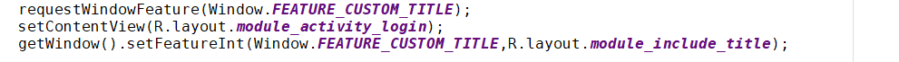

## 自定义标题栏

**自定义标题栏时，一般的写法基本上是下面几步：**

**出现报错：**

**android.util.AndroidRuntimeException: You cannot combine custom titles with other title features**

**java.lang.IllegalStateException: You need to use a Theme.AppCompat theme (or descendant) with this activity**