#### RecyclerView的点击事件

#### Retrofit

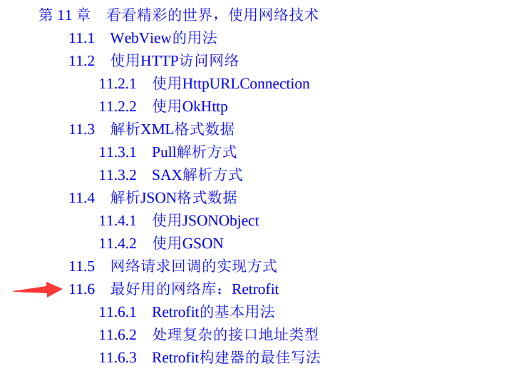


#### Jetpack（ViewModel、LIfecycles、LiveData）

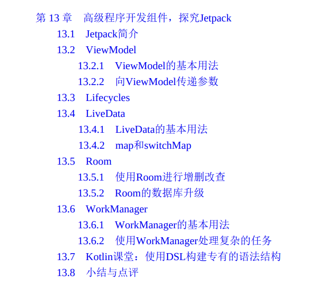


#### MVVM项目架构

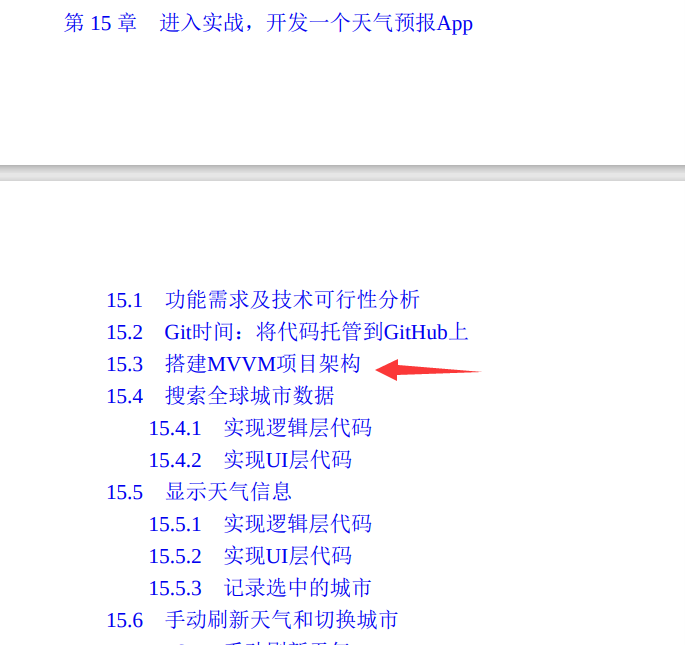


# 第 1 章 Android介绍

## Android简介

### Android系统架构

**Android大致可以分为4层架构：Linux内核层、系统运行库层、应用框架层和应用层。**

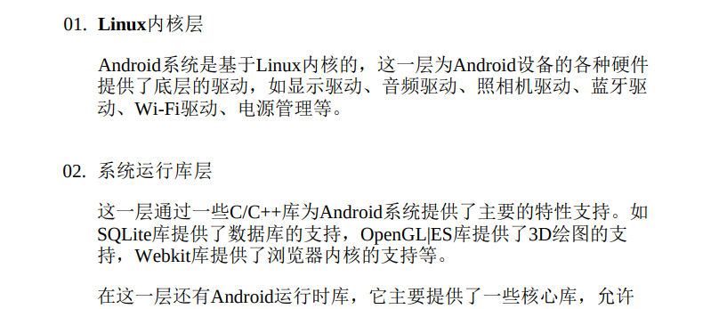


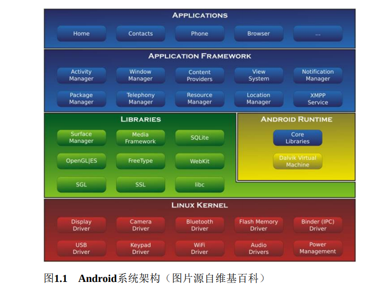


### Project模式的项目结构

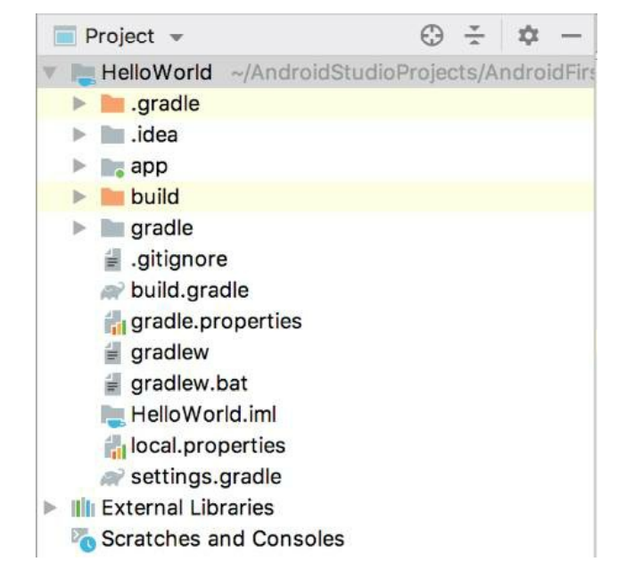

**除了app目录之外，大多数的文件和目录是自动生成的，我们并不需要进行修改**

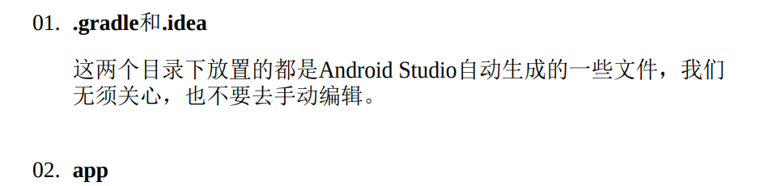

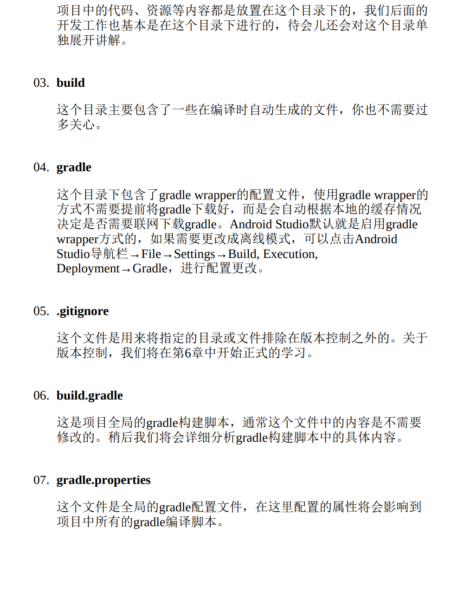

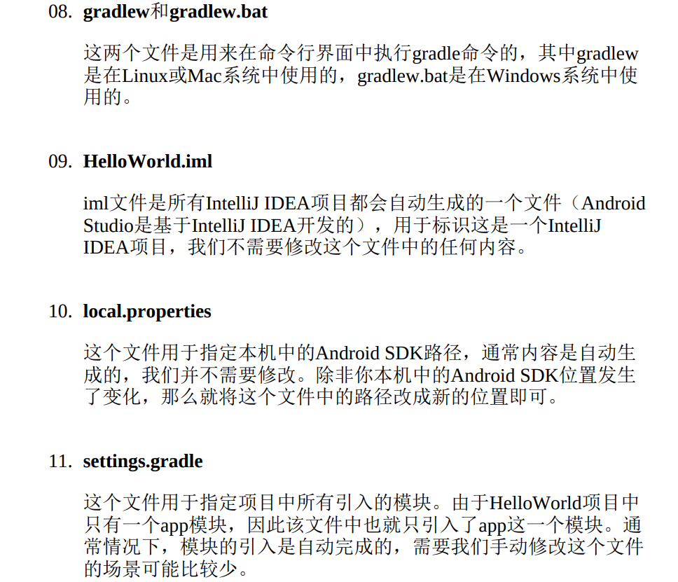


#### app目录下的结构

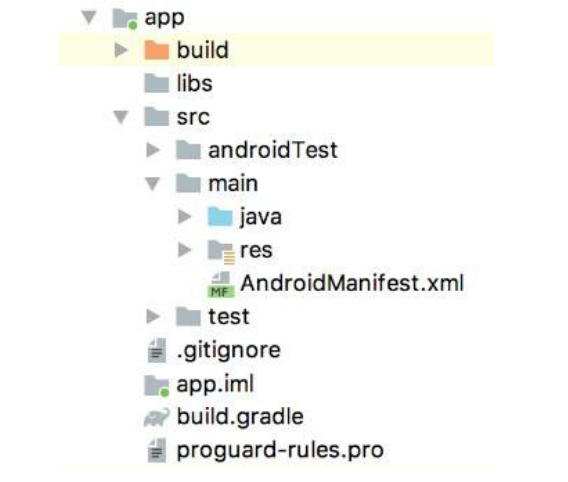

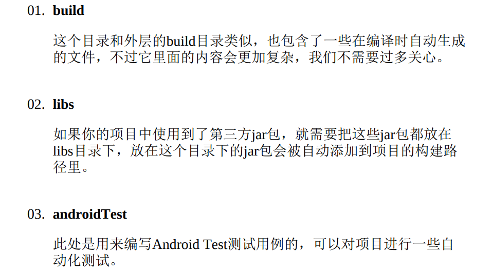

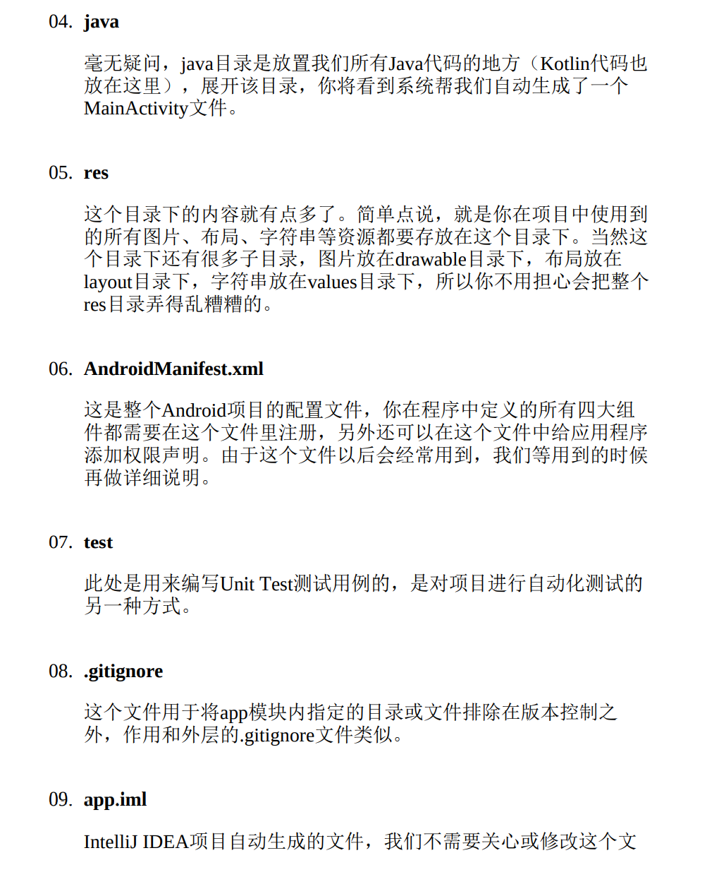

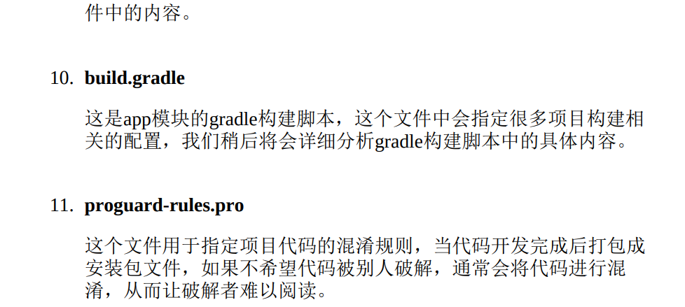


##### res目录下的结构

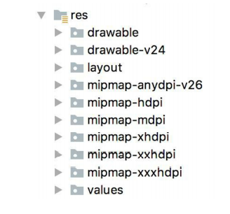

+ 所有以**“drawable”**开头的目录都是用来放图片的

+ 所有 以**“mipmap”**开头的目录都是用来放应用图标的
+ 所有以**“values”**开头的 目录都是用来放字符串、样式、颜色等配置的
+ 所有以**“layout”**开头的 目录都是用来放布局文件的


之所以有这么多“mipmap”开头的目录，其实主要是**为了让程序能够更好地兼容各种设备**。drawable目录也是相同的道理，虽然Android Studio没有帮我们自动生成，但是**我们应该自己创建drawable-hdpi、drawable-xhdpi、drawable-xxhdpi等目录**。在制作程序的时候，最好能够给同一张图片提供几个不同分辨率的版本，分别放在这些目录下，然后**程序运行的时候，会自动根据当前运行设备分辨率的高低选择加载哪个目录下的图片**。当然这只是理想情况，更多的时候**美工只会提供给我们一份图片，这时你把所有图片都放在drawable-xxhdpi目录下就好了，因为这是最主流的设备分辨率目录**。


### 详解build.gradle文件

**Android Studio是采用Gradle来构建项目的**

**Gradle是一个非常先进的项目构建工具，它使用了一种基于Groovy的领域特定语言 （DSL）来进行项目设置**，摒弃了传统基于XML（如Ant和Maven）的各种烦琐配置。


**项目中有两个build.gradle文件**，这两个文件对构建Android Studio项目都起到了至关重要的作用

+ 一个是在最外层目录下的

  ```groovy
  buildscript {
      ext.kotlin_version = "1.4.30"
      repositories {
          google()	//google仓库
          mavenCentral()	//jcenter仓库
      }
      dependencies {
          classpath "com.android.tools.build:gradle:4.2.0-beta05"		//Gradle插件
          classpath "org.jetbrains.kotlin:kotlin-gradle-plugin:$kotlin_version"	//Kotlin插件
          
      }
  }
  
  allprojects {
      repositories {
          google()	//google仓库
          jcenter()	//jcenter仓库
      }
  }
  ```

  + **repositories：google()和jcenter()**

    两处**repositories的闭包**中都声明了google()和jcenter()这两行配置，它们分别对应了一个**代码仓库**

    + **google仓库**中包含的主要是Google自家的扩展依赖库
    + **jcenter仓库**中包含的大多是一些第三方的开源库

    声明了这两行配置之后，我们就可以在项目中轻松引用任何google和jcenter仓库中的依赖库了

  + **dependencies：classpath**

    **dependencies闭包**中**使用classpath声明了两个插件**：一个 Gradle插件和一个Kotlin插件

    + **Gradle插件：**Gradle 并不是专门为构建Android项目而开发的，Java、C++等很多种项目也可 以使用Gradle来构建，因此**如果我们要想使用它来构建Android项目，则需要声明com.android.tools.build:gradle:3.5.2这个插件**。

      其中，**最后面的部分 3.5.2 是插件的版本号，它通常和当前Android Studio的版本是对应的**。如我现在使用的是Android Studio 3.5.2版本，那么这里的插件版本号就应该是3.5.2

    + **Kotlin插件：**Kotlin插件则**表示当前项目是使用Kotlin进行开发的**，如果是Java版的Android项目，则不需要声明这个插件。

+ 一个是在app目录下的

  ```groovy
  plugins {
      id 'com.android.application'
      id 'kotlin-android'
      id 'kotlin-android-extensions'
  }
  
  android {
      compileSdkVersion 30
      buildToolsVersion "30.0.3"
  
      defaultConfig {
          applicationId "com.example.kotlin_test"
          minSdkVersion 21
          targetSdkVersion 30
          versionCode 1
          versionName "1.0"
  
          testInstrumentationRunner "androidx.test.runner.AndroidJUnitRunner"
      }
  
      buildTypes {
          release {
              minifyEnabled false
              proguardFiles getDefaultProguardFile('proguard-android-optimize.txt'), 'proguard-rules.pro'
          }
      }
      compileOptions {
          sourceCompatibility JavaVersion.VERSION_1_8
          targetCompatibility JavaVersion.VERSION_1_8
      }
      kotlinOptions {
          jvmTarget = '1.8'
      }
  }
  
  dependencies {
  
      implementation "org.jetbrains.kotlin:kotlin-stdlib:$kotlin_version"
      implementation 'androidx.core:core-ktx:1.3.1'
      implementation 'androidx.appcompat:appcompat:1.2.0'
      implementation 'com.google.android.material:material:1.2.1'
      implementation 'androidx.constraintlayout:constraintlayout:2.0.1'
      testImplementation 'junit:junit:4.+'
      androidTestImplementation 'androidx.test.ext:junit:1.1.2'
      androidTestImplementation 'androidx.test.espresso:espresso-core:3.3.0'
  }
  ```

  + **首先 plugins 中第一行 id 应用了一个插件，一般有两种值可选：**

    + com.android.application表示这是一个应用程序模块，
    + com.android.library表示这是一个库模块

    **二者最大的区别在于：**应用程序模块是可以直接运行的，库模块只能作为代码库依附于别的应用程序模块来运行

  + **接下来 plugins 中的两行 id 应用了 kotlin-android 和 kotlin-android-extensions 这两个插件：**

    + **第一个插件**：如果你想要**使用Kotlin来开发Android项目**，那么**第一个插件就是必须应用**的。

    + **第二个插件：**第二个插件帮助我们**实现了一些非常好用的Kotlin扩展功能**，它带来了巨大便利性。

  

  **紧接着是一个大的android闭包，在这个闭包中我们可以配置项目构建的各种属性：**

  + **compileSdkVersion：**compileSdkVersion用于**指定项目的 SDK 编译版本**。这里指定成30表示使用Android 11系统的SDK编译

  + **buildToolsVersion：**buildToolsVersion用于**指定项目构建工具的版本**，目前最新的版本就是30.0.3。如果有更新的版本时，Android Studio会进行提示。

    

    然后我们看到，**android闭包中又嵌套了一个defaultConfig闭包**，defaultConfig闭包中可以**对项目的更多细节进行配置：**

    + **applicationId：**applicationId是**每一个应用的唯一标识符，绝对不能重复，默认会使用我们在创建项目时指定的包名**，如果你想在后面对其**进行修改， 那么就是在这里修改的**

    + **minSdkVersion：**minSdkVersion用于**指定项目最低兼容的 Android 系统版本**。这里指定成21表示最低兼容到Android 5.0系统

    + **targetSdkVersion：**targetSdkVersion**指定的值表示你在该目标版本上已经做过了充分的测试，系统将会为你的应用程序启用一些最新的功能和特性**

      比如 Android 6.0 系统中引入了运行时权限这个功能，如果你将targetSdkVersion指定成23或者更高，那么系统就会为你的程序启用运行时权限功能，而如果你将targetSdkVersion指定成22，那么就说明你的程序最高只在Android 5.1系统上做过充分的测试，Android 6.0 系统中引入的新功能自然就不会启用了

    + **versionCode：**versionCode用于**指定项目的版本号**

    + **versionName：**versionName用于**指定项目的版本名**

    + **testInstrumentationRunner：**testInstrumentationRunner**用于在当前项目中启用JUnit测试**，你可以为当前项目编写测试用例，以保证功能的正确性和 稳定性

    

    **分析完了defaultConfig闭包，接下来我们看一下buildTypes闭包。**buildTypes闭包中**用于指定生成安装文件的相关配置，通常只会有两个子闭包：一个是debug，一个是release**

    + **debug闭包：**debug闭包用于指定 生成测试版安装文件的配置
    + 

    

