# 目录

第　1    章 开始启程——你的第 一行

Android代码　1

1.1　了解全貌，Android王国简介　2

1.1.1　Android系统架构　2

1.1.2　Android已发布的版本　3

1.1.3　Android应用开发特色　4

1.2　手把手带你搭建开发环境　5

1.2.1　准备所需要的工具　5

1.2.2　搭建开发环境　5

1.3　创建你的第 一个Android项目　9

1.3.1　创建HelloWorld项目　9

1.3.2　启动模拟器　11

1.3.3　运行HelloWorld　14

1.3.4　分析你的第 一个Android程序　15

1.3.5　详解项目中的资源　20

1.3.6　详解build.gradle文件　22

1.4　前行必备：掌握日志工具的使用　25

1.4.1　使用Android的日志工具Log　25

1.4.2　为什么使用Log而不使用println()　26

1.5　小结与点评　28


第　2章 探究新语言，快速入门Kotlin

编程　30

2.1　Kotlin语言简介　31

2.2　如何运行Kotlin代码　32

2.3　编程之本：变量和函数　35

2.3.1　变量　35

2.3.2　函数　37

2.4　程序的逻辑控制　41

2.4.1　if条件语句　41

2.4.2　when条件语句　42

2.4.3　循环语句　45

2.5　面向对象编程　48

2.5.1　类与对象　49

2.5.2　继承与构造函数　50

2.5.3　接口　55

2.5.4　数据类与单例类　58

2.6　Lambda编程　61

2.6.1　集合的创建与遍历　61

2.6.2　集合的函数式API　65

2.6.3　Java函数式API的使用　69

2.7　空指针检查　71

2.7.1　可空类型系统　72

2.7.2　判空辅助工具　73

2.8　Kotlin中的小魔术　77

2.8.1　字符串内嵌表达式　77

2.8.2　函数的参数默认值　78

2.9　小结与点评　81


第3章　先从看得到的入手，探究

Activity　82

3.1　Activity是什么　82

3.2　Activity的基本用法　82

3.2.1　手动创建Activity　83

3.2.2　创建和加载布局　85

3.2.3　在AndroidManifest文件中

注册　88

3.2.4　在Activity中使用Toast　90

3.2.5　在Activity中使用Menu　92

3.2.6　销毁一个Activity　96

3.3　使用Intent在Activity之间穿梭　96

3.3.1　使用显式Intent　96

3.3.2　使用隐式Intent　99

3.3.3　更多隐式Intent的用法　101

3.3.4　向下一个Activity传递数据　105

3.3.5　返回数据给上一个Activity　106

3.4　Activity的生命周期　108

3.4.1　返回栈　108

3.4.2　Activity状态　109

3.4.3　Activity的生存期　110

3.4.4　体验Activity的生命周期　111

3.4.5　Activity被回收了怎么办　117

3.5　Activity的启动模式　118

3.5.1　standard　119

3.5.2　singleTop　120

3.5.3　singleTask　122

3.5.4　singleInstance　123

3.6　Activity的最佳实践　126

3.6.1　知晓当前是在哪一个Activity　126

3.6.2　随时随地退出程序　127

3.6.3　启动Activity的最佳写法　129

3.7　Kotlin课堂：标准函数和静态方法　130

3.7.1　标准函数with、run和apply　130

3.7.2　定义静态方法　133

3.8　小结与点评　137


第4章　软件也要拼脸蛋，UI开发的

点点滴滴　138

4.1　该如何编写程序界面　138

4.2　常用控件的使用方法　139

4.2.1　TextView　139

4.2.2　Button　142

4.2.3　EditText　144

4.2.4　ImageView　149

4.2.5　ProgressBar　151

4.2.6　AlertDialog　154

4.3　详解3种基本布局　156

4.3.1　LinearLayout　156

4.3.2　RelativeLayout　163

4.3.3　FrameLayout　166

4.4　系统控件不够用？创建自定义控件　169

4.4.1　引入布局　169

4.4.2　创建自定义控件　172

4.5　最常用和最难用的控件：ListView　174

4.5.1　ListView的简单用法　174

4.5.2　定制ListView的界面　176

4.5.3　提升ListView的运行效率　179

4.5.4　ListView的点击事件　180

4.6　更强大的滚动控件：RecyclerView　182

4.6.1　RecyclerView的基本用法　183

4.6.2　实现横向滚动和瀑布流布局　186

4.6.3　RecyclerView的点击事件　191

4.7　编写界面的最佳实践　193

4.7.1　制作9-Patch图片　193

4.7.2　编写精美的聊天界面　196

4.8　Kotlin课堂：延迟初始化和密封类　201

4.8.1　对变量延迟初始化　201

4.8.2　使用密封类优化代码　204

4.9　小结与点评　206


第5章　手机平板要兼顾，探究

Fragment　207

5.1　Fragment是什么　207

5.2　Fragment的使用方式　209

5.2.1　Fragment的简单用法　210

5.2.2　动态添加Fragment　212

5.2.3　在Fragment中实现返回栈　215

5.2.4　Fragment和Activity之间的

交互　216

5.3　Fragment的生命周期　217

5.3.1　Fragment的状态和回调　217

5.3.2　体验Fragment的生命周期　219

5.4　动态加载布局的技巧　221

5.4.1　使用限定符　221

5.4.2　使用最小宽度限定符　224

5.5　Fragment的最佳实践：一个简易

版的新闻应用　225

5.6　Kotlin课堂：扩展函数和运算符

重载　234

5.6.1　大有用途的扩展函数　234

5.6.2　有趣的运算符重载　236

5.7　小结与点评　240


第6章　全局大喇叭，详解广播机制　242

6.1　广播机制简介　242

6.2　接收系统广播　243

6.2.1　动态注册监听时间变化　243

6.2.2　静态注册实现开机启动　245

6.3　发送自定义广播　249

6.3.1　发送标准广播　249

6.3.2　发送有序广播　252

6.4　广播的最佳实践：实现强制下线功能　255

6.5　Kotlin课堂：高阶函数详解　261

6.5.1　定义高阶函数　261

6.5.2　内联函数的作用　265

6.5.3　noinline与crossinline　268

6.6　Git时间：初识版本控制工具　271

6.6.1　安装Git　271

6.6.2　创建代码仓库　272

6.6.3　提交本地代码　274

6.7　小结与点评　274


第7章　数据存储全方案，详解

持久化技术　275

7.1　持久化技术简介　275

7.2　文件存储　276

7.2.1　将数据存储到文件中　276

7.2.2　从文件中读取数据　279

7.3　SharedPreferences存储　281

7.3.1　将数据存储到SharedPre-

ferences中　282

7.3.2　从SharedPreferences中读取

数据　284

7.3.3　实现记住密码功能　285

7.4　SQLite数据库存储　288

7.4.1　创建数据库　289

7.4.2　升级数据库　295

7.4.3　添加数据　297

7.4.4　更新数据　300

7.4.5　删除数据　302

7.4.6　查询数据　304

7.4.7　使用SQL操作数据库　307

7.5　SQLite数据库的最佳实践　307

7.5.1　使用事务　308

7.5.2　升级数据库的最佳写法　309

7.6　Kotlin课堂：高阶函数的应用　312

7.6.1　简化SharedPreferences的用法　312

7.6.2　简化ContentValues的用法　314

7.7　小结与点评　317


第8章　跨程序共享数据，探究ContentProvider　318

8.1　ContentProvider简介　318

8.2　运行时权限　319

8.2.1　Android权限机制详解　319

8.2.2　在程序运行时申请权限　322

8.3　访问其他程序中的数据　326

8.3.1　ContentResolver的基本用法　326

8.3.2　读取系统联系人　329

8.4　创建自己的ContentProvider　332

8.4.1　创建ContentProvider的步骤　332

8.4.2　实现跨程序数据共享　336

8.5　Kotlin课堂：泛型和委托　345

8.5.1　泛型的基本用法　345

8.5.2　类委托和委托属性　347

8.5.3　实现一个自己的lazy函数　350

8.6　小结与点评　352


第9章　丰富你的程序，运用手机

多媒体　353

9.1　将程序运行到手机上　353

9.2　使用通知　355

9.2.1　创建通知渠道　355

9.2.2　通知的基本用法　357

9.2.3　通知的进阶技巧　362

9.3　调用摄像头和相册　367

9.3.1　调用摄像头拍照　367

9.3.2　从相册中选择图片　371

9.4　播放多媒体文件　374

9.4.1　播放音频　374

9.4.2　播放视频　377

9.5　Kotlin课堂：使用infix函数构建

更可读的语法　381

9.6　Git时间：版本控制工具进阶　383

9.6.1　忽略文件　384

9.6.2　查看修改内容　385

9.6.3　撤销未提交的修改　387

9.6.4　查看提交记录　388

9.7　小结与点评　389


第　10章 后台默默的劳动者，探究

Service　390

10.1　Service是什么　390

10.2　Android多线程编程　391

10.2.1　线程的基本用法　391

10.2.2　在子线程中更新UI　392

10.2.3　解析异步消息处理机制　395

10.2.4　使用AsyncTask　396

10.3　Service的基本用法　399

10.3.1　定义一个Service　399

10.3.2　启动和停止Service　401

10.3.3　Activity和Service进行

通信　404

10.4　Service的生命周期　408

10.5　Service的更多技巧　408

10.5.1　使用前台Service　409

10.5.2　使用IntentService　411

10.6　Kotlin课堂：泛型的高级特性　415

10.6.1　对泛型进行实化　415

10.6.2　泛型实化的应用　417

10.6.3　泛型的协变　418

10.6.3　泛型的逆变　422

10.7　小结与点评　425


第　11章 看看精彩的世界，使用网络

技术　427

11.1　WebView的用法　427

11.2　使用HTTP访问网络　429

11.2.1　使用HttpURLConnection　430

11.2.2　使用OkHttp　433

11.3　解析XML格式数据　436

11.3.1　Pull解析方式　438

11.3.2　SAX解析方式　441

11.4　解析JSON格式数据　444

11.4.1　使用JSONObject　445

11.4.2　使用GSON　446

11.5　网络请求回调的实现方式　448

11.6　最好用的网络库：Retrofit　451

11.6.1　Retrofit的基本用法　452

11.6.2　处理复杂的接口地址类型　456

11.6.3　Retrofit构建器的最佳写法　459

11.7　Kotlin课堂：使用协程编写高效的

并发程序　461

11.7.1　协程的基本用法　461

11.7.2　更多的作用域构建器　467

11.7.3　使用协程简化回调的写法　471

11.8　小结与点评　474


第　12章 最佳的UI体验，Material

Design实战　475

12.1　什么是Material Design　475

12.2　Toolbar　476

12.3　滑动菜单　483

12.3.1　DrawerLayout　483

12.3.2　NavigationView　486

12.4　悬浮按钮和可交互提示　491

12.4.1　FloatingActionButton　491

12.4.2　Snackbar　494

12.4.3　CoordinatorLayout　496

12.5　卡片式布局　498

12.5.1　MaterialCardView　498

12.5.2　AppBarLayout　504

12.6　下拉刷新　507

12.7　可折叠式标题栏　510

12.7.1　CollapsingToolbarLayout　510

12.7.2　充分利用系统状态栏空间　519

12.8　Kotlin课堂：编写好用的工具方法　522

12.8.1　求N个数的最大最小值　522

12.8.2　简化Toast的用法　524

12.8.3　简化Snackbar的用法　526

12.9　Git时间：版本控制工具的高级

用法　528

12.9.1　分支的用法　528

12.9.2　与远程版本库协作　530

12.10　小结与点评　532


第　13章 高级程序开发组件，探究

Jetpack　533

13.1　Jetpack简介　533

13.2　ViewModel　534

13.2.1　ViewModel的基本用法　536

13.2.2　向ViewModel传递参数　539

13.3　Lifecycles　541

13.4　LiveData　545

13.4.1　LiveData的基本用法　545

13.4.2　map和switchMap　549

13.5　Room　554

13.5.1　使用Room进行増删改查　555

13.5.2　Room的数据库升级　562

13.6　WorkManager　565

13.6.1　WorkManager的基本用法　566

13.6.2　使用WorkManager处理

复杂的任务　568

13.7　Kotlin课堂：使用DSL构建专有的

语法结构　571

13.8　小结与点评　577


第　14章 继续进阶，你还应该掌握的

高级技巧　579

14.1　全局获取Context的技巧　579

14.2　使用Intent传递对象　582

14.2.1　Serializable方式　582

14.2.2　Parcelable方式　583

14.3　定制自己的日志工具　584

14.4　调试Android程序　586

14.5　深色主题　589

14.6　Kotlin课堂：Java与Kotlin代码

之间的转换　596

14.7　总结　600


第　15章 进入实战，开发一个天气

预报App　601

15.1　功能需求及技术可行性分析　601

15.2　Git时间：将代码托管到GitHub上　605

15.3　搭建MVVM项目架构　612

15.4　搜索全球城市数据　615

15.4.1　实现逻辑层代码　615

15.4.2　实现UI层代码　620

15.5　显示天气信息　626

15.5.1　实现逻辑层代码　626

15.5.2　实现UI层代码　631

15.5.3　记录选中的城市　645

15.6　手动刷新天气和切换城市　647

15.6.1　手动刷新天气　648

15.6.2　切换城市　650

15.7　制作App的图标　654

15.8　生成正式签名的APK文件　659

15.8.1　使用Android Studio生成　660

15.8.2　使用Gradle生成　663

15.9　你还可以做的事情　666


第　16章 编写并发布一个开源库，PermissionX　669

16.1　开发前的准备工作　669

16.2　实现PermissionX开源库　673

16.3　对开源库进行测试　678

16.4　将开源库发布到jcenter仓库　681

16.5　体验我们的成果　688

16.6　结束语　691


#### RecyclerView的点击事件


#### Retrofit


#### Jetpack（ViewModel、LIfecycles、LiveData）


#### MVVM项目架构


**本博客的记载学习是在已经看完过《第一行代码-第二版》的基础上的温习学习笔记**

# 第 1 章 Android介绍

## Android简介

### Android系统架构

**Android大致可以分为4层架构：Linux内核层、系统运行库层、应用框架层和应用层。**


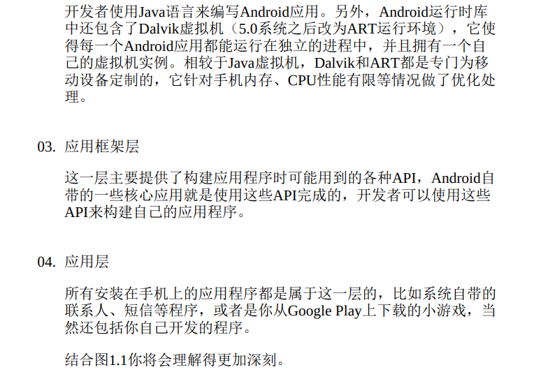


### Project模式的项目结构


**除了app目录之外，大多数的文件和目录是自动生成的，我们并不需要进行修改**


#### app目录下的结构


##### res目录下的结构


+ 所有以**“drawable”**开头的目录都是用来放图片的

+ 所有 以**“mipmap”**开头的目录都是用来放应用图标的
+ 所有以**“values”**开头的 目录都是用来放字符串、样式、颜色等配置的
+ 所有以**“layout”**开头的 目录都是用来放布局文件的


之所以有这么多“mipmap”开头的目录，其实主要是**为了让程序能够更好地兼容各种设备**。drawable目录也是相同的道理，虽然Android Studio没有帮我们自动生成，但是**我们应该自己创建drawable-hdpi、drawable-xhdpi、drawable-xxhdpi等目录**。在制作程序的时候，最好能够给同一张图片提供几个不同分辨率的版本，分别放在这些目录下，然后**程序运行的时候，会自动根据当前运行设备分辨率的高低选择加载哪个目录下的图片**。当然这只是理想情况，更多的时候**美工只会提供给我们一份图片，这时你把所有图片都放在drawable-xxhdpi目录下就好了，因为这是最主流的设备分辨率目录**。


### 详解build.gradle文件

**Android Studio是采用Gradle来构建项目的**

**Gradle是一个非常先进的项目构建工具，它使用了一种基于Groovy的领域特定语言 （DSL）来进行项目设置**，摒弃了传统基于XML（如Ant和Maven）的各种烦琐配置。


**项目中有两个build.gradle文件**，这两个文件对构建Android Studio项目都起到了至关重要的作用

+ 一个是在最外层目录下的

  ```groovy
  buildscript {
      ext.kotlin_version = "1.4.30"
      repositories {
          google()	//google仓库
          mavenCentral()	//jcenter仓库
      }
      dependencies {
          classpath "com.android.tools.build:gradle:4.2.0-beta05"		//Gradle插件
          classpath "org.jetbrains.kotlin:kotlin-gradle-plugin:$kotlin_version"	//Kotlin插件
          
      }
  }
  
  allprojects {
      repositories {
          google()	//google仓库
          jcenter()	//jcenter仓库
      }
  }
  ```

  + **repositories：google()和jcenter()**

    两处**repositories的闭包**中都声明了google()和jcenter()这两行配置，它们分别对应了一个**代码仓库**

    + **google仓库**中包含的主要是Google自家的扩展依赖库
    + **jcenter仓库**中包含的大多是一些第三方的开源库

    声明了这两行配置之后，我们就可以在项目中轻松引用任何google和jcenter仓库中的依赖库了

  + **dependencies：classpath**

    **dependencies闭包**中**使用classpath声明了两个插件**：一个 Gradle插件和一个Kotlin插件

    + **Gradle插件：**Gradle 并不是专门为构建Android项目而开发的，Java、C++等很多种项目也可 以使用Gradle来构建，因此**如果我们要想使用它来构建Android项目，则需要声明com.android.tools.build:gradle:3.5.2这个插件**。

      其中，**最后面的部分 3.5.2 是插件的版本号，它通常和当前Android Studio的版本是对应的**。如我现在使用的是Android Studio 3.5.2版本，那么这里的插件版本号就应该是3.5.2

    + **Kotlin插件：**Kotlin插件则**表示当前项目是使用Kotlin进行开发的**，如果是Java版的Android项目，则不需要声明这个插件。


+ 一个是在app目录下的

  ```groovy
  plugins {
      id 'com.android.application'
      id 'kotlin-android'
      id 'kotlin-android-extensions'
  }
  
  android {
      compileSdkVersion 30
      buildToolsVersion "30.0.3"
  
      defaultConfig {
          applicationId "com.example.kotlin_test"
          minSdkVersion 21
          targetSdkVersion 30
          versionCode 1
          versionName "1.0"
  
          testInstrumentationRunner "androidx.test.runner.AndroidJUnitRunner"
      }
  
      buildTypes {
          release {
              minifyEnabled false
              proguardFiles getDefaultProguardFile('proguard-android-optimize.txt'), 'proguard-rules.pro'
          }
      }
      compileOptions {
          sourceCompatibility JavaVersion.VERSION_1_8
          targetCompatibility JavaVersion.VERSION_1_8
      }
      kotlinOptions {
          jvmTarget = '1.8'
      }
  }
  
  dependencies {
      
  	implementation fileTree(dir: 'libs', include: ['*.jar'])
      implementation "org.jetbrains.kotlin:kotlin-stdlib:$kotlin_version"
      implementation 'androidx.core:core-ktx:1.3.1'
      implementation 'androidx.appcompat:appcompat:1.2.0'
      implementation 'com.google.android.material:material:1.2.1'
      implementation 'androidx.constraintlayout:constraintlayout:2.0.1'
      testImplementation 'junit:junit:4.+'
      androidTestImplementation 'androidx.test.ext:junit:1.1.2'
      androidTestImplementation 'androidx.test.espresso:espresso-core:3.3.0'
  }
  ```

  **plugins设定要使用到的插件：**

  + **首先 plugins 中第一行 id 应用了一个插件，一般有两种值可选：**

    + com.android.application表示这是一个应用程序模块，
    + com.android.library表示这是一个库模块

    **二者最大的区别在于：**应用程序模块是可以直接运行的，库模块只能作为代码库依附于别的应用程序模块来运行

  + **接下来 plugins 中的两行 id 应用了 kotlin-android 和 kotlin-android-extensions 这两个插件：**

    + **第一个插件**：如果你想要**使用Kotlin来开发Android项目**，那么**第一个插件就是必须应用**的。

    + **第二个插件：**第二个插件帮助我们**实现了一些非常好用的Kotlin扩展功能**，它带来了巨大便利性。

  

  

  **紧接着是一个大的android闭包，在这个闭包中我们可以配置项目构建的各种属性：**

  + **compileSdkVersion：**compileSdkVersion用于**指定项目的 SDK 编译版本**。这里指定成30表示使用Android 11系统的SDK编译

  + **buildToolsVersion：**buildToolsVersion用于**指定项目构建工具的版本**，目前最新的版本就是30.0.3。如果有更新的版本时，Android Studio会进行提示。

    

    然后我们看到，**android闭包中又嵌套了一个defaultConfig闭包**，defaultConfig闭包中可以**对项目的更多细节进行配置：**

    + **applicationId：**applicationId是**每一个应用的唯一标识符，绝对不能重复，默认会使用我们在创建项目时指定的包名**，如果你想在后面对其**进行修改， 那么就是在这里修改的**

    + **minSdkVersion：**minSdkVersion用于**指定项目最低兼容的 Android 系统版本**。这里指定成21表示最低兼容到Android 5.0系统

    + **targetSdkVersion：**targetSdkVersion**指定的值表示你在该目标版本上已经做过了充分的测试，系统将会为你的应用程序启用一些最新的功能和特性**

      比如 Android 6.0 系统中引入了运行时权限这个功能，如果你将targetSdkVersion指定成23或者更高，那么系统就会为你的程序启用运行时权限功能，而如果你将targetSdkVersion指定成22，那么就说明你的程序最高只在Android 5.1系统上做过充分的测试，Android 6.0 系统中引入的新功能自然就不会启用了

    + **versionCode：**versionCode用于**指定项目的版本号**

    + **versionName：**versionName用于**指定项目的版本名**

    + **testInstrumentationRunner：**testInstrumentationRunner**用于在当前项目中启用JUnit测试**，你可以为当前项目编写测试用例，以保证功能的正确性和 稳定性

    

    **分析完了defaultConfig闭包，接下来我们看一下buildTypes闭包。**buildTypes闭包中**用于指定生成安装文件的相关配置，通常只会有两个子闭包：一个是debug，一个是release**

    + **debug闭包：**debug闭包用于**指定生成测试版安装文件的配置**，debug闭包是可以忽略不写的

    + **release闭包：**release闭包用于**指定生成正式版安装文件的配置**

      + **minifyEnabled：**minifyEnabled用于**指定是否对项目的代码进行混淆**，true 表示混淆，false表示不混淆

      + **proguardFiles：**proguardFiles用于**指定混淆时使用的规则文件**，这里**指定了两个文件**：

        第一个**proguard-android-optimize.txt**是在/tools/proguard目录下的，**里面是所有项目通用的混淆规则**；

        第二个**proguard-rules.pro**是在当前项目的根目录下的，**里面可以编写当前项目特有的混淆规则**。

        需要注意的是， 通过Android Studio直接运行项目生成的都是测试版安装文件

        在编译正式版本时，代码混淆是一个必不可少的过程。而且使用代码混淆也相当简单，简单到只需要配置一句`minifyEnabled true`

    

    **compileOptions闭包：**

    [示例中用到的compileOptions内的解释](https://blog.csdn.net/ys743276112/article/details/51722047)

    ```groovy
    	//如下代码的作用为：为您的项目启用 Java 8 语言功能和 Jack
    	compileOptions {
            sourceCompatibility JavaVersion.VERSION_1_8
            targetCompatibility JavaVersion.VERSION_1_8
        }
    ```

     

    **kotlinOptions闭包：**

    [Kotlin中使用Java8特性](https://blog.csdn.net/socrates_lee/article/details/79279604)

    ```groovy
    	//如下代码的作用为：Kotlin中使用Java8特性
    	kotlinOptions {
            jvmTarget = '1.8'
        }
    ```

  

  

  接下来还剩一个**dependencies闭包，它可以指定当前项目所有的依赖关系：**

  **通常Android Studio项目一共有3种依赖方式：本地依赖、库依赖和远程依赖。**

  + **本地依赖**可以对本地的jar包或目录添加依赖关系

    示例的dependencies闭包中的配置，第一行的**implementation fileTree**就是一个本地依赖声明，它表示将libs目录下所有.jar后缀的文 件都添加到项目的构建路径中。

  + **库依赖**可以对项目中的库模块添加依赖关系

    **库依赖**的基本格式是**implementation project**后面加上要依赖的库的名称

    比如有一个库模块的名字叫helper，那么添加这个库的依赖关系只需要加 入**implementation project(':helper')**这句声明即可

    关于这部分内容，我们将在本书的最后一章学习

  + **远程依赖**则可以对 jcenter仓库上的开源项目添加依赖关系

    **implementation**则是远程依赖声明

    **androidx.appcompat:appcompat:1.1.0就是一个标准的远程依赖库格式**，其中：

    + androidx.appcompat是**域名部分**，用于和其他公司的库做区分；

    + appcompat是**工程名部分**，用于和同一个公司中不同的库工 程做区分；

    + 1.1.0是**版本号**，用于和同一个库不同的版本做区分。

    加上这句声明后，Gradle在构建项目时会首先检查一下本地是否已经有**这个库**的缓存，如果没有的话则会自动联网下载，然后再**添加到项目的构建路径中**

  + **testImplementation** 和 **androidTestImplementation** 都是用于声明测试用例库的，这个我们暂时用不到，先忽略它就可以了

  


# 第 2 章 快速入门 Kotlin编程

## Kotlin的优点简介

**Kotlin的代码会编译成和Java编译后同样规格的class文件，即 Java 虚拟机也能够识别Kotlin的代码编译后的class文件，并在程序运行的时候将class文件解释成计算机可识别的二进制数据后再执行**

**Kotlin相比Java：**

+ **Kotlin的语法更加简洁**，对于同样的功能， 使用Kotlin开发的代码量可能会比使用Java开发的减少50% 甚至更多。
+ 另外，**Kotlin的语法更加高级**，相比于Java比较老旧的语法，**Kotlin增加了很多现代高级语言的语法特性，使得开发效率大大提升**
+ 还有， **Kotlin在语言安全性方面下了很多工夫，几乎杜绝了空指针这个全球崩溃率最高的异常**，至于是如何做到的，我们在稍后就会学到。 
+ 然而Kotlin在拥有众多出色的特性之外，还有一个最为重要的特性，那就是**它和Java是100%兼容的。Kotlin可以直接调用使用Java编写的代码，也可以无缝使用Java第三方的开源库**。这使得Kotlin在加入了诸多新特性的同时，还继承了Java的全部财富。


## Kotlin基本语法

**注意，Kotlin每一行代码的结尾是不用加分号的，如果你写惯了Java的 话，在这里得先熟悉一下**

**Kotlin本着最简化的设计原则，将诸如new、行尾分号这种不必要的语法结构都取消了**


### 变量

**Kotlin中定义一个变量，只允许在变量前声明两种关键字：val和var。** 

val（value的简写）用来声明一个不可变的变量，这种变量在初始赋值之后就再也不能重新赋值，对应Java中的final变量。 

var（variable的简写）用来声明一个可变的变量，这种变量在初始赋值之后仍然可以再被重新赋值，对应Java中的非final变量。

**Kotlin有出色的类型推导机制**


**显式地声明变量类型**


**Kotlin完全抛弃了Java中的基本数据类型，全部使用 了对象数据类型**


**Number类型是Kotlin内置的一个抽象类，像Int、Long、Float、Double 等与数字相关的类都是它的子**类


**永远优先使用val来声明一个变量，而当val没有办法满足你的需求时再使用var。这样设计出来的程序会更加健壮，也更 加符合高质量的编码规范。**


### 函数


首先 **fun（function的简写）是定义函数的关键字**，无论你定义什么函数，都一定要使用fun来声明。 

**紧跟在fun后面的是函数名**

函数名后面**紧跟着一对括号，声明该函数接收什么参数，参数的声明格式是“参数名: 参数类型”**

**参数括号后面的那部分用于声明该函数会返回什么类型的数据**


**当一个函数中只有一行代码时，Kotlin允许我们不必编写函数体，可以直接将唯一的一行代码写在函数定义的尾部，中间用等号连接即可**


### 条件语句

**Kotlin中的条件语句主要有两种实现方式：if和when**

+ **if语句**

  **Kotlin中的if语句和Java中的if语句几乎没有任何区别**

  

  

  **Kotlin中的if语句相比于Java有一个额外的功能，它是可以有返回值的，返回值就是if语句每一个条件中最后一行代码的返回值**

  

  

  

+ **when语句**

  **when语句允许传入一个任意类型的参数，然后可以在when的结构体中定义一系列的条件，格式是：**

  

  当你的执行逻辑只有一行代码时，{ }可以省略

  

  **when语句和if语句一样，也是可以有返回值的**

  

  

  **when语句还允许进行类型匹配**

  **is关键字**就是类型匹配的核心，它相当于Java中的 instanceof关键字

  

  

  **when语句还有一种不带参数的用法**

  将判断的表达式完整地写在when的结构体当中（**Kotlin中判断字符串或对象是否相等可以直接使用==关键字**）

  

  


### 循环语句（区间）

**Kotlin也提供了while循环和for循环**

+ **while循环**

  **while循环不管是在语法还是使用技巧上都和Java中的while循环没有任何区别**

+ **区间**

  + **升序闭区间：**Kotlin使用如下代码来表示一个[0, 10]的区间

    

    **`..`是创建两端闭区间的关键字，在`..`的两边指定区间的左右端点就可以创建一个升序闭区间了**

  + **升序左闭右开区间：**Kotlin使用如下代码来表示一个[0, 10)的区间

    

    **until关键字来创建一个左闭右开的区间**

  + **降序闭区间：**Kotlin使用如下代码来表示一个[10, 1]的区间

    

    **downTo关键字创建一个降序闭区间**

    

+ **for循环**

  **for - in循环遍历区间**

  **默认情况下，for-in循环每次执行循环时会在区间范围内递增1**

  

  

  **如果你想跳过其中的一些元素，可以使用step关键字：**

  

  

  **for-in循环除了可以对区间进行遍历之外，还可以用于遍历数组和集合**

  + **集合**

    

    

    


+ **repeat循环**

  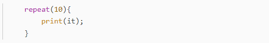

  **repeat()** 其实是kotlin中的一个为我们封装好的函数，**括号里面的数代表这段代码需要被执行多少次**，里面的**it为这个函数提供的变量**，我们**直接使用**就可以，他可以**显示目前为止程序被执行到了第几次（从0开始，执行第一次为0）**


### 类和对象

**Kotlin File：**File通常是用于编写Kotlin顶层函数和扩展函数

**Kotlin中SecondActivity::class.java的写法就相当于Java中 SecondActivity.class**


+ **类：**

  **Kotlin中也是使用class关键字来声明一个类的，这一点和Java一致**

  

+ **对象：**

  **Kotlin中实例化一个类的方式和Java是基本类似的，只是去掉了new关键字而已**

  


### 继承与构造函数

+ **Kotlin中的抽象类和Java中并无区别**

+ **Kotlin中任何一个非抽象类默认都是不可以被继承的，相当于Java中给类声明了 final 关键字**

  **Person类的前面加上 open 关键字就可以让非抽象类可以被继承**

  

+ **Kotlin将构造函数分成了两种：主构造函数和次构造函数**

  + **主构造函数：**主构造函数将会是你最常用的构造函数**，每个类默认都会有一个不带参数的主构造函数，当然你也可以显式地给它指明参数**。主构造函数的特点是**没有函数体，直接定义在类名的后面即可**

    

    另外，由于构造函数中的参数是在创建实例的时候传入的，因此我们**可以**将参数全部声明成val。

    如果在声明参数的时候**用val或者var声明一下**，那么它们就会**变为类中的属性**，反之则不会。

    + 如果我想**在主构造函数中编写一些逻辑**，该怎么办呢？Kotlin给我们提供了一个**init结构体**，所有主构造函数中的逻辑都可以写在里面：

      
      
    + **子类的主构造函数调用父类中的哪个构造函数，在继承的时候通过括号来指定**

      Person类后面的一对**空括号**表示Student类的主构造函数在初始化的时候会**调用Person类的无参数构造函数**，即使在无参数的情况 下，**这对括号也不能省略**

      

  + **次构造函数：**任何一个类只能有一个主构造函数，但是**可以有多个次构造函数**。**次构造函数也可以用于实例化一个类**，这一点和主构造函数没有什么不同，只不过**它是有函数体的**

    + Kotlin规定，当一个类**既有主构造函数又有次构造函数时**，**所有的次构造函数都必须调用主构造函数（包括间接调用）**

      

      **次构造函数是通过constructor关键字来定义的，这里我们定义了两个次构造函数：**

      + 第一个次构造函数接收name和age参数，然后它又**通过 this 关键字调用了主构造函数**，并将sno和grade这两个参数赋值成初始值；
      + 第二个次构造函数不接收任何参数，它**通过 this 关键字调用了我们刚才定义的第一个次构造函数**，并将name和age参数也赋值成初始值，由于第二个次构造函数间接调用了主构造函数，因此这仍然是合法的

    + **类中只有次构造函数， 没有主构造函数：**当一个类没有显式地定义主构造函数且定义了次构造函数时，它就是没有主构造函数。没有主构造函数，**继承父类的时候也就不需要再加上括号了，**另外，由于没有主构造函数，**次构造函数只能直接调用父类的构造函数，将this关键字换成了super关键字**

      

+ **在Java中继承的关键字是extends，而在Kotlin中变成了一个冒号：**

  

  **类名后面的括号：子类的主构造函数调用父类中的哪个构造函数，在继承的时候通过括号来指定**

  

  注意，我们在Student类的主构造函数中增加name和age这两个字段时，不能再将它们声明成val，因为**在主构造函数中声明成val或者 var 的参数将自动成为该类的字段**，这就会导致和父类中同名的 name 和 age 字段造成冲突。因此，这**里的name和age参数前面我们不用加任何关键字**，让它的作用域仅限定在主构造函数当中即可


### 接口

**Kotlin中的接口部分和Java几乎是完全一致的**

**Java是单继承 结构的语言，任何一个类最多只能继承一个父类，但是却可以实现任意多个接口，Kotlin也是如此**


**Kotlin中继承、实现接口统一使用冒号，中间用逗号进行分隔**

**Kotlin中使用override关键字来重写父类或者实现接口中的函数**


**Kotlin还增加了一个额外的功能：允许对接口中定义的函数进行默认实现。不实现进行默认实现的函数时就会自动使用默认的实现逻辑**

**其实Java在JDK 1.8之后也开始支持这个功能了**


### 函数的可见性修饰符

Java中有public、private、protected和 default（什么都不写）这4种函数可见性修饰符。**Kotlin中也有4种， 分别是public、private、protected和internal，需要使用哪种修饰符时**，直接定义在fun关键字的前面即可

+ **private：**private修饰符**在两种语言中的作用是一模一样的，都表示只对当前类内部可见**
+ **public：**public修饰符的**作用虽然也是一致的，表示对所有类都可见，但是在Kotlin中public修饰符是默认项**，而在Java中default才是默认项
+ **protected：**protected关键字在Java中表示对当前类、子类和同一包路径下的类可见，**在Kotlin中则表示只对当前类和子类可见**
+ **internal：**Kotlin抛弃了Java中的default可见性（同一包路径下的类可见），引入了一种新的可见性概念，**只对同一模块中的类可见，使用的是internal修饰符**


### 数据类和单例类

**数据类：**

+ **数据类通常需要重写equals()、hashCode()、toString()**这几个方法。其中：
  + **equals()方法**用于判断两个数据类是否相等。
  + **hashCode() 方法**作为equals()的配套方法，也需要一起重写，否则会导致 HashMap、HashSet等hash相关的系统类无法正常工作
  + **toString() 方法**用于提供更清晰的输入日志，否则一个数据类默认打印出来的就是一行内存地址

+ **Java中数据类：**

  

+ **Kotlin中数据类：data关键字：当在一个类前面声明了data关键字时，就表明你希望这个类是一个数据类，Kotlin会根据主构造函数中的参数帮你 将equals()、hashCode()、toString()等固定且无实际逻辑意义的方法自动生成**

  


**单列类：**

**在Kotlin中创建一个单例类的方式极其简单，只需要将class关键字改成object关键字即可（饿汉式的单例模式）**

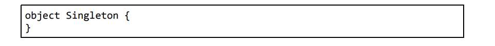

**对应的 Kotlin Bytecode：**

```java
public final class Singleton {
   public static final Singleton INSTANCE;

   private Singleton() {
      INSTANCE = (SingletonKt)this;
   }

   static {
      new SingletonKt();
   }
}
```


## Lambda编程

### 集合

**Collection是Java以及Kotlin所有集合的总接口**


**List集合：**

**传统写法：**


+ **listOf()函数：**

  **但是这种初始化集合的方式比较烦琐，为此Kotlin专门提供了一个内置 的listOf()函数来简化初始化集合的写法，如下所示：**

  

  **不过需要注意的是，listOf()函数创建的是一个不可变的集合，该集合只能用于读取，我们无法对集合进行添加、修改或删除操作。**

+ **mutableListOf()函数：**

  **使用mutableListOf()函数就可以创建一个可变的集合**

  


**Set集合：**

Set集合的用法几乎与List集合一模一样，**只是将创建集合的方式换成了setOf()和mutableSetOf()函数而已**


**Map集合：**

**传统写法：**


但其实在Kotlin中**并不建议使用put()和get()方法来对 Map 进行添加和读取数据操作，而是更加推荐使用一种类似于数组下标的语法结构**

+ **向Map中添加一条数据**

  

+ **从Map中读取一条数据**

  


**Kotlin毫无疑问地提供了一对 mapOf() 和 mutableMapOf() 函数来继续简化Map的用法**

+ **mapOf()函数：**

  **在mapOf()函数中，我们可以直接传入初始化的键值对组合来完成对Map集合的创建：**

  

  **to并不是关键字，而是一个infix函数**

  


### 集合的函数式API（Lambda表达式）

**函数式API的语法结构，也就是Lambda表达式的语法结构**

+ **maxBy函数：**maxBy函数的工作原理是根据我们**传入的条件来遍历集合，从而找到该条件下的最大值**

  比如，这里我们希望在一个水果集合里面找到单词最长的那个水果，就可以这样写：

  

+ **map函数：**将集合中的每个元素都映射成一个另外的值，**映射的规则在Lambda表达式中指定**，最终生成一个新的集合

  比如，这里我们希望让所有的水果名都变成大写模式，就可以这样写：

  

  **map函数的功能非常强大，它可以按照我们的需求对集合中的元素进行任意的映射转换**

+ **filter函数：**filter函数是**用来过滤集合中的数据**的，它可以单独使用，也可以配合刚才的map函数一起使用

  比如我们只想保留5个字母以内的水果，就可以借助filter函数来实现，代码如下所示：

  

+ **any和all函数：**其中**any函数用于判断集合中是否至少存在一个元素满足指定条件**，**all 函数用于判断集合中是否所有元素都满足指定条件**

  


### Lambda的定义：Lambda就是一小段可以作为参数传递的代码

**Lambda表达式的语法结构：**


**Lambda表达式的简化：**

+ **Kotlin规定，当Lambda参数是函数的最后一个参数时，可以将 Lambda表达式移到函数括号的外面**

  

+ **如果Lambda参数是函数的唯一一个参数的话，还可以将函数的括号省略**

  

+ **由于Kotlin拥有出色的类型推导机制，Lambda表达式中的参数列表其实在大多数情况下不必声明参数类型**

  

+ **当Lambda表达式的参数列表中只有一个参数时，也不必声明参数名，而是可以使用it关键字来代替**

  


### Java函数式API的使用

**在Kotlin中调用Java方法时也可以使用函数式API，只不过这是有一定条件限制的**

具体来讲：

+ 如果我们在Kotlin代码中调用了一个Java方法，并且该方法**接收一个Java单抽象方法接口参数**，就可以使用函数式API。Java单抽象方法接口指的是接口中只有一个待实现方法
+ 如果**接口中有多个待实现方法**，则无法使用函数式API


**匿名类：**

+ **Java中：**

  

+ **Kotlin中：**

  + **Kotlin中匿名类的写法和Java有一点区别，由于Kotlin完全舍弃了new关键字，因此创建匿名类实例的时候就不能再使用new了，而是改用了 object 关键字**

    

  + **目前Thread类的构造方法是符合Java函数式API的使用条件的，因为Runnable类中只有一个待实现方法，下面我们就对代码进行精简：**

    

  + 如果一个Java**方法的参数列表中有且仅有一个Java单抽象方法接口参数**，我们还可以将接口名进行省略，这样代码就变得更加精简了

    

  + **和之前Kotlin中函数式API的用法类似，**当Lambda表达式是方法的最后一个参数时，可以将Lambda表达式移到方法括号的外面。同时，如果Lambda表达式还是方法的唯一一个参数， 还可以将方法的括号省略，最终简化结果如下：

    


**举个例子，Android中有一个极为常用的点击事件接口 OnClickListener，其定义如下：**


**用Kotlin代码实现同样的功能，就可以使用函数式API的写法来对代码进行简化，结果如下：**


## 空指针检查

某国外机构做的一个统计，**Android系统上崩溃率最高的异常类型就是空指针异常（NullPointerException）**

**若要分析其根本原因的话，我觉得主要是因为空指针是一种不受编程语言检查的运行时异常，只能由程序员主动通过逻辑判断来避免**


**Kotlin默认所有的参数和变量都不可为空**

**Kotlin将空指针异常的检查提前到了编译时期，如果我们的程序存在空指针异常的风险，那么在编译的时候会直接报错，修正之后才能成功运行，这样就可以保证程序在运行时期不会出现空指针异常了**


**如果我们的业务逻辑就是需要某个参数或 者变量为空该怎么办呢？**

**Kotlin提供了另外一套可为空的类型系统，只不过在使用可为空的类型系统时，我们需要在编译时期就将所有潜在的空指针异常都处理掉，否则代码将无法编译通过。**


**在类名的后面加上一个问号表示可为空的类型系统**

比如，`Int`表示不可为空的整型，而`Int?`就表示可为空的整 型；`String`表示不可为空的字符串，而`String?`就表示可为空的字符串


### 判空辅助工具

+ **?.操作符：当对象不为空时正常调用相应的方法，当对象为空时则什么都不做**

  

  

  **当text为空时，text?.length会返回一个null值**

+ **?:操作符：这个操作符的左右两边都接收一个表达式，如果左边表达式的结果不为空就返回左边表达式的结果，否则就返回右边表达式的结果**

  

  

+ **!!操作符：Kotlin的空指针检查机制也并非总是那么智能，有的时候我们可能从逻辑上已经将空指针异常处理了，但是Kotlin的编译器并不知道，这个时候它还是会编译失败，在这种情况下，如果我们想要强行通过编译，可以使用非空断言工具， 写法是在对象的后面加上!!**

  

+ **let函数：这个函数提供了函数式 API 的编程接口，并将原始调用对象作为参数传递到Lambda表达式中**

  

  + **let 函数的特性配合?.操作符可以在空指针检查的时候起到很大的作用**

    

    

  + **let函数是可以处理全局变量的判空问题的，而if判断语句则无法做到这一点。**

    **比如我们将doStudy()函数中的参数变成一个全局变量，使用let函数仍然可以正常工作，但使用if判断语句则会提示错误，使用if判断语句对全局变量进行判空之所以会报错，是因为全局变量的值随时都有可能被其他线程所修改，即使做了判空处理，仍然无法保证if语句中的study变量没有空指针风险**


## Kotlin中的技巧

### 字符串内嵌表达式

**在Kotlin中，我们不需要再像使用 Java时那样傻傻地拼接字符串了，而是可以直接将表达式写在字符串里面，即使是构建非常复杂的字符串，也会变得轻而易举，永远和加号连接符的写法说“再见”了**


### 函数的参数默认值

**在定义函数的时候给任意参数设定一个默认值，这样当调用此函数时就不会强制要求调用方为此参数传值，在没有传值的情况下会自动使用参数的默认值**

**Kotlin提供了另外一种神奇的机制，就是可以通过键值对的方式来传参，从而不必像传统写法那样按照参数定义的顺序来传参**


**在类的主构造方法中给参数设定默认值，就可以在很多情况下代替次构造函数**


# 第 3 章 Activity

## 创建一个Activity


+ **Generate Layout File：**勾选Generate Layout File表示会自动为FirstActivity创建一个对应的布局文件
+ **Launcher Activity：**勾选Launcher Activity表示会自动将FirstActivity设置为当前项目的主Activity
+ **Backwards Compatibility：**勾选Backwards Compatibility表示会为项目启用向下兼容旧版系统的模式


### Activity的注册声明


+ **Activity的注册声明要放在标签内，通过标签来对Activity进行注册。一般情况下Android Studio会自动帮我们完成注册**

+ **在标签中：**

  + **android:name：**android:name来指定具体注册哪一个Activity

    这里填入的.FirstActivity是com.example.activitytest.FirstActivity的缩写，由于**在最外层的标签中已经通过package属性指定了程序的包名是com.example.activitytest**，因此在注册Activity时，这一部分可以省略，直接使用.FirstActivity就足够了

  + **\<intent-filter>标签：**配置主Activity（程序运行起来的时候首先启动的Activity）（只有当前Activity是主Activity，才添加此部分内容）

    在这个标签里添加如下两句声明即可：

    ```xml
    <action android:name="android.intent.action.MAIN"/>
    <category android:name="android.intent.category.LAUNCHER" />
    ```

  + **android:label：**android:label指定Activity中**标题栏的内容**（标题栏是显示在Activity最顶部的）。给主Activity指定的label不仅会成为标题栏中的内容，还会成为启动器（Launcher）中**应用程序显示的名称**


## kotlin-android-extensions插件（已经被ViewBinding替代）

**Java中为了简化findViewById()方法的调用，滋生出了诸如ButterKnife之类的第三方开源库**

不过，这个问题在Kotlin中就不复存在了，因为：

**Kotlin编写的 Android项目在app/build.gradle文件的头部默认引入了一个kotlin-android-extensions插件**

+ **这个插件会根据布局文件中定义的控件id自动生成一个 具有相同名称的变量，我们可以在Activity里直接使用这个变量，而不用再调用findViewById()方法了**

+ **自动生成的这些变量是需要导包的，所以建议使用代码补全功能**

  

+ **kotlin-android-extensions这个插件背后也是通过调用findViewById()方法来实现的**


## Kotlin语法糖之一

**Java Bean的概念，它是一个非常简单的Java 类，会根据类中的字段自动生成相应的Getter和Setter方法**

**在Kotlin中调用这种语法结构的Java方法时，可以使用一种更加简便的写法比如用如下代码来设置和读取Book类中的pages字段：**


## Intent

**Kotlin中SecondActivity::class.java的写法就相当于Java中 SecondActivity.class**


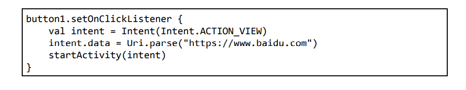

**这里我们首先指定了Intent的action是Intent.ACTION_VIEW，这是一个Android系统内置的动作，其常量值为android.intent.action.VIEW**

**然后通过Uri.parse()方法将一 个网址字符串解析成一个Uri对象，再调用Intent的setData()方法将这个Uri对象传递进去**

**这里再次使用了前面学习的语法糖，省略使用了setData()方法，直接.data看上去像是给Intent的data属性赋值一样**


+ **setData()方法：它接收一个Uri对象，主要用于指定当前Intent正在操作的数据，而这些数据通常是以字符串形式传入Uri.parse()方法中解析产生的**

+ **\<data>：与setData()方法对应，我们可以在\<intent-filter>标签中配置一个\<data>标签，用于更精确地指定当前Activity能够响应的数据。\<data>标签中主要可以配置以下内容：**

  

  **只有当\<data>标签中指定的内容和Intent中携带的Data完全一致时，当前Activity才能够响应该Intent。不过，在标签中一般不会指定过多的内容。例如在上面的浏览器示例中，其实只需要指定 android:scheme 为https，就可以响应所有https协议的Intent了**

  

  **Android Studio认为所有能够响应ACTION_VIEW的Activity都应该加上 BROWSABLE的category，否则就会给出一段警告提醒。**

  **加上 BROWSABLE的category是为了实现deep link功能，和我们目前学习的东西无关，所以这里直接在标签上使用 tools:ignore 属性将警告忽略即可**


## Activity的生命周期

**按下Back键或调用finish()方法去销毁一个Activity时，处于栈顶的 Activity 就会出栈变成销毁状态（即会调用onDestroy()方法），前一个入栈的Activity就会重新处于栈顶的位置。**

**系统总是会显示处于栈顶的Activity给用户。**


**android:theme属性：**用于给当前Activity指定主题，Android系统内置有很多主题可以选择，当然我们也可以定制自己 的主题


### Activity被回收了怎么办

应用中有一个Activity A，用户在Activity A的 基础上启动了Activity B，Activity A就进入了停止状态，这个时候由于系统内存不足，将Activity A回收掉了，然后用户按下Back键返回 Activity A，会出现什么情况呢？**其实还是会正常显示Activity A的，只不过这时并不会执行onRestart()方法，而是会执行Activity A的 onCreate()方法**，因为Activity A在这种情况下会被重新创建一次。但**存在的临时数据和状态会被回收掉。**


**onSaveInstanceState()回调方法与onCreat()方法：**

**onSaveInstanceState()方法会携带一个Bundle类型的参数，Bundle 提供了一系列的方法用于保存数据**，比如可以使用putString()方法保存字符串，使用putInt()方法保存整型数据，以此类推。**每个保存方法需要传入两个参数，第一个参数是键，用于后面从Bundle中取值， 第二个参数是真正要保存的内容。**


**onCreate()方法其实也有一个Bundle类型的参数。这个参数在一般情况下都是null，但是如果在Activity被系统回收之前，你通过onSaveInstanceState()方法保存数据，这个参数就会带有之前保存的全部数据，我们只需要再通过相应的取值方法将数据取出即可**


## singleInstance模式

singleInstance模式应该算是4种启动模式中最特殊也最复杂的一个了。

不同于以上3种启动模式，指定为 singleInstance 模式的Activity会**启用一个新的返回栈来管理这个 Activity**（其实如果singleTask模式指定了不同的taskAffinity，也会启动 一个新的返回栈）

**不管是哪个应用程序来访问这个 Activity，都共用同一个返回栈，也就解决了共享Activity实例的问题。**


**打印当前返回栈的id：getTaskId()方法（Java中需要实例话一个Activity对象）**


**如果所在的当前的返回栈已经空了，会显示另一个返回栈的栈顶Activity（如果不存在其他返回栈应用程序会直接退出回到桌面）**


## Activity的最佳实践技巧

### 知晓当前页面是在哪一个Activity

+ **新建一个BaseActivity类继承自 AppCompatActivity（注意不是Activity，不需要在AndroidManifest.xml中注册）**

+ **重写onCreate()方法，在其中加一行日志，用于打印当前实例的类名**

  

  **Kotlin中的javaClass表示获取当前实例的 Class对象，相当于在Java中调用getClass()方法；再调用simpleName获取当前实例的类名**

+ **让BaseActivity成为项目中所有Activity的父类，让它们不再继承自AppCompatActivity，而是继承自 BaseActivity**

+ **重新运行程序，现在第一次进入每一个页面时，会在日志中打印出当前页面对应的Activity的类名**


### 随时随地退出程序

+ **新建一个单例类作为Activity的集合**

  

  **注意在销毁Activity之前，我们需要先调用 activity.isFinishing 来判断 Activity 是否正在销毁中，因为 Activity 还可能通过按下Back键等方式被销毁，如果该Activity没有正在销毁中，我们再去调用它的finish()方法来销毁它**

+ **借用知晓当前页面是在哪一个Activity中的BaseActivity，在其中调用addActivity和removeActivity方法**

  

+ **从此以后，不管你想在什么地方退出程序，只需要调用ActivityCollector.finishAll()方法就可以了**

  **可以在销毁所有Activity的代码后面再加上杀掉当前进程的代码，以保证程序完全退出：**

  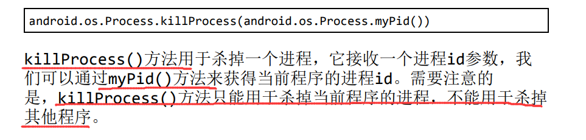


### 启动Activity的最佳写法

**在需要启动的Activity中定义一个启动该Activity的静态方法**


**这样写的好处在哪里呢？**

**最重要的一点就是一目了然，SecondActivity 所需要的数据在方法参数中全部体现出来了，这样即使不用阅读 SecondActivity中的代码，不去询问负责编写SecondActivity的同事，你也可以非常清晰地知道启动Activity需要传递哪些数据。另外， 这样写还简化了启动Activity的代码，现在只需要一行代码就可以启动 SecondActivity**


## Kotlin课堂：标准函数和静态方法

### 标准函数with、run和apply

**Kotlin的标准函数指的是Standard.kt文件中定义的函数，任何Kotlin代码都可以自由地调用所有的标准函数**


#### with函数

**with函数可以在连续调用同一个对象的多个方法时让代码变得更加精简**

+ **with函数接收两个参数：第一个参数可以是一个任意类型的对象，第二个参数是一个Lambda表达式**

+ **with 函数会在Lambda表达式中提供第一个参数对象的上下文，并使用 Lambda表达式中的最后一行代码作为返回值返回**

  


**实例：**


#### run函数

**run函数的用法和使用场景其实和with函数是非常类似的，只是稍微做了一些语法改动而已**

+ **首先run函数通常不会直接调用，而是要在某个对象的基础上调用**

+ **其次run函数只接收一个Lambda参数，并且会在Lambda表达式中 提供调用对象的上下文**

+ **其他方面和with函数是一样的，包括也会使用 Lambda 表达式中的最后一行代码作为返回值返回**

  


**实例：**


#### apply函数

**apply函数和run函数也是极其类似的，都要在某个对象上调用，并且只接收一个Lambda参数，也会在Lambda表达式中提供调用对象的上下文**

**但是apply函数无法指 定返回值，而是会自动返回调用对象本身**


**实例：**


### 定义静态方法

**和绝大多数主流编程语言不同的是，Kotlin极度弱化了静态方法这个概念，想要在Kotlin中定义一个静态方法反倒不是一件容易的事**

**因为Kotlin提供了比静态方法更好用的语法特性，并且我们在上一节中已经学习过了，那就是单例类**


#### companion object

**不过，使用单例类的写法会将整个类中的所有方法全部变成类似于静态方法的调用方式，而如果我们只是希望让类中的某一个方法变成静态方法的调用方式，则可以使用companion object**


**注意：前面使用的单例类和companion object都只是在语法的 形式上模仿了静态方法的调用方式，实际上它们都不是真正的静态方 法。因此如果你在Java代码中以静态方法的形式去调用的话，你会发现这些方法并不存在。**


#### 注解和顶层方法

**然而如果你确确实实需要定义真正的静态方法， Kotlin仍然提供了两种实现方式：注解和顶层方法**


+ **@JvmStatic注解：**

  **如果我们给单例类或companion object中的方法加上@JvmStatic注解，那么 Kotlin 编译器就会将这些方法编译成真正的静态方法**

  

  **注意，@JvmStatic注解只能加在单例类或companion object中的方法上**

+ **顶层方法：**

  **顶层方法指的是那些没有定义在任何类中的方法**

  **Kotlin编译器会将所有的顶层方法全部编译成静态方法，因此只要你定义了一个顶层方法，那么它就一 定是静态方法。**

  + **如果是在Kotlin代码中调用顶层方法，那就很简单了，所有的顶层方法都可以在任何位置被直接调用，不用管包名路径，也不用创建实例，直接键入方法名即可**

  + **如果是在Java代码中调用，因为Java中没有顶层方法这个概念，所有的方法必须定义在类中。**

    **Kotlin编译器会自动创建一个和顶层方法所在的Kotlin文件的文件名相同的Java类，因此在Java中使用类名.函数名的方法调用即可**


# 第 4 章 UI开发

**XML和ConstraintLayout：**


[Android新特性介绍，ConstraintLayout完全解析](https://blog.csdn.net/guolin_blog/article/details/53122387?ops_request_misc=%257B%2522request%255Fid%2522%253A%2522161789170716780261958458%2522%252C%2522scm%2522%253A%252220140713.130102334.pc%255Fblog.%2522%257D&request_id=161789170716780261958458&biz_id=0&utm_medium=distribute.pc_search_result.none-task-blog-2~blog~first_rank_v2~rank_v29-1-53122387.nonecase&utm_term=ConstraintLayout)


## Kotlin实现点击事件

**方法一：**


**方法二：**


## Android控件的可见属性

**Android控件的可见属性。所有的Android控件都具有这个属性，可以通过android:visibility进行指定，可选值有3种：visible、invisible和gone。**

+ **visible**表示控 件是可见的，这个值是默认值，不指定android:visibility时，控件都是可见的。
+ **invisible**表示控件不可见，但是它仍然占据着原来的位置和大小，可以理解成控件变成透明状态了。
+ **gone**则表示控件不仅不可见，而且不再占用任何屏幕空间。


**我们可以通过代码来设置控件的可见性**

+ **使用的是setVisibility()方法，允许传入View.VISIBLE、View.INVISIBLE和View.GONE这3种值。**
+ **通过getVisibility()方法来判断控件是否可见**


## 自定义标题栏

+ **自定义标题栏的XML布局**

+ **将标题栏include进需要的布局中**

  

+ **隐藏掉系统自带的标题栏**

  调用了**getSupportActionBar()方法**来获得**ActionBar的实例**，然后再调用它的**hide()方法将标题栏隐藏起来**

  


## 简单自定义控件

+ **新建一个类继承ViewGroup**如继承LinearLayout

  

  + TitleLayout的主构造函数中声明了**Context和AttributeSet这两个参数**，在布局中引入TitleLayout控件时就会调用这个构造函数

  + 通过**LayoutInflater的from()方法**可以构建出一 个LayoutInflater对象，然后调用**inflate()方法**就可以动态加载一 个布局文件、

    **inflate()方法接收两个参数：**

    + 第一个参数是**要加载的布局文件的id**，这里我们传入R.layout.title；
    + 第二个参数是**给加载好的布局再添加一个父布局**，这里我们想要指定为TitleLayout，于是直接传入this

+ **在需要的XML布局中添加自定义控件**

  添加自定义控件和添加普通控件的方式基本是一样的，只不过在添加自定义控件的时候，我们需要**指明控件的完整类名，包名在这里是不可以省略的**

  


## 编写精美的聊天界面（P329）


## Kotlin课堂：延迟初始化、强制类型转换和密封类

### 强制类型转换

Kotlin中的类型强制转换使用的**关键字是as**

`val x: String = y as String`表示y强制类型转换为String


直接使用as进行强制类型转换是不安全的方法，安全的强制类型转换使用 **as?，当类型转换失败时，它会返回 null，但不会抛出异常崩溃**


### 对变量延迟初始化

如果你的类中存在很多全局变量实例，为了保证它们能够满足 Kotlin 的空指针检查语法标准，你不得不做许多的非空判断保护才行， 即使你非常确定它们不会为空。幸运的是，这个问题其实是有解决办法的，而且非常简单，那就是**对全局变量进行延迟初始化**。


+ 延迟初始化使用的是 **lateinit 关键字**，它可以告诉Kotlin编译器，我会在晚些时候对这个变量进行初始化，这样就不用在一开始的时候将它赋值为null了

  

  使用lateinit关键字也不是没有任何风险，如果我们在变量还没有初始化的情况下就直接使用它，那么程序就一定会崩溃，并且抛出一个**UninitializedPropertyAccessException异常**

  所以，**当你对一个全局变量使用了lateinit关键字时，请一定要确保它在被任何地方调用之前已经完成了初始化工作**，否则Kotlin将无法保证程序的安全性

+ 还可以**通过代码来判断一个全局变量是否已经完成了初始化**

  

  **具体语法就是这样，`::adapter.isInitialized` 可用于判断 adapter 变量是否已经初始化。**虽然语法看上去有点奇怪，但**这是固定的写法**。


### 使用密封类优化代码

**密封类的作用：在when语句中传入一个密封类变量作为条件时**，Kotlin编译器会自动检查该密封类有哪些子类，并强制要求你将每一个子类所对应的条件全部处理。这样就可以保证，即使没有编写else条件，也不可能会出现漏写条件分支的情况，所以不会强制要求编写else条件。

而如果使用接口的话，则需要编写else条件，且后续要是有其他类实现了此接口，可能会在之前写过的when中出现漏写条件分支的情况


**密封类的关键字是sealed class**


**另外再多说一句，密封类及其所有子类只能定义在同一个文件的顶层位置，不能嵌套在其他类中**，这是被密封类底层的实现机制所限制的


# 第 5 章 Fragment

## Fragment的生命周期


+ **Fragment第一次被加载到屏幕上：**

  依次执行onAttach()、onCreate()、onCreateView()、onActivityCreated() 和 onResume()方法

+ **Fragment被其他Fragment替换掉：**

  + **在替换的时候调用了 addToBackStack() 方法：**

    依次执行onPause()、onStop() 和 onDestroyView()

  + **没有在替换的时候调用了 addToBackStack() 方法：**

    依次执行onPause()、onStop()、onDestroyView()、onDestroy() 和 onDetach()

+ **Fragment被其他Fragment替换掉后回到屏幕上（在替换的时候调用了 addToBackStack() 方法）：**

  依次执行onCreateView()、onActivityCreated()、onStart() 和 onResume()

+ **Fragment被销毁：**

  依次执行onPause()、onStop()、onDestroyView()、onDestroy() 和 onDetach()方法


### Fragment被回收了怎么办

**和在Activity中的处理方法基本一致**

在Fragment中你也可以通过 **onSaveInstanceState()** 方法来保存数据，因为进入停止状态的 Fragment有可能在系统内存不足的时候被回收。

保存下来的数据 在onCreate()、onCreateView()和onActivityCreated()这3个方法 中你都可以重新得到，它们都含有一个Bundle类型的 savedInstanceState参数


## Kotlin中定义常量

**Kotlin中定义常量都是使用的这种方式：**在companion object、单例类或顶层作用域中使用const关键字声明一个变量即可


## Kotlin课堂：扩展函数和运算符重载

### 扩展函数

不少现代高级编程语言中有扩展函数这个概念，**Java却一直以来都不支持这个非常有用的功能**，这多少会让人有些遗憾。但值得高兴的是， Kotlin对扩展函数进行了很好的支持


**扩展函数表示即使在不修改某个类的源码的情况下，仍然可以打开这个类，向该类添加新的函数**

**定义扩展函数只需要在函数名的前面加上一个ClassName.的语法结构**，就表示将该函数添加到指定类当中了。


建议**向哪个类中添加扩展函数，就定义一个同名的Kotlin文件**，这样便于你以后查找。 

当然，**扩展函数也是可以定义在任何一个现有类当中的，并不一定非要创建新文件**。不过通常来说，**最好将它定义成顶层方法**，这样可以让扩展函数拥有全局的访问域


**实例：**


### 运算符重载

运算符重载是Kotlin提供的一个比较有趣的语法糖

运算符重载使用的是 **operator 关键字**，只要**在指定函数的前面加 上operator关键字**，就可以实现运算符重载的功能了

**Kotlin允许我们对同一 个运算符进行多重重载**


+ **加号的运算符重载**

  

  

+ **所有常用的可重载运算符和关键字对应的语法糖表达式，以及它们会被转换成的实际调用函数**

  


# 第 6 章 广播

## 隐式广播

在Android 8.0系统之后，**所有隐式广播都不允许使用静态注册的方式来接收了**。

**隐式广播指的是那些没有具体指定发送给哪个应用程序的广播**，大多数系统广播属于隐式广播，但是少数特殊的系统广播目前仍然允许使用静态注册的方式来接收。这些特殊的系统广播列表详见https://developer.android.google.cn/guide/components/broadcast-exceptions.html


## Kotlin课堂：高阶函数和内联函数

### 高阶函数详解

**如果一个函数接收另一个函数作为参数，或者返回值的类型是另一个函数，那么该函数就称为高阶函数**

高阶函数允许**让函数类型的参数来决定函数的执行逻辑**。即使是同一个高阶函数，只要传入不同的函数类型参数，那么它的执行逻辑和最终的返回结果就可能是完全不同的


+ **函数类型：我们知道，编程语言中有整型、布尔型等字段类型，而Kotlin又增加了一个函数类型的概念**

  如果我们**将这种函数类型添加到一个函数的参数声明或者返回值声明**当中，那么这就是一个高阶函数了

  + **定义一个函数类型：**基本规则如下

    

    + **->左边的部分：**就是用来声明该函数接收什么参数的，多个参数之间使用逗号隔开，如果不接收任何参数， 写一对空括号就可以了
    + -**>右边的部分：**用于声明该函数的返回值是什么类型，如果没有返回值就使用Unit，它大致相当于Java中的void

+ 将上述**函数类型添加到某个函数的参数声明或者返回值声明**上，那么这个函数就是一个高阶函数了

  

  **func代表自定义的函数参数的名称**

+ 高阶函数调用时，传入的**函数要和定义时候的函数类型的传入参数和返回值类型**相同

  + 定义高阶函数以及需要传入的函数

    

    

  + 调用高阶函数并传入函数

    

    第三个参数使用了**`::plus`和`::minu`s**这种写法。**这是一种函数引用方式的写法**

+ 但是如果每次调用任何高阶函数的时候都还得先定义一个与其函数类型参数相匹配的函数，这有些太复杂了

  因此**Kotlin还支持其他多种方式来调用高阶函数，比如Lambda表达式、匿名函数、成员引用等**

  其中，**Lambda表达式是最常见也是最普遍的高阶函数调用方式**

  

+ **高阶函数完整的语法规则：**在函数类型的前面加上**`ClassName.`**，就表示这个**函数类型是定义在哪个类当中**的

  如下图中所示在函数类型的前面加上了一个StringBuilder. 的语法结构

  将函数类型定义到StringBuilder类当中的**好处**就是当我们**调用build函数时传入的Lambda表达式将会自动拥有StringBuilder的上下文**（这也是apply函数的实现方式）

  


### 内联函数的作用：消除高阶函数中的Lambda表达式的开销

**高阶函数的实现原理：我们都知道，Kotlin的代码最终还是要编译成Java字节码的，但Java中并没有高阶函数的概念。这就要归功于Kotlin强大的编译器了，Kotlin的编译器会将这些高阶函数的语法转换成Java支持的语法结构**

我们一直使用的**Lambda表达式在底层被转换成了匿名类的实现方式**


**上述的Kotlin代码大致会被转换成如下Java代码：**


**考虑到可读性，这段代码进行了些许调整，并不是严格对应了 Kotlin 转换成的 Java 代码**

+ 这里num1AndNum2()函数的**第三个参数变成了一个Function接口，这是一种Kotlin内置的接口，里面有一个待实现的invoke()函数**。
+ 而num1AndNum2()函数其实就是**调用了Function接口的invoke()函数，并把num1和num2参数传了进去**
+ 在调用num1AndNum2()函数的时候，之前的**Lambda表达式在这里变成 了Function接口的匿名类实现**，然后在invoke()函数中实现了n1 + n2的逻辑，并将结果返回


**内联函数：**我们一直使用的Lambda表达式在底层被转换成了匿名类的实现方式。这就表明，我们**每调用一次Lambda表达式，都会创建一个新的匿名类实例，当然也会造成额外的内存和性能开销**。

为了解决这个问题，Kotlin提供了内**联函数的功能，它可以将使用 Lambda 表达式带来的运行时开销完全消除**


**内联函数的用法**非常简单，**只需要在定义高阶函数时加上inline关键字**的声明即可


**内联函数的工作原理：**Kotlin编译器会**将内联函数中的代码在编译的时候自动替换到调用它的地方**，这样也就不存在运行时的开销了

+ **实例：**

  

  + **第一步替换：**将Lambda表达式中的代码替换到函数类型参数调 用的地方

    

  + **第二步替换：**将内联函数中的全部代码替换到函数调用的地方

    

  + **最终的替换结果：**

    


### 选择性内联：noinline与crossinline

#### noinline

一个高阶函数中如果接收了两个或者更多函数类型的参数，这时我们给函数**加上了inline关 键字，那么Kotlin编译器会自动将所有引用的Lambda表达式全部进行内联**。

 但是，如果我们**只想内联其中的一个Lambda表达式**就可以使用**noinline关键字**了


**实例：**


在block2参数的前面加上了一个noinline关键字，那么现在就**只会对block1参数所引用的Lambda表达式进行内联**了


**为什么Kotlin还要提供一个noinline关键字来排除内联功能呢：**

+ 这是因为**内联的函数类型参数在编译的时候会被进行代码替换，因此它没有真正的参数属性**。

  + **非内联的函数类型参数可以自由地传递给其他任何函数，因为它就是一个真实的参数**
  + **内联的函数类型参数只允许传递给另外一个内联函数**，这也是它最大的局限性。

+ **内联函数所引用的Lambda表达式中是可以使用return关键字来进行函数返回的， 而非内联函数只能进行局部返回**

  + **非内联函数中的局部返回：**

    

    

    **注意：Lambda表达式中是不允许直接使用return关键字的**。

    这里**使用了return@printString的写法，表示进行局部返回，并且不再执行Lambda表达式的剩余部分代码**

  + **内联函数中的非局部返回：**

    

    

    **现在printString()函数变成了内联函数，我们就可以在Lambda表达 式中使用return关键字了。此时的return代表的是返回外层的调用函数，也就是main()函数**


#### crossinline

**将高阶函数声明成内联函数是一种良好的编程习惯，事实上，绝大多数高阶函数是可以直接声明成内联函数的，但是也有少部分例外的情况：**

如果我们**在高阶函数中创建了另外的Lambda或者匿名类的实现，并且在这些实现中调用函数类型参数**，此时再将高阶函数声明成内联函数，就一定会提示错误

因为**内联函数的Lambda表达式中允许使用return关键字，和高阶函数的匿名类实现中不允许使用return关键字**之间造成了冲突


但借助**crossinline关键字**就可以很好地解决这个问题。

**crossinline关键字就像一个契约，它用于保证在内联函数的Lambda表达式中一定不会使用return关键字**，这样冲 突就不存在了，问题也就巧妙地解决了


声明了**crossinline之后，我们就无法在调用runRunnable函数时的 Lambda 表达式中使用return关键字进行函数返回了，但是仍然可以使用return@runRunnable的写法进行局部返回**


# 第 7 章 数据存储全方案，详解持 久化技术

## 数据持久化功能

Android系统中主要提供了**3种方式**用于简 单地实现数据持久化功能：**文件存储、SharedPreferences存储以及数据库存储**

+ **文件存储：**

  文件存储不对存储的内容进行任何格式化处理,所有数据都是原封不动地保存到文件当中的，因而它**比较适合存储一些简单的文本数据或二进制数据**

  如果你想使用文件存储的方式来保存一些较为**复杂的结构化数据，就需要定义一套自己的格式规范**，方便之后将数据从文件中重新解析出来

  + **存数据：**

    

    

    注意，这里还使用了一个**use函数，这是Kotlin提供的一个内置扩展函数：**它会保证在Lambda表达式中的代码全部执行完之后自动将外层的流关闭，这样就不需要我们再编写一个finally语句，手动去关闭流了

  + **读数据：**

    

    

    注意，这里从文件中读取数据使用了一个**forEachLine函数，这也是 Kotlin提供的一个内置扩展函数：**它会将读到的每行内容都回调到 Lambda表达式中，我们在Lambda表达式中完成拼接逻辑即可

+ **SharedPreferences存储：**

  **SharedPreferences是使用键值对的方式来存储数据的**。也就是说，当保存一条数据的时候，需要给这条数据提供一个对应的键，这样在读取数据的时候就可以通过这个键把相应的值取出来。

  而且SharedPreferences还**支持多种不同的数据类型存储**，如果存储的数据类型是整型，那么读取出来的数据也是整型的；如果存储的数据 是一个字符串，那么读取出来的数据仍然是字符串

+ **SQLite数据库存储：**

  **Android系统内置了数据库：SQLite是一款轻量级的关系型数据库。**它的运算速度非常快，占用资源很少，通常只需要几百 KB的内存就足够了，因而特别适合在移动设备上使用。SQLite不仅支持标准的SQL语法，还遵循了数据库的ACID事务，所以只要你以前使 用过其他的关系型数据库，就可以很快地上手SQLite。而SQLite又比一般的数据库要简单得多，它甚至不用设置用户名和密码就可以使用

  **文件存储和SharedPreferences存储只适用于保存一些简单的数据和键值对**


## Device FileExplorer工具

借助Device FileExplorer工具可以查看设备文件，**这个工具其实就相当于一个设备文件浏览器**

这个工具在Android Studio的右侧边栏当中，通常是在右下角的位置，如果你的右侧边栏中没有这个工具的话，也可以使用快捷键Ctrl + Shift + A（Mac系统是command + shift + A）打开搜索 功能，在搜索框中输入“Device File Explorer”即可找到这个工具


+ **文件存储所在位置：**

  /data/data/com.example.filepersistencetest/files/

  **文件存储使用普通文件对数据进行管理**

+ **SharedPreferences存储所在位置：**

  /data/data/com.example.sharedpreferencestest/shared_prefs/

  **SharedPreferences文件是使用XML格式来对数据进行管理**

+ **SQLite数据库存储所在位置：**

  /data/data/com.example.databasetest/databases/

  但是这个工具最多只 能看到databases目录下出现了一个BookStore.db文件，是无法查看Book表的。因此我们还需要借助一个叫作**Database Navigator**的插件工具

  P473：**Database Navigator**的插件工具方法


## Kotlin课堂：异常检查机制和高阶函数的应用

### 异常检查机制

**Kotlin是没有异常检查机制（checked exception）的**。这意味着使用Kotlin编写的所有代码都**不会强制要求**你进行异常捕获或异常抛出。 即无论你写或者不写try catch代码块，Kotlin都可以编译通过。

[浅谈Kotlin的Checked Exception机制](https://blog.csdn.net/guolin_blog/article/details/108817286?ops_request_misc=%257B%2522request%255Fid%2522%253A%2522161810430016780274132304%2522%252C%2522scm%2522%253A%252220140713.130102334.pc%255Fblog.%2522%257D&request_id=161810430016780274132304&biz_id=0&utm_medium=distribute.pc_search_result.none-task-blog-2~blog~first_rank_v2~rank_v29-1-108817286.nonecase&utm_term=%E5%BC%82%E5%B8%B8%E6%A3%80%E6%9F%A5)


### 高阶函数的应用（还没看）

P504


# 第 8 章 ContentProvider

ContentProvider主要**用于在不同的应用程序之间实现数据共享的功能**， 它提供了一套完整的机制，**允许一个程序访问另一个程序中的数据，同时还能保证被访问数据的安全性**

ContentProvider可以**选择只对哪一部分数据进行共享**，从而保证我们程序中的隐私数据不会有泄漏的风险


## 运行时权限

P514	开始介绍

P520	具体讲解以及精华部分


## Kotlin课堂：泛型和委托

### 泛型

Kotlin中的泛型和 Java 中的泛型有同有异

**泛型主要有两种定义方式：**

使用的**语法结构都是\<T>**。当然括号内的 **T 并不是固定要求的，事实上你使用任何英文字母或单词都可以**，但是通常情况下，T是一种约定俗成的泛型写法

当然也可以定义多个泛型参数：


+ 一种是定义泛型类

  

  

+ 另一种是定义泛型方法

  

  

  + 另外，**Kotlin还拥有非常出色的类型推导机制**，例如我们传入了一个 Int 类型的参数，它能够**自动推导出泛型的类型**就是Int型，因此这里也**可以直接省略泛型的指定**

    

+ **Kotlin还允许我们对泛型的类型进行限制，可以通过指定上界的方式来对泛型的类型进行约束**

  **实例：如下所示，比如这里将method()方法的泛型上界设置为Number类型，表明我们只能将method()方法的泛型指定成数字类型， 比如Int、Float、Double等**

  

  + **在默认情况下，所有的泛型都是可以指定成可空类型的**，这是因为在不手动指定上界的时候，**泛型的上界默认是Any?**。

    而如果想要让泛型的类型不可为空，只需要将泛型的上界手动指定成Any就可以了

  + **<*>这种泛型的写法表示你不知道或者不关心泛型的具体类型，只是为了通过语法编译而已**


### 类委托和委托属性

Java对于委托并没有语言层级的实现。

但Kotlin中支持委托功能，并且将**委托功能分为了两种**：类委托和委托属性

+ **类委托：**类委托的核心思想在于**将一个类的具体实现委托给另一个类去完成**

  Kotlin中委托使用的**关键字是by，我们只需要在接口声明的后面使用 by 关键字，再接上受委托的辅助对象**

  

  **如果我们要对某个方法进行重新实现，只需要单独重写那一个方法就可以了**

  **其他的方法仍然可以享受类委托所带来的便利，即直接调用辅助对象中的方法**

  

  **实例：如下所示这里新增了一个helloWorld()方法，并且重写了isEmpty()方法**

  

+ **委托属性：**委托属性的核心思想是**将一个属性（字段）的具体实现委托给另一个类去完成**

  + 

  + 

    + **getValue()方法要接收2个参数：**

      + 第一个参数用于**声明该Delegate类的委托功能可以在什么类中使用**，这里写成MyClass表示仅可在MyClass类中使用

      + 第二个参数**KProperty<*>是Kotlin中的一个属性操作**类，可用于获取各种属性相关的值，在当前场景下用不着，但是必须在方法参数上进行声明

        **<*>这种泛型的写法表示你不知道或者不关心泛型的具体类型，只是为了通过语法编译而已**

        **返回值可以声明成任何类型，根据具体的实现逻辑去写就行了**，上述代码只是一种示例写法

    + **setValue()方法要接收3个参数：**

      + **前两个参数和 getValue() 方法是相同的**

      + **最后一个参数表示具体要赋值给委托属性的值**，这个参数的类型必须和getValue()方法返回值的类型保持一致

    + 当属性是**使用val关键字声明时，可以不用在Delegate类中实现 setValue() 方法，只需要实现getValue()方法就可以了**


### lazy函数

它的基本语法结构如下：


实际上，**by lazy并不是连在一起的关键字，只有by才是Kotlin中的关键字，lazy在这里只是一个高阶函数而已**

+ 在lazy函数中会创建并返回一个Delegate对象，当我们调用p属性的时候，其实调用的是Delegate对象的 getValue() 方法，然后getValue()方法中又会调用lazy函数传入的 Lambda 表达式，这样表达式中的代码就可以得到执行了，并且调用p属性后得到的值就是Lambda表达式中最后一行代码的返回值


# 第 9 章 运用手机多媒体（本章基本只看了kotlin）

## 将程序运行到手机上

P571


## 使用通知

暂时跳过


## Kotlin课堂：使用infix函数构建更可读的语法

我们已经多次使用过**A to B这样的语法**结构构建键值对

首先，**to并不是Kotlin语言中的一个关键字，之所以我们能够使用A to B这样的语法结构，是因为Kotlin提供了一种高级语法糖特性：infix函数**

infix函数也并不是什么难理解的事物，它**只是把编程语言函数调用的语法规则调整了一下而已**，比如A to B这样的写法，实际上等价于A.to(B)的写法


**infix函数写在fun的前面，可见性修饰符的后面**

**实例：**

+ 原本使用方式：

  

+ 使用infix函数：

  

+ 现在使用方式：

  


infix函数由于其语法糖格式的特殊性，**有两个比较严格的限制：**

+ 首先，**infix函数是不能定义成顶层函数的，它必须是某个类的成员函数，可以使用扩展函数的方式将它定义到某个类或接口当中**
+ 其次，**infix函数必须接收且只能接收一个参数，至于参数类型是没有限制的**


# 第 10 章 Service

**Service是Android中实现程序后台运行的解决方案，它非常适合执行那些不需要和用户交互而且还要求长期运行的任务**

Service的运行**不依于任何用户界面，即使程序被切换到后台，或者用户打开了另外一个应用程序，Service仍然能够保持正常运行**

Service并不是运行在一个独立的进程当中的，而是**依赖于创建Service时所在的应用程序进程**。当某个应用程序进程被杀掉时，所有依赖于该进程的Service也会停止运行

另外，也不要被Service的后台概念所迷惑，实际上**Service并不会自动开启线程，所有的代码都是默认运行在主线程当中的**。也就是说，我们**需要在Service的内部手动创建子线程，并在这里执行具体的任务**，否则就 有可能出现主线程被阻塞的情况。


## Android多线程编程

**Android多线程编程其实并不比Java多线程编程特殊，基本是使用相同的语法**


**Java和Kotlin中均有的方法：**

+ 方法一：

  定义一个线程只需要**新建一个类继承自Thread，然后重写父类的run()方法，并在里面编写耗时逻辑即可**

  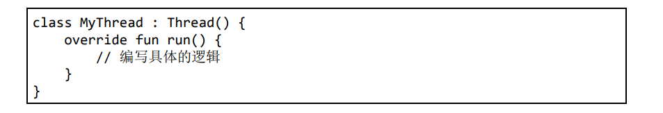

  **启动线程的方式：**

  **只需要创建新建类的实例，然后调用它的start()方法即可，这样run()方法中的代码就会在子线程当中运行了**

  

+ 方法二：

  当然，**使用继承的方式耦合性有点高，我们会更多地选择使用实现 Runnable 接口的方式**来定义一个线程

  

  **启动线程的方式：**

  Thread的构造函数接收一个Runnable参数。可以直接**将新建的类传入Thread的构造函数里，接着调用Thread的start()方法**。run() 方法中的代码就会在子线程当中运行了

  

+ 方法三：

  如果你**不想专门再定义一个类去实现Runnable接口**，也可以**使用Lambda的方式，这种写法更为常见**

  


**Kotlin中独有提供的方式：**


## 在子线程中更新UI

和许多其他的GUI库一样，Android的**UI也是线程不安全的**。也就是说， 如果**想要更新应用程序里的UI元素，必须在主线程中进行**，否则就会出现异常


但是有些时候，我们**必须在子线程里执行一些耗时任务，然后根据任务的执行结 果来更新相应的UI控件**。对于这种情况，Android提供了**一套异步消息处理机制，完美地解决了在子线程中进行UI操作的问题**


## 解析异步消息处理机制

P645


## Service的基本用法


**Exported属性**表示是否将这个Service暴露给外部其他程序访问，**Enabled属性**表示是否启用这个Service


**从Android 8.0系统开始， 应用的后台功能被大幅削减**。

现在**只有当应用保持在前台可见状态的情况下，Service才能保证稳定运行，一旦应用进入后台之后，Service随时都有可能被系统回收**。之所以做这样的改动，是为了防止许多恶意的应 用程序长期在后台占用手机资源，从而导致手机变得越来越卡。当然， **如果你真的非常需要长期在后台执行一些任务，可以使用前台Service或者WorkManager**，前台Service我们待会马上就会学到，而WorkManager 将会在第13章中进行学习


我们是完全有可能对一个Service**既调用了startService()方法，又调用了bindService()方法**的，在这种情况下该如何让Service销 毁呢？

根据Android系统的机制，一个Service只要**被启动或者被绑定了之后，就会处于运行状态，必须要让以上两种条件同时不满足，Service 才能被销毁**。所以，这种情况下要同时调用stopService()和 unbindService()方法，onDestroy()方法才会执行


## 前台Service

如果你希望Service能够一直保持运 行状态，就可以考虑使用前台Service。

前台Service和普通Service最大的区别就在于，**它一直会有一个正在运行的图标在系统的状态栏显示，下拉状态栏后可以看到更加详细的信息，非常类似于通知的效果**


P669


## 使用IntentService

**为了可以简单地创建一个异步的、会自动停止的Service，Android专门提供了一个IntentService类**

P672


## Kotlin课堂：泛型的高级特性

### 对泛型进行实化

**Java中完全没有泛型实化这个概念**

**Java的泛型擦除机制：**Java的泛型功能是通过类型擦除机制来实现

+ **泛型对于类型的约束只在编译时期存在**，运行的时候仍然会按照JDK 1.5之前的机制来运行，JVM是识别不出来我们在代码中指定的泛型类型的
+ 所有**基于JVM的语言**，它们的泛型功能都是通过类型擦除机制来实现的，其中当然**也包括了Kotlin**
+ 这种机制使得我们不可能使用a is T或 者T::class.java这样的语法，因为**T的实际类型在运行的时候已经被擦除了**


**Kotlin中是可以将内联函数中的泛型进行实化的**

+ 该函数必须是内联函数才行，也就是要用inline关键字来修饰该函数。
+ 其次，在声明泛型的地方必须**加上reified关键字**来表示该泛型要进行实化


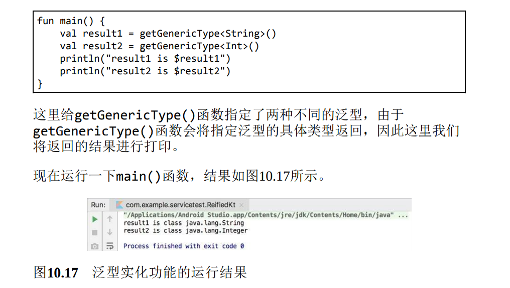


### 泛型的协变

**泛型的协变和逆变功能不太常用**，而且我个人认为有点不容易理解。**但是Kotlin的内置API中使用了很多协变和逆变的特性**


**in位置和out位置：**

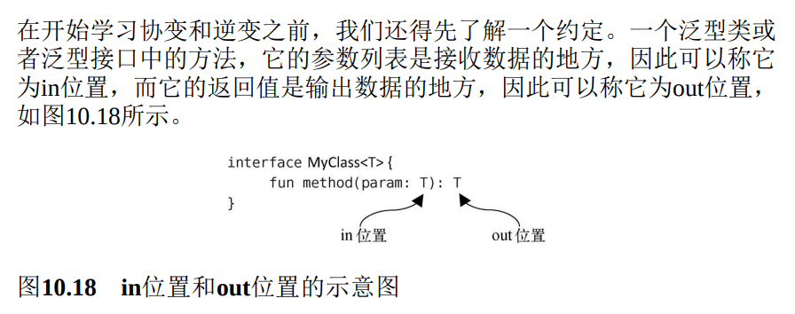

假如定义了一 个MyClass的泛型类，**其中A是B的子类型，同时MyClass又是MyClass的子类型**，那么我们就可以称**MyClass在T这个泛型上是协变的**

如果**一个泛型类在其泛型类型的数据上是只读的**话，那么**它是没有类型转换安全隐患**的，**MyClass成为MyClass的子类型**

+ 需要让**MyClass类中的所有方法都不能接收T类型的参数**


+ **out关键字：**

  

  + **@UnsafeVariance注解：**

    **在泛型E的前面又加上了一个@UnsafeVariance注解，这样编译器就会允许泛型E出现在in位置上了**

    但是如果你滥用这个功能，导致运行时出现了类型转换异常， Kotlin对此是不负责的

    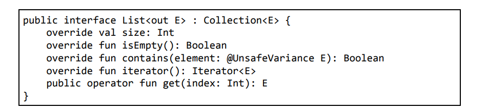

    contains()方法的目的非常明确，它只是为了判断当前集合中是否包含参数中传入的这个元素，而并不会修改当前 集合中的内容，因此这种操作实质上又是安全的。那么为了让编译器能 够理解我们的这种操作是安全的，这里在泛型E的前面又加上了一 个@UnsafeVariance注解，这样编译器就会允许泛型E出现在in位置上了。

+ **使用val关键字：**

  构造函数中的泛型T是在in位置上，但是由于这里我们**使用了val关键字，所以构造函数中的泛型T仍然是只读的**，因此这样写是合法且安全的

+ **使用了var关键字，但同时给它加上private修饰符：**

  即使我们使用了var关键字，但只要给它加上private修饰符，**保证这个泛型T对于外部而言是不可修改的**，那么就都是合法的写法


**Kotlin已经默认给许多内置的API加上了协变声明，其中就包括了各种集合的类与接口**


### 泛型的逆变（较难理解）

假如定义了一个MyClass的泛型类，其中**A是B的子类型，同时MyClass又是MyClass的子类型**，那么我们就可以称MyClass 在T这个泛型上是逆变的


+ **in关键字：**

  在泛型T的声明前面加上了一个in关键字。这就意味着现在T只能出现在in位置上，而不能出现在out位置上，同时也意味着在泛型T上是逆变的

  

  + **@UnsafeVariance注解：**

    作用同理协变中的作用以及用法

    


**Kotlin在提供协变和逆变功能时，就已经把各种潜在的类型 转换安全隐患全部考虑进去了。只要我们严格按照其语法规则，让泛型在协变时只出现在out位置上，逆变时只出现在in位置上，就不会存在类型转换异常的情况。**虽然@UnsafeVariance注解可以打破这一语法规 则，但同时也会带来额外的风险，所以你在使用@UnsafeVariance注 解时，必须很清楚自己在干什么才行


# 第 11 章 网络技术

##  WebView的用法

Android提供了一个**WebView控件，借助它我们就可以在自己的应用程序里嵌入一个浏览器**，从而非常轻松地展示各种各样的网页

P695


## 使用HTTP访问网络

### 使用HttpURLConnection

在过去，Android上发送HTTP请求一般有两种方式： HttpURLConnection和HttpClient。

不过**由于HttpClient存在API数量过多、扩展困难等缺点**，Android团队越来越不建议我们使用这种方式。 终于在Android 6.0系统中，**HttpClient的功能被完全移除**了，标志着此功能被正式弃用

P699


### 使用OkHttp

事实上在开源盛行的今天，有许多出色的网络通信库都可以**替代原生的HttpURLConnection，而其中OkHttp（Okhttp3）无疑是做得最出色的一个**

P705


## 解析XML格式数据

P709


### Windows系统下搭建Apache服务器

这里只会演示Windows系统下 的搭建过程，因为Mac和Ubuntu系统都是默认安装好Apache服务器的， 只需要启动一下即可。如果你使用的是这两种系统，可以自行搜索一下 具体的操作方法

P709


**解析XML格式的数据其实也有挺多种方式的，本节中我们学习比较常用的两种：Pull解析和SAX解析**

### Pull解析方式

P713


**从Android 9.0系统开始，应用程序默认只允许使用HTTPS 类型的网络请求，HTTP类型的网络请求因为有安全隐患默认不再被支持**

**为了能让程序使用HTTP，需要进行如下配置：**

P715


### SAX解析方式

SAX解析也是一种特别常用的XML解析方式，虽然**它的用法比Pull解析要复杂一些，但在语义方面会更加清楚**

P717


## 解析JSON格式数据

比起XML，**JSON的主要优势在于它的体积更小，在网络上传输的时候更省流量**。但缺点在于，它的语义性 较差，看起来不如XML直观


解析JSON数据也有很多种方法，可以使用官方提供的 **JSONObject**，也可以使用Google的开源库**GSON**。另外，一些第三方的 开源库如**Jackson、FastJSON**等也非常不错


### 使用JSONObject

P722


### 使用GSON

如果你认为使用JSONObject来解析JSON数据已经非常简单了，那你就太容易满足了。Google提供的GSON开源库可以让解析JSON数据的工作简单到让你不敢想象的地步

P723


## 网络请求回调的实现方式

通常情况下我们应该**将通用的网络操作提取到一个公共的类里，并提供一个通用方法，当想要发起网络请求的时候，只需简单地调用一下这个方法即可**

P729


## 最好用的网络库：Retrofit

**Retrofit和OkHttp的定位完全不同**

+ OkHttp侧重的是底层通信的实现
+ Retrofit侧重的是上层接口的封装

Retrofit就是Square公司**在 OkHttp 的基础上进一步开发出来的应用层网络通信库**，使得我们可以用 更加面向对象的思维进行网络操作


### Retrofit的基本用法

Retrofit的**基本设计思想**基于以下几个事实：

+ 同一款应用程序中所发起的网络请求绝大多数指向的是同一个服务器域名

+ 服务器提供的接口通常是可以根据功能来归类的

+ 开发者肯定更加习惯于“调用一个接口，获取它的返回值”这样的编码方式

  但当调用的是服务器接口时，却很难想象该如何使用这样的编码方式。其实大多数人并不关心网络的具体通信细节，但是**传统网络 库的用法却需要编写太多网络相关的代码**


Retrofit的**用法**基于以上几点来设计的：

+ 首先我们可以**配置好一个根路径**，然后在指定服务器接口地址时只需要**使用相对路径**即可，这样就**不用每次都指定完整的URL地址**了

+ 另外，Retrofit**允许我们对服务器接口进行归类，将功能同属一类的服务器接口定义到同一个接口文件当中**，从而让代码结构变得更加合理

+ 最后，我们也完全不用关心网络通信的细节，**只需要在接口文件中声明一系列方法和返回值，然后通过注解的方式指定该方法对应哪个服务器接口，以及需要提供哪些参数**

  当我们在程序中**调用该方法时，Retrofit 会自动向对应的服务器接口发起请求，并将响应的数据解析成返回值声明的类型**。这就使得我们可以用更加面向对象的思维来进行网络操作。


**Retrofit的具体用法：**

+ 添加必要的依赖库

  编辑 app/build.gradle文件，在dependencies闭包中添加如下内容：

  

  + **第一条依赖：**由于Retrofit是基于OkHttp开发的，因此添加上述第一条依赖会自动**将 Retrofit、OkHttp 和 Okio 这几个库一起下载**，我们无须再手动引入 OkHttp 库

  + **第二条依赖：**Retrofit还会将服务器返回的 JSON 数据自动解析成对象，因此上述第二条依赖就是一个Retrofit的转换库，它是借助GSON来解析 JSON 数据的，所以会自动**将GSON库一起下载下来**，这样我们也不用手动引入GSON库了

    除了GSON之外，Retrofit还支持各种其他主流的 JSON 解析库，包括Jackson、Moshi等，不过毫无疑问GSON是最常用的

+ GSON的用法：（略）

+ 定义接口文件：

  通常**Retrofit的接口文件建议以具体的功能种类名开头，并以Service结尾**，这是一种比较好的命名习惯

  

  不过由于**实例中**的的 Apache 服务器上其实只有一个获取JSON数据的接口，因此这里只需要定义一个接口文件，并包含一个方法即可

  **上述代码中有两点需要我们注意：**

  + 第一就是在getAppData()方法上面添加的注解，这里**使用了一个@GET注解，表示当调用getAppData()方法时Retrofit会发起一条GET请求，请求的地址就是我们在@GET注解中传入的具体参数**（注意，这里**只需要传入请求地址的相对路径即可**，根路 径我们会在稍后设置）

  + 第二就是**getAppData()方法的返回值必须声明成Retrofit中内置的 Call 类型**，并通过泛型来指定服务器响应的数据应该转换成什么对象

    由于服务器响应的是一个包含App数据的JSON数组，因此这里我们将泛型声明成List。当然，**Retrofit还提供了强大的Call Adapters功能来允许我们自定义方法返回值的类型**

+ 使用定义好的接口：

  

  + 首先使用了**Retrofit.Builder来构建一个Retrofit对象**

    + **baseUrl()方法：**baseUrl()方法用于**指定所有Retrofit请求的根路径**

    + **addConverterFactory()方法：**addConverterFactory()方法用于**指定Retrofit在解析数据时所使用的转换库**

      这里指定成GsonConverterFactory。

    + 注意baseUrl()方法和addConverterFactory()方法两个方法都是**必须调用的**

  + 调用**Retrofit对象的create()方法，传入具体Service接口所对应的Class类型**，创建一个该接口的动态代理对象

    有了动态代理对象之后，我们就可以随意调用接口中定义的所有方法，而 Retrofit 会自动执行具体的处理

  + 调用传入的接口中的方法后会返回一个接口中指定的对象，再调用一下它的 **enqueue()方法，Retrofit就会根据注解中配置的服务器接口地址去进行网络请求了**

    **服务器响应的数据会回调到enqueue()方法中传入的 Callback 实现里面**

    + 需要注意的是，**当发起请求的时候，Retrofit会自动在内部开启子线程，当数据回调到Callback中之后，Retrofit又会自动切换回主线程，整个操作过程中我们都不用考虑线程切换问题**

  + 在**Callback的onResponse()方法中，调用response.body()方法将 会得到Retrofit解析后的对象**，遍历解析出的对象，并筛选处理需要的数据即可


### 处理复杂的接口地址类型

+ **先从最简单的看起，比如服务器的接口地址如下所示：**

  

  这是最简单的一种情况，**接口地址是静态的**，永远不会改变。

  那么对应到Retrofit当中，使用如下的写法即可：
  

+ 但是显然服务器不可能总是给我们提供静态类型的接口，**在很多场景下，接口地址中的部分内容可能会是动态变化的**，比如如下的接口地址：

  

  **在这个接口当中，\<page>部分代表页数，我们传入不同的页数，服务器返回的数据也会不同**。

  这种接口地址对应到Retrofit当中应该怎么写呢？

  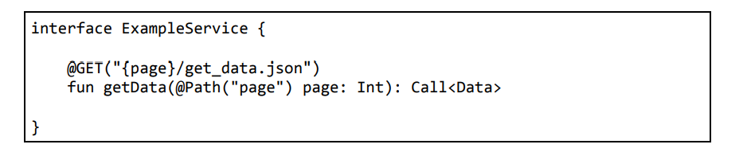

  + 在@GET注解指定的接口地址当中，这里**使用了一个{page}的占位符**
  +  然后又**在getData()方法中添加了一个page参数，并使用@Path("page")注解来声明这个参数**。
  + 这样当调用getData()方法发起请求时，**Retrofit就会自动将page参数的值替换到占位符的位置，从而组成一个合法的请求地址**

+ 另外，**很多服务器接口还会要求我们传入一系列的参数**，格式如下：

  

  **这是一种标准的带参数GET请求的格式：**

  + **接口地址的最后使用问号来连接参数部分**
  + **每个参数都是一个使用等号连接的键值对**
  + **多个参数之间使用“&”符号进行分隔**

  

  对于这种格式的服务器接口，我们可以使用刚才所学的@Path注解的方式来解决，但是这样会有些麻烦， **Retrofit针对这种带参数的GET请求，专门提供了一种语法支持：**

  

  这里**在getData()方法中添加了user和token这两个参数，并使用@Query注解对它们进行声明**。这样当发起网络请求的时候，Retrofit 就会自动按照带参数GET请求的格式将这两个参数构建到请求地址当中

+ 不过HTTP并不是只有GET请求这一种类型，而是有很多种，其中比较常用的有GET、POST、PUT、PATCH、DELETE这几种

  **Retrofit对所有常用的HTTP请求类型都进行了支持，使用@GET、@POST、@PUT、@PATCH、@DELETE注解，就可以让Retrofit发 出相应类型的请求了**

  + @DELETE

    

    

    + 使用了**@DELETE注解来发出DELETE类型的请求，并使用了@Path注解来动态指定id**

    + **在返回值声明的时候，我们将Call的泛型指定成了ResponseBody：**

      由于POST、PUT 、PATCH、DELETE**这几种请求类型与GET请求不同，它们更多是用于操作服务器上的数据，而不是获取服务器上的数据，所以通常它们对于服务器响应的数据并不关心**。

      这个时候**就可以使用ResponseBody，表示Retrofit能够接收任意类型的响应数据，并且不会对响应数据进行解析**

  + @POST

    

    声明了一个**Data类型的参 数，并给它加上了@Body注解**。这样**当Retrofit发出POST请求时，就会自动将Data对象中的数据转换成JSON格式的文本，并放到HTTP请求的 body部分**，服务器在收到请求之后只需要从body中将这部分数据解析出来即可。

    **这种写法同样也可以用来给PUT、PATCH、DELETE类型的请求提交数据**

  + **有些服务器接口还可能会要求我们在HTTP请求的header中指定参数。比如：**

    

    但是**这种写法只能进行静态header声明，如果想要动态指定header的值，则需要使用@Header注解**，如下所示：

    


### Retrofit构建器的最佳写法

获取Service接口的动态代理对象实在是太麻烦了。需要先使用Retrofit.Builder构建出一个Retrofit对象，然后再调用Retrofit对象 的create()方法创建动态代理对象。如果只是写一次还好，**每次调用任何服务器接口时都要这样写一遍的话，肯定没有人能受得了**

事实上，确实也没有每次都写一遍的必要，因为构建出的Retrofit对象是全局通用的，只需要在调用create()方法时针对不同的Service接口 传入相应的Class类型即可。因此，**我们可以将通用的这部分功能封装起来，从而简化获取Service接口动态代理对象的过程**

P741


## Kotlin课堂：使用协程编写高效的并发程序

**协程属于Kotlin中非常有特色的一项技术，因为大部分编程语言中是没 有协程这个概念的**

**协程其实和线程是有点类似的，可以简单地将它理解成一种轻量级的线程**

要知道，我们之前所学习的线程是非常重量级的，它需要依靠操作系统的调度才能实现不同线程之间的切换。而使**用协程却可以仅在编程语言的层面就能实现不同协程之间的切换，从而大大提升了并发编程的运行效率。**


**协程允许我们在单线程模式下模拟多线程编程的效果，代码执行时的挂起与恢复完全是由编程语言来控制的，和操作系统无关**


### 协程的基本用法

+ **添加依赖库：**

  **Kotlin并没有将协程纳入标准库的API当中，而是以依赖库的形式提供的。**所以如果我们想要使用协程功能，**需要先在app/build.gradle文件当中添加如下依赖库：**

  

  + **第二个依赖库是在Android项目中才会用到的**

    如果编写的是纯Kotlin代码，是用不到第二个依赖库的

+ **开启一个协程：**

  + 最简单的方式就是**使用Global.launch函数（不太建议使用）：**

    

    + **GlobalScope.launch函数可以创建一个协程的作用域，这样传递给 launch 函数的代码块（Lambda表达式）就是在协程中运行的了**

    + **Global.launch函数每次创建的都是一个顶层协程，这种协程当应用程序运行结束时也会跟着一起结束**

      所有如果应用程序结束过快**，顶层协程里的代码可能还没有执行程序就结束了**

    + **delay()函数**

      **delay()函数可以让当前协程延迟指定时间后再运行**，但它和Thread.sleep()方法不同。

      delay()函数是一个非阻塞式的挂起函 数，它只会挂起当前协程，并不会影响其他协程的运行。 而Thread.sleep()方法会阻塞当前的线程，这样运行在该线程下的所 有协程都会被阻塞

      注意，**delay()函数只能在协程的作用域或其他挂起函数中调用**

      

  + **runBlocking函数（一般不用）**

    runBlocking函数同样会创建一个协程的作用域，但是**它可以保证在协程作用域内的所有代码和子协程没有全部执行完之前一直阻塞当前线程**

    需要注意的是，**runBlocking函数通常只应该在测试环境下使用， 在正式环境中使用容易产生一些性能上的问题**

    

  + **launch函数**

    launch函数和我们刚才所使用的GlobalScope.launch函数不同

    + 首先**它必须在协程的作用域中才能调用**
    + 其次**它会在当前协程的作用域下创建子协程**。子协程的特点是如果外层作用域的协程结束了，该作用域下的所有子协程也会一同结束

    

  + **suspend关键字**

    **使用它可以将任意函数声明成挂起函数，而挂起函数之间都是可以互相调用的**

    

    **suspend关键字只能将一个函数声明成挂起函数，是无法给它提供协程作用域的**

    比如你现在尝试在printDot()函数中调用launch函数，一定是无法调用成功的，因为launch函数要求必须在协程作用域当中才能调用

    + **coroutineScope函数**（一般用这个）

      **coroutineScope函数也是一个挂起函数，因此可以在任何其他挂起函数中调用**

      **它的特点是会继承外部的协程的作用域并创建一个子协程**，借助这个特性，**我们就可以给任意挂起函数提供协程作用域了**

      

      另外，**coroutineScope函数和runBlocking函数还有点类似，它可以保证其作用域内的所有代码和子协程在全部执行完之前，外部的协程会一直被挂起**

      但是**coroutineScope函数只会阻塞当前协程，既不影响其他协程，也不影响任何线程，因此是不会造成任何性能上的问题的**

      


### 更多的作用域构建器

GlobalScope.launch、runBlocking、launch、coroutineScope这几种作用域构建器，它们都可以用于创建一个新的协程作用域

+ GlobalScope.launch和runBlocking函数是可以在任意地方调用的
+ coroutineScope函数可以在协程作用域或挂起函数中调用， 而launch函数只能在协程作用域中调用


+ **协程要怎样取消呢**

  不管是 GlobalScope.launch 函数还是 launch 函数，它们都**会返回一个Job对象，只需要调用Job对象的cancel()方法**就可以取消协程了

  

  **P751**


#### async函数

调用launch函数可以创建一个新的协程，**但是launch函数只能用于执行一段逻辑**，却不能获取执行的结果，因为**它的返回值永远是一个Job对象**，**使用async函数即可获得它的执行结果**

+ **async函数必须在协程作用域当中才能调用，它会创建一个新的子协程并返回一个Deferred对象**，如果我们想要获取async函数代码块的执行 结果，只需要**调用Deferred对象的await()方法**即可

  

+ 不过async函数的奥秘还不止于此。事实上，**在调用了async函数之后，代码块中的代码就会立刻开始执行。**

  **当调用await()方法时，如果代码块中的代码还没执行完，那么await()方法会将当前协程阻塞住， 直到可以获得async函数的执行结果**

  **实例：**

  

  

  即如上图代码中的**两个async中的函数是串行执行的**，但这样明显是非常低效的

  + **改进方法：**

    **不在每次调用async函数之后就立刻使用await()方法获取结果了，而是仅在需要用到async函数的执行结果时才调用await()方法进行获取**

    **这样async函数间就变成一种并行关系了**

    

    


#### withContext()函数

withContext()函数是一个挂起函数，大体可以将它理解成 **async 函数的一种简化版写法**


+ 调用withContext()函数之后，会**立即执行代码块中的代码，同时将外部协程挂起**

+ 当代码块中的代码全部执行完之后，**会将最后一行的执行结果作为withContext()函数的返回值返回**

+ 与`async{ }.await()`唯一不同的是，**withContext()函数强制要求我们指定一个线程参数**

  + 我们**通过线程参数给协程指定一个具体的运行线程**

  + 线程参数主要有以下3种值可选：

    **Dispatchers.Default、Dispatchers.IO 和 Dispatchers.Main**

    + **Dispatchers.Default：**Dispatchers.Default**表示会使用一种默认低并发的线程策略**

      当你要执行的代码属于**计算密集型任务时**，开启过高的并发反而可能会影响任务的运行效率，此时就可以使用Dispatchers.Default

    + **Dispatchers.IO：**Dispatchers.IO**表示会使用一种较高并发的线程策略**

      当你要执行的代码**大多数时间是在阻塞和等待中，比如说执行网络请求时**，为了能够支持更高的并发数量，此时就可以使用Dispatchers.IO

    + **Dispatchers.Main：**Dispatchers.Main则表示**不会开启子线程，而是在Android主线程中执行代码**

      但是这个值只能在Android项目中使用，纯Kotlin程序使用这种类型的线程参数会出现错误

  + 事实上，在我们刚才所学的协程作用域构建器中，**除了 coroutineScope 函数之外，其他所有的函数都是可以指定这样一个线 程参数的，只不过withContext()函数是强制要求指定的，而其他函数 则是可选的**


### 使用协程简化回调的写法

P756


# 第 12 章 Material Design实战

P762


## Glide的用法

**Glide是一个超级强大的开源图片加载库，它不仅可以用于加载本地图片，还可以加载网络图片、 GIF图片甚至是本地视频**

**当图片像素过高时候**，如果不进行压缩就直接展示的话，**很容易引起内存溢出**。而**使用Glide就完全不需要担心这回事，Glide在内部做了许多非常复杂的逻辑操作，其中就包括了图片压缩**，我们只需要安心按照Glide的标准用法去加载图片就可以了

最重要的是，Glide的用法非常简单，只需几行代码就能轻松实现复杂的图片加载功能

+ **在 app/build.gradle 文件中声明库的依赖：**

  

+ **在Activity中：**

  + 首先**调用 Glide.with() 方法并传入一 个Context、Activity或Fragment参数**
  + 然后**调用 load() 方法加载图 片，可以是一个URL地址，也可以是一个本地路径，或者是一个资源 id**
  + 最后**调用 into() 方法将图片设置到具体某一个ImageView中就可以了**

  


## Kotlin课堂：编写好用的工具方法（还没看）

Kotlin提供的丰富语法特性给我们提供了无限扩展的可能，**各种复杂的API经过特殊的封装处理之后都能变得简单易用**

那么在本节的 Kotlin 课堂中，我将带你**对几个常用API的用法进行简化，从而编写出一 些好用的工具方法**


P844


# 第 13 章 高级程序开发组件，探究Jetpack

## Jetpack简介

**Jetpack是一个开发组件工具集，它的主要目的是帮助我们编写出更加简洁的代码，并简化我们的开发过程**

Jetpack中的组件有一个特点，**它们大部分不依赖于任何Android系统版本，这意味着这些组件通常是定义在AndroidX库当中的**，并且拥有非常好的向下兼容性


Jetpack的家族还是非常庞大的，主要由**基础、架构、行为、 界面这4个部分组成**。你会发现，里面有许多东西是我们已经学过的， 像通知、权限、Fragment都属于Jetpack。由此可见，**Jetpack并不全是些新东西，只要是能够帮助开发者更好更方便地构建应用程序的组件， Google都将其纳入了Jetpack**


在这么多的组件当中，**最需要我们关注的其实还是架构组件。目前Android官方最为推荐的项目架构就是MVVM，因而Jetpack中的许多架构组件是专门为MVVM架构量身打造的**


## ViewModel

**ViewModel应该可以算是Jetpack中最重要的组件之一了**

其实Android平台上之所以会出现诸如MVP、MVVM之类的项目架构，就是因为**在传统的开发模式下，Activity的任务实在是太重了，既要负责逻辑处理， 又要控制UI展示，甚至还得处理网络回调，等等**。在大型项目中仍然使用这种写法的话，那么**这个项目将会变得非常臃肿并且难以维护，因为没有任何架构上的划分**


+ 而ViewModel的一个重要作用就是可以帮助Activity分担一部分工作，**它是专门用于存放与界面相关的数据的**。也就是说，**只要是界面上能看得到的数据，它的相关变量都应该存放在ViewModel中**，而不是 Activity 中，这样可以在一定程度上减少Activity中的逻辑

+ **ViewModel的生命周期和Activity不同**，它可以保证在手机屏幕发生旋转的时候不会被重新创建，**只有当Activity退出的时候才会跟着Activity一起销毁**。因此，将与界面相关的变量存放在ViewModel 当中，这样即使旋转手机屏幕，界面上显示的数据也不会丢失

  


### ViewModel的基本用法

+ **在app/build.gradle文件中添加如下依赖：**

  

+ 通常来讲，**比较好的编程规范是给每一个Activity和Fragment都创建一个对应的ViewModel，即分别创建对应的类让它们继承自ViewModel**

  **实例：**

  为MainActivity创建一个对应的 MainViewModel 类，并让它继承自ViewModel

  

+ **创建ViewModel的实例**

  **这里最需要注意的是，我们绝对不可以直接去创建ViewModel的实例，而是一定要通过 ViewModelProvider 来获取 ViewModel的实例，**具体语法规则如下：

  

  **之所以要这么写，是因为ViewModel有其独立的生命周期，并且其生命 、周期要长于Activity**。如果我们在onCreate()方法中创建ViewModel的实例，那么每次onCreate()方法执行的时候，ViewModel都会创建一 个新的实例，

  


### 向ViewModel传递参数

借助 **ViewModelProvider.Factory** 就可以实现


+ **修改上面实例中继承自ViewModel的类，让其构造函数接收传入参数**

  

+ **新建一个类让其实现ViewModelProvider.Factory接口**

  + **此类的构造函数中也接收**自定义ViewMode的构造函数中接收的参数

  + **实现create()方法**

    在create()方法中我们创建了自定义 ViewModel 的实例，并将参数传了进去

    （因为create()方法的执行时机和Activity的生命周期无关，所以此处可以直接创建 ViewModel 的实例而不会产生之前提到的问题）

    

+ **在ViewModelProvider中，额外传入一个MainViewModelFactory参数，并将值传给MainViewModelFactory的构造函数**

  （注意，这一步是非常重要的，**只有用这种写法才能将参数最终传递给 自定义ViewModel 的构造函数**）

  


## Lifecycles

在编写Android应用程序的时候，可能会经常遇到需要感知Activity生命周期的情况。

在一个Activity中去感知它的生命周期非常简单，而如果要在一个非Activity的类中去感知 Activity 的生命周期则比较复杂

这种需求是广泛存在的，同时也衍生出了一系列的解决方案，比如通过在Activity中嵌入一个隐藏的Fragment来进行感知，或者通过手写监听器的方式来进行感知，等等

+ 通过**手写监听器**的方式来对Activity的生命周期进行感知

  

  为了让MyObserver能够感知到Activity的生命周 期，需要专门在MainActivity中重写相应的生命周期方法，然后再通知给MyObserver


**Lifecycles组件就是为了解决这个问题而出现的，它可以让任何一个类都能轻松感知到Activity的生命周期，同时又不需要在Activity中编写大量的逻辑处理**

### Lifecycles组件的基本用法

+ 新建一个MyObserver类，并**让它实现LifecycleObserver接口**

  LifecycleObserver是一个空方法接口，只需要进行一下接口实现声明就可以了，而不去重写任何方法。

  

  接下来我们可以在MyObserver中定义任何方法，但是**如果想要感知到 Activity 的生命周期，还得借助额外的注解功能才行**

  

  **在方法上使用了@OnLifecycleEvent注解，并传入了 一种生命周期事件**

  **生命周期事件的类型一共有 7 种：**

  + ON_CREATE、ON_START、ON_RESUME、ON_PAUSE、ON_STOP和 ON_DESTROY**分别匹配Activity中相应的生命周期回调**

  + 另外还有一种 **ON_ANY 类型，表示可以匹配Activity的任何生命周期回调**

  因此，上述代码中的activityStart()和activityStop()方法就应该 分别在Activity的onStart()和onStop()触发的时候执行

+ 借助**LifecycleOwner**让MyObserver得到通知

  

  + 首先**调用LifecycleOwner的getLifecycle()方法，得到一个 Lifecycle 对象**
  + 然后调用它的**addObserver()方法来观察LifecycleOwner的生命周期，再把 MyObserver的实例传进去**就可以了

  

  + LifecycleOwner

    我们可以自己去实现一个LifecycleOwner，但通常情况下这是完全没有必要的。

    因为**只要你的Activity是继承自AppCompatActivity的，或者你的Fragment是继承自 androidx.fragment.app.Fragment 的，那么它们本身就是一个LifecycleOwner的实例**，这部分工作已经由 AndroidX 库自动帮我们完成了

    + 因此在Acticity中就可以如下这样写：

      

      只要添加这样一行代码，**MyObserver就能自动感知到Activity的生命周期了。另外，需要说明的是，尽管我们一直在以Activity举例， 但其实上述的所有内容在Fragment中也是通用的**


### 主动获知当前的生命周期状态

不过**目前MyObserver虽然能够感知到Activity的生命周期发生了变化，却没有办法主动获知当前的生命周期状态**

要解决这个问题**只需要在MyObserver的构造函数中将Lifecycle对象传进来即可**


有了Lifecycle对象之后，我们就**可以在任何地方调用lifecycle.currentState来主动获知当前的生命周期状态**

**lifecycle.currentState返回的生命周期状态是一个枚举类型**， 一共有	INITIALIZED、DESTROYED、CREATED、STARTED、RESUMED	这 5 种状态类型。它们与Activity的生命周期回调所对应的关系如下图所示：


也就是说，当获取的生命周期状态是CREATED的时候，说明onCreate()方法已经执行了，但是onStart()方法还没有执行。当获取的生命周期状态是STARTED的时候，说明onStart()方法已经执行 了，但是onResume()方法还没有执行，以此类推


## LiveData

**LiveData是Jetpack提供的一种响应式编程组件，它可以包含任何类型的数据，并在数据发生变化的时候通知给观察者**

**LiveData特别适合与 ViewModel 结合在一起使用**，虽然它也可以单独用在别的地方，但是在**绝大多数情况下，它是使用在ViewModel当中的**


### LiveData的基本用法

**ViewModel无法将数据的变化主动通知给 Activity**

**ViewModel的生命周期是长于Activity的，如果把Activity的实例传给ViewModel，就很有可能会因为Activity无法释放而造成内存泄漏，所以不能把Activity的实例传给ViewModel**

因为解决方案就是，**将数据使用LiveData来包装，然后在Activity中去观察它，就可以主动将数据变化通知给Activity了**


+ 将counter变量修改成了**一个MutableLiveData对象，并指定它的泛型**为Int，表示它包含的是整型数据

  **MutableLiveData是一种可变的LiveData**，它的用法很简单，主要**有3种读写数据的方法：分别是getValue()、setValue()和postValue()方法**

  + **getValue()方法**用于获取LiveData中包含的数据
  + **setValue()方法**用于给LiveData设置数据，但是只能在主线程中调用
  + **postValue()方法**用于在非主线程中给LiveData设置数据

  **上述代码其实就是调用 getValue() 和 setValue() 方法对应的语法糖写法**

  

+ 在Activity中

  

  调用了**viewModel.counter的observe()方法来观察数据的变化**。

  + 经过对MainViewModel的改造，**现在counter变量已经变成了一个LiveData对象，任何LiveData对象都可以调用它的observe()方法来观察数据的变化。**

  + **observe()方法接收两个参数：**

    + 第一个参数是一个LifecycleOwner对象，Activity本身就是一个LifecycleOwner对象，因此直接传this就好
    + 第二个参数是一个Observer接口，**当counter中包含的数据发生变化时，就会回调到这里**

    

  + 

+ **更加规范的写法（Android官方最为推荐的写法）：**

  这仍然不是最规范的LiveData用法，主要的问题就在于我们将 counter 这个可变的LiveData暴露给了外部。这样即使是在ViewModel的外面也 是可以给counter设置数据的，从而破坏了ViewModel数据的封装性， 同时也可能带来一定的风险。 

  **比较推荐的做法是，永远只暴露不可变的LiveData给外部。这样在非 ViewModel 中就只能观察LiveData的数据变化，而不能给LiveData设置数据**

  

  + 这里先将原来的counter变量改名为\_counter（**注意自己不要这样以下划线命名）**变量，并**给它加上private修饰符**，这样_counter变量对于外部就是不可见的了
  + 然后我们**又新定义了一个counter变量，将它的类型声明为不可变的LiveData**，并在它的get()属性方法中返回_counter变量

  


### map和switchMap

LiveData的基本用法虽说可以满足大部分的开发需求，但是当项目变得 复杂之后，可能会出现一些更加特殊的需求。**LiveData为了能够应对各种不同的需求场景，提供了两种转换方法：map()和switchMap()方法**


#### map方法

map()方法的作用是将实际包含数据的LiveData和仅用于观察数据的LiveData进行转换（比如只把实际LiveData中的部分数据暴露给外部）

**map()方法接收两个参数：**第一个参数是原始的LiveData对象；第二个参数是一个转换函数，我们在转换函数里编写具体的转换逻辑即可

这里我们调用了**Transformations的map()方法**来对LiveData的 数据类型进行转换。


+ 另外，我们还将userLiveData声明成了private，以保证数据的封装性。**外部使用的时候只要观察userName这个LiveData就可以了。 **
+ **当userLiveData的数据发生变化时，map()方法会监听到变化并执行转换函数中的逻辑（这里的逻辑就是将User对象转换成一个 只包含用户姓名的字符串），然后再将转换之后的数据通知给userName的观察者**


#### switchMap()方法

**switchMap()方法的使用场景非常固定，但是可能比map()方法要更加常用**


**前面我们所学的所有内容都有一个前提：LiveData对象的实例都是在 ViewModel中创建的**。然而在实际的项目中，不可能一直是这种理想情况，**很有可能ViewModel中的某个LiveData对象是调用另外的方法获取的**


**switchMap()方法的使用场景非常固定：**如果ViewModel中的某个LiveData对象是调用另外的方法获取的，那么我们就可以借助switchMap()方法，将这LiveData对象转换成另外一个可观察的LiveData对象

**switchMap()方法同样接收两个参数：**

+ 第一个参数传入我们新增的 userIdLiveData，switchMap()方法会对它进行观察
+ 第二个参数是一个转换函数，注意，**我们必须在这个转换函数中返回一个LiveData对象，因为switchMap()方法的工作原理就是要将转换函数中返回的 LiveData 对象转换成另一个可观察的LiveData对象。**那么很显然，我们只需要在转换函数中调用Repository的getUser()方法来得到LiveData对 象，并将它返回就可以了


这里我们定义了一个新的userIdLiveData对象，用来观察userId的数据变化，然后调用了Transformations的switchMap()方法，用来对另一个可观察的LiveData对象进行转换


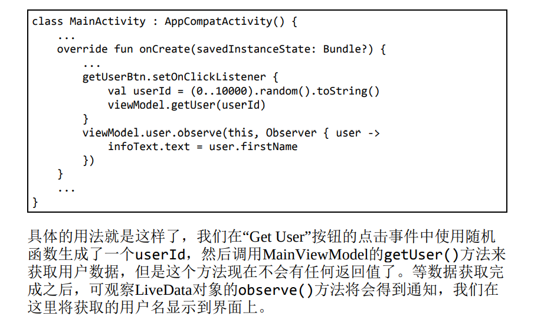


+ ViewModel中**某个获取数据的方法有可能是没有参数，在没有可观察数据的情况下，我们需要创建一个空的LiveData对象，示例 写法如下：**

  

  **接下来就是点睛之笔的地方了**，在refresh()方法中，我们只是**将refreshLiveData原有的数据取出来（默认是空），再重新设置到refreshLiveData当中，这样就能触发一次数据变化**。是的， **LiveData内部不会判断即将设置的数据和原有数据是否相同，只要调用了setValue()或postValue()方法，就一定会触发数据变化事件**

  然后我们在Activity中观察refreshResult这个LiveData对象即可，这样只要调用了refresh()方法，观察者的回调函数中就能够得到最新的数据


### 总结


## Room

大型项目当中，如果仅仅是使用了一些原生的API来对SQLite数据库进行数据的增删改查操作，会非常容易让项目的代码变得混乱，除非你进行了很好的封装。为此市面上出现了诸多**专门为 Android数据库设计的ORM框架**。

**ORM（Object Relational Mapping）也叫对象关系映射**。简单来讲，我们使用的编程语言是面向对象语言，而使用的数据库则是关系型数据库， **将面向对象的语言和面向关系的数据库之间建立一种映射关系，这就是 ORM了**

使用ORM框架的好处：它赋予了我们一个强大的功能，就是**可以用面向对象的思维来和数据库进行交互，绝大多数情况下不用再和SQL 语句打交道了，同时也不用担心操作数据库的逻辑会让项目的整体代码变得混乱**

由于许多大型项目中会用到数据库的功能，为了帮助我们编写出更好的代码，**Android官方推出了一个ORM框架，并将它加入了Jetpack当中， 就是我们这节即将学习的Room**


### 使用Room进行增删改查

P892


## WorkManager


这么频繁的功能和API变更，让开发者就很难受了，到底该如何编写后台代码才能**保证应用程序在不同系统版本上的兼容性**呢？

为了解决这个问题，**Google推出了WorkManager组件。WorkManager很适合用于处理一些要求定时执行的任务，它可以根据操作系统的版本自动选择底层是使用AlarmManager实现还是JobScheduler实现，从而降低了我们的使用成本。另外，它还支持周期性任务、链式任务处理等功能，是一个非常强大的工具**


我们还得先明确一件事情：**WorkManager和Service并不相同，也没有直接的联系。**

+ Service是Android系统的四大组件之一，它在没有被销毁的情况下是一直保持在后台运行的。

+ **而WorkManager只是一个处理定时任务的工具，它可以保证即使在应用退出甚至手机重启的情况下， 之前注册的任务仍然将会得到执行**，因此WorkManager很适合用于执行一些定期和服务器进行交互的任务，比如周期性地同步数据，等等


### WorkManager的基本用法

**准备工作：**

+ **在app/build.gradle文件中添加如下的依赖：**

  


**WorkManager的基本用法：**

+ 定义一个后台任务，并实现具体的任务逻辑
+ 配置该后台任务的运行条件和约束信息，并构建后台任务请求
+ 将该后台任务请求传入WorkManager的enqueue()方法中，系统会在合适的时间运行


**具体实现示例：**

+ 第一步要定义一个后台任务

  

  **后台任务的写法非常固定，也很好理解**

  + 首先每一个后台任务都必须**继承自Worker类，并调用它唯一的构造函数**。

  + 然后**重写父类中的 doWork() 方法，在这个方法中编写具体的后台任务逻辑即可**

    + **doWork()方法不会运行在主线程当中**，因此你可以放心地在这里执行耗时逻辑

    + **doWork() 方法要求返回一个Result对象，用于表示任务的运行结果**

      成功就返回**Result.success()**，失败就返回**Result.failure()**

      除此之外， 还有一个**Result.retry()**方法，它其实也代表着失败，只是可以结合**WorkRequest.Builder的setBackoffCriteria()方法来重新执行任务**

+ 第二步，配置该后台任务的运行条件和约束信息

  **这一步其实也是最复杂的一步，因为可配置的内容非常多**，不过目前我们还只是学习WorkManager的基本用法，因此只进行最基本的配置就可以了

  

  + 只需要**把刚才创建的后台任务所对应的Class对象传入OneTimeWorkRequest.Builder的构造函数中**

  + 然后**调用build()方法即可完成构建**

  + **OneTimeWorkRequest.Builder是WorkRequest.Builder的子类，用于构建单次运行的后台任务请求**

    **WorkRequest.Builder还有另外一个子类PeriodicWorkRequest.Builder，可用于构建周期性运行的后台任务请求**，但是为了降低设备性能消耗，PeriodicWorkRequest.Builder构造函数中传入的**运行周期间隔不能短于15分钟**

    

+ 最后一步，**将构建出的后台任务请求传入WorkManager的enqueue()方法中，系统就会在合适的时间去运行了**

  

+ **后台任务的具体运行时间是由我们所指定的约束以及系统自身的一些优化所决定的**

  没有指定任何约束，即代表立刻执行


### 使用WorkManager处理复杂的任务


+ **让后台任务在指定的延迟时间后运行，只需要借助setInitialDelay()方法就可以了**

  示例：

  

  这就表示我们希望让SimpleWorker这个后台任务在5分钟后运行。你**可以自由选择时间的单位，毫秒、秒、分钟、小时、天都可以**

+ **给后台任务请求添加标签。**

  

  **标签最主要的一个功能就是我们可以通过标签来取消后台任务请求**

  

  当然，**即使没有标签，也可以通过id来取消后台任务请求：**

  

  但是，**使用id只能取消单个后台任务请求，而使用标签的话，则可以将同一标签名的所有后台任务请求全部取消**，这个功能在逻辑复杂的场景下尤其有用

  除此之外，我们也**可以使用如下代码来一次性取消所有后台任务请求：**

  

+ **如果后台任务的doWork()方法中返回了Result.retry()，那么是可以结合setBackoffCriteria()方法来重新执行任务的：**

  

  **setBackoffCriteria()方法接收3个参数：**

  + 第二个和第三个参数用于**指定在多久之后重新执行任务，时间最短不能少于10秒钟**；

  + 第一个参数则用于**指定如果任务再次执行失败，下次重试的时间应该以什么样的形式延迟**

    **第一个参数的可选值有两种**

    + LINEAR：代表下次重试时间以线性的方式延迟
    + EXPONENTIAL：代表下次重试时间以指数的方式延迟

+ **对后台任务的运行结果进行监听：**

  + **调用getWorkInfoByIdLiveData()方法，并传入后台任务请求 的id，会返回一个LiveData对象。**

  + **然后我们就可以调用LiveData对象 的observe()方法来观察数据变化了，以此监听后台任务的运行结果**

  

  + 另外**也可以调用getWorkInfosByTagLiveData()方法，监听同一标签名下所有后台任务请求的运行结果**

+ **链式任务**

  **beginWith()方法用 于开启一个链式任务**，至于后面要接上什么样的后台任务，只需要**使用then()方法来连接即可**。

  另外WorkManager还要求，**必须在前一个后台任务运行成功之后，下一个后台任务才会运行**。也就是说，如果某个后台任务运行失败，或者被取消了，那么接下来的后台任务就都得不到 运行了

  


## Kotlin课堂：使用DSL构建专有的语法结构

P914


# 第 14 章 高级技巧


## Kotlin课堂：Java与Kotlin代码之间的转换

P952


如果希望学习更多Kotlin知识，可以阅读专门介绍Kotlin的图书，例如图灵公司出版的 《Kotlin编程权威指南》。


# 第 15 章	实战（MVVM）

**MVVM（Model-View-ViewModel）是一种高级项目架构模式**，目前已被广泛应用在Android程序设计领域


**MVVM架构可以将程序结构主要分成3部分**：

+ **Model**是数据模型部分；
+ **View**是界面展示部分；
+ 而**ViewModel**比较特殊，可以将它理解成一个连接数据模型和界面展示的桥梁，从而实现让业务逻辑和界面展示分离的程序结构设计

当然，一个优秀的项目架构除了会包含以上3部分内容之外，**还应该包含仓库、数据源**等


+ **图中所有的箭头都是单向的**

  比方说UI控制层指向了ViewModel层，表示**UI控制层会持有ViewModel层的引用**，但是反过来ViewModel层却不能持有UI控制层 的引用，其他几层也是一样的道理

+ **引用也不能跨层持有**

  比如UI控制层不能持有仓库层的引用，谨记每一层的组件都只能与它相 邻层的组件进行交互


## 项目结构

在.android包下再新建几个包


+ **logic包用于存放业务逻辑相关的代码**，其中，logic包中又包含了dao、model、network这3个子 包，分别用于存放数据访问对象、对象模型以及网络相关的代码。**（仓库也放在其中）**

  + **logic包下**：

    + 新建一个Repository单例类，**作为仓库层的统一封装入口**

      **liveData()函数**是lifecycle-livedata-ktx库提供的一个非常强大且好用的功能，它可以自动构建并返回一个LiveData对象，然后在它的代码块中提供一个挂起函数的上下文，这样我们就可以在liveData()函数的代码块中调用任意的挂起函数了

      

  + **network包：**

    + 首先定义一个用于访问彩云天气城市搜索API的**Retrofit接口**，在 logic/network包下新建PlaceService接口

      

    + 定义好了PlaceService接口，为了能够使用它，我们还得创建一 个**Retrofit构建器**才行。新建一 个ServiceCreator单例类

      

    + 再定义一个**统一的网络数据源访问入口，对所有网络请求的API进行封装**，新建一个SunnyWeatherNetwork单例类

      

      

      

  + **model包：（按照对应的JSON格式来定义相应的数据模型）**

    + **实例一：**

      

      

    + **实例二：**

      

    + 还需要**在logic/model包下再定义⼀个Weather类，⽤于将Realtime和Daily对象封装起来**

      

  + **dao包：**

    + 新建⼀个PlaceDao单例类，进行SharedPreferences存储

      

+ **ui包用于存放界面展示相关的代码**。而ui 包中又包含了place和weather这两个子包，分别对应SunnyWeather中的两个主要界面

  **（ViewModel层也放在其中）**

  ViewModel相当于逻辑层和UI层之间的一个桥梁，虽然它更偏向于逻辑层的部分，但是由于ViewModel通常和Activity或Fragment是一一对应的，因此**我们还是习惯将它们放在一起**

  + place包下：

    + **定义ViewModel层：**

      

  + weather包下：

    + **定义ViewModel层：**

      


**总结架构示意图： **


## 制作App的图标

P1039