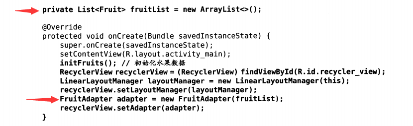
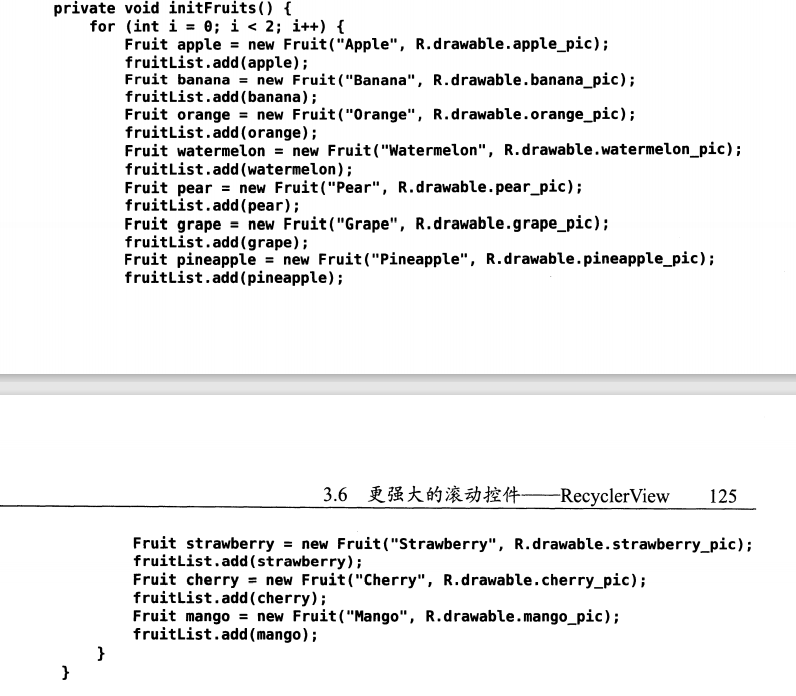

# 第一章	初识Android

**该文章为阅读《第一行代码（第二版）》时的一些随记，用于复习与回顾**

<!--more-->

## R文件

[res文件目录介绍](https://blog.csdn.net/fxdaniel/article/details/41452655?utm_medium=distribute.pc_relevant.none-task-blog-title-10&spm=1001.2101.3001.4242)

Android程序编译后会自动生成R文件（R.java）是一个java类(包含了所有 res/ 目录下资源)，其中包括drawable、layout、string等各色静态内部类（每个静态内部类分别对应着一种资源,如layout静态内部类对应着layout中的界面文件）。而每个静态内部类中的静态常量分别定义为一条资源标识符。具体的内容如下所示：

```java
public final class R{
	
	//全是以 publi static final 开头的内部类
	
	...
	
	public static final class layout{...}
	public static final class id{...}
	public static final class drawable{...}
	public static final class mipmap{...}
	public static final class color{...}
	public static final class string{...}
	public static final class style{...}
	
	...
	
}
```

项目中添加的任何资源都会在R文件中生成一个相应的资源id。


([参考博客文章](https://blog.csdn.net/qq_34686440/article/details/88934680))

#### **1、 在java文件中使用R文件**

**1.使用res资源下，通过R.子类.资源名**（即资源标识符）

```java
//字符
R.string.name1
R.string.name2
//图片
R.drawable.icon1
R.drawable.icon2
//布局
R.layout.first_layout
R.layout.second_layout
//....
```

**2.使用android自带的资源下**

只是需要在前面加上 android. 以申明来自Android系统

#### **2、在XML中使用R文件**

**1.在res资源下，@[package:]type/name（使用我们自己包下的资源可以省略 package）**

```
@drawable/icon
/*
其中@代表R.java类
drawable代表的是R.java中的静态内部类drawable
icon代表静态内部类drawable中的静态属性icon
而该属性可以指向 res 目录下的“drawable-*dpi”中的 icon.png 图标
*/
```

**2.在android内置资源下，则要添上包名“android：**

```
android:textColor=”@android:color/red”
```


在布局文件当中我们需要为一些组件添加 Id 属性作为标示。可以使
用如下的表达式**“@+id/string_name”**，“@”符号是将这个控件ID自动记载R文件中，其中“+”表示在 R.java 的名为 id 的内部类中添加一条记录。通过该方式生成的资源标识符，仍然可以以**“@id/string_name”**的方式引用。id在编译存入R文件后会变为一个16进制的int类型数据。

eg.


[各种文件，资源访问更详细讲解](https://www.runoob.com/w3cnote/android-tutorial-project-src-analysis.html)


## 打印日志


# 第二章	活动(Activity)

## 创建活动

任何Activity都需要重写onCreate()方法。一般都需要调用setContentView()方法来给当前的活动加载一个布局，传入参数为一个布局文件(.xml文件)的id。

```java
@Override
protect void onCreate(Bundle saveInstanceState){
    super.onCreate(savedInstanceState);
    setContentView(R.layout.XXX);
}
```


所有的活动都需要在AndroidManifest.xml中进行注册才能生效(一般该步骤Android Studio会自动帮我们完成)，注册声明要放在\<application>标签内。


此外还需要配置主活动，程序才能运行起来。


Activity类提供了一个finish()方法可以销毁当前活动，效果和按下Back键一样。


## Intent

### 启动一个活动：

#### 显式Intent：


#### 隐式Intent

不明确指出我们想要启动的活动，而是指定了一系列更为抽象的action和category等信息。


同时，每个Intent中只能指定一个action，但却能指定多个actegory且需要都匹配。

Android系统内置的action使用的时候不用在\<intent-filter>中声明。

[Intent与IntentFilter详解](https://blog.csdn.net/wjr2012/article/details/6205725)


#### 启动活动最佳写法

在活动中添加一个**actionStart()**方法


### 活动之间传递数据

#### 向下一个活动传递数据


Intent中的putExtra()方法的重载可以把数据暂存在Intent中

这里putExtra()方法中接受两个参数，第一个是键，用于后面从Intent中取值，第二个参数是要传递的数据。

Bundle类用作携带数据，Bundle类是一个key-value类，故putExtra方法中可以直接放入一个Bundle对象。


#### 返回数据给上一个活动


## 活动的生命周期

#### **返回栈：**

每个应用程序都会有自己的返回栈。

Android中的活动是层叠的，每启动一个新的活动，就会覆盖在原活动之上，然后点击Back键会销毁最上面的活动，下面的一个活动就会重新显示出来。


#### 活动状态：

**运行状态：**该活动位于返回栈的栈顶。

**暂停状态：**该活动不处于栈顶位置，但仍然可见。(因为此时处于运行状态的活动没有占满整个屏幕，导致不处于栈顶位置的活动可见)

**停止状态：**该活动不处于栈顶位置，且完全不可见。

**销毁状态:**该活动从返回栈中移除了(销毁了)


注释：

**onCreate()：**子类的onCreate()方法中必须调用父类的onCreate方法，即super.onCreate()。同时通常情况下，还需要在onCreate()方法中调用setContentView(int)方法填充屏幕。


其他方法均可如上重写，即当活动发生对应变化的时候会调用重写过的对应方法。


[Activity中调用finish()方法，会走哪些生命周期方法？](https://blog.csdn.net/fesdgasdgasdg/article/details/79138321)

[Activity类中的finish()、onDestory()和System.exit(0) 三者的区别](https://blog.csdn.net/yelangjueqi/article/details/9466347?utm_medium=distribute.pc_relevant.none-task-blog-BlogCommendFromMachineLearnPai2-2.control&depth_1-utm_source=distribute.pc_relevant.none-task-blog-BlogCommendFromMachineLearnPai2-2.control)


## 活动的启动模式：

**standard**：是活动默认的启动模式。每次启动一个活动都放进返回栈，不在乎这个活动是否已经在返回栈中存在。

**singleTop：**启动活动时如果发现返回栈的栈顶已经是该活动，则直接使用它，不会再创建新的活动实例。


(下面几个启动模式修改语句同上)

**singleTask:**每次启动一个活动时，系统会首先在返回栈中检查是否存在该活动的实例，如果发现已经存在，则把这个活动之上的所有活动统统出栈(销毁)，如果没有发现，就创建一个该活动的实例。

**singleInstance:**该模式下，会有一个单独的返回栈来管理这个活动，不管是哪个应用程序来访问这个活动，都共用这一个返回栈，而不像前面三个模式都是在每个应用程序自己的返回栈中进行操作。

(按下**Back键**进行返回时，会首先在同一个返回栈中进行出栈，当一个栈中为空时，才会去启动其他返回栈中的活动或是退出程序)


# 第三章	控件和布局

**xmlns是xml namespace的缩写，故一下所有属性中的android和app是可变的，重点关注android：和app：后面的内容。**


### 常用控件（View）的使用：

**(一个控件属于一个View对象，也可以通过View.inflate(Context context, @LayoutRes int resource, ViewGroup root))创建View)**

在.XML中给控件一个id，再指定控件的宽度和高度，然后再适当加入一些控件特有的属性。

**findViewById**是定位函数，主要是引用.R文件里的引用名。一般在R.java文件里系统会自动帮你给出你在XML里定义的ID或者Layout里面的名称，用于初始化控件，实例化控件，方便进行其他操作。(eg.在.java中：Button button =（Button) findViewById(R.id.XXX)

Android中所有控件都有：

**android:layout_width**和**android:layout_heigh**t这两个属性指定控件的宽度和高度，可选值有：**match_parent**和**wrap_content**

**android:visibility**指定控件的可见属性，可选值有3种：visible、invisible、gone。该属性默认为visible。可使用代码setVisibility()方法来控制，可以传入View.VISIBLE、View.INVISIBLE和View.GONE。通过getVisibility()方法来判断某控件是否可见。


#### **通过View实现细线：**

将View的宽或高设置为1dp（可以根据需求改变线的粗细，不一定为1dp），然后通过background属性设置以下颜色即可。


#### TextView:

**match_parent**让当前控件的大小和父布局的大小一样(如让组件和手机屏幕的宽度一致)。

**wrap_content**让当前控件的大小能够刚好包含住里面的内容，即由控件的内容决定当前控件的大小(如让组件高度足够包含住里面的所有文字)。

**android:text**指定TextView中显示的文本内容。(文字内容默认居左上角对齐)

**android:gravity**指定TextView中文字的对齐方式，可选值有：top、bottom、left、right、center等，可以用“|”来同时指定多个值。

**android:textSize**指定TextView中文字的大小，单位为sp

**android:textColor**指定文字的颜色

**android:paddingLeft**指定控件左边补白大小

**android:paddingRight**指定控件右边补白大小

**android:paddingTop**指定控件上边补白大小

**android:paddingBottom**指定控件下边补白大小

**android:ellipsize**指定TextView中文本内容超出控件宽度时，文本的缩略方式，可选值有：start(省略号在开头)、middle(省略号在中间)、end(省略号在结尾)、marquee(跑马灯显示)。**注：**最好配合android:singleLine="true"或android:maxLines="1"属性使用，不然可能出现错误，例如当多行的时候middle不起作用

**android:singleLine**指定TextView只能单行显示，可选值有：true、false

**android:maxLines**指定TextView中最多能显示的行数

(还有其他很多属性，用到的时候去查阅文档)


#### Button:

**android:text**指定Button中显示的文本内容。(文字内容默认居中)

**android:textAllCaps**指定Button中的所有英文字母进行大写转换(默认为true)，可选值有：true和false

代码示例：


使用setOnclickListener需实现onClickListener接口，onClickListner接口原型：

```Java
public interface OnClickListener {
        void onClick(View var1);
    }
```

  

#### EditText

**android:hint**指定在输入框中显示一段提示性的文本(当用户在输入框输入任何内容时，这段文本会自动消失)。

**android:maxLines**指定了输入框可显示的最大行数，当输入的内容超过规定的行数时，文本就会向上滚动，而不是继续拉伸框体。

**android:ellipsize**指定TextView中文本内容超出控件宽度时，文本的缩略方式，可选值有：start(省略号在开头)、middle(省略号在中间)、end(省略号在结尾)。**注：**最好配合android:singleLine="true"或android:maxLines="1"属性使用，不然可能出现错误，例如当多行的时候middle不起作用；同时EditText中该属性不同于TextView：没有marquee(跑马灯显示)可选值

**android:singleLine**指定TextView只能单行显示，可选值有：true、false


**EditText.getText()**方法获取到输入框中的内容，返回类型是Editable，故想获得其String类型，则需要调用toString()方法，即**EditText.getText().toString()**

**EditText.setText()**方法设置输入框中的内容

**EditText.setSelection()**方法设置光标的位置，传入参数为int类型

[EditText更多常见属性和方法](https://blog.csdn.net/weimeig/article/details/79648378?utm_medium=distribute.pc_relevant_t0.none-task-blog-BlogCommendFromMachineLearnPai2-1.control&depth_1-utm_source=distribute.pc_relevant_t0.none-task-blog-BlogCommendFromMachineLearnPai2-1.control)


额外补充：

**Toast：**makeText()创建出一个Toast对象，然后调用show()显示。其中makeText()方法需要传入3个参数：Context：也就是Toast要求的上下文；显示的文本内容；Toast的显示时长，Toast.LENGTH_SHORT表示短时间，Toast.LENGTH_LONG表示长时间。Toast默认位于屏幕偏下方中央。[Toast讲解](https://www.cnblogs.com/net168/p/4041763.html)

```Java
 Toast.makeText(FirstActivity.this,"测试成功！",Toast.LENGTH_SHORT).show();
```


#### ImageView

图片通常都是放在以”drawable“开头的目录下，不过一般不使用没有指定具体分辨率的目录来放置图片。

**android:src**给ImageView指定一张图片。

**scaleType**指定图片的缩放模式，可选值有：centerCrop(让图片保持原有的比例填充满整个ImageView，并将超出屏幕的部分裁剪掉)

**android:layout_centerInParent**可选值为true时指定图片居中


**setImageXXX：**

+ **setImageResource()**方法更改ImageView对象指定的图片，传入参数为R文件中的Id值(app本地文件中的图片)

+ **setImageDrawable()**方法更改ImageView对象指定的图片，传入一个Drawable实例

+ **setImageBitmap()**方法更改ImageView对象指定的图片，传入参数来一个Bitmap实例，其实setImageBitmap()方法最后也会调用setImageDrawable()方法，同时把bitmap转成drawable。


Bitmap和Drawable的区别：可以简单地理解为Bitmap储存的是像素信息，Drawable储存的是对Canvas的一系列操作。

setImageResource()简单，会根据设备分辨率进行图片大小缩放适配，但是是在UI线程中对图片读取和解析的，占空间，资源不会及时回收，图片多且大时运行很容易出OOM。
setImageBitmap()比较麻烦，要手动设置参数，不过比较安全。


#### ProgressBar

**style**属性修改进度条样式(默认为一个圆形进度条)


**android:max**当进度条改为水平进度条后，可通过该属性指定一个最大数值，然后就可以在.java中动态的更改进度条显示的进度。(如下所示)


#### AlertDialog

AlertDialog可以在当前的界面弹出一个对话框，这个对话框置于所有界面元素之上，能够屏蔽掉其他控件的交互能力。

AlertDialog通过**AlertDialog.Builder**创建实例。

**setTitle()**方法设置对话框的标题

**setMessage()**方法设置对话框的内容

**setCancelable()**方法设置对话框可否取消

**setPositiveButton()方法**传入两个参数，第一个参数传入字符串设置该按钮显示的内容，第二个参数注册按钮的监听器，最后调用show()方法将对话框显示出来。

**setNegativeButton()**传入两个参数，第一个参数传入字符串设置该按钮显示的内容，第二个参数注册按钮的监听器，最后调用show()方法将对话框显示出来。


#### ProgressDialog

ProgressDialog和AlertDialog类似，不同的是会在对话框中显示一个进度条。**一般用于表示当前操作比较耗时，让用户耐心地等待。**

**setTitle()**方法设置进度条对话框的标题

**setMessage()**方法设置进度条对话框的内容

**setCancelable()**方法设置进度条对话框可否取消

**show()**方法将进度条对话框显示出来

**dismiss()**方法将进度条对话框关闭


#### 其他控件

##### checkBox

**checkBox**控件，是一个复选框控件，用户可以通过点击的方式来进行选中和取消。**checkBox.setChecked()**方法设置复选框是否勾选，参数为boolean值。

##### ScrollView

**ScrollView**称为滚动视图，当在一个屏幕的像素显示不下绘制的UI控件时，可以采用滑动的方式，使控件显示。

**ScrollView**的直接子元素只能有一个，故若想添加多个控件则需添加一个布局，在布局中添加控件


### 4中基本布局（ViewGroup）

布局是一种可用于放置很多控件的容器，同时里面也可以放布局。


#### LinearLayout：线性布局

**android:orientation**属性指定**各个控件互相之间的排列方向**，可选值有vertical和horizontal。(默认值为horizontal)

**android:layout_gravity**属性用于指定**控件在布局中的对齐方式**，可选值有center、center_vertical、center_horizontal、buttom、end、clip_horizontal、clip_vertical、fill、fill_horizontal、fill_vertical、left、right、start和top(可以用“|”来同时指定多个值)。需要注意的是，当LinearLayout的排列方向是horizontal时，只有垂直方向上的对齐方式才会生效，排列方向为vertical时同理。

**区分：**上面提到过类似的**android:gravity**属性，其**两者的可选值相同**，但表达意义有区别

+ **android:gravity**用于指定子组件在控件中的对齐方式（即在它自己的边界内，应该如何放置它的内容）
+ **android:layout_gravity**用于指定组件自身在父组件中的位置


**android:layout_weight**属性使用比例的方式来指定控件的大小，在手机屏幕的适配性方面起到了非常重要的作用，参数为数(可以为小数，**不指定时默认为0，**即代表控件大小只由android:layout_width和android:layout_height来控制)。

系统会把一个布局下所有控件指定的layout_weight值加起来得到一个总值，然后每个控件所占大小的比例就是该控件占据屏幕剩余屏幕【剩余屏幕是指屏幕空间去掉layout_weight为0的控件所占的空间】的比例（该属性在该控件中的优先级大于该控件中android:layout_width和android:layout_height）

 **android:layout_centerHorizontal**可选值为true时代表水平方向居中

[layout_weight属性的用法和意义](https://blog.csdn.net/anhenzhufeng/article/details/89915069)

**android:layout_marginTop**属性指定当前控件上边缘与其他控件(布局)的间距，可选值为xxdp
**android:layout_marginBottom**属性指定当前控件下边缘与其他控件(布局)的间距，可选值为xxdp
**android:layout_marginLeft**属性指定当前控件左边缘与其他控件(布局)的间距，可选值为xxdp
**android:layout_marginRight**属性指定当前控件右边缘与其他控件(布局)的间距，可选值为xxdp


#### RelativeLayout：相对布局

**控件可以相对于父控件或者其他控件进行定位**

**android:layout_alignParentLeft**属性指定控件相对于父布局位于左边

**android:layout_alignParentTop**属性指定控件相对于父布局位于顶部

**android:layout_alignParentRight**属性指定控件相对于父布局位于右边

**android:layout_alignParentButtom**属性指定控件相对于父布局位于底部

**android:layout_centerInParent**属性指定控件相对于父布局居正中

**android:layout_above**属性指定一个控件位于另一个控件的上方(需要为这个属性指定相对控件id的引用)

**android:layout_below**属性指定一个控件位于另一个控件的上方(需要为这个属性指定相对控件id的引用)

**android:layout_toLeftof**指定一个控件位于另一个控件的左侧(需要为这个属性指定相对控件id的引用)

**android:layout_toRightof**指定一个控件位于另一个控件的右侧(需要为这个属性指定相对控件id的引用)

(当一个控件去引用另外一个控件的id时，该控件一定要定义在引用控件的后面，不然会出现找不到id的情况)

**android:layout_alignLeft**属性指定一个控件的左边缘和另一个控件的左边缘对齐

**android:layout_alignRight**属性指定一个控件的右边缘和另一个控件的右边缘对齐

**android:layout_alignTop**属性指定一个控件的上边缘和另一个控件的上边缘对齐

**android:layout_alignBottom**属性指定一个控件的下边缘和另一个控件的下边缘对齐


#### FrameLayout：帧布局

应用场景很少，所有控件都默认摆放在布局的左上角


#### PercentFrameLayout、PercentRelativeLayout：百分比布局

百分比布局是Android引入的新增布局，在support库中。如果当前版本没有该库的话，需要在项目的**build.gradle**中添加百分比布局库的依赖，才能保证百分比布局在Android所有系统版本上的兼容性。

在app/build.gradle文件的dependencies闭包中添加如下内容：

```groovy
dependencies{
    compile fileTree(dir:"libs",include:['*.jar'])
    compile 'com.android.support:appcompat-v7:24.2.1'
    compile 'com.android.support:percent:24.2.1'
    testCompile 'junit:junit:4.12'
}
```

由于百分比布局并不是内置在系统SDK中，所以需要把完整的包路径写出来，还必须定义一个app的命名空间，这样才能使用百分比布局的自定义属性。

```xml
<android.support.percent.PercentFrameLayout                         	xmlns:android="http://schemas.android.com/apk/res/android"           xmlns:app="http://schemas.android.com/apk/res-auto"                 ...
</android.support.percent.PercentFrameLayout>                
```

**app:layout_widthPercent**属性指定宽度相对布局比例，参数为百分比数。

**app:layout_heightPercent**属性指定高度相对布局比例，参数为百分比数。


**(此外还有其他布局，可日后自行进行了解)**


### 创建自定义控件

控件和布局的继承结构：


View是Android中最基本的一种UI组件，它可以在屏幕上绘制一块矩形区域，并能响应这块区域的各种事件，所有控件直接或间接继承自View，因此我们使用的各种控件其实就是在View的基础之上又添加了各自特有的功能。

ViewGroup是一种特殊的View，它可以包含很多子View和子ViewGroup。

**android:background**属性用于为布局或者控件指定一个背景，可以使用颜色或图片来进行填充。

**android:layout_margin**属性指定控件在上下左右方向上偏移的距离。(参数单位dp)

**android:layout_marginLeft**属性指定控件在左方向上偏移的距离。(参数单位dp)

**android:layout_marginTop**属性指定控件在上方向上偏移的距离。(参数单位dp)

**android:layout_marginRight**属性指定控件在右方向上偏移的距离。(参数单位dp)

**android:layout_marginBottom**属性指定控件在下方向上偏移的距离。(参数单位dp)


只需要通过**include**语句将自定义布局引入其他布局中（下图示例代码中引入了自定义的布局title.xml）


调用getSupportActionBar()方法来获得ActionBar实例，然后再调用ActionBar的hide()方法将标题栏隐藏起来。


### ListView（逐渐被RecyclerView替代）

#### ListView的简单用法

**ArrayAdapter**是适配器的实现类之一，数组中的数据要想传递给ListView需要借助适配器来完成。ArrayAdapter可以通过泛型来指定要适配的数据类型，然后在构造函数中把要适配的数据传入。


示例中选用ArrayAdapter的构造函数之一，需要传入三个参数：当前上下文、ListView子项布局的id、适配的数据。此处选用android.R.layout.simple_list_item_1作为子项布局的id，这是一个Android内置的布局文件。最后调用ListView的setAdapter()方法，将构建好的适配器对象传递进去，这样ListView和数据之间的关联就建立完成了。


#### 定制ListView的界面

自定义一个适配器，这个适配器继承自ArrayAdapter


**getView()**方法在每个子项被滚动到屏幕内时被调用

**getItem()**方法得到当前项的示例


**LayoutInflater**为子项加载我们传入的布局。LayoutInflater的from()方法传入参数Content即从给定上下文获取LayoutInflater，LayoutInflater的**inflate()**方法的一个重载函数接收3个参数，**上图示例中是其在ListView中的标准写法**，3个参数分别为：int resource (代表需要加载资源的id)、ViewGroup root (代表资源需要被添加的地方)和boolean attachToRoot (是否要被添加到root中)。


#### ListView运行效率优化


#### ListView的点击事件

**setOnItemClickListener()**方法为ListView注册一个监听器


### RecyclerView：滚动控件

RecyclerView属于新增控件，同理PercentFrameLayout，其被定义在了support库中，需要在app/build.gradle文件的dependencies闭包中添加如下内容：

```groovy
dependencies {
	compile fileTree(dir:'libs',include:['*.jar'])
    compile 'com.android.support:appcompat-v7:24.2.1'
    compile 'com.android.support:recyclerview-v7:24.2.1'
    testCompile 'junit:junit:4.12'
}
```


#### RecyclerView实现与LIstView相同的效果

##### 在XML中


##### 在活动中

###### **实例化RecyclerView并初始化数据**

+ 获得RecyclerView实例

  

+ 初始化数据

  

  


###### **指定一个Adapter(适配器)和一个LayoutManager**

使用 RecyclerView ，必须指定一个Adapter(适配器)和一个LayoutManager（可参考实体书P124，电子书P134）

+ 新建一个类，让这个类**继承自RecyclerView.Adapter**，并将泛型指定为第二步要创建的内部类

  

+ 同时在这个类中构造一个静态内部类，这个内部类**继承自RecyclerView.ViewHolder**

  + 其内重载一个构造函数要传入一个View参数，这个参数通常是RecycleView子项的最外层的布局，然后就可以通过findViewById()方法来获取到布局中的控件实例

    

+ 构造函数把要展示的数据源传进来，并赋值给一共全局变量用于操作

  

  

+ 由于新建的类是继承自RecyclerView.Adapter，所以就必须重写**onCreateViewHolder()、onBindViewHolder()**和**getItemCount()**这三个方法

  + **onCreateViewHolder()**方法用于创建ViewHolder实例

  + **onBindViewHolder()**方法用于对RecyclerView子项的数据进行赋值，**该方法会在每个子项被滚动到屏幕内的时候执行**

  + **getItemCount()**方法告诉RecyclerView一共有多少个子项，直接返回数据源的长度就可以了

    


**适配器完整实例代码：**


###### **添加LayoutManager**

+ 创建一种LayoutManager实例并将其通过RecyclerView的**setLayoutManager()**方法设定到RecyclerView当中用于指定布局方式

  **实例：**

  

  此处创建的是LinearLayoutManager类型的LayoutManager，指定了RecyclerView为线性布局，实现了和ListView类似的效果

  **如果要修改RecyclerView的布局方式，只需要修改LayoutManager即可**

  **LayoutManager默认提供了三种布局：**

  + LinearLayoutManager：线性布局
  + GridLayoutManager：网格布局
  + StaggeredGridLayoutManager：交错网格布局

  此外也可以自定义布局

+ 创建适配器实例，并将数据通过适配器的构造方法传入

  

+ 最后通过调用RecyclerView的setAdapter()方法完成设配器设置

至此，RecyclerView和数据之间的关联就建立完成了


**完整示例代码：**


#### RecyclerView实现横向滚动与瀑布流布局


LinearLayout水平排列适用于纵向滚动的场景，垂直排列适用于横向滚动的场景。


**LinearLayoutManager的setOrientation()**方法设置布局的排列方向，默认为纵向排列，传入LinearLayoutManager.HORIZONTAL表示让布局横行排列。


**瀑布流：**多行等宽元素排列，后面的元素依次添加到其后，等宽不等高。


**瀑布流需要各个子项的高度不一致才能看出明显的效果**


#### RecyclerView的点击事件


**制作Nine-Patch图片：**

Nine-Patch图片是一种被特殊处理过的png图片，能够指定哪些区域可以被拉伸，哪些区域不可以。

使用Android sdk目录下的tools文件夹中的draw9patch.bat文件制作Nine-Patch图片。


# 第四章	碎片(Fragment)

## 碎片是什么


## 碎片的使用方式

### 在布局文件中添加碎片

#### 创建碎片实例

+ **XML中**

  和活动一样编写，实例：

  

+ 新建一个类继承自**Fragment**,重写其**onCreateView()**方法，然后在这个方法中通过LayoutInflater的inflate()方法将定义好的布局(xml)加载进来

  

  

  


#### **LayoutInflater的inflate方法**

**inflate方法的主要作用就是将xml转换成一个View对象，用于动态的创建布局，内部实现原理就是利用Pull解析器，对Xml文件进行解析，然后返回View对象**

inflate方法重载了四种调用方式，分别为：

```java
public View inflate(int resource, ViewGroup root)
 
public View inflate(int resource, ViewGroup root, boolean attachToRoot)
 
public View inflate(XmlPullParser parser, ViewGroup root)
 
public View inflate(XmlPullParser parser, ViewGroup root, boolean attachToRoot)
```

**上述这四种方法最终调用的，还是第四种方法**

**public View inflate(int resource, ViewGroup root, boolean attachToRoot)**中三个参数：

+ resource ：布局的资源id
+ root ：填充的根视图
+ attachToRoot： 是否将载入的视图绑定到根视图中


#### 将碎片添加到活动中

在活动的布局(xml)中通过**\<fragment>标签**加入碎片即可，**android:name**属性后指明要添加的碎片的类名**(注意一定要将类的包名也加上)**


### 动态添加碎片


**主要分为5步：**


#### 创建碎片实例

**方法与上相同**


#### 将碎片添加到活动中


### 在碎片中模拟返回栈


### 碎片和活动之间进行通信


#### 在活动中获得碎片实例


#### 在碎片中获得活动实例


### 碎片与碎片直接进行通信


## 碎片的生命周期

### 碎片的状态


### 碎片的回调方法


+ **碎片第一被加载到屏幕：**

  

+ **碎片被替换了(不显示了)**

  

+ **如果碎片被替换的时候调用了addToBackStack()方法，则按下back键使得碎片回到运行状态时**

  

+ **碎片销毁**

  


## 动态加载布局的技巧


### 使用限定符


#### 实例：使用large限定符

+ 正常新建一个活动，根据需求编写res目录下layout文件夹中的xxx.xml文件内容

+ 在res目录下新建layout-large文件夹，新建一个和layout文件夹中同名的布局(xxx.xml)，然后根据相似需求编写内容

**large是一个限定符，那些屏幕被认为是large的设备就会自动加载layout-large文件夹下的布局，而小屏幕的设备则会加载layout文件夹下的布局**


#### 实例：使用最小宽度限定符


在res目录下新建layout-sw600dp文件下，同理新建一个同名的布局，然后根据相似需求编写内容


## 碎片的其他技巧

**编写同时兼容手机和平板的应用程序**


**核心：**

**如果当前是双页模式，就动态的添加Fragment，如果当前是单页模式，就直接打开新的Activity**。


# 第五章	广播(Broadcast Receiver)

为了便于进行系统级别的消息通知，Android中引入了一套广播消息机制

## 广播机制简介

接收广播的方法需要引入一个新的概念——**广播接收器(Broadcast Receiver)**


**广播主要可以分为两种类型：标准广播和有序广播**

- **标准广播：**

  

- **有序广播：**


## 接收系统广播


广播接收器可以对需要的广播进行注册，这样当注册了的广播发出时，广播接收器就能够接收到该广播，并在内部处理相应的逻辑。

**注册广播的方式一般有两种：**

- **动态注册：**在代码中注册，必须要在程序启动后才能接收广播
- **静态注册：**在AndroidManifest.xml中注册

### 动态注册

- **创建一个广播接收器：**

  - 新建一个类继承自BroadcastReceiver

  - 重写父类的onReceive()方法，onReceive()方法会在广播到来时得到执行，具体的逻辑就是在onReceive()方法中处理。 

  - **广播接收者是不允许开启线程的，不要在onReceive()方法中添加过多的逻辑或者进行任何耗时操作。**

    

- （一般在onCreate()或者onResume()方法中注册）创建一个**IntentFilter**的实例，并通过**addAction()**方法添加对应需要的广播(action)，再创建一个广播接收者实例，然后调用**registerReceiver()**方法进行注册，registerReceiver()方法传入两个参数：广播接收者实例、IntentFilter实例。

- （一般在onDestory()方法中取消注册）最后通过调用**unregisterReceiver()**方法取消注册(动态注册的广播接收器一定要取消注册)。


### 静态注册

可以让程序在未启动的情况下就能接收到广播

- 创建一个广播接收者：

  和动态注册一样

- 在AndroidManifest.xml中注册：

  **android:name**属性后添加**.广播注册者类名**

  **android:exported**属性表示是否允许这个广播接收器接收本程序以外的广播

  **android:enabled**属性表示是否启用这个广播接收器

  在**\<intent-filter>**标签里添加对应的action

  使用**\<uses-permission>**标签加入需要的权限

  


## 发送自定义广播

### 发送标准广播

- 构建一个Intent对象，把要发送的广播的值传入
- 调用Context的**sendBroadcast()**方法将广播发送出去,传入参数为构建的Intent对象


这样所有监听该广播的广播接收器都会收到消息


### 发送有序广播

广播是一种可以跨进程的通信方式，因此在应用程序内发出的广播，其他的应用程序也可以收到。

- 构建一个Intent对象，把要发送的广播的值传入

- 调用Context的**sendOrderedBroadcast()**方法将广播发送出去，传入两个参数：构建的Intent对象、与权限相关的字符串(指定接收方为了接收你的广播必须持有的权限的字符串。如果为null，则不需要权限)

  

- 再在AndroidManifest.xml中通过**android:priority**属性设定广播接收器的优先级，这样就可以设定广播接收器接收的先后顺序。android:priority默认为0，值越大优先级越高，取值必须为整数

  

在某个广播接收器的**onReceive()**中调用**abortBroadcast()**方法就表示将这条广播截断


## 本地广播


**通过LocalBroadcastManager类和IntentFilter来实现**

### 实现发出本地广播

- 创建一个LocalBroadcastManager引用，调用LocalBroadcastManager的**getInstance()**方法得到LocalBroadcastManager实例

- 构建一个Intent对象，把要发送的广播的值传入；调用LocalBroadcastManager实例的**sendBroadcast()**方法发出本地广播

  


### 实现接收本地广播

除了registerReceiver()和unregisterReceiver()方法与**动态注册时不同，其余均相同**。

此处需要调用LocalBroadcastManager实例的registerReceiver()和unregisterReceiver()方法进行注册和解除注册


**本地广播无法通过静态注册的方式来接收**


# 第六章	本地存储

 Android主要提供了三种方式用于简单地实现数据持久化功能：文件存储、sharedPreference存储和数据库存储。此外还可以将数据保存在手机地SD卡中，不过该方法相对起来更麻烦一些且安全性更差。


## 文件存储

### 将数据存储到文件中


**openFileOutput()方法用于将数据存储到指定的文件中，openFileOutput()方法接受两个参数，返回一个FileOutputStream对象**


### 从文件中读取数据

**openFileInput()方法用于从文件中读取数据，openFileInput()方法接收一个参数，即要读取的文件名，返回一个FileInputStream对象**


## SharedPreferences存储


### 将数据存储到SharedPreferences

要想使用SharedPreferences存储数据，首先需要创建SharedPreferences对象，Android中主要提供了3种方法用于得到SharePreferences对象：


SharedPreferences文件是使用XML格式来对数据进行管理的


### 从SharedPreferences中读取数据


## SQLite数据库存储(数据库不用看)过时了，现在用Greendao或者jetpark

### 创建数据库

通过Android提供的**SQLiteOpenHelper**帮助类可以简单地对数据库进行**创建和升级**，SQLiteOpenHelper是一个**抽象类**。


#### 创建子类继承帮助类：(重写了onCreate()方法、onUpgrade()方法)


#### 创建表

**建表需要用SQL语句**

SQLite不像其他数据库拥有众多繁杂的数据类型，它的数据类型很简单：**integer**表示整形，**real**表示浮点型，**text**表示文本类型，**blob**表示二进制类型。

**execSQL()**方法传入SQL语句并执行，**此处传入建表语句，即建立了Book表**


**onCreate()**方法在**创建**数据库的时候会被调用。(自己创建的帮助类中重写的onCreate()方法）


#### 实例化继承帮助类的子类

有两个构造方法可供重写使用，但不是必须的，一般使用参数少一些的那个。


#### 调用getWritableDatabase()或getReadableDatabase()方法创建或打开一个数据库


**getWritableDatabase()**方法如果数据库以存在则直接打开，否则创建一个新的数据库并返回一个可对数据库进行读写操作的**SQLiteDatabase对象**，**如果数据库不可写入（磁盘已满），则返回的的对象将以只读的方式去打开数据库。**

**getReadableDatabase()**方法如果数据库以存在则直接打开，否则创建一个新的数据库并返回一个可对数据库进行读写操作的**SQLiteDatabase对象**，**如果数据库不可写入（磁盘已满），则出现异常。**


#### adb查看表

这个工具可以直接对连接在电脑上的手机或模拟器进行调试操作

第一步将adb配置到环境变量里

第二步使用命令行操作

具体百度


### 升级数据库

**在重写的onUpgrade()方法中加入需要执行的语句。**


**重新调用继承了帮助类的子类的构造方法，第四个参数传入比上一次调用时更大的数值，再调用getWritableDatabase()或getReadableDatabase()方法，如果数据库存在即会调用其Unpgrade()方法，该操作是把之前的表drop掉，然后再重新创建表**


### 对表中的数据进行增删改查


#### 添加数据

定义一个**SQLiteDatabase**引用接收getWritableDatabase()或getReadableDatabase()返回的SQLiteDatabase对象

**insert()方法：  SQLiteDatabase**中提供了一个insert()方法用于向表中添加数据，insert()方法接收三个参数：表名、一般为NULL、一个ContentValues对象。

**ContentValues对象：**提供了一系列的**put()**方法用于向ContentValues中添加数据，**put()**方法传入两个参数：列名、需要传入的数据。


#### 更新数据

**update()方法：SQLiteDatabase**中提供了一个updata()方法用于对数据进行更新，updata()方法接收4个参数：表名、ContentValues对象、SQL的where部分语句、字符串数组(为第三个参数中的每个占位符指定相应的内容)。


#### 删除数据

**delete()方法：SQLiteDatabase**中提供了一个delete()方法用于删除数据，delete()方法接收三个参数：表名、SQL的where部分语句、字符串数组(第三个参数中的每个占位符指定相应的内容)。


#### 查询数据


调用**query()**方法后会返回一个**Cursor**对象，查询到的所有数据都将从这个对象中取出。


#### 使用SQl语句操作数据库


### 使用LitePal操作数据库	//LitePal不用看了，过时了

LitePal：一个开源库，是一个开源的Android数据库框架。


#### 配置LitePal

**添加依赖**


**配置litepal.xml文件**


**配置LitePalApplication**


#### 创建数据库

**根据数据库中表的内容创建一个Java Bean**


**在litepal.xml中添加表对应的类**


**进行任何一次数据库的操作，数据库就会自动创建出来**


#### 升级数据库

**LitePal非常好的一点是，当我们进行数据库升级后会自动帮助我们保留之前表中的所有数据。**


#### 更新数据库

new出一个目标修改表的实例，然后setXXX()方法来设置要更新的数据，最后调用**updateAll()**方法，


对于所有想要将数据更新成默认值的操作，LitePal统一提供了一个setToDefault()方法，传入一个参数：列名。


#### 删除数据

#### //LitePal不用看了，过时了


# 第七章	内容提供器(Content Provider)

## 内容提供器简介

**内容提供器主要用于在不同的应用程序之间实现数据共享的功能**


## 运行时权限

**Android6.0之前的系统没有这个功能，不会有运行时权限需要处理**


### 普通权限和危险权限


**危险权限如下所示，除了下图中权限外其他权限均为普通权限：**


每当使用一个权限的时，可以先到这张表中来查看一下，如果在属于这张表中的权限，那么就需要进行运行时权限处理，如果不在这张表中，那么只需要在AndroidManifest.xml文件中添加一下权限声明就可以了。
另外需要注意，**表格中每个危险权限都属于一个权限组**，我们在进行运行时权限处理时使用的是权限名，但是用户一旦同意授权了，那么该权限所对应的权限组中所有其他的权限也会同时被授权。


### 在程序运行时申请权限

**以使用CALL_PHONE这个权限为实例：**

+ 在AndroidManifest.xml文件中申明需要使用到权限

  

+ 在活动中借助**ContextCompat.checkSelfPermission()**方法判断是否授权权限，ContextCompat.checkSelfPermission()方法接收两个参数，第一个参数是Context，第二个参数是具体的权限名（eg.比如打电话的权限名就是Manifest.permission.CALL_PHONE），然后将ContextCompat.checkSelfPermission()方法的返回值和PackageMannager.PERMISSION_GRANTED作比较，相等就说明用户已经授权，不等就表示用户没有授权

  + 若权限已经授权，直接去执行需要的逻辑操作即可(此处实例为call()方法)

  + 若没有授权，则需要调用**ActivityCompat.requestPermissions()**方法来向用户申请权限，ActivityCompat.requestPermissions()方法接收三个参数：Activity实例，String数组(需要申请的权限名)，请求码(只要是唯一值就可以传入)

    

  + 程序运行时，调用完requestPermissions()方法后，系统会弹出一个权限申请的谈话框，然后用户可以选择同意或者拒绝权限申请，不论哪种结果**最终都会回调onRequestPermissionsResult()方法**，授权的结果则会封装在**grantResults**参数当中

    


## 访问其他程序中的数据

**想要访问内容提供器中共享的数据，就一定要借助ContentResolver类**

+ 通过Context中的getContentResolver()方法获取到ContentResolver类的实例

+ ContentResolver类中提供了一系列的方法用于对数据进行CRUD操作

  + **Insert()**方法用于添加数据，**update()**方法用于更新数据，**delete()**方法用于删除数据，**query()**方法用于查询数据

  上述CRUD操作接收一个**URI参数**(被称为内容URI，给内容提供器中的数据建立了唯一标识符)，它主要由两部分组成：**authority，path**

  + authority：

    

  + path：

    

  + 最后将authority和path组合起来同时在头部加上协议申明(content)：

    

  + 将组合好的字符串解析成Uri对象作为参数传入

    

  + **query()**方法：

    

    

    

  + **insert()**方法：

    需要一个**ContentValues**实例组装数据，然后调用insert()方法，传入参数Uri和ContentValues

    

  + **update()**方法：

    

  + **delect()**方法：

    


## 创建自己的内容提供器

URI的写法：


### **新建一个类去继承ContentProvider的方式类创建一个内容提供器**

+ **借助UriMatcher类实现匹配URI的功能**

  + 调用UriMatcher实例的**addURI()**方法将期望匹配的内容URI格式传递进去(此处传入的路径参数可以使用通配符)，**addURI()**方法接收3个参数：authority、path、自定义代码

    

  + UriMatcher实例的**match()**方法，传入一个Uri对象，**返回值为能够匹配这个Uri对象所对应的自定义代码（即是上面addURI()方法中传入的第三个参数：自定义代码）**

+ **ContentProvider类中有6个抽象方法**，故我们在使用子类继承它的时候，需要将这6个方法全部重写，在每个方法中

  + **onCreate()**  

    

    

  + **query()**

    

    

    

  + **update()**

    

    

  + **delete()**

    

    

  + **getType()**

    

    

    + 一个内容URI对应的**MIME字符串**格式如下

      

    + 在getType()中实现将传入的URI返回其MIME字符串格式

      

**为什么安全？**


### 实现跨程序数据共享

**(一个完整内容提供器的实例)**

**通过内容提供器来给程序加入外部访问接口**

(前提：该程序得存在数据，才具有被其他数据访问的意义，**以下实例以该程序已经存在一个继承自SQLiteOpenHelper帮助类的子类MyDatabaseHelper，且已经存在表book和表category**)

+ 直接通过New->Other->Content Provider创建内容器，勾选Exported属性和Enabled属性。或者创建一个类，然后在AndroidManifest.xml文件中注册。
  + Enabled属性表示是否允许外部程序访问我们的内容提供器
  + Enable属性表示是否启用这个内容提供器


+ 对UriMatcher进行初始化操作，将**期望匹配的几种URI格式**添加进去

  

  

+ 具体编写内容提供器中6个抽象方法

  + onCreate()方法中创建一个MyDatabaseHelper实例，返回true表示成功，这时数据库就已经完成了创建或升级操作

    

  + query()方法

    + **通过传入的Uri参数判断出用户想要访问哪张表**。此处用到了getPathSegments()方法：

      

    + **调用SQLiteDatabase的query()方法进行查询，并将Cursor对象返回**

      

  + insert()、update()、delete()方法和query()方法类似，均为先根据传入的Uri参数判断对哪个表进行操作，再分别调用SQLiteDatabase的insert()、update()、delete()方法进行对数据库的操作

    + insert()

      

    + update()

    

    + delete()

      

  + getType()方法中按照格式规范编写返回内容URI对应的MIME字符串格式

    

    


# 第八章	运用手机多媒体	

## 使用通知


### 通知的基本用法

可以在活动、广播接收器和服务中创建，一般在广播接收器和服务中创建使用。


#### 创建一个通知

- 通过Context的**getSystemService()**方法构建一个**NotificationManager**实例来对通知进行管理，getSystemService()方法接收一个字符串参数用于确定获取系统的哪个服务，此处传入**Context.NOTIFICATION_SERVICE**

  

  getSyetemService()传入参数、返回值及其说明：

  

  

- 创建一个Notification对象，我们可以在最终的build()方法之前连缀任意多的设置方法来创建一个丰富的Notification对象

  

  

  

- 调用NotificationManager的**notify()**方法就可以让通知显示出来，notify()方法接收两个参数：int类型的id、Notification对象

  

  


#### 实现通知的点击效果

**PendingIntent**


- 构建一个Intent对象

- 构建一个PendingIntent对象

- 在构建Notification对象时再连缀一个**setContentIntent()**方法

  

- **添加点击通知后状态栏中的通知图标消失效果**

  

  + 在构建Notification对象时再连缀一个**setAutoCancel()**方法

    

  + 调用NotificationManager的**cancel()**方法将其取消，cancel()方法的传入参数为需要取消的通知的Id

    

    


#### **通知的进阶技巧**

##### setSound()


##### setVibrate()

setVibrate()方法设定在通知到来的时候让手机进行振动。传入参数为一个长整型的数组，用于设置手机静止和振动的时长，单位为毫秒。


此外还需要声明手机振动的权限


##### setLights()


##### setDefaults()


**setStyle()**


**通知中显示长文字信息**

当我们在构建Notification对象时用setContentText()传入大量文字，则通知内容是无法显示完整的，多余的部分会用省略号来代表。但我们通过setStytle可以让通知显示一段长文字


**通知中显示大图片**


##### setPriority()


图中所示最高等级效果为：弹出一个横幅，并附带了通知的详细内容，不管用户在干嘛，都会显示在最上方。


## 调用摄像头和相册

### 调用摄像头拍照

+ 

+ 

  

+ 

  


### 从相册中选择照片


### 压缩照片

**（自行查阅）**


## 播放多媒体文件

### 播放音频


**实例：**

+ **MediaPlayer做好播放前的准备**

  

  

  

  

  

  

+ **对MediaPakyer做各种操作**

  

  

  


### 播放视频


+ **VideoView做好播放前的准备**

  

  

  

  

  

+ **对VideoView做各种操作**

  

  

  


**VideoView与MediaPlayer关系**


# 第九章	网络技术

## WebView的用法

Android借助WebView控件可以在自己的应用程序里嵌入一个浏览器，从而非常轻松地展现各种各样地网页

- **WebView是一个控件**，故第一步在XXX.xml中加入控件

  

- 

- 


## 使用HTTP协议访问网络

### 使用HttpURLConnection


**同样不要忘记申请网络权限**


**Get方法获取数据实例：**


**Post方法提交数据：**


### 使用OKHttp

**在项目中添加OkHttp库的依赖**


**发起一条GET请求过程：**


**发起一条POST请求：**


**将网络操作提取到一个公共的类里，并提供一个静态方法，当想发送网络请求时，调用这个方法即可：**


## 解析XML格式数据

### Pull解析方式


### SAX解析方式


**实例：**


## 解析JSON格式数据


**JSON的格式：**

[图片转载自](http://www.ruanyifeng.com/blog/2009/05/data_types_and_json.html)


### 使用JSONObject

- 得到服务器返回的Response类型的JSON格式的数据将其转化为字符串

- 创建一个JSONArray类的实例将数据传入其中（JSONArray是一个数组，数组元素类型为JSONObject）

- 创建一个JSONObject对象循环遍历JSONArray（每个JSONObiect对象中包含对应的各种数据），然后调用其getString()方法将数据去除。

  

  

  **（参考博客）**

  [JSON的三种解析方式以及JSONObject、JSONArray区别](https://blog.csdn.net/qq_32253371/article/details/78083391?utm_medium=distribute.pc_relevant.none-task-blog-BlogCommendFromBaidu-2.control&depth_1-utm_source=distribute.pc_relevant.none-task-blog-BlogCommendFromBaidu-2.control) 

  [JSONObject和JSONArray](https://blog.csdn.net/u014260748/article/details/41521123?utm_medium=distribute.pc_relevant_t0.none-task-blog-BlogCommendFromMachineLearnPai2-1.control&depth_1-utm_source=distribute.pc_relevant_t0.none-task-blog-BlogCommendFromMachineLearnPai2-1.control)   

  


### 使用GSON

**GSON库将一段JSON格式的字符串自动映射成一个对象(JavaBean)**

- **在项目中添加GSON库的依赖**

  

- **解析JSON数据：**

  

- **解析JSON数组：**

  


**实例：**


[JSON四种解析技术详解](https://www.cnblogs.com/chengmuzhe/p/10596922.html)


# 第十章	服务(Service)

**Service(服务)**


## Android多线程编程

匿名内部类的方式定义一个线程，重写其中的run()方法并调用其start()方法启动线程，这样run()方法中的代码就会在子线程中运行了


### 在子线程中处理UI

#### 异步消息处理

**Android不允许在子线程中进行UI操作**，但我们必须在子线程里去执行一些耗时任务，然后根据任务的执行结果来更新相应的UI控件，对于这种情况，Android提供了一套**异步消息处理机制**。


**例子：**


上图例子中主类实现OnClickListener接口，然后重写onClick(View v)方法，在重写的onClick(View v)方法中，通过switch(v.getId())确定点击的是否是按钮，然后在内构建子线程并执行，将执行结果通过handler.sendMessage(message)发送出去，当handle接收到消息后将消息传递给handleMessage(Message msg)方法并执行。


#### 异步消息处理流程

**Android中的异步消息处理主要由4个部分组成：Message、Handler、MessageQueue和Looper。**


#### AsyncTask 


**AsyncTask的基本用法**


**1.onPreExecute()**


**2.doInBackground(Params...)**


**Params即是excute()中传递的参数**

**3.onProgressUpdate(Progress...)**


**4.onPostExcute(Result)**


**AsyncTask只需要调用一下publishProgress()方法就可以从子线程切换到UI线程了**


**AsyncTask用法步骤总结：**

- 构建一个类继承AsyncTask<， ， ，>，再其中根据需求重写以下几个方法。

- **在doInBackground()方法中执行具体的耗时任务**，这个方法中的所有代码都会在**子线程中运行**，如果需要更新UI元素则调用**publishProgress(Progress...)**方法。

- 当在后台任务中调用了**publishProgress(Progress...)**方法后，onProgressUpdate()方法会很快被调用。故**在onProgressUpdate()方法中进行UI操作。**

- 当后台任务执行完毕并通过return语句时，就会调用onPostExcute(Result)方法，**在onPostExecute()方法中执行一些任务的收尾工作**，可以利用返回的数据进行一些UI操作。

- 最后在需要的地方new此类并调用execute()方法来启动这个任务 `eg. new LeiExample().execute();`**注意一个AsyncTask对象被创建出来后，就只能执行一个异步任务，即只能execute()一次，之后再调用execute()方法不会有任何反应**

  

**实例代码：**


#### 其他：

**runOnUiThread()**

**runOnUiThread()**这个方法判断是否当前线程为主UI线程：是就立刻执行其中的方法，不是就通过handler.post()发送到动作序列中，等到是主UI线程再立刻执行其中的方法。


## 服务的基本用法 

### **定义一个服务**

右击com.example.XXX->New->Service->Service

Exported属性表示是否允许除了当前程序之外的其他程序访问这个服务，Enabled属性表示是否启用这个服务


**onBind()**方法是Service中唯一的一个抽象方法


**Service中最常用的3个方法：**

**onCreate()**方法在Service创建的时候调用

**onStartCommand()**方法会在每次Service启动的时候调用

**onDestroy()**方法会在服务销毁的时候调用


 每一个Service都需要在AndroidManifest.xml文件中进行注册才能生效，**这是Android四大组件共有的特点，**一般Android Studio会自动帮我们完成这一步骤。

AndroidManifest.xml文件：


### 启动和停止一个服务

启动和停止一个服务主要借助**Intent**来实现。

**startService(Intene)**方法启动服务。

**stopService(Intent)**方法停止服务

**startService(Intene)**方法和**stopService(Intent)**方法都是定义在Context类中的

**stopSelf()**方法不传入参数或传入参数为-1或传入onStartCommand(Intent intent,int flags,int startId)中对应的startId，停止服务，作用等同于**stopService(Intent)**


### 活动和服务进行通信

任何一个Service在整个应用程序范围内都是通用的，即一个Service可以和多个Activity进行绑定。之后活动就可以对服务进行更多操作。

**当一个Activity和Service绑定后，就可以调用该Service里的Binder提供的方法。**

**Service中：**

**创建一个类继承自Binder(Binder 实现了 IBinder 接口)**，在其中创建需要的方法，然后创建该类的实例，然后在onBind()方法中返回这个实例。


**Activity中：**

首先创建一个ServiceConnection的匿名类，在里面重写**onServiceConnected()**方法和**onServiceDisconnected()**方法。

onServiceDisconnected(ComponentName name)方法会在活动与服务成功绑定的时候调用

onServiceConnected(ComponentName name，IBinder service)方法会在活动与服务解除绑定的时候调用，**此处方法传入的IBinder service参数即为Service中onBind()方法中返回的实例。**

**在这些方法中创建服务中创建的类的实例，然后就可以调用该类中的任何public()方法**


**bindService()**方法将Service与Activity进行绑定，bindService()方法接收3个参数，Intent对象、ServiceConnection实现类的实例和一个标志位。

**unbindService()**方法解除Service和Activity之间的绑定，传入ServiceConnection实现类的实例。


### 服务的生命周期


### 服务的更多技巧

#### 使用前台服务


在onCreate()方法中构建Notification对象并调用startForeground()方法后就会让服务变成一个前台服务，并在系统状态栏显示出来。


#### 使用IntentService

为了可以简单地创建一个异步地、会自动停止的服务，Android专门提供了一个IntentService类，IntentService类继承于Service


 **具体用法步骤：**

- 新建一个类继承自IntentService，在其中：

  - 提供一个无参构造函数并在其内调用父类的有参构造函数

  - 实现onHandleIntent()这个抽象方法，这个方法是在子线程中运行的，故在这个方法中可以去处理一些具体的逻辑。

    

  

- 在AndroidManifest.xml中注册该类使其成为服务

  

- 在活动中启动 IntentService ，启动的方式和启动传统 Service 一样，构建一个Intent对象，调用startService()方法并传入Intent对象

  


#### 指定回退的Activity

[Notification之----任务栈](https://www.jianshu.com/p/060d9d24c4f3)


# 第十二章	UI设计实战


## Toolbar

**每个活动最顶部的标题栏就是ActionBar控件**


**Toolbar替代ActionBar**


### 替代ActionBar

**步骤：**

+ 指定一个不带ActionBar的主题
+ 定义一个Toolbar控件
+ 在活动中获得Toolbar实例，并调用setSupportActionBar()方法将实例传入


任何一个新建的项目，**默认都是会显示ActionBar**，这个ActionBar是**根据项目中指定的主题来显示的**

+ **主题在AndroidManifest.xml文件中，由android:theme属性指定** 

  

+ **android:theme属性指定的主题，在res/values/styles.xml文件中** 

  


#### **指定一个不带ActionBar的主题**

**使用Toolbar来替代ActionBar，需要指定一个不带ActionBar的主题（即在res/values/styles.xml文件中修改style的parent主题），通常有Theme.AppCompat.NoActionBar和Theme.AppCompat.Light.NoActionBar**


**style中的属性：**

[样式style和主题Theme的部分使用总结](https://blog.csdn.net/u013651026/article/details/79552480)


#### 定义一个Toolbar控件


+ 使用xmln:app指定了一个新的命名空间

  

  

+ 定义一个Toolbar控件

  

  


#### 在活动中获得Toolbar实例，并调用setSupportActionBar()方法将实例传入

+ **通过findViewById()得到Toolbar实例**
+ **调用setSupportActionBar()方法并将Toolbar的实例传入**


### 常用的功能

#### 修改标题栏上显示的文字内容

**Toolbar中显示的文字内容是在AndroidManifest.xml中，通过android:label属性指定**


#### 在标题栏中添加action按钮

+ **准备按钮的图片放在drawable-xxhdpi目录下**

+ **在res目录下，新建一个menu文件夹，然后在该文件夹中新建一个布局文件(如toolbar.xml文件)**

  + 使用\<menu>标签作为根节点

  + 通过\<item>标签来定义action按钮

    + android:id用于指定按钮的id
    + android:icon用于指定按钮的图标(只显示在Toolbar中)
    + android:title用于指定按钮的文字(只显示在菜单中)
    + app:showAsAction用来指定按钮的显示位置

    )

+ **在活动中重写onCreateOptionsMenu()方法和onOptionsItemSelected()方法**

  

  


#### APPBarLayout实现标题栏的动态显现


**步骤一：解决Toolbar和RecyclerView一起使用时的覆盖问题：**


+ **第一步嵌套如下图所示**
+ **在RecyclerView中使用app:layout_behavior属性即可指定一个布局行为（下图中所示指定的布局行为appbar_scrolling_view_behavior也是由Design Support库提供的）**


**步骤二：指定AppBarLayout接收到的滚动事件**


## 滑动菜单


### DrawerLayout

**DrawerLayout是一个布局，其中允许放入两个直接子控件**

+ 第一个子控件是主屏幕中显示的内容
+ 第二个子控件是滑动菜单中显示的内容


**实例：**


# 第十三章	高级技巧

## 全局获取Context


+ **定制自己的Application类，即创建一个类继承自Application，然后重写其onCreate()方法，并根据需求自定义方法**

  

  

+ **在AndroidManifest.xml文件的\<application>标签下指定当程序启动的时候应该初始化MyApplication类**，而不是默认的Application类（任何一个项目都只能配置一个Application）

  

+ **在需要的地方调用定制的类中的对应的方法即可获得全局Context**

  


# 第十四章	实战例子

## 新建包


**其中**

+ **db包用于存放数据库模型相关的代码**
+ **gson包用于存放GSON模型相关的代码**
+ **service包用于存放服务相关的代码**
+ **util 包用于存放工具相关的代码（如与服务器进行交互的类、解析和处理从服务器返回数据的类[eg.将服务器返回的时间解析处理成自己需要展示的时间的格式]等）**


### 添加依赖

**首先需要将项目所需的各种依赖库进行声明。**

**编辑app/build.gradle文件，在dependencies闭包中添加依赖**

**实例：**


### db包

**db包用于存放数据库模型相关的代码**

+ **第一阶段我们要做的就是创建好数据库和表，这样从服务器获取到的数据才能够存储到本地** 

+ **然后我们来设计一下数据库的表结构，表的设计当然是仁者见仁智者见智,并不是说哪种设计就是最规范最完美的**


#### 实例：

**（此处使用LitePal对数据库进行操作，不过现在LitePal已经过时）**

**这里准备建立3张表: province、 city、 county, 分别用于存放省、市、县的数据信息。对应到实体类中（实体类的内容非常简单，就是声明一些需要的字段,并生成相应的getter和setter方法），此处即应该建立Province、City、 County 这3个类**

**即在db包下新建Province类、City类、 County类：**

+ Province

  

+ City类

  

+ Country类

  


### util包

**util 包用于存放工具相关的代码**


#### 实例：

+ **在util包下增加一个HttpUtil类，用于和服务器进行交互**

  

+ **在util包下增加一个Utility类，用于解析和处理从服务器返回的JSON格式数据（根据需求和会返回的数据格式进行编写）**

  

  截图一个handleProvincesResponse()作为示例：

  


## 自定义标题栏

+ **在布局中定义一个标题栏（此外也可以定义一个标题栏布局，再通过include标签放入需要使用的布局位置）**

  [include介绍](https://blog.csdn.net/yztbydh/article/details/80569367?utm_medium=distribute.pc_feed_404.none-task-blog-BlogCommendFromBaidu-1.nonecase&depth_1-utm_source=distribute.pc_feed_404.none-task-blog-BlogCommendFromBaidu-1.nonecas)

  [include使用中的注意事项](https://blog.csdn.net/u011277123/article/details/52774428)

  一个垂直排列的线性布局中第一个放置一个相对布局

  + 相对布局的layout_height需设定为“?attr/actionBarSize”

  

+ **自定义一个类，在其中定义方法来动态设置标题栏的内容（不要使用 static）**

+ **修改res/values/styles.xml中内容**

  

+ **在活动或碎片中，实例化上述类，并调用相应的方法**


## 使用GSON解析JSON格式数据


**@SerializedName注解**


## 必应每日一图接口

```
http://guolin.tech/api/bing_pic
```


## 碎片的使用技巧

**instanceof在碎片中的使用**

