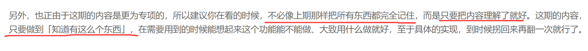
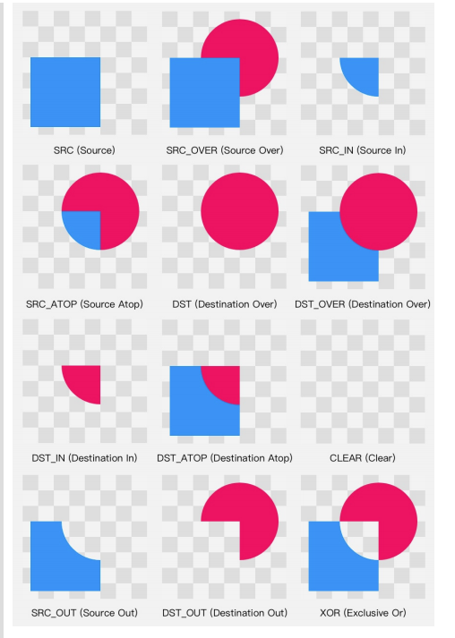

# 自定义View

## 1-1	绘制基础

### 坐标系

**在 Android 里，每个 View 都有一个自己的坐标系，彼此之间是不影响的。这个坐标系的原点是 View 左上角的那个点；水平方向是 x 轴，右正左负；竖直方向是 y 轴，下正上负（注意，是下正上负，不是上正下负，和上学时候学的坐标系方向不一样）。也就是下面这个样子。**

### 独有信息 / 公有信息

+ **独有信息：**

  

+ **共有信息：**

  

### Path.setFillType(fillType)	【`EVEN_ODD` 和 `WINDING` 的原理】

`FillType` 的取值有四个：

- `EVEN_ODD`
- `WINDING` （默认值）
- `INVERSE_EVEN_ODD`
- `INVERSE_WINDING`

#### EVEN_ODD 和 WINDING 的原理

##### EVEN_ODD

##### WINDING

## 1-2 Paint详解

### `Paint` 的第一类 API——关于颜色的三层设置

**`Paint` 的第一类 API——关于颜色的三层设置：直接设置颜色的 API 用来给图形和文字设置颜色； `setColorFilter()` 用来基于颜色进行过滤处理； `setXfermode()` 用来处理源图像和 `View` 已有内容的关系。。**

#### 基本颜色

+ **直接设置颜色**

+ **渐变色**

  **setShader(Shader shader) 设置 Shader**

  + LinearGradient 线性渐变
  + RadialGradient 辐射渐变
  + SweepGradient 扫描渐变

  **TileMode** 一共有 3 个值可 选： **CLAMP , MIRROR 和 REPEAT** 。CLAMP 会在端点之外延续端点处的颜色；MIRROR 是镜像模式；REPEAT 是重复模式。

+ **用 Bitmap 来着色**

+ **ComposeShader 混合着色器**

  **PorterDuff.Mode mode参数类型：**

  

  **PorterDuff.Mode** 是用来指定两个图像共同绘制时的颜色策略的。PorterDuff.Mode 一共有 17 个，可以分为两类： 

  

  + Alpha 合成 (Alpha Compositing) 

    

  + 混合 (Blending)

    

+ **颜色过滤**

+  **setXfermode(Xfermode xfermode)**

   Xfermode 指的是你要绘制的内容和 Canvas 的目标位置 的内容应该怎样结合计算出最终的颜色。

  但通俗地说，其实就是要你以绘制的内容 作为源图像，以 View 中已有的内容作为目标图像，选取一个 PorterDuff.Mode 作 为绘制内容的颜色处理方案。

  + **离屏缓存（Xfermode使用时的 注意事项）**

    使用离屏缓存 (Off-screen Buffer) 把内容绘制在额外的层上，再把绘制好的内容贴回 View 中

    

  + **控制好透明区域**

    

### 效果

**效果类的 API ，指的就是抗锯齿、填充/轮廓、线条宽度、色彩优化等等这些**