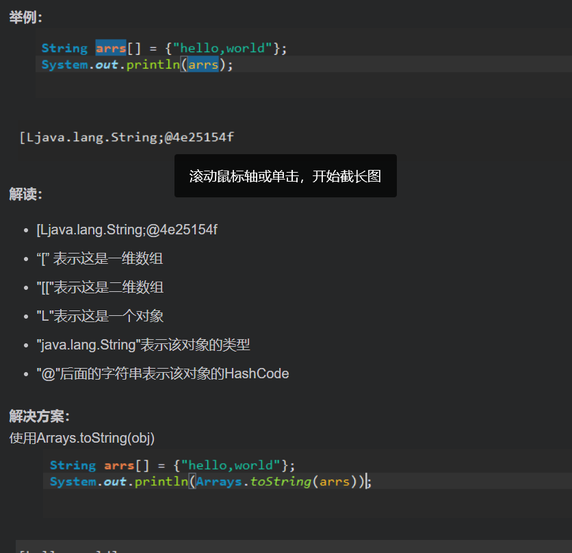

### 空指针异常	java.lang.NullPointerException

[借鉴于此博客](https://blog.csdn.net/qq_42618969/article/details/81141895)

**静下心来慢慢的查找，下面分成几步来带你查找问题：**

1：首先是查看报错的第一行（Androidstudio中打开run界面第一个可点击的地方），一般前几行都是比较关键的，我们一定要注意：

2：检查我们的XML文件里面定义的id（这个很关键），看看有没有对应的id，

3：检查代码中(对象，实例等）有没有初始化：

4：检查我们对应的事件（比如点击事件）有没有设置监听器。

5：下面是一般编译器报错的模板：

E/AndroidRuntime: FATAL EXCEPTION: main
         Process: com.choicelean.superwinner, PID: 179

java.lang.NullPointerException:Attempt to invoke virtual method 'void                                                            android.view.View.setOnClickListener(android.view.View$OnClickListener)' on a null object reference
           at com.choicelean.superwinner.fragment.main.GrowupFragment.initEvents(GrowupFragment.java:457)
           at com.choicelean.superwinner.fragment.main.GrowupFragment.initAd(GrowupFragment.java:425)
           at com.choicelean.superwinner.fragment.main.GrowupFragment.initPopUp(GrowupFragment.java:401)
           at com.choicelean.superwinner.fragment.main.GrowupFragment.onClick(GrowupFragment.java:174)
           at android.view.View.performClick(View.java:4792)
           at android.view.View$PerformClick.run(View.java:19936)
           at android.os.Handler.handleCallback(Handler.java:739)
           at android.os.Handler.dispatchMessage(Handler.java:95)
           at android.os.Looper.loop(Looper.java:135)
           at android.app.ActivityThread.main(ActivityThread.java:5595)
           at java.lang.reflect.Method.invoke(Native Method)
           at java.lang.reflect.Method.invoke(Method.java:372)
           at com.android.internal.os.ZygoteInit$MethodAndArgsCaller.run(ZygoteInit.java:960)
           at com.android.internal.os.ZygoteInit.main(ZygoteInit.java:755)

最后通过以上的问题基本上能解决90%以上的问题。

#### Caused by: java.lang.NullPointerException: Attempt to invoke virtual method 'android.view.Window$Callback android.view.Window.getCallback()' on a null object reference

**报错原因：**

在Activity中，还没有setContentView时，我给成员变量绑定Id，即是用findViewById给成员变量绑定ID.

### 输出时出现“[Ljava.lang.String@xxxxx

[借鉴于此博客](https://blog.csdn.net/m0_45067620/article/details/108281593)

