# 第1章 了解Web及网络基础

## 1.1 使用 HTTP 协议访问 Web

**客户端(client)：**通过发送请求获取服务器资源的 Web 浏览器等。

## 1.2 HTTP 的诞生

**Apache：**Web 服务器标准之一

## 1.3 网络基础 TCP/IP

**协议：**

**TCP/IP：**

### TCP/IP 的分层管理

**分层的好处：**

**各层的作用：**

+ **应用层**

  

+ **传输层**

  

+ **网络层**

  

+ **链路层**

  

### TCP/IP 通信传输流

**封装：**

## 1.4 与 HTTP 关系密切的协议 : IP、TCP 和 DNS

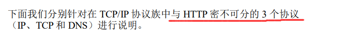

### 负责传输的 IP 协议

#### 使用 ARP 协议凭借 MAC 地址进行通信

**IP 间的通信依赖 MAC 地址**

**ARP 是一种用以解析地址的协议，根据通信方 的 IP 地址就可以反查出对应的 MAC 地址。**

**路由选择（routing）：**

### 确保可靠性的 TCP 协议

**可靠的字节流服务：**

#### 三次握手

## 1.5 负责域名解析的 DNS 服务

## 1.6 各种协议与 HTTP 协议的关系

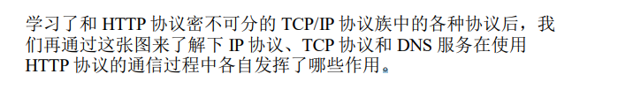

## 1.7 URI 和 URL

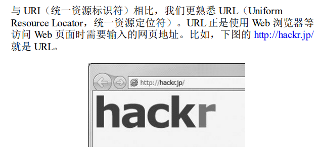

### URI

#### URL

**URL是 URI 的子集**

#### URI 格式

+ **绝对URI**

  

  + **协议方案名**

    

  + **登录信息(认证)**

    

  + **服务器地址**

    

  + **服务器端口号**

    

  + **带层次的文件路径**

    

  + **查询字符串**

    

  + **片段表示符**

    

### RFC标准

# 第 2 章 简单的 HTTP 协议

## 2.1 HTTP 协议用于客户端和服务器端之间的通信

## 2.2 通过请求和响应的交换达成通信

### 请求报文

**具体示例：**

### 响应报文

**具体示例：**

## 2.3 HTTP 是不保存状态的协议

**cookie：**

## 2.4 请求 URI 定位资源

**查询HTTP服务器端支持的HTTP方法种类：**

## 2.5 告知服务器意图的 HTTP 方法

**HTTP/1.1 中可使用的方法：**

### GET：获取资源

+ **请求的是文本：**保持原样返回
+ **请求的是像CGI那样的程序：**返回经过执行后的输出结果

+ **实例：**

  

### POST：传输实体主体

+ **实例：**

  

### PUT：传输文件

+ **实例：**

  

### HEAD：获取报文首部

+ **实例：**

  

### DELETE：删除文件

+ **实例：**

  

### OPTIONS：询问支持的方法

+ **实例：**

  

### TRACE：追踪路径

+ **实例：**

  

### CONNECT：要求用隧道协议连接代理**

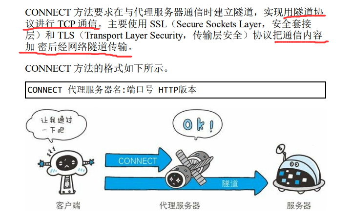

+ **实例：**

  

## 2.6 使用方法下达命令

## 2.7 持久连接节省通信量

### 持久连接：

### 管线化：

## 2.8 使用 Cookie 的状态管理

# 第 3 章 HTTP 报文内的 HTTP 信息

## 3.1 HTTP 报文

## 3.2 请求报文及响应报文的结构

a

## 3.3 编码提升传输速率

**报文主体和实体主体的差异：**

+ 通常，**报文主体等于实体主体**。

+ 只有**当传输中进行编码操作时，实体主体的内容发生变化**，才导致它和报文主体产生差异。

**服务器端：**

+ **压缩传输的内容编码：**

  

  

+ **分割发送的分块传输编码：**

  **把实体主体分块的功能称为分块传输编码（Chunked Transfer Coding）**

  

  + 
  + 
  + 

## 3.4 发送多种数据的多部分对象集合

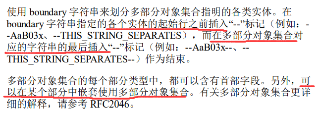

## 3.5 获取部分内容的范围请求

## 3.6 内容协商返回最合适的内容

**有以下 3 种类型的内容协商技术：**

+ **服务器驱动协商（Server-driven Negotiation）**

  

+ **客户端驱动协商（Agent-driven Negotiation）**

  

+ **透明协商（Transparent Negotiation）**

  

# 第 4 章 返回结果的 HTTP 状态码

HTTP 状态码负责表示**客户端 HTTP 请求的返回结果**、**标记服务器端的处理是否正常**、**通知出现的错误等工作**。

## 4.1 状态码告知从服务器端返回的请求结果

**状态码，以3位数字和原因短语组成：**

## 4.2 2XX 成功

**2XX 的响应结果表明请求被正常处理了**

### 200 OK

###  204 No Content

### 206 Partial Content

## 4.3 3XX 重定向

**3XX 响应结果表明浏览器需要执行某些特殊的处理以正确处理请求**

### 301 Moved Permanently

### 302 Found

### 303 See Other

### 304 Not Modified

### 307 Temporary Redirect

## 4.4 4XX 客户端错误

**4XX 的响应结果表明客户端是发生错误的原因所在**

### 400 Bad Request

### 401 Unauthorized

### 403 Forbidden

### 404 Not Found

## 5XX 服务器错误

**5XX 的响应结果表明服务器本身发生错误**

### 500 Internal Server Error

### 503 Service Unavailable

# 第 5 章 与 HTTP 协作的 Web 服务器

## 5.1 用单台虚拟主机实现多个域名

## 5.2 通信数据转发程序 ：代理、网关、隧道

### 代理

+ **使用代理服务器的理由**

  

+ **代理中的方法**

  

  + 
  + 

### 网关

### 隧道

## 5.3 保存资源的缓存

**缓存：**

**缓存服务器：**

### 缓存的有效期限

### 客户端的缓存

# 第 6 章 HTTP 首部

**HTTP 协议的请求和响应报文中必定包含 HTTP 首部**

## 6.1 HTTP 报文首部

+ **HTTP请求报文**

  

+ **HTTP 响应报文**

  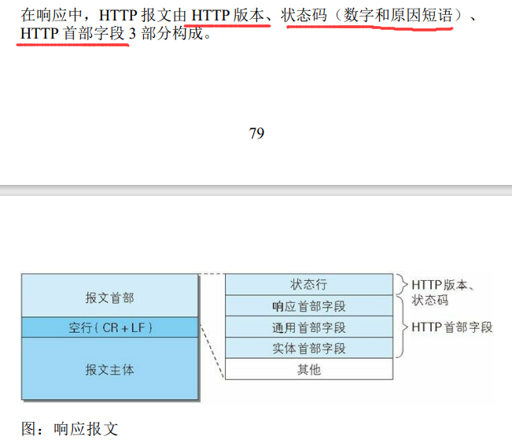

## 6.2 HTTP 首部字段

**HTTP 首部字段传递重要信息**

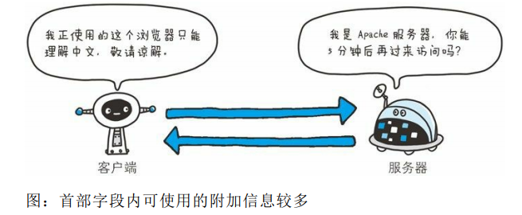

### HTTP 首部字段结构

### 4 种 HTTP 首部字段类型

+ **通用首部字段**

  

  

+ **请求首部字段**

  

  

+ **响应首部字段**

  

  

+ **实体首部字段**

  

  

### 非 HTTP/1.1 首部字段

**End-to-end 首部和 Hop-by-hop 首部：**

+ **End-to-end 首部**

  

+ **Hop-by-hop 首部**

  

## 6.3 HTTP/1.1 通用首部字段

**通用首部字段是指，请求报文和响应报文双方都会使用的首部**

### Cache-Control

#### Cache-Control 指令一览

+ **缓存请求指令**

  

+ **缓存响应指令**

  

#### 表示是否能缓存的指令

##### public 指令

##### private 指令

##### no-cache 指令

#### 控制可执行缓存的对象的指令

##### no-store 指令

#### 指定缓存期限和认证的指令

##### s-maxage 指令

##### max-age 指令

##### min-fresh 指令

##### max-stale 指令

##### only-if-cached 指令

##### must-revalidate 指令

##### proxy-revalidate 指令

##### no-transform 指令

#### Cache-Control 扩展

##### **cache-extension token**

### Connection

+ **控制不再转发给代理的首部字段**

+ **管理持久连接**

  

### Data

### Pragma

### Trailer

### Transfer-Encoding

### Upgrade

### Via

### Warning

## 6.4 请求首部字段

### Accept

## 6.5 响应首部字段

**（只过了一遍，笔记略）**

## 6.6 实体首部字段

**（只过了一遍，笔记略）**

## 6.7 为 Cookie 服务的首部字段

**至 2013 年 5 月，Cookie 的规格标准文档有以下 4 种：**

+ 

+ 

+ 

+ 

### Set-Cookie

#### expires 属性

#### path 属性

#### domain 属性

#### secure 属性

#### HttpOnly 属性

### Cookie

## 6.8 其他首部字段

**（只过了一遍，笔记略）**

# 第 7 章 确保 Web 安全的 HTTPS

## 7.1 HTTP 的缺点

### 通信使用明文可能会被窃听

+ **TCP/IP是可能被窃听的网络**

  **通信时不加密是一个缺点，通信内容在所有的通信线路上都有 可能遭到窥视**

  

+ **加密处理防止被窃听**

  

  + **通信的加密**

    

  + **内容的加密**

    

  

### 不验证通信方的身份就可能遭遇伪装

+ **任何人都可发起请求**  

  

  ​                                                                                                                                                                                          

+ **查明对手的证书**

  

### 无法证明报文完整性，可能已遭篡改

+ **接收到的内容可能有误**

  

+ **防止篡改**

  

## 7.2 HTTP+ 加密 + 认证 + 完整性保护 = HTTPS

### HTTP 加上加密处理和认证以及完整性保护后即是 HTTPS

### HTTPS 是身披 SSL 外壳的 HTTP

### 相互交换密钥的公开密钥加密技术

+ **共享密钥加密的困境**

  **用对称密钥加密会产生的问题：**

  

+ **使用两把密钥的公开密钥加密**

  

  

+ **HTTPS采用混合加密机制**

  

###  证明公开密钥正确性的证书

+ **可证明组织真实性的 EV SSL 证书**

  

+ **用以确认客户端的客户端证书**

  

+ **认证机构信誉第一**

  

+ **由自认证机构颁发的证书称为自签名证书**

  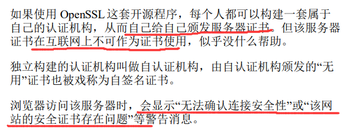

### HTTPS 的安全通信机制

**HTTPS 的通信步骤(十二步)：**

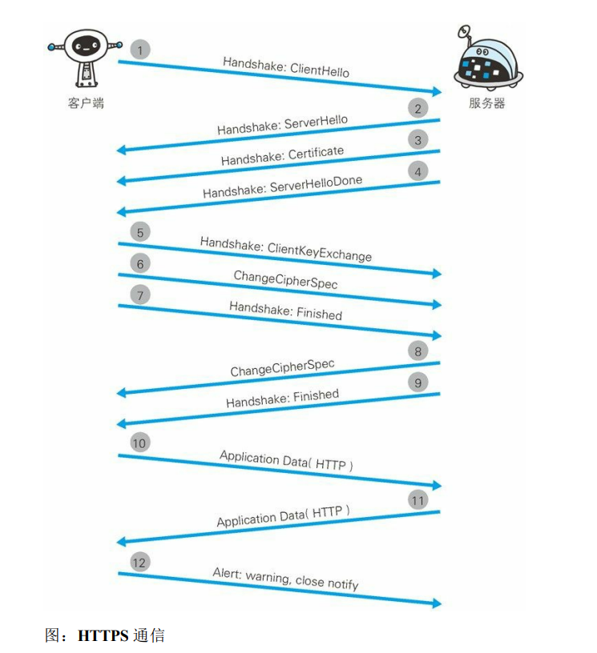

+ **步骤 1**

  

+ **步骤 2**

  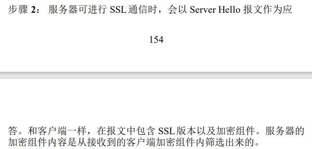

+ **步骤 3**

  

+ **步骤 4**

  

+ **步骤 5**

  

+ **步骤 6**

  

+ **步骤 7**

  

+ **步骤 8**

  

+ **步骤 9**

  

+ **步骤 10**

  

+ **步骤 11**

  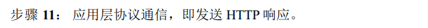

+ **步骤 12**

  

+ **SSL和TLS**

+ **SLL速度慢**

  

+ **为什么不一直使用HTTPS**

  

# 第 8 章 确认访问用户身份的认证

## 8.1 何为认证

**核对的信息通常是指以下这些：**

**HTTP使用的认证方式：**

## 8.2 BASIC 认证

**BASIC 认证（基本认证）是从 HTTP/1.0 就定义的认证方式，是 Web 服务器与通信 客户端之间进行的认证方式。**

### BASIC 认证的认证步骤

+ **步骤 1**

  

+ **步骤 2**

  

  

+ **步骤 3**

  

## 8.3 DIGEST 认证

**质询响应方式：**

### DIGEST 认证的认证步骤

+ **步骤 1**

  

+ **步骤 2**

  

+ **步骤 3**

  

## 8.4 SSL 客户端认证

### SSL 客户端认证的认证步骤

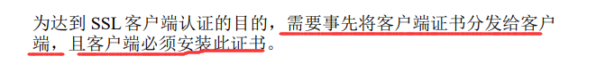

+ **步骤 1**

  

+ **步骤 2**

  

+ **步骤 3**

  

**SSL 客户端认证采用双因素认证：**

**SSL 客户端认证必要的费用：**

## 8.5 基于表单认证(使用最多)

### 认证多半为基于表单认证

### Session 管理及 Cookie 应用

#### Session 管理及 Cookie 状态管理步骤

+ **步骤 1**

  

+ **步骤 2**

  

+ **步骤 3**

  

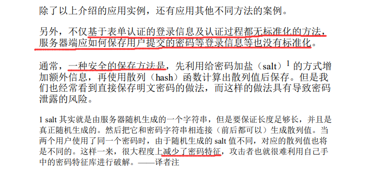

# 第 9 章 基于 HTTP 的功能追加协议

## 9.1 基于 HTTP 的协议

## 9.2 消除 HTTP 瓶颈的 SPDY

###  HTTP 的瓶颈

**以下这些 HTTP 标准就会成为实时显示更新内容的瓶颈：**

#### Ajax的解决方法

#### Comet的解决方法

#### SPDY的目标

### SPDY的设计与功能

#### 获得的额外功能

**使用 SPDY 后，HTTP 协议额外获得以下功能：**

+ **多路复用流**

  

+ **赋予请求优先级**

  

+ **压缩HTTP首部**

  

+ **推送功能**

  

+ **服务器提示功能**

  

## 9.3 使用浏览器进行全双工通信的

### WebSocket 的设计与功能

### WebSocket 协议

#### WebSocket协议的主要特点

+ **推送功能**

  

+ **减少通信量**

  

  

  + **握手·请求**

    

  + **握手·响应**

    

  

+ **WebSocket API**

  

  + **实例**

    

## 9.4 期盼已久的 HTTP/2.0

## 9.5 Web 服务器管理文件的 WebDAV

### 扩展 HTTP/1.1 的 WebDAV

### WebDAV 内新增的方法及状态码

**实例：**

+ **WebDAV的请求实例**

  

+ **WebDAV的响应实例**

  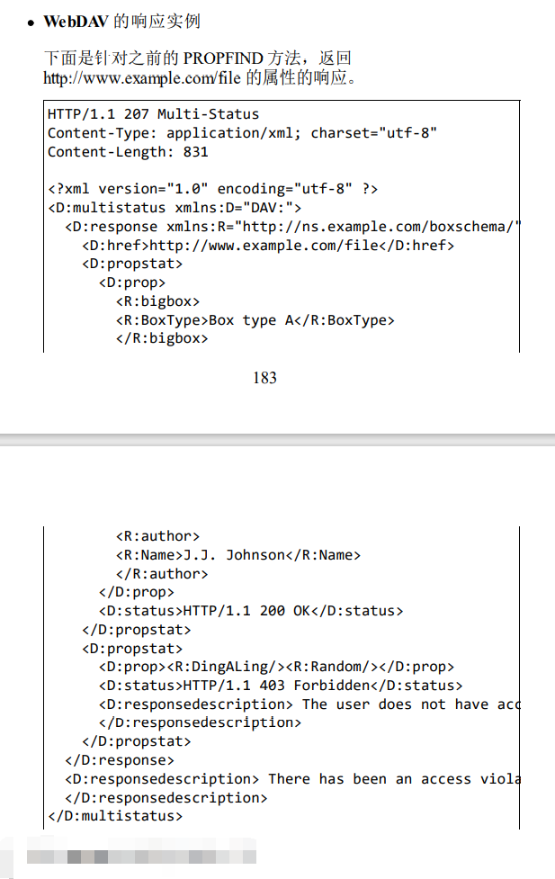

# 第 10 章 构建 Wetb 内容的技术

## 10.1 HTML

### Web 页面几乎全由 HTML 构建

+ **超文本标记语言：**

  **HTML（HyperText Markup Language，超文本标记语言）是为了发送 Web 上的超文本（Hypertext）而开发的标记语言。**

+ **超文本(超链接文本)：**

  **超文本是一种文档系统，可将文档中任意位置的信息与其他信息（文本或图片等）建立关联，即超链接文本。**

+ **标记语言：**

  **标记语言是指通过在文档的某部分穿插特别的 字符串标签，用来修饰文档的语言。**

+ **标签：**

  **我们把出现在 HTML文档内的 这种特殊字符串叫做 HTML标签（Tag）。**

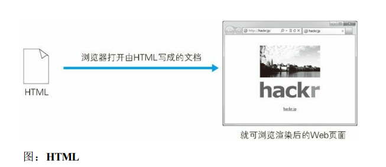

### HTML 的版本

### 设计应用 CSS

## 10.2 动态 HTML

### 更易控制 HTML 的 DOM

## 10.3 Web 应用

### 动态内容和静态内容

### 与 Web 服务器及程序协作的 CGI

### 因 Java 而普及的 Servlet

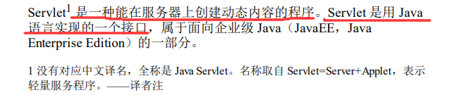

## 10.4 数据发布的格式及语言

### 可扩展标记语言XML

### 发布更新信息的 RSS/Atom

+ **RSS 有以下版本，名称和编写方式也不相同：**

  

+ **Atom 具有以下两种标准：**

  

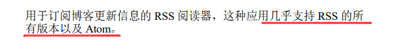

### JavaScript 衍生的轻量级易用 JSON

# 第 11 章 Web 的攻击技术

**互联网上的攻击大都将 Web 站点作为目标**

## 11.1 针对 Web 的攻击技术

### HTTP 不具备必要的安全功能