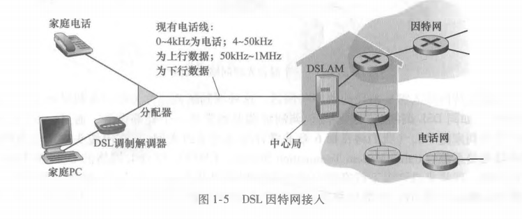
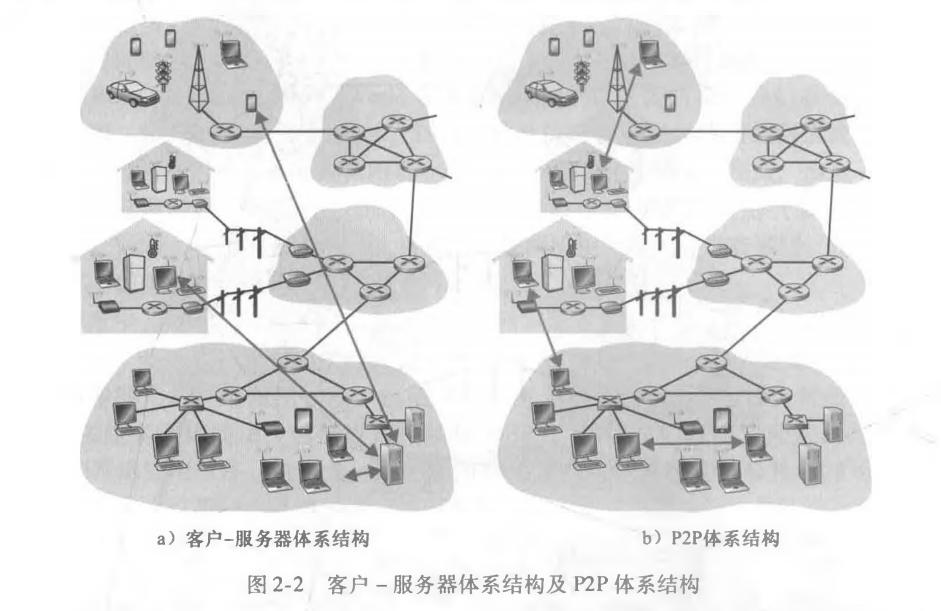

# 第一章：计算机网络和因特网

## 1. 1	什么是因特网

### 1. 1. 1	具体构成描述（众多术语）

因特网是一个世界范围的计算机网络，即它是一个**互联了遍及全世界数十亿计算设备的网络**

**计算设备：**传统的桌面PC、Linux 工作站以及所谓的服务器（它们用于存储和传输Web页面和电子邮件报文等信息），非传统的因特网 “物品”（如便携机、智能手机、平板电脑、电视、游戏机、温度调节装置、家用安 全系统、家用电器、手表、眼镜、汽车、运输控制系统等）

**主机（host）/  端系统（end system）：**用**因特网术语**来说，上述计算设备中的所有这些设备都称为主机（host）或端系统（end system）。它们容纳（即运行）应用程序，如Web浏览器程 序、Web服务器程序、电子邮件客户程序或电子邮件服务器程序等。

**通信链路（communication link）和分组交换机（packet switch）：**

端系统通过通信链路（communication link）和分组交换机（packet switch）连接到一起

+ **通信链路：**通信链路由不同类型的物理媒体组成。这 些物理媒体包括同轴电缆、铜线、光纤和无线电频谱
+ **传输速率：**不同的链路能够以不同的速率传输数据，链路的传输速率（transmission rate）以比特/秒（bit/s,或bps）度量
+ **分组：**当一台端系统要向另一台端系统发送数据时，**发送端系统**会**将数据分段，并为每段加上首部字节。由此形成的信息包用计算机网络的术语来说称为分组（packet）**。这些分组通过网络发送到**目的端系统**，在那里被**装配**成初始数据
+ **分组交换机【路由器（router）和链路层交换机（link-layer switch）】：**
  + 分组交换机从它的一条**入通信链路**接收到达的分组，并从它的一条**出通信链路转发**该分组
  + 路由器（router）和链路层交换机（link-layer switch）是在当今的因特网中的**分组交换机中最著名的两种类型**
    + 链路层交换机通常用于接入网中
    + 路由器通常用于网络核心中
+ **路径（mute或path）：**从发送端系统到接收端系统，一个分组所**经历的一系列通信链路和分组交换机**称为通过该网络的路径（mute或path）

**因特网服务提供商（Internet Service Provider, ISP）：**

+ ISP包括如：本地电缆或电话公司那样的住宅区ISP、公司ISP、大学ISP；在机场、旅馆、咖啡店和其 他公共场所提供WiFi接入的ISP；以及为智能手机和其他设备提供移动接入的蜂窝数据 ISP
+ 每个ISP自身就是一个**由多台分组交换机和多段通信链路组成的网络**
+ ISP**为端系统提供了各种不同类型的网络接入**，包括如线缆调制解调器或DSL那样的住宅宽带接入、 高速局域网接入和移动无线接入
+ ISP**为内容提供者提供因特网接入服务**，将Web站点和视频服务器直接连入因特网
+ 为端系统提供接入因特网的ISP之间是**互联的**。同时各自也是独立管理，运行着IP协议，遵从一定的命名和地址规则
  + **较低层的ISP**通过国家的、国际的较高层ISP （如中国电信 、中国联通 ，中国移动、Level 3 Communica-tions、AT&T、Sprint和NTT）互联起来
  + **较高层的ISP**是由通过高速光纤链路互联的高速路由器组成的

**协议（protocol）【TCP （Transmission Control Protocol,传输控制协议）和IP（Internet Protocol,网际协议）】：**

端系统、分组交换机和其他因特网部件都要运行一系列协议（protocol），这些协议**控制因特网中信息的接收和发送**

+ **TCP （Transmission Control Protocol,传输控制协议）和IP （Internet Protocol,网际协议）：**TCP和IP**是因特网中两个最为重要的协议**。
  + IP协议：IP协议定义了在**路由器和端系统之间**发送和接收的分组格式
  + **因特网的主要协议统称为TCP/IP**

**因特网标准（Internet standard）：**鉴于因特网协议的重要性，每个人**就各个协议及其作用取得一致**认识是很重要的，这样人们就能够创造协同工作的系统和产品，这正是标准发挥作用的地方。

**因特网工程任务组（Internet Engineering Task Force, IETF ）：**因特网标准 （Internet standard）由因特网工程任务组(Internet Engineering Task Force, IETF ) [ IETF 2016］研发

**请求评论（RFC）：**IETF的**标准文档**称为请求评论(Request For Comment, RFC)，它定义了 TCP、IP、HTTP (用于Web)和SMTP (用于电子邮件)等协议

其他组织也在制定用于网络组件的标准。例如，IEEE 802 LAN/MAN标准化委员会［IEEE 802 2016］制定了以太网和无线WiFi的标准

### 1. 1. 2	服务描述

**分布式应用程序（distributed applicalion）：**应用程序涉及多个相互交换数据的端系统，则它们被称为分布式应用程序（distributed applicalion）。**因特网应用程序运行在端系统上**

**套接字接口（socket interface）：**

**与因特网相连的端系统**提供了一个套接字接口( socket interface)，该接口规定了**运行在一个端系统上的程序**请求因特网基础设施**向运行在另一个端系统上的特定目的地程序交付数据**的方式

**因特网套接字接口是一套发送程序必须遵循的规则集合，**使因特网能够向接收数据的程序交付数据

### 1. 1. 3	协议

协议（protocol）**定义了**在两个或多个通信实体之间交换的报文的**格式和顺序**，以及报文发送和/或接收一条报文或其他事件**所采取的动作**

因特网（更一般地说是计算机网络）广泛地使用了协议。**不同的协议用于完成不同的通信任务**

## 1.2	网络边缘

### 位于“网络边缘”的应用程序和端系统

**主机（host）/  端系统（end system）：**

**主机 = 端系统，只是两种不同理解方式的叫法**

+  端系统（end system）：与因特网相连的计算机和其他设备**位于因特网的边缘**，故而被称为端系统。

  因特网的端系统包括了桌面计算机（例如，桌面PC、Mac和Linux设备）、服务器（例如，Web和电子邮件 服务器）和移动计算机（例如，便携机、智能手机和平板电脑）。此外，越来越多的非传统物品正被作为端系统与因特网相连

+ 主机（host）：端系统也称为主机（host）,因为它们**容纳（即运行）应用程序**，如Web浏览器程 序、Web服务器程序、电子邮件客户程序或电子邮件服务器程序等

  **主机有时又被进一步划分为两类：**

  + **客户 （client）：**客户通常是桌面PC、移动PC和智能手机等
  + **服务器（server）：**服务器通常是更为强大的机器，用于存储和发布Web页面、流视频、中继电子邮件等
    + **数据中心：**今天, 大部分提供搜索结果、电子邮件、Web页面和视频的服务器都属于大型数据中心（data center） 

### 1. 2. 1	接入网

**接入网：**接入网是指将端系统**物理连接**到其边缘路由器（edge router）的网络

**边缘路由器（edge router）：**边缘路由器是端系统到任何其他远程端系统的**路径上的第一台路由器**

#### 家庭接入：DSL、电缆、FTTH、拨号和卫星

**宽带住宅接入【数字用户线（Digital Subscriber Line, DSL）和电缆】：**

2014年，几乎所有家庭都是经过高速宽带连接。宽带住宅接入有两种**最流行的类型**：数字用户线（Digital Subscriber Line, DSL）和电缆。

+ **数字用户线（DSL）：**住户通常从提供本地电话接入的本地电话公司处获得DSL因特网接入。因此，当使用DSL时，用户的本地电话公司也是它的ISP。

  + 每个用户的**DSL 调制解调器**使用现有的电话线（即双绞铜线）与位于电话公司的本地中心局（CO）中的**数字用户线接入复用器（DSLAM）**交换数据。
  + 家庭的**DSL调制解调器**得到**数字数据后将其转换为高频音**，以通过电话线传输给本地中心局
  + 来自许多家庭的模拟信号在**DSLAM**处被转换回数字形式
  + **分配器：**在用户一 侧，一个分配器**把到达家庭的数据信号和电话信号分隔开**，并将数据信号转发给DSL调制解调器
  + **数字用户线接入复用器（DSLAM）：**在电话公司一侧，在本地中心局中，DSLAM**把数据和电话信号分隔开**，并将数据送往因特网。数百甚至上千个家庭与同一个DSLAM相连

+ **家庭电话线：**家庭电话线**同时承载了数据和传统的电话信号**，它们**用不同的频率进行编码**： 

  + 高速下行信道，位于50kHz到1 MHz频段
  + 中速上行信道，位于4kHz到50kHz频段
  + 普通的双向电话信道，位于0到4kHz频段

  这种方法使单根DSL线路看起来就像有3根单独的线路一样，因此一个电话呼叫和一 个因特网连接能够同时共享DSL链路

  

  

  

**不对称的接入：**DSL标准定义了多个传输速率，包括12Mbps下行和1.8Mbps上行传输速率［ITU 1999］，以及55Mbps下行和15Mbps 上行传输速率［ITU 2006］。**因为这些上行速率和下行速率是不同的**，所以这种接入被称为是不对称的。

**DSL（用于短距离接入）限制：**—般而言，如果住宅不是位于本地中心局的5~10英里（1英里=1609. 344 米）范围内，该住宅必须采用其他形式的因特网接入

**DSL和电缆因特网接入（cable Internet access）的区别：**

+ DSL：DSL利用电话公司现有的本地电话基础设施
+ 电缆因特网接入（cable Internet access）：电缆因特网接入利用了有线电视公司现有的有线电视基础设施。住宅从提供有线电视的公司获得电缆因特网接入

**电缆因特网接入（cable Internet access）：**

+ **混合光纤同轴( Hybrid Fiber Coax, HFC) 系统：**光缆将电缆头端连接到地区枢纽，从这里使用传统的同轴电缆到达各家各户和公寓。因为**在这个系统中应用了光纤和同轴电缆**，所以它经常被称为混合光纤同轴（Hybrid Fiber Coax, HFC）系统。

  

+ **电缆调制解调器（cable modem）：**

  电缆因特网接入需要特殊的调制解调器，这种调制解调器称为电缆调制解调器（cable modem） 。如同DSL调制解调器，电缆调制解调器**通常是一个外部设备，通过一个以太网端口连接到家庭PC**

  + 电缆调制解调器将HFC网络划分为下行和上行两个信道。如同DSL,接入通常是不对称

  + **电缆调制解调器端接系统（Cable Modem Termination System, CMTS）：**

    **电缆调制解调器端接系统**与DSL网络的DSLAM具有类似的功能，即将来自许多下行家庭中的**电缆调制解调器发送的模拟信号转换回数字形式**

+ **共享广播媒体：**电缆因特网接入的一个重要特征是共享广播媒体。

  

**光纤到户(Fiber To The Home, FTTH) [FTTH Council 2016]：**从本地中心局直接到家庭提供了一条光纤路径。

从本地中心局到家庭有几种有竞争性的光纤分布方案：

+ **直接光纤：**最简单的光纤分布网络称为**直接光纤**，从本地中心局到每户设置一根光纤。

+ **主动光纤网络（Active Optical Network, AON)和被动光纤网络(Passive Optical Network, PON)：**更为一般的是，从中心局岀来的每根光纤实 际上由许多家庭共享，直到相对接近这些家庭的位置，该光纤才分成每户一根光纤。进行这种分配有两种有竞争性的光纤分布体系结构：主动光纤网络（Active Optical Network, AON)和被动光纤网络(Passive Optical Network, PON)

  + AON本质上就是交换因特网（在第6章讨论它）

  + **PON：**该技术用于Verizon的FIOS服务中

    + **光纤网络端接器(Optical Network Termi nator, ONT)：**每个家庭具有一个光纤网络端接器(ONT)，它由专门的光纤连接到邻近的**分配器(splitter)** 。
    + **分配器(splitter)：**分配器把一些家庭(通常少于100个)**集结到一根共享的光纤**，该光纤再连接到本地电话和公司的中心局中的光纤线路端接器(Optical Line Tenninator, OLT) 。
    + **光纤线路端接器(Optical Line Tenninator, OLT)：**该OLT**提供了光信号和电信号之间的转换**，经过本地电话公司**路由器与因特网相连**。

    

    + **家庭路由器：**在家庭中，用户将一台家庭路由器(通常是无线路由器)与ONT相连，并经过这台家庭路由器接入因特网。

  + 在PON体系结构中，所有从OLT发送到分配器的分组在分配器(类似于一个电缆头端)处复制。

**卫星链路：**在无法提供DSL、电缆和 FTTH的地方（例如在某些乡村环境），能够使用卫星链路将住宅以超过1Mbps的速率与因特网相连。

**拨号接入：**。使用传统电话线的拨号接入与DSL基于相同的模式：家庭的调制解调器经过电话线连接到ISP的调制解调器。 与DSL和其他宽带接入网相比，拨号接入56kbps的慢速率是令人痛苦的。

#### 企业（和家庭）接入：以太网和WiFi

**局域网（LAN）：**越来越多的家庭环境中，使用局域网（LAN）将端系统连接到边缘路由器。

**以太网：**以太网到目前为止是公司、大学和家庭网络中最为流行的局域网（LAN）接入技术。

+ **以太网交换机：**以太网用户使用双绞铜线与一台以太网交换机相连，以太网交换机或这样相连的交换机网络，则再与更大的因特网相连。

  

**无线LAN：**在无线LAN环境中，无线用户从/到一个接入点发送/接收分组，该接入点与企业网连接（很可能使用了有线以太网），企业网再与有线因特网相连。**一个无线LAN用户通常必须位于接入点的几十米范围内。**

**WiFi：**基于IEEE 802. 11技术的无线LAN接入,更通俗地称为WiFi。

**家庭网络：**

该网络允许家庭成员**经宽带接入因特网**，其中任何一个家庭成员都可以在厨房、院子或卧室**漫游上网**。

+ **家庭网络组成如下：**
  + 一台漫游的**便携机**和一台**有线PC**
  + —个与无线PC和家中其他无线设备通信的**基站（无线接入点）**
  + 一个提供与因特网宽带接入的**电缆调制解调器**
  + 一台互联了基站及带有电缆调制解调器的**固定PC的路由器**

#### 广域无线接入：3G和LTE

iPhone和安卓等设备应用了与蜂窝移动电话相同的无线基础设施，通过蜂窝网提供商运营的基站来发送和接收分组。

与WiFi不同的是，一个用户仅需要**位于基站的数万米**(而不是几十米)范围内。

**3G**为分组交换广域无线因特网接入提供了超过1Mbps的速率。更高速率的广域接入技术即**第四代(4G) 广域无线网络**。

LTE (长期演进“Long-Term Evolution”的缩写)来源于3G技术，它能够取得超过10Mbps的速率。

### 1. 2. 1 物理媒介

暂时略，有空再补

# 第二章：应用层

## 2. 1	应用层协议原理

### 2. 1. 1	网络应用程序体系结构

**网络应用程序体系结构：**从应用程序研发者的角度看，网络体系结构是固定的，并为应用程序提供了特定的服务集合。在另一方面，**应用程序体系结构 (application architecture)** 由应用程序研发者设计, 规定了如何在各种端系统上组织该应用程序。

在选择应用程序体系结构时，应用程序研发者很可能利用现代网络应用程序中所使用的两种主流体系结构之一：**客户-服务器体系结构或对等（P2P）体系结构**

+ **客户-服务器体系结构（client-server architecture）**

  在客户-服务器体系结构（client-server architecture）中，有一个总是打开的主机称为服务器，它服务于来自许多其他称为客户的主机的请求。具有客户-服务器体系结构的非常著名的应用程序包括Web、 FTP、Telnet和电子邮件。

  + 利用客户-服务器体系结构，**客户相互之间不直接通信**
  + 客户-服务器体系结构的另一个特征是**该服务器具有固定的、周知的地址，该地址称为IP地址**。因为该服务器具有固定的、周知的地址，并且因为该服务器总是打开的，客户总是能够通过向该服务器的IP地址发送分组来与其联系。
  + 在一个客户-服务器应用中，常常会出现一台单独的服务器主机跟不上它所有客户请求的情况。。为此，配备大量主机的数据中心（data center）常被用于创建强大的虚拟服务器。

+ **P2P 体系结构（P2P architecture）**

  在一个 P2P 体系结构（P2P architecture） 中，对位于数据中心的专用服务器有最小的 （或者没有）依赖

  + **对等方：**应用程序在间断连接的主机对之间使用直接通信，这些主机对被称为**对等方**

  + 因为这种对等方通信**不必通过专门的服务器**，该体系结构被称为对等方到对等方的

  + **自扩展性（self-scalability）。**例如, 在一个P2P文件共享应用中，尽管每个对等方都由于请求文件产生工作负载，但每个对等 方通过向其他对等方分发文件也为系统增加服务能力。

    P2P体系结构也是有成本效率的, 虽然它们通常不需要庞大的服务器基础设施和服务器带宽（这与具有数据中心的客户-服 务器设计形成鲜明对比）。未来P2P应用由于高度非集中式结构，面临安全性、性能和可靠性等挑战

+ **混合的体系结构**

  某些应用具有混合的体系结构，**它结合了客户-服务器和P2P的元素**。例如，对于许多即时讯息应用而言，服务器被用于跟踪用户的IP地址，但用户到用户的报文在用户主机之间（无须通过中间服务器）直接发送

### ※2. 1. 2	进程通信

不特别关注同一台主机上的进程间的通信，而**关注运行在不同端系统（可能具有不同的操作系统）上的进程间的通信**

**在两个不同端系统上的进程，通过跨越计算机网络交换报文（message）而相互通信**

+ **发送进程**生成并向网络中发送报文
+ **接收进程**接收这些报文并可能通过回送报文进行响应

#### 客户和服务器进程

网络应用程序由成对的进程组成，这些进程通过网络相互发送报文

对每对通信进程, 我们通常将这两个进程之一标识为**客户（client）**，而另一个进程标识为**服务器（serve）**

+ 在一对进程之间的通信会话场景中，发起通信（即在该会话开始时发起与其他进程的联系）的进程被标识为客户，在会话开始时等待联系的进程是服务器。

#### ※进程与计算机网络之间的接口（套间字 socket）

多数应用程序是由通信进程对组成，每对中的两个进程互相发送报文。从一个进程向另一个进程发送的报文必须通过下面的网络。

**套接字（socket）：**进程通过一个称为**套接字的软件接口**向网络发送报文和从网络接收报文。**套接字是同一台主机内应用层与运输层之间的接口（应用程序进程和运输层协议之间的接口）**

下图2-3显示了两个经过因特网通信的进程之间的套接字通信（图2-3中假定由该进程 使用的下面运输层协议是因特网的TCP协议）。

如该图所示，**套接字是同一台主机内应用层与运输层之间的接口**。由于该套接字是建立网络应用程序的可编程接口，因此套接字也称为**应用程序和网络**之间的**应用程序编程接口**（Application Programming Interface, API） 

应用**程序开发者可以控制套接字在应用层端的一切，但是对该套接字的运输层端几乎没有控制权：**

+ **应用程序开发者对于运输层的控制仅限于：**
  + ①选择运输层协议。一旦应用程序开发者选择了一个运输层协议（如果可供选择的话），**则应用程序就建立在由该协议提供的运输层服务之上**
  + ②也许能设定几个运输层参数，如最大缓存和最大报文段长度等（将在第3章中涉及）

#### 进程寻址

在一台主机上运行的进程为了向在另一台主机上运行的进程发送分组，**接收进程需要有一个地址**。

**为了标识该接收进程，需要定义两种信息：**①主机的地址；②在目的主机中指定接收进程的标识符。

+ **主机的地址：**在因特网中，主机由其**IP地址(IP address)**标识。IP地址是一个32比特的量且**它能够唯一地标识该主机**

+ **在目的主机中指定接收进程的标识符：**发送进程还必须**指定运行在接收主机上的接收进程**(更具体地说，**接收套接字**)。因为一般而言一台主机能够运行许多网络应用，**目的地端口号(port number)**用于这个目的。

  已经给流行的应用分配了特定的端口号。例如，Web服务器用端口号80来标识。邮件服务器进程(使用SMTP 协议)用端口号25来标识。用于所有因特网标准协议的周知端口号的列表能够在http://WWW.iana.org处找到

### 2. 1. 3	可供应用程序使用的运输服务

包括因特网在内的很多网络提供了不止一种运输层协议。**当开发一个应用时，必须选择一种可用的运输层协议。（通过研究这些可用的 运输层协议所提供的服务，选择一个最能为你的应用需求提供恰当服务的协议。）**

#### 可靠数据传输

**分组在计算机网络中可能丢失：**例如，分组能够使路由器中的缓存溢岀，或者当分组中的某些比特损坏后可能被丢弃。

**可靠数据传输(reliable data transfer)：**如果一个协议提供了这样的确保数据交付服务：由应用程序的一端发送的数据**正确、完全地**交付给该应用程序的另一端，就认为提供了**可靠数据传输(reliable data transfer)。**当一个运输协议提供这种服务时，发送进程**只要将其数据传递进套接字，就可以完全相信该数据将能无差错地到达接收进程**

+ 像电子邮件、文件传输、远程主机访问、Web文档传输以及金融应用等这样的应用，数据丢失可能会造成灾难性的后果
+ **容忍丢失的应用(loss-tolerant application)：**最值得注意的是多媒体应用，如交谈式音频/视频

#### 吞吐量

**可用吞吐量：**在沿着一条网络路径上的两个进程之间的通信会话场景中，可用吞吐量就是**发送进程能够向接收进程交付比特的速率**。

+ 因为其他会话将共享沿着该网络路径的带宽，并且因为这些会话将会到达和离开，该**可用吞吐量将随时间波动**。

这些导致另一种自然的服务，即**运输层协议能够以某种特定的速率提供确保的可用吞吐量**。使用这种服务，该应用程序能够请求 r 比特/秒的确保吞吐量，并且该运输协议能够确保可用吞吐量总是为至少 r 比特/秒。

+ **带宽敏感的应用（bandwidth-sensitive application）：**具有吞吐量要求的应用程序被称为**带宽敏感的应用（bandwidth-sensitive application）** 。许多当前的多媒体应用是带宽敏感的，尽管某些多媒体应用程序可能采用自适应编码技术对数字语音或视频以与当前可用带宽相匹配的速率进行编码。
+ **弹性应用（elastic application）：**弹性应用（elastic application）能够**根据当时可用的带宽或多或少地利用可供使用的吞吐量**。电子邮件、文件传输以及Web传送都属于弹性应用。

#### 定时

运输层协议也能提供定时保证，定时保证能够以多种形式实现：一个保证的例子如：发送方注入进套接字中的每个比特到达接收方的套接字不迟于100ms。

这种服务将对交互式实时应用程序有吸引力，如因特网电话、虚拟环境、电话会议和多方游戏，所有这些服务**为了有效性而要求数据交付有严格的时间限制。**

#### 安全性

运输协议能够为应用程序提供一种或多种安全性服务。这种服务将在发送和接收进程之间提供机密性，以防该数据以某种方式在这两个进程之间被观察到。运输协议还能提供除了机密性以外的其他安全性服务，包括数据完整性和端点鉴别。

例如，在发送主机中，运输协议能够加密由发送进程传输的所有数据，在接收主机中，运输层协议能够在将数据交付给接收进程之前解密这些数据。

### 2. 1. 4	因特网提供的运输服务

