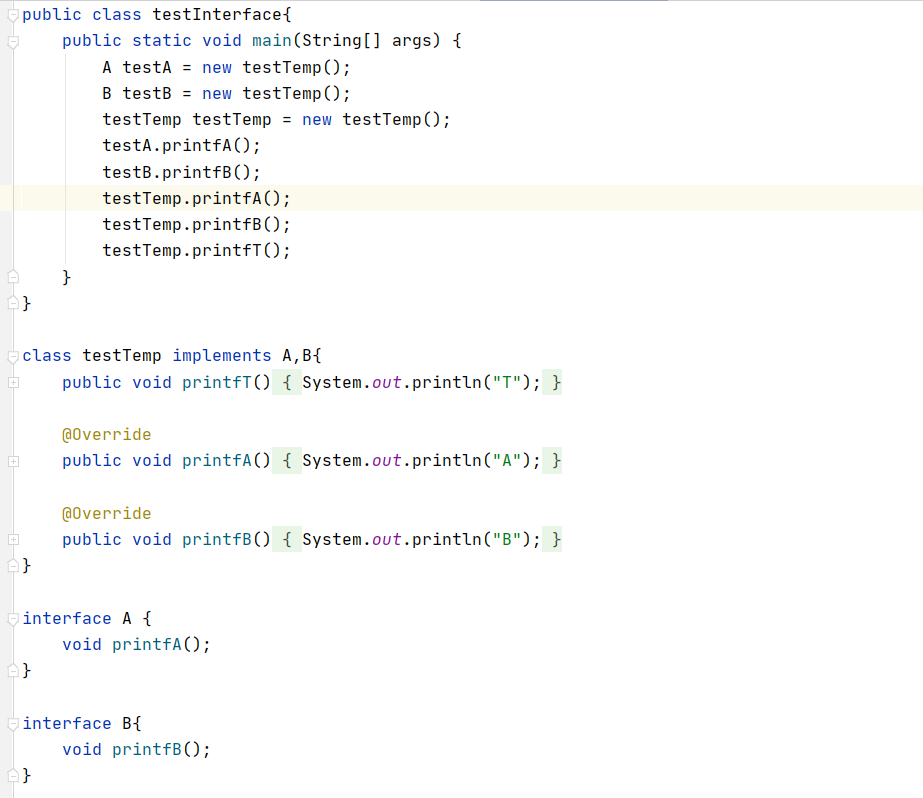
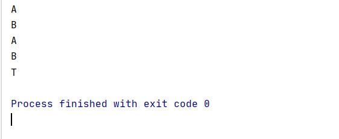
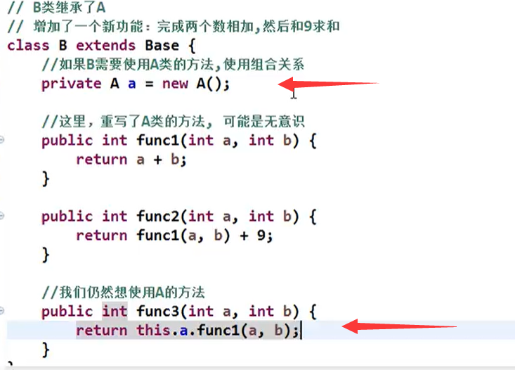
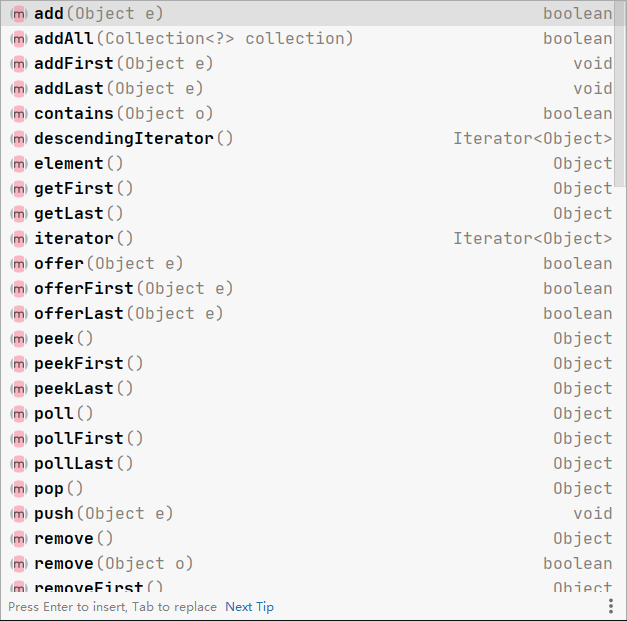
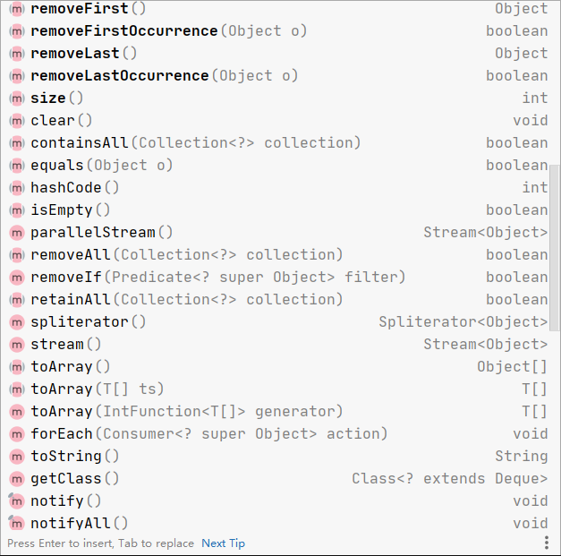
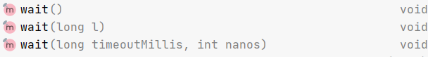
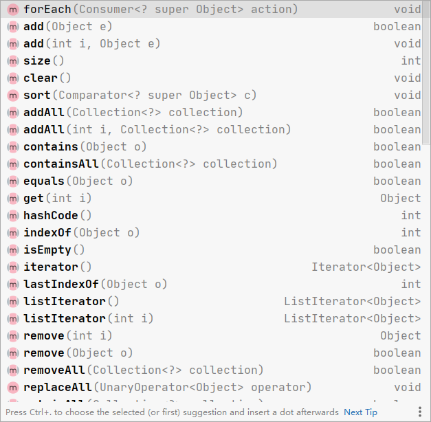
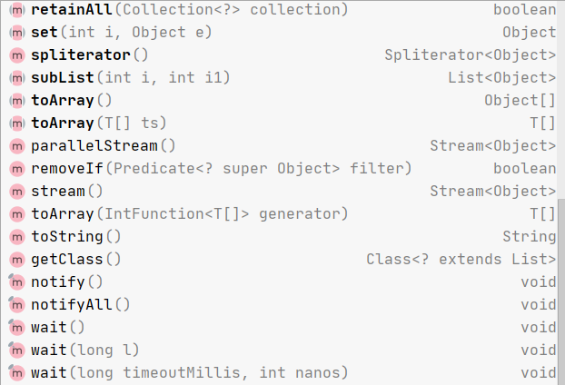

# LinkedList与多接口实现

## 一个类实现多个接口

**如上图所示：**

**testTemp类实现了接口A和B**

+ 当以`A testA = new testTemp()`实例化时，testA只能调用接口A中的方法。

  即只能调用`printfA`方法，而不能调用`printfB`和`printfT`方法

+ 当以`B testB = new testTemp()`实例化时，testB只能调用接口B中的方法。

  即只能调用`printfB`方法，而不能调用`printfA`和`printfT`方法

+ 当以`testTemp testTemp = new testTemp()`实例化时，testTemp可以调用所有方法。

  即可以调用`printfA`、`printfB`和`printfT`方法

## 里氏替换原则

**里氏替换原则设定规范了如何正确使用继承**

**里氏替换原则：**

+ **所有使用基类的地方必须能够使用子类进行替换**，而程序的行为不会发生任何变化(替换为子类之后不会产生错误或者异常)

  **即在子类中尽量不要重写父类已经实现的方法**

+ 如果子类迫不得已要重写父类的方法：

  + 再**定义一个更加基础的基类**，将子类原本需要重写的方法，提出来放到基类中，让原本的父类和子类共同继承这个基类

    再根据需要**通过聚合，组合，依赖**来解决其他问题

    + **组合：**

      在A类中实例化B类，这样就可以在A类中调用B类中的方法

      

## LinkedList

**LinkedList实现了List接口和Deque接口**

+ **实现了Deque接口中的方法：**

  **`Deque<Object> deque = new LinkedList<Object>();`**

+ **实现了List接口中的方法：**

  **`List<Object> list = new LinkedList<Object>();`**

  

