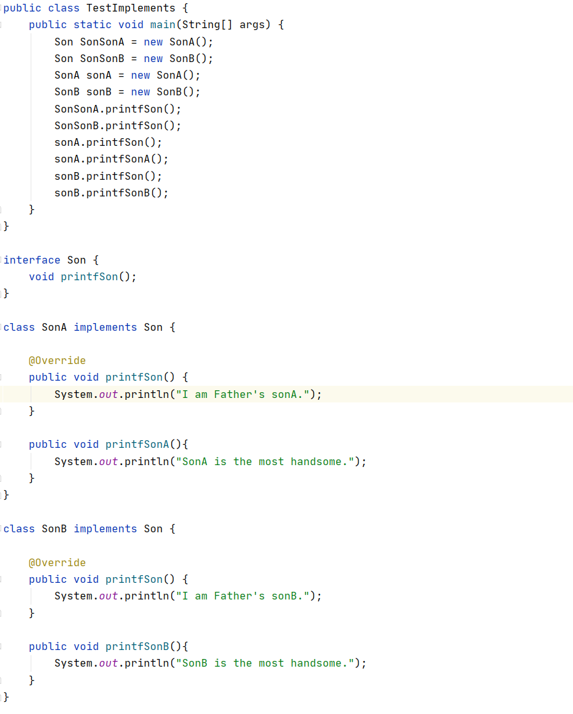

# List与一个接口多个实现类

## 一个接口多个实现类



如上图所示，**类SonA和SonB实现了接口Son**

+ 当以 `Son SonSonA = new SonA();` 和 `Son SonSonB = new SonB();`实例化时，**SonSonA 和 SonSonB 只能调用接口Son中定义了的方法。**

  即只能调用各自实现了的 `printfSon()`方法，不能调用各自自己独有的 `printfSonA()` 和 `printfSonB()` 方法

+ 当以 `SonA sonA = new SonA();` 和 `SonB sonB = new SonB();`实例化时，sonA可以调用 SonA 中的所有对外开放的方法，sonB可以调用 SonB 中的所有对外开放的方法。

  即 sonA 可以调用 printfSon() 和 printfSonA()方法，sonB可以调用 printfSon() 和 printfSonB() 方法


## 面向接口编程思想

首先，面向接口编程和面向对象编程并不是平级的，它并不是比面向对象编程更先进的一种独立的编程思想，而是附属于面向对象思想体系，属于其一部分。或者说，**它是面向对象编程体系中的思想精髓之一**。

**采用了面向接口编程方式**，也就是上述示例中的  `Son SonSonA = new SonA();` 和 `Son SonSonB = new SonB();`

就能**通过接口很大限度上规范开发人员的实现规则**，因为你现在只能调用接口的方法

**同时一个类可能实现了不同的接口，用面向接口编程方式实例化对象也可以指明实例化的对象的作用**


## List

**ArrayList 和 LinkedList 实现了List 接口**

即一般情况下均用如下方法创建ArrayList对象和LinkedList对象   

```java
List<Object> list = new ArrayList<Object>()	//创建ArrayList对象
List<Object> list = new LinkedList<Object>()	//创建LinkedList对象    
```

