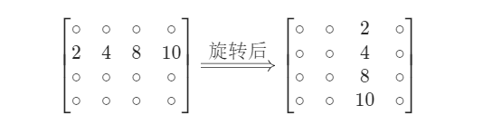
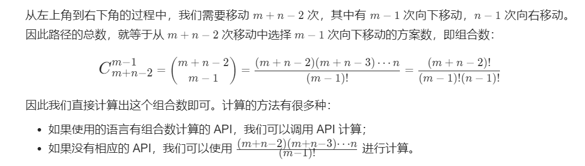
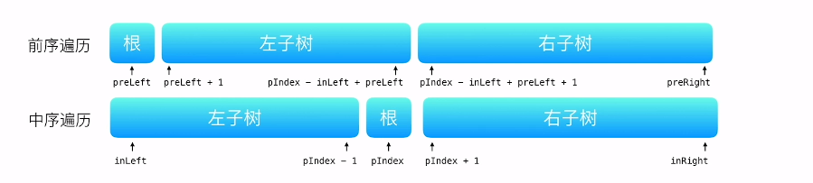
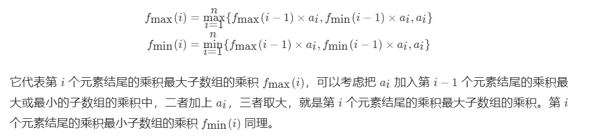
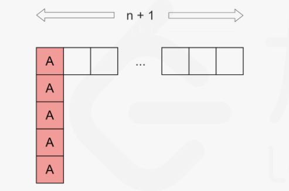

## leedcode 数组热题

**（题解参考leedcode）**

### 常用方法和属性：

```java
String.toCharArray()	//返回字符串对应的char数组
Arrays.sort(Object[] array)	//数组排序(默认为从小到大排序，且只能对一维数组排序) 
Arrays.toString(int[] array)	//数组转成字符串
String.charAt(int x)	//返回某个索引处的字符
String.length()	//返回字符串长度
array.length	//一维数组的长度/二维数组的行数
array[i].length	//二维数组的列数
String.substring(int beginIndex)	//返回字符串的子字符串
String.substring(int beginIndex, int endIndex)
Integer.valueOf()	//string to integer
String.valueOf()	//integer to string　
```

下列题中用到过的其他方法和属性

**Java集合中部分实现类的大致关系图：**


+ **List**的主要实现类是**ArrayList**和**LinkedList**

+ **Set**的主要实现类是**HashSet**

+ **Map**的主要实现类是**HashMap**

+ **Deque**的主要实现类是**ArrayDeque**和**LinkedList**

  [Deque接口代替Stack接口完成栈功能](https://chengfeng96.com/blog/2018/01/20/Java%E4%B8%AD%E7%94%A8Deque%E6%8E%A5%E5%8F%A3%E4%BB%A3%E6%9B%BFStack%E6%8E%A5%E5%8F%A3%E5%AE%8C%E6%88%90%E6%A0%88%E5%8A%9F%E8%83%BD/)	[ArrayDeque类的使用详解](https://blog.csdn.net/skh2015java/article/details/74840513)

```java
Map<Object, Object> hashmap = new HashMap<Object, Object>()	//创建HashMap对象
hashmap.put（K key，V value）	//将指定的键/值对插入到 HashMap 中,
    						  //如果插入的 key 对应的 value 已经存在，则执行 value 替换操作，返回旧的 value 值;							   //如果不存在则执行插入，返回 null
hashMap.get(Object key)	//返回key对应的value; 如果key不存在的话就返回null
hashMap.getOrDefault(Object key, V defaultValue)	//返回key对应的value																					    //如果key不存在的话就返回设定的默认值：defaultValue（即传入													  //的第二个参数）
hashMap.containsKey(Object key)	//检查key是否存在,返回值为boolean
hashMap.values()	//返回此映射中包含的值的Collection视图，转换后就可以使用Collections中的方法如获取最大值、最小值等
hashMap.keySet()	//返回此映射中包含的键的 Set 视图，返回一个Set集合，此集合类型为Map.Entry
hashMap.entrySet()	//返回此映射中包含的映射关系的 Set 视图


        
Math.min(int m,int n)	//返回两者中的极小值
Math.max(int m,int n)	//返回两者中的极大值
Math.min(int i,Math.min(int j,int k))	//返回三者中的极小值
Math.max(int i,Math.max(int j,int k))	//返回三者中的极大值
    
List<Object> list = new ArrayList<Object>()	//创建ArrayList对象
List<List<Object>> ans = new ArrayList<List<Object>>();	//创建多维数组
list.add(Object value)	//将数加入到list集合中
list.remove(int index)	//移出列表中指定索引处的元素，返回值为被移除的元素
list.remove(Object o)	//移出列表中指定的元素，返回值为bollean类型	(内部调用equals()方法比较判断，相等即移除)
List.get(int index)	//用于获取列表指定位置的元素。返回值为通过索引获取的元素
list.size()	//返回列表中元素的个数，返回值为int类型
list.clear()	//删除数组中的所有元素
list.removeAll(Collection c)	//参数c->动态数组列表中要删除的元素集合
//removeAll()方法内部即是循环判断动态数组中的元素和c中有相同的元素，相同则调用remove()方法从数组中删除
//sites.removeAll(sites)写法的作用在部分情况下等于list.clear()，但效果没有list.clear()好

list.toArray()	//不带参数的toArray方法，是构造的一个Object数组，然后进行数据拷贝，返回一个Object数组
list.toArray(T[] a)	//根据参数数组的类型，构造一个对应类型的长度跟List的size一致的空数组
    				//如果参数 T[] arr 作为参数传入到方法，则返回 T 类型的数组
    				//如果未传入参数，则返回 Object 类型的数组

    
//Deque:双端队列集合(Deque代替了Stack类)	LinkedList:此处为双向链表	
//ArrayDeque:依赖于可变数组来实现的双向队列（当作为栈使用时，性能比Stack好；当作为队列使用时，性能比LinkedList好）
Deque<Object> stack = new LinkedList<Object>()	//创建LinkedList对象 
Deque<Object> stack = new ArrayDeque<Object>()	//创建ArrayDeqque
stack.isEmpty()	//判断栈是否为空，返回值为boolean类型
stack.peek()	//检索此列表的头部（第一个元素）但不删除; 如果头部不为空，返回头部元素，如果为空则返回null
stack.pop()	//检索此列表的头部（第一个元素）并删除; 如果头部不为空，返回头部元素，如果为空抛出异常
stack.push(Object)	//将元素加入此列表的头部前面; 无返回值
stack.clear()	//删除所有元素，无返回值

    
Integer.MAX_VALUE	//表示int类整数的最大值
Integer.MIN_VALUE	//表示int类整数的最小值
Integer.equals(Integer)	//Integer之间比较大小
Integer = int	//Integer和int比较大小时可以直接用等号，因为此时Integer会进行自动拆箱
    
    
    
//java中八种基本数据类型对应的包装类型：
 short    	Short       2个字节                        
 int        Integer     4个字节
 long     	Long        8个字节
 float     	Float       4个字节
 double  	Double   	8个字节
 byte      	Byte        1个字节
 char       Character  	2个字节
 boolean 	Boolean 	这个试编译环境而定
```


### 注意点及技巧：

#### list.add(Object value)

**当add非基本数据类型时，如果不希望后续对add进去的对象的操作会影响它的值，就需要重新new一个对象再add进去。**

**39题中，` ans.add(new ArrayList<Integer>(combine));`，不能直接写` ans.add(combine);`，不然，ans中add进去的是combine的引用，后续如果其他地方有对combine的修改，也会影响到ans中的值。**


#### array.sort()

**默认为从小到大排，且只能对一维数组排序**

```java
//Arrays.sort()方法重写模板
Arrays.sort(T[], new Comparator<T>() {
	public int compare(T a, T b){
		return fa - fb;
	}
});

/*

①对序列进行排序，序列中单位元素的类型T，决定了重写Comparator类中的参数类型

②fa/fb表示自定义的排序方式，返回正数表示参数a大于参数b，不一定是两个参数相减。

③默认为从小到大排序，用参数a减参数b。若需要从大到小排序，则用参数b减参数a。（同②，不一定是相减，从小到大排按正常思路，参数a大则返回正数；若要从大到小排，则按相反思路，参数a大则返回负数）

*/
```


##### 实现对二维数组的排序

```java
//如下实例为按int[][] intervals数组的第一列大小排序（即所有intervals[i][0]排序）
	public int[][] merge(int[][] intervals) {
        //override 重写该方法，实现二维数组的从小到大行排序
        Arrays.sort(intervals, new Comparator<int[]>() {
            public int compare(int[] interval1, int[] interval2) {
                return interval1[0] - interval2[0];	//此处的interval1[0]、interval2[0]分别代表intervals[i][0]
                									//如果要按不同的列排序，则更改
            }
        });
		...
    }
```


#### 数组中两个数交换

##### 使用中间变量

```java
public static void exchange(int i,int temp,int[]nums){
    int t = nums[temp];
    nums[temp] = nums[i];
    nums[i] = t;
}
```


##### 不使用中间变量（注意，使用此方法有条件）

**注意：不使用中间变量交换的写法需要满足，交换的两个数，一定不能是数组中同一个位置的数，即下图中的 i 一定不能等于 temp**

**因为本来如果是同一个下标的话，期望得到的是此下标处的数不变，但是此方法其实得到的是将数变为了0**

```java
public static void exchange(int i,int temp,int[]nums){
    nums[temp] = nums[i] - nums[temp];
    nums[i] = nums[i] - nums[temp];
    nums[temp] = nums[i] + nums[temp];
}
```


#### equals和hashCode

[如何重写Java的equals方法](https://hellofrank.github.io/2019/09/21/%E8%AF%B4%E8%AF%B4%E5%A6%82%E4%BD%95%E9%87%8D%E5%86%99Java%E7%9A%84equals%E6%96%B9%E6%B3%95/?utm_source=tuicool&utm_medium=referral)

有些时候记得**重写equals（重写equals方法一定要重写hashCode方法）**，否则容易在调用一些方法时出错（[使用removeAll出错](https://blog.csdn.net/will_awoke/article/details/6528872)）

**不过除非特别必要而且很明确的需要逻辑相等，否则不要重写equals。**

+ **重写equals,应当遵守JavaSE的通用约定**

> 自反性（reflexive） ：对于任何非`null`的引用值x, `x.equals(x)` 必须返回 `true`。
> 对称性（symmetric）: 对于任何非`null`的引用值`x`和`y`，当且仅当`x.equals(y)` 返回`true`时， `y.equals(x)`必须返回`true`。
> 传递性（transitive）: 对于任何非`null`的引用值`x`,`y`和`z`，如果`x.equals(y)`返回`true`,并且`y.equals(z)`也返回`true`,那么`x.equals(z)`也必须返回`true`。
> 一致性（consistent）: 对于任何非`null`的引用值x和y, 只要equals的比较操作在对象中所用的信息没有被修改，多次调用`x.equals(y)`就会一致的返回`true`,或者一致的返回`false`。
> 对于任何非`null`的引用值`x`，`x.equals(null)`必须返回`false`。

+ **重写hashCode方法， JavaSE 给出了约定如下：**

> 1. 在应用程序的执行期间，只要对象的equals方法的比较操作所用到的信息没有被修改，那么对这同一个对象调用多次hashCode方法，它必须始终如一地返回同一个整数。在同一个应用程序的多次执行过程中，这个整数可以不同。
> 2. 如果两个对象根据equals(Object)方法是相等的，那么调用这两个对象中任一个对象的hashCode方法必须产生同样的整数结果。
> 3. 如果两个对象根据equals(Object)方法是不相等的，那么调用这两个对象中任一个对象的hashCode方法，不要求必须产生不同的整数结果。然而，程序员应该意识到这样的事实，对于不相等的对象产生截然不同的整数结果，有可能提高散列表（hash table）的性能。

[如何重写hashCode算法](https://www.jianshu.com/p/3f29b47320f2)

```java
//重写equals方法通用实例：
public class Book {
    private String name;
    private String publish;
    public Book(String name, String publish){
        this.name = name;
        this.publish = publish;
    }
    @Override
    public boolean equals(Object obj){

        //使用 == 检查参数是否为这个对象的引用。
        if(obj == this) return true;
        //使用instanceof 检查参数是否为正确类型。
        if (!(obj instanceof Book)) return false;

        //把参数转化成正确类型
        Book book = (Book) obj;

        //对于该类中的关键字段，检查参数中的字段是否与该对象中对应的字段匹配。
        return Objects.equals(name,book.name) &&
                Objects.equals(publish,book.publish);
    }

}
```


#### 如果想要定义一个基本数据类型变量，但一开始又不想让其等于任何值（包括默认值）

则需要用到基本数据类型对应的类，如下写法：

```java
        Integer candidate = null;
		...
		candidate = 1;
```


### Map技巧合集

#### Map统计数组中每个元素出现的个数

```java
        for (int i = 0; i < nums.length; i++) {
            ...
            mp.put(pre, mp.getOrDefault(pre, 0) + 1);	//存入元素pre，如果之前不存在的话，就使其value为 1
            											//如果之前就存在元素pre的话，在原来的value基础上 +1
        }
```


#### Map中得到value的最大值最小值

```java
//得到Map中value的最大值，最小值
	Collection<Integer> collection = map.values();
    Integer mapMax = Collections.max(collection);
    Integer mapMin = Collections.min(collection);

//要想得到最大值最小值对应的key值的话，就只能选择遍历Map了
//遍历方法总结如下，这里给出一种方法（iterator迭代器）：
    Set set = map.entrySet();
    Iterator iterator = set.iterator();
    while (iterator.hasNext())
    {
        Map.Entry entry = (Map.Entry) iterator.next();
       	//注意，set集合的getValue()方法返回的是基本数据类型的包装类，因此需要通过调用其.equals()方法来比对value的值
        if (entry.getValue().equals(mapMax)) {
            mapMaxIndex = (Integer) entry.getKey();
        }
        if (entry.getValue().equals(mapMin)) {
            mapMinIndex = (Integer) entry.getKey();
        }
    }
```


#### 遍历Map

**遍历Map的思想就是将Map的键值，建或者值转化成一个set集合，然后通过ForEach来循环遍历**

[Java中遍历HashMap的5种方式](https://blog.csdn.net/w605283073/article/details/80708943)

[Map.Entry](https://blog.csdn.net/yaomingyang/article/details/78748130)	[entrySet() 方法](https://www.runoob.com/java/java-hashmap-entryset.html)

```java
	Map<Integer, Integer> map = new HashMap<Integer, Integer>();

	//想要同时遍历键和值
	//方法一：使用map.entrySet()方法，然后ForEach循环遍历键值	
		for (Map.Entry<Integer, Integer> entry : map.entrySet()) {
			System.out.println("Key = " + entry.getKey() + ", Value = " + entry.getValue());
		}

	//方法二：使用iterator迭代器
		Iterator<Map.Entry<Integer, Integer>> entries = map.entrySet().iterator();
		while (entries.hasNext()) {
			Map.Entry<Integer, Integer> entry = entries.next();
			System.out.println("Key = " + entry.getKey() + ", Value = " + entry.getValue());
		}

	//方法三：使用Lambda表达式遍历
		map.forEach((k, v) -> System.out.println("key: " + k + " value:" + v));


	//只想遍历键或者值
	//方法四：使用map.keySet() / map.values()方法，然后ForEach循环遍历键或者值	
		// 迭代键
		for (Integer key : map.keySet()) {
			System.out.println("Key = " + key);
		}
 
		// 迭代值
		for (Integer value : map.values()) {
			System.out.println("Value = " + value);
		}
```


### 1.Two Sum/两数之和（难度：简单）

#### 一：暴力枚举（略）

#### 二：哈希表

**思路：**顺序取一个数a，查找数组中是否存在target - a的数存在，存在，即得到结果

**实现：**该题用HashMap<key，value>，key中放入数组中的数，value放入该数在数组中对应的位置，判断时通过HashMap.containsKey(key)判断该数是否存在，存在的话通过HashMap.get()返回该数在数组中的位置，此题完成。

```java
    Map<Integer, Integer> hashtable = new HashMap<Integer, Integer>(); //创建HashMap对象
    for (int i = 0; i < nums.length; ++i) {
        if (hashtable.containsKey(target - nums[i])) {   //HashMap.containsKey(Object key)方法检查key是否存在，
            return new int[]{hashtable.get(target - nums[i]), i} //HashMap.get(Object key)方法读取出对应的value
        }
        hashtable.put(nums[i], i);    //HashMap.put(Object value,Object key)方法将value根据key存入HashMap中
    }
```


### 4.Median of Two Sorted Arrays/寻找两个正序数组的中位数（难度：困难）


### 11.Container With Most Water/盛最多水的容器

#### 一：暴力枚举（略）

#### 二：双指针

**思路：**左右指针分别指向数组的左右两端，计算当前可以容纳的水量，然后选择左右指针中较小的一个向中间移动，再次计算当前可以容纳的水量，重复上述过程直到左右指针指向同一个数为止。此时计算的水量中的最大值即为最大可以容纳的水量。

**实现：**定义两个数l,r起到左右指针的作用，l初始化为0，r初始化为height.length，定义一个数ans记录下移动过程中的最大值，当height[l]<height[r]时，++l，反之--r。最终得到的ans即结果。

```java
public class Solution {
    public int maxArea(int[] height) {
        int l = 0, r = height.length - 1;
        int ans = 0;
        while (l < r) {
            int area = Math.min(height[l], height[r]) * (r - l); //Math.min(int,int)返回两者中的极小值
            ans = Math.max(ans, area); //Math.max(int,int)返回两者中的极大值
            if (height[l] <= height[r]) {
                ++l;
            }
            else {
                --r;
            }
        }
        return ans;
    }
}
```


### 15.3Sum/三数之和

#### 一：排序+双指针

**思路：**第一步对数组进行从小到大排序，从数组中第一个数开始，然后定义左右两个指针，左指针指向该数后一个数，右指针指向数组的末端，如果两指针所指数之和大于该数，则向左移动右指针，反之则向右移动左指针，相等时则记录下此时的两个数，同时向左移动左指针到指向的数不同开始重复上述过程，直到左指针移动到右指针右边一个数。重复上述过程，直到重复到数组中倒数第三个数。

**(该题不能用“1.Two Sun”中类似containsKey()的方法直接判断，是因为此题要求找出所有满足条件且不重复的三元组，而用该方法不能保证不重复。第一题能用是因为第一题只要求返回一个满足要求的结果即可)**

**过程：**使用Array.sort()进行排序，定义first、second、third和target四个数分别代表-target = nums[first]、左指针、右指针和两指针指向数之和。 如果nums[second] + nums[third] > target，third--，如果nums[second] + nums[third] < target，second++，如果nums[second] + nums[third] = target，记录下此时的nums[first]、nums[second] 和nums[third]，然后重复上述过程，直到second == third，first++然后重复上述过程，直到first == nums.length - 3，程序结束。

```java
//用如下方法存入三元数组到一个List集合中
List<List<Integer>> ans = new ArrayList<List<Integer>>();
if (nums[second] + nums[third] == target) {
    List<Integer> list = new ArrayList<Integer>();	//创建ArrayList对象
    list.add(nums[first]);	//将数加入到list集合中
    list.add(nums[second]);
    list.add(nums[third]);
    ans.add(list);	//将list集合加入到list集合中
}
```


### 31.Next Permutation/下一个排列

**思路：**希望得到字典序中下一个更大的排列需满足：

1.下一个数比当前数大，因此需要将后面的**[大数]**与前面的**[小数]**交换。

2.我们希望下一个数增加的幅度尽可能的小，则需满足：

●需找出尽可能靠右的低位进行交换，这就需要**从后向前找**

●将[小数]右边尽可能小的[大数]与[小数]进行交换

●[大数]交换完后，将[大数]后面的所有数重置为升序排列

**过程：**略，**此题思路较重要，过程和代码较为简单**


### 33.Search in Rotated Sorted Array/搜索旋转排序数组

**思路：**此题要求时间复杂度是O(logn)级别，故此题可使用二分搜索思想，在旋转点的左侧和右侧均是有序的，比较nums[left]、nums[mid]和nums[right]的大小确定左半边有序还是右半边有序，再判断target是否位于有序的半边，若是位于则可进行二分查找，若是位于存在旋转点的半边，令left = mid + 1/ right = mid - 1，然后重复上述过程，直至找到target或者确认target不存在。

**过程：**

- 分类判断，nums.length等于0，1和大于1的三种情况，在nums.length大于1的情况下，while循环找到target的位置。

- 使用递归写法，该写法比上述写法所耗时间要短。

  ```java
      public int search(int[] nums, int target) {
          return search(nums, 0, nums.length - 1, target);
      }
      
      private int search(int[] nums, int low, int high, int target) {
          if (low > high)
              return -1;
          int mid = (low + high) / 2;
          if (nums[mid] == target)
              return mid;
          if (nums[mid] < nums[high]) {
              if (nums[mid] < target && target <= nums[high])
                  return search(nums, mid + 1, high, target);
              else
                  return search(nums, low, mid - 1, target);
          } else {
              if (nums[low] <= target && target < nums[mid])
                  return search(nums, low, mid - 1, target);
              else
                  return search(nums, mid + 1, high, target);
          }
      }
  ```

  

### 34.Find First and Last Position of Element in Sorted Array/在排序数组中查找元素的第一个和最后一个位置

**二分查找，略**


### 39.Combination Sum/组合总和

#### 一.搜索回溯

**思路：**搜索回溯算法包含三个概念：**深度优先遍历、递归、栈**。

采用试错的思想，它尝试分步的去解决一个问题。在分步解决问题的过程中，当它通过尝试发现现有的分步答案不能得到有效的正确的解答的时候，它将取消上一步甚至是上几步的计算，再通过其它的可能的分步解答再次尝试寻找问题的答案。当找到一个正确的解答则存储下来，同样取消上一步甚至是上几步的计算，再通过其它的可能的分步解答再次尝试寻找问题的答案。直到遍历完所有可能的情况，程序结束。

该题从数组的第一个数开始，分出两种情况，一种是选则当前数，一种是跳过当前数，每一步都有这两种选择情况，判断所选所有数之和是否等于目标值，大于则继续搜索遍历，等于则存储该分步的结果，小于则代表该分步不能得到有效的正确解答。整个搜索过程可以用一个树来表达：

(下图为题目例子：数组[2,3,6,7]    target  7 )


**过程：**

通过idx+1和idx来分步是否选择当前数，递归(深度优先遍历)具有回溯的特性，通过combine.add(candidates[idx])和combine.remove(combine.size() - 1)模拟出栈和入栈。当向下搜索的时候通过combine.add(candidates[idx])入栈，如果得到正确解答，则通过ans.add(new ArrayList\<Integer>(combine))存储栈中的答案后返回，如果发现该分步不能得到正确解答则直接返回，返回后则**通过combine.remove(combine.size() - 1)出栈，使得回溯时能够使存储分步的栈也回到原来状态**。

```java
class Solution {
    public List<List<Integer>> combinationSum(int[] candidates, int target) {
        List<List<Integer>> ans = new ArrayList<List<Integer>>();
        List<Integer> combine = new ArrayList<Integer>();
        dfs(candidates, target, ans, combine, 0);
        return ans;
    }

    public void dfs(int[] candidates, int target, List<List<Integer>> ans, List<Integer> combine, int idx) {
        if (idx == candidates.length) {
            return;
        }
        if (target == 0) {
            ans.add(new ArrayList<Integer>(combine));	//注意这一步，需要重新new，不然后面的remove方法会将其清空
            return;
        }
        // 直接跳过
        dfs(candidates, target, ans, combine, idx + 1);
        //以下五行代码为“精髓重点”
        // 选择当前数
        if (target - candidates[idx] >= 0) {
            combine.add(candidates[idx]);
            dfs(candidates, target - candidates[idx], ans, combine, idx);
            combine.remove(combine.size() - 1);
        }
    }
}
```

**搜索回溯的过程一定存在一些优秀的剪枝方法来使得程序运行得更快，但上述代码中只给出了最朴素不含剪纸的写法**

**给出一种剪枝方案：**

将数组排序，则修改判断处的条件为传入的target是否大于此时的索引处的值，当小于时，则该条搜索不再继续


### 42.Trapping Rain Water/接雨水（难度：困难）

**思路：每一个位置处的积水量等于：该位置左边的最大值和右边的最大值二者中较小的一个再减去该位置的高度，若大于0则该值即为积水量，小于0则积水量为0。最后将所有位置处的积水量求和即可得到答案**

#### **一：暴力**

遍历每一个位置，在每个位置的情况下，遍历其左边和右边找出需要的值。


#### **二：动态编程**

left_max[i]存储目标数组中从下标i到最左端所有数中的最大值

right_max[i]存储目标数组中从下标i到最右端所有数中的最大值

此时left_max[i]和right_max[i]中存储的即是i位置处其左边的最大值和其右边的最大值，按照该题思路即可得出最终答案

**因得到left_max[]和right_max[]的过程采用了动态规划的思想，每一步不用重新从头遍历一次，故减少了时间复杂度**。


#### 三：栈的应用

使用一个**单调不增栈**来存储条形块的索引下标

在遍历数组构建单调不增栈的过程中若遇到下一个数大于等于栈顶元素时：

- 意味着栈中元素可以被弹出。弹出栈顶元素 。

- 计算当前元素和栈顶元素的距离(记得减一)

- 找出界定高度(即该位置与其左右两边形成的低洼)

- 往答案中累加积水量（**该过程在一个大水洼中是一行一行水洼的累加）**

  

```java
public int trap(int[] height) {
    int ans = 0, current = 0;
    Deque<Integer> stack = new LinkedList<Integer>();
    while (current < height.length) {
        while (!stack.isEmpty() && height[current] > height[stack.peek()]) {
            int top = stack.pop();	//弹出栈顶元素
            if (stack.isEmpty())
                break;
            int distance = current - stack.peek() - 1;	//
            int bounded_height = Math.min(height[current], height[stack.peek()]) - height[top];
            ans += distance * bounded_height;
        }
        stack.push(current++);
    }
    return ans;
}
```


#### 四：双指针

左右指针指向数组头与末，向中间移动两个指针中指向的数较小的一个指针，移动到指向的数大于另外一个指针时，移动另外一个指针，在移动的过程中，若数递减，则记录递减前的一个数，减去每一个递减中的数求和累加积水量，直到移动到大于递减前的一个数，重复上述步骤直至左指针和右指针紧挨着。

```java
public int trap(int[] height) {
    int left = 0, right = height.length - 1;
    int ans = 0;
    int left_max = 0, right_max = 0;
    while (left < right) {
        if (height[left] < height[right]) {
            if (height[left] >= left_max) {
                left_max = height[left];
            } else {
                ans += (left_max - height[left]);
            }
            ++left;
        } else {
            if (height[right] >= right_max) {
                right_max = height[right];
            } else {
                ans += (right_max - height[right]);
            }
            --right;
        }
    }
    return ans;
}
```


### 48.Rotate Image/旋转图像

#### 一：分析得出算术式方程（规律）

+ 第一步分析的规律：

  

  矩阵中第 i 行的第 j 个元素，在旋转后，它出现在倒数第 i列的第 j个位置。即矩阵中的元素matrix\[row][col]，在旋转后，它的新位置为matrixNew\[col][n-row-1]

+ 更深一步尝试出的规律：

  将matrix\[row][col] 放到原矩阵中的目标位置 matrix\[col][n−row−1]，并用一个临时变量 temp 暂存 matrix\[col][n−row−1] 的值。对matrix\[col][n−row−1]重复上述过程，发现进行第四次后，元素回到了matrix\[row][col] 形成了循环即可得到如下表达式：

  

  实例：3 x 3矩阵中\[0][0]开始：

   \[0][0] -> \[0][3] -> \[3][3] -> \[3][0] -> \[0][0]

+ 分析我们应该枚举哪些位置：

  + 当 n 为偶数时，我们需要枚举 n^2 / 4 =(n/2)×(n/2) 个位置，可以将该图形分为四块，以4×4 的矩阵为例：

    

    保证了不重复、不遗漏；

  + 当 n 为奇数时，由于中心的位置经过旋转后位置不变，我们需要枚举 (n^2-1) / 4 =((n−1)/2)×((n+1)/2) 个位置，需要换一种划分的方式，以5×5 的矩阵为例：

    

    同样保证了不重复、不遗漏，矩阵正中央的点无需旋转


```java
class Solution {
    public void rotate(int[][] matrix) {
        int n = matrix.length;
        for (int i = 0; i < n / 2; ++i) {
            for (int j = 0; j < (n + 1) / 2; ++j) {
                int temp = matrix[i][j];
                matrix[i][j] = matrix[n - j - 1][i];
                matrix[n - j - 1][i] = matrix[n - i - 1][n - j - 1];
                matrix[n - i - 1][n - j - 1] = matrix[j][n - i - 1];
                matrix[j][n - i - 1] = temp;
            }
        }
    }
}
```


#### 二：将旋转拆分为多步翻转（对称变化）

先水平轴翻转，再主对角线翻转，即得到结果


```java
class Solution {
    public void rotate(int[][] matrix) {
        int n = matrix.length;
        // 水平翻转
        for (int i = 0; i < n / 2; ++i) {
            for (int j = 0; j < n; ++j) {
                int temp = matrix[i][j];
                matrix[i][j] = matrix[n - i - 1][j];
                matrix[n - i - 1][j] = temp;
            }
        }
        // 主对角线翻转
        for (int i = 0; i < n; ++i) {
            for (int j = 0; j < i; ++j) {
                int temp = matrix[i][j];
                matrix[i][j] = matrix[j][i];
                matrix[j][i] = temp;
            }
        }
    }
}
```


### 53.Maximum Subarray/最大子序和（难度：简单）

```java
//	自己写的 
class Solution {
    public int maxSubArray(int[] nums) {
            int max = nums[0];
            int temp = nums[0];
            for(int i = 1 ; i < nums.length ; i++){
                if(nums[i] >= 0 && temp >= 0){
                    temp = temp + nums[i]; 
                }else if(nums[i] >= 0 || nums[i] > temp){
                    temp = nums[i];
                }else if(temp + nums[i] >= 0){
                    temp = temp + nums[i];
                }else{
                    temp = Integer.MIN_VALUE;
                }

                if(temp > max){
                    max = temp;
                }
            } 
            return max;
    }
}
```


#### 一：动态规划

**思路：**从数组中下标为0的数开始到最后一个数，依次求出以每个数结尾的「连续子数组的最大和」，那么最终答案即每个数结尾的「连续子数组的最大和」中的最大值（见下图实例，上面灰色一排为实际数组，下面一排为以每个数结尾的最大连续子数组）


**动态规划转移方程：**f(i)=max{ f(i−1)+nums[i] ,	nums[i] }

考虑到 f(i) 只和 f(i-1) 相关，于是我们可以只用一个变量 pre 来维护对于当前 f(i) 的 f(i−1) 的值是多少，从而让空间复杂度降低到 O(1)

```java
class Solution {
    public int maxSubArray(int[] nums) {
        int pre = 0, maxAns = nums[0];
        for (int x : nums) {
            pre = Math.max(pre + x, x);		//第 i 个数结尾的「连续子数组的最大和」	
            maxAns = Math.max(maxAns, pre);		//记录前 i 个数结尾中的最大值
        }
        return maxAns;
    }
}
```


### 55.Jump Game/跳跃游戏

```java
//	自己写的
class Solution {
    public boolean canJump(int[] nums) {    
        return findMax(0,nums[0],nums);
    }

    public static boolean findMax(int left, int right, int[] nums){
            if(right >= nums.length - 1){
                return true;
            }else{
                 int max = right;
                for(int x = left; x <= right && x < nums.length; x++){
                    max = Math.max(max, x + nums[x]);
                }
                 if(max == right){
                     return false;
                 }
                 if(max > nums.length || findMax(right,max,nums) ){
                    return true;
                 }else{
                     return  false;
                 }
            }
    } 
}
```


#### 一：贪心

**思路：**

依次遍历数组中的每一个位置，并实时维护 **最远可以到达的位置**（ x + +nums[x]）。

在遍历的过程中，如果**最远可以到达的位置大于等于数组中的最后一个位置，那就说明最后一个位置可达**，我们就可以直接返回 True 作为答案。反之，如果在遍历结束后，最后一个位置仍然不可达，我们就返回 False 作为答案。

```java
public class Solution {
    public boolean canJump(int[] nums) {
        int n = nums.length;
        int rightmost = 0;
        for (int i = 0; i < n; ++i) {
            if (i <= rightmost) {
                rightmost = Math.max(rightmost, i + nums[i]);	//维护最远可以达到的位置
                if (rightmost >= n - 1) {	
                    return true;
                }
            }
        }
        return false;
    }
}
```


### 56.Merge Intervals/合并区间

#### 一：排序

**思路：**首先，我们将列表中的区间**按照左端点升序排序**，然后我们将第一个区间加入 merged 数组中，并按顺序依次考虑之后的每个区间：

+ 如果当前区间的左端点在数组 merged 中最后一个区间的右端点之后，那么它们不会重合，我们可以直接将这个区间加入数组 merged 的末尾；

+ 否则，它们重合，我们需要用当前区间的右端点更新数组 merged 中最后一个区间的右端点，将其置为二者的较大值。

```java
class Solution {
    public int[][] merge(int[][] intervals) {
        if (intervals.length == 0) {
            return new int[0][2];
        }
        Arrays.sort(intervals, new Comparator<int[]>() {
            //override	重写sort方法，使其能对二维数组进行排序
            public int compare(int[] interval1, int[] interval2) {
                return interval1[0] - interval2[0];
            }
        });
        List<int[]> merged = new ArrayList<int[]>();
        for (int i = 0; i < intervals.length; ++i) {
            int L = intervals[i][0], R = intervals[i][1];
            if (merged.size() == 0 || merged.get(merged.size() - 1)[1] < L) {
                merged.add(new int[]{L, R});
            } else {
                merged.get(merged.size() - 1)[1] = Math.max(merged.get(merged.size() - 1)[1], R);
            }
        }
        return merged.toArray(new int[merged.size()][]);	//将ArrayList类型转化为int[][]数组
    }
}
```


### 62.Unique Paths/不同路径

```java
//自己写的
class Solution {
    public int uniquePaths(int m, int n) {
        int[] temp = new int[n];
        for(int i = 0; i < m; i++){
            for(int j = 0; j < n; j++){
                if(i == 0){
                    temp[j] = 1;
                }else{
                    if(j == 1){
                        temp[j] = temp[j] + 1;
                    }
                    if(j > 1){
                        temp[j] = temp[j] + temp[j - 1];
                    }
                }
            }
        }
        return temp[n - 1];
    }
}
```


#### 一：动态规划

动态规划转移方程：	

+ 当 i != 0 && j != 0：*f*(*i*,*j*)=*f*(*i*−1,*j*)+*f*(*i*,*j*−1)
+ 其他情况：*f*(*i*,*j*) = 0

```java
class Solution {
    public int uniquePaths(int m, int n) {
        int[][] f = new int[m][n];
        for (int i = 0; i < m; ++i) {
            f[i][0] = 1;
        }
        for (int j = 0; j < n; ++j) {
            f[0][j] = 1;
        }
        for (int i = 1; i < m; ++i) {
            for (int j = 1; j < n; ++j) {
                f[i][j] = f[i - 1][j] + f[i][j - 1];
            }
        }
        return f[m - 1][n - 1];
    }
}
```


#### 二：组合数学



```java
class Solution {
    public int uniquePaths(int m, int n) {
        long ans = 1;
        for (int x = n, y = 1; y < m; ++x, ++y) {
            ans = ans * x / y;
        }
        return (int) ans;
    }
}
```


### 64.Minimum Path Sum/最小路径和

```java
//自己写的
class Solution {
    public int minPathSum(int[][] grid) {
        int[][] temp = new int[grid.length][grid[0].length];
        temp[0][0] = grid[0][0];
        for(int i = 0; i < grid.length; i++){
            for(int j = 0; j < grid[0].length; j++){
                if(i == 0 && j != 0){
                    temp[i][j] = temp[i][j - 1] + grid[i][j];
                }else{
                    if(j == 0 && i != 0){
                        temp[i][j] = temp[i - 1][j] + grid[i][j];
                    }
                    if(j > 0 && i > 0){
                        temp[i][j] = Math.min(temp[i - 1][j],temp[i][j - 1]) + grid[i][j];
                    }
                }
            }
        }
        return temp[grid.length - 1][grid[0].length - 1];
    }
}
```


#### 一：动态规划

+ 当 i>0i>0 且 j=0j=0 时，dp\[i][0]=dp\[i−1][0] + grid\[i][0]。

+ 当 i=0i=0 且 j>0j>0 时，dp\[0][j]=dp\[0][j−1] + grid\[0][j]。

+ 当 i>0i>0 且 j>0j>0 时，dp\[i][j]=min(dp\[i−1][j],dp\[i][j−1]) + grid\[i][j]

```java
class Solution {
    public int minPathSum(int[][] grid) {
        if (grid == null || grid.length == 0 || grid[0].length == 0) {
            return 0;
        }
        int rows = grid.length, columns = grid[0].length;
        int[][] dp = new int[rows][columns];
        dp[0][0] = grid[0][0];
        for (int i = 1; i < rows; i++) {
            dp[i][0] = dp[i - 1][0] + grid[i][0];
        }
        for (int j = 1; j < columns; j++) {
            dp[0][j] = dp[0][j - 1] + grid[0][j];
        }
        for (int i = 1; i < rows; i++) {
            for (int j = 1; j < columns; j++) {
                dp[i][j] = Math.min(dp[i - 1][j], dp[i][j - 1]) + grid[i][j];
            }
        }
        return dp[rows - 1][columns - 1];
    }
}
```


### 75.Sort Colors/颜色分类

```java
//自己写的
class Solution {
    public void sortColors(int[] nums) {
        int temp1 = 0,temp2 = nums.length - 1;
        for(int i = 0; i < nums.length;){
            if(i == temp2 + 1){
                break;
            }
            switch(nums[i]){
                case 0:
                exchange(i,temp1,nums);
                temp1++;
                //注意这一步 if , 若交换过来的也是0，需要将 i 往前+1，不然会导致num[i]一直为0，然后 i 一直不变，但temp1一					 直++，最后导致出错 
                if(nums[i] == 0){
                    i++;
               }
                break;
                case 1:
                i++;
                break;
                case 2:
                exchange(i,temp2,nums);
                temp2--;
                break;
            }
        }
    }

    public static void exchange(int i,int temp,int[]nums){
        int t = nums[temp];
        nums[temp] = nums[i];
        nums[i] = t;
    }
}
```


#### 方法一：单指针

对数组进行两次遍历。

+ 在第一次遍历中，我们将数组中所有的 0 交换到数组的头部。

+ 在第二次遍历中，我们将数组中所有的 1 交换到头部的 0 之后。

  此时，所有的 2 都出现在数组的尾部，这样我们就完成了排序

```java
class Solution {
    public void sortColors(int[] nums) {
        int n = nums.length;
        int ptr = 0;
        for (int i = 0; i < n; ++i) {
            if (nums[i] == 0) {
                int temp = nums[i];
                nums[i] = nums[ptr];
                nums[ptr] = temp;
                ++ptr;
            }
        }
        for (int i = ptr; i < n; ++i) {
            if (nums[i] == 1) {
                int temp = nums[i];
                nums[i] = nums[ptr];
                nums[ptr] = temp;
                ++ptr;
            }
        }
    }
}
```


#### 方法二：双指针

**有两种遍历方式：**

+ 用两个指针分别用来交换 0 和 1

  ```java
  class Solution {
      public void sortColors(int[] nums) {
          int n = nums.length;
          int p0 = 0, p1 = 0;
          for (int i = 0; i < n; ++i) {
              if (nums[i] == 1) {
                  int temp = nums[i];
                  nums[i] = nums[p1];
                  nums[p1] = temp;
                  ++p1;
              } else if (nums[i] == 0) {
                  int temp = nums[i];
                  nums[i] = nums[p0];
                  nums[p0] = temp;
                  if (p0 < p1) {
                      temp = nums[i];
                      nums[i] = nums[p1];
                      nums[p1] = temp;
                  }
                  ++p0;
                  ++p1;
              }
          }
      }
  }
  ```

+ 用两个指针分别用来交换 0 和 2

  ```java
  class Solution {
      public void sortColors(int[] nums) {
          int n = nums.length;
          int p0 = 0, p2 = n - 1;
          for (int i = 0; i <= p2; ++i) {
              while (i <= p2 && nums[i] == 2) {
                  int temp = nums[i];
                  nums[i] = nums[p2];
                  nums[p2] = temp;
                  --p2;
              }
              if (nums[i] == 0) {
                  int temp = nums[i];
                  nums[i] = nums[p0];
                  nums[p0] = temp;
                  ++p0;
              }
          }
      }
  }
  ```

  


### 78.Subsets/子集

#### 方法一：迭代法实现子集枚举

枚举加入。枚举的过程中通过 0/1 序列 &运算 判断每一次加入的数组中包含原数组中的哪几个数。

```java
class Solution {
    List<Integer> t = new ArrayList<Integer>();
    List<List<Integer>> ans = new ArrayList<List<Integer>>();

    public List<List<Integer>> subsets(int[] nums) {
        int n = nums.length;
        for (int mask = 0; mask < (1 << n); ++mask) {
            t.clear();
            for (int i = 0; i < n; ++i) {
                if ((mask & (1 << i)) != 0) {	//假设此处 nums.length = 4，则(1 << i)分别为：0001，0010，0100，													 1000，即(1 << i)&mask的0/1序列中 依次查看每一位是否需要add进数组
                    t.add(nums[i]);
                }
            }
            ans.add(new ArrayList<Integer>(t));
        }
        return ans;
    }
}
```


#### 方法二：dfs递归法实现子集枚举

每一个数，在每种情况中，都有选择和不选择两种状态，此题则是需要遍历所有情况并存储下来。

```java
class Solution {
    List<Integer> t = new ArrayList<Integer>();
    List<List<Integer>> ans = new ArrayList<List<Integer>>();

    public List<List<Integer>> subsets(int[] nums) {
        dfs(0, nums);
        return ans;
    }

    //cur参数表示当前位置;	此处dfs的作用即为搜索存储cur~num.lentgh-1范围内的所有情况
    public void dfs(int cur, int[] nums) {
        if (cur == nums.length) {
            //当前位置已经判断到数组的最后一位了，将此情况存储下来
            ans.add(new ArrayList<Integer>(t));
            return;
        }
        t.add(nums[cur]);	//默认假设选择当前位置数的情况
        dfs(cur + 1, nums);
        //后面两步骤即回溯为某位置不选，然后再去搜索后面的所有可能情况
        t.remove(t.size() - 1);//假设没有选择当前位置数的情况。
        dfs(cur + 1, nums);
    }
}
```

**实例：**


### 79.Word Search/单词搜索

#### 方法一：深度优先搜索

设函数 check(i,j,k) 判断以网格的 (i, j) 位置出发，能否搜索到单词 word[k..]，其中 **word[k..] 表示字符串 word 从第  k 个字符开始的后缀子串**。如果能搜索到，则返回 true，反之返回 false。函数 check(i,j,k) 的执行步骤如下：

+ 如果 board\[i][j] \\=s[k]，当前字符不匹配，直接返回 false。
+ 如果当前已经访问到字符串的末尾，且对应字符依然匹配，此时直接返回 true。
+ 否则，**遍历当前位置的所有相邻位置**。如果从某个相邻位置出发，能够搜索到子串 word[k+1..]，则返回 true，否则返回 false。


这样，我们**对每一个位置 (i,j) 都调用函数 check(i,j,0) 进行检查**：只要有一处返回 true，就说明网格中能够找到相应的单词，否则说明不能找到。

**技巧：**

+ **为了防止重复遍历相同的位置，需要额外维护一个与 board 等大的 visited 数组，用于标识每个位置是否被访问过。**每次遍历相邻位置时，需要跳过已经被访问的位置。

  ```java
          int h = board.length, w = board[0].length;
          boolean[][] visited = new boolean[h][w];
  ```

+ **自定义一个数组保存上下左右变化**，通过循环改数组进行当前位置的所有相邻位置进行遍历

  （**注意：**这种类型，要**假设每个位置都可以进行上下左右移动，然后对移动后的位置判断是否符合要求**；而不要对每个位置进行判断上下左右哪个位置可以移动，再去选择移动。因为前者的代码复杂度要小很多）

  ```java
          int[][] directions = {{0, 1}, {0, -1}, {1, 0}, {-1, 0}};	//上下左右位置
  
  		for (int[] dir : directions) {
              int newi = i + dir[0], newj = j + dir[1];
              if (newi >= 0 && newi < board.length && newj >= 0 && newj < board[0].length) {
                  if (!visited[newi][newj]) {
                      boolean flag = check(board, visited, newi, newj, s, k + 1);
                      if (flag) {
                          result = true;
                          break;
                      }
                  }
              }
  		}
  ```

  

```java
//	最终代码
class Solution {
    public boolean exist(char[][] board, String word) {
        int h = board.length, w = board[0].length;
        boolean[][] visited = new boolean[h][w];
        for (int i = 0; i < h; i++) {
            for (int j = 0; j < w; j++) {
                boolean flag = check(board, visited, i, j, word, 0);
                if (flag) {
                    return true;
                }
            }
        }
        return false;
    }

    public boolean check(char[][] board, boolean[][] visited, int i, int j, String s, int k) {
        if (board[i][j] != s.charAt(k)) {
            return false;
        } else if (k == s.length() - 1) {
            return true;
        }
        visited[i][j] = true;
        int[][] directions = {{0, 1}, {0, -1}, {1, 0}, {-1, 0}};
        boolean result = false;
        for (int[] dir : directions) {
            int newi = i + dir[0], newj = j + dir[1];
            if (newi >= 0 && newi < board.length && newj >= 0 && newj < board[0].length) {
                if (!visited[newi][newj]) {
                    boolean flag = check(board, visited, newi, newj, s, k + 1);
                    if (flag) {
                        result = true;
                        break;
                    }
                }
            }
        }
        visited[i][j] = false;
        return result;
    }
}
```


### 84.Largest Rectangle in Histogram/柱状图中最大的矩形（难度：困难）

#### 方法一：单调栈


### 85.（难度：困难）


### 105.Construct Binary Tree from Preorder and Inorder Traversal/从前序与中序遍历序列构造二叉树

#### 方法一：递归

对于**任意一颗树**而言

+ 前序遍历的形式总是

  ```
  [ 根节点, [左子树的前序遍历结果], [右子树的前序遍历结果] ]
  ```

+ 而中序遍历的形式总是

  ```
  [ [左子树的中序遍历结果], 根节点, [右子树的中序遍历结果] ]
  ```

+ 由前序遍历可以得到树的根，然后在中序遍历中找到根所在的位置，即此位置左边为此根左子树部分，此位置右边为此根右子树部分




**技巧：**在中序遍历中对根节点进行定位时，我们可以考虑**使用哈希表**来帮助我们快速地定位根节点。对于哈希映射中的每个键值对，**键表示一个元素（节点的值），值表示其在中序遍历中的出现位置**


```java
class Solution {
    private Map<Integer, Integer> indexMap;

    public TreeNode myBuildTree(int[] preorder, int[] inorder, int preorder_left, int preorder_right, int inorder_left, int inorder_right) {
        if (preorder_left > preorder_right) {
            return null;
        }

        // 前序遍历中的第一个节点就是根节点
        int preorder_root = preorder_left;
        // 在中序遍历中定位根节点
        int inorder_root = indexMap.get(preorder[preorder_root]);
        
        // 先把根节点建立出来
        TreeNode root = new TreeNode(preorder[preorder_root]);
        // 得到左子树中的节点数目
        int size_left_subtree = inorder_root - inorder_left;
        // 递归地构造左子树，并连接到根节点
        // 先序遍历中「从 左边界+1 开始的 size_left_subtree」个元素就对应了中序遍历中「从 左边界 开始到 根节点定位-1」的元素
        root.left = myBuildTree(preorder, inorder, preorder_left + 1, preorder_left + size_left_subtree, inorder_left, inorder_root - 1);
        // 递归地构造右子树，并连接到根节点
        // 先序遍历中「从 左边界+1+左子树节点数目 开始到 右边界」的元素就对应了中序遍历中「从 根节点定位+1 到 右边界」的元素
        root.right = myBuildTree(preorder, inorder, preorder_left + size_left_subtree + 1, preorder_right, inorder_root + 1, inorder_right);
        return root;
    }

    public TreeNode buildTree(int[] preorder, int[] inorder) {
        int n = preorder.length;
        // 构造哈希映射，帮助我们快速定位根节点
        indexMap = new HashMap<Integer, Integer>();
        for (int i = 0; i < n; i++) {
            indexMap.put(inorder[i], i);
        }
        return myBuildTree(preorder, inorder, 0, n - 1, 0, n - 1);
    }
}
```


### 121.Best Time to Buy and Sell Stock/买卖股票的最佳时机（难度：简单）

用一个变量记录历史最高利润，用一个变量维护记录一个历史最低价格。

之后的每一天和这一天前的最低价格相比

+ 如果高于历史最低价格：与历史最低价格相减，得出这一天的最大利润然后和历史最高利润相比得到最大利润。
+ 如果低于历史最低价格：取代自己变为历史最低价格

循环此步骤，直到遍历完一遍数组

```java
//此题较简单（略）
class Solution {
    public int maxProfit(int[] prices) {
        int maxP = 0,leftMin=Integer.MAX_VALUE,rightMax=Integer.MIN_VALUE;
        for(int i:prices){

            if(leftMin > i){
                leftMin = i;
                rightMax = i;
            }

            if(rightMax < i){
                rightMax = i;
            }

            if(maxP < rightMax - leftMin){
                maxP = rightMax - leftMin;
            }
        }

        return maxP;
    }
}
```


### 128


### 152.Maximum Product Subarray/乘积最大子数组

#### 方法一：动态规划

此题不能简单的用当前位置前的最优解与当前位置相乘后比较，得出当前的最优解，**当前位置的最优解未必是由前一个位置的最优解转移得到的**


**需要根据当前数的正负性进行分类讨论：**

+ **当前位置如果是一个负数的话**，那么我们希望以它前一个位置结尾的某个段的积也是个负数，这样就可以负负得正，并且我们希望这个积尽可能「负得更多」，即尽可能小
+ **如果当前位置是一个正数的话**，我们更希望以它前一个位置结尾的某个段的积也是个正数，并且希望它尽可能地大

所以我们对每个位置维护两个数，分别是**以第 i 个元素结尾的乘积**的最小子数组的乘积和最大子数组的乘积

**可以得到如下的动态规划转移方程：**



```java
class Solution {
    public int maxProduct(int[] nums) {
        int maxF = nums[0], minF = nums[0], ans = nums[0];
        int length = nums.length;
        for (int i = 1; i < length; ++i) {
            int mx = maxF, mn = minF;
           	//双重Math.max,即是为了得到三个数中的最大值；Math.min的用法相同
            maxF = Math.max(mx * nums[i], Math.max(nums[i], mn * nums[i]));
            minF = Math.min(mn * nums[i], Math.min(nums[i], mx * nums[i]));
            ans = Math.max(maxF, ans);
        }
        return ans;
    }
}
```


### 169.Majority Element/多数元素（难度：简单）

#### Boyer-Moore 投票算法

把众数记为 +1，把其他数记为 -1，将它们全部加起来，**显然和大于 `0`**，从结果本身我们可以看出众数比其他数多


+ 我们维护一个候选众数 `candidate` 和它出现的次数 `count`。初始时 `candidate` 可以为任意值，`count` 为 0；

+ 我们遍历数组 nums 中的所有元素，对于每个元素 `x`，在判断 `x` 之前，如果 `count` 的值为 0，我们先将 `x` 的值赋予 `candidate`，随后我们判断 x：
  + 如果 `x` 与 `candidate` 相等，那么计数器 `count` 的值增加 1；
  + 如果 `x` 与 `candidate` 不等，那么计数器 `count` 的值减少 1。

+ 在遍历完成后，**`candidate` 即为整个数组的众数**。


```java
class Solution {
    public int majorityElement(int[] nums) {
        int count = 0;
        Integer candidate = null;

        for (int num : nums) {
            if (count == 0) {
                candidate = num;
            }
            count += (num == candidate) ? 1 : -1;
        }

        return candidate;
    }
}
```


### 238.Product of Array Except Self/除自身以外数组的乘积

#### 方法一：左右乘积列表

**思路：利用索引左侧所有数字的乘积和右侧所有数字的乘积（即前缀与后缀）相乘得到答案**

+ 初始化两个空数组 L 和 R。对于给定索引 i，**L[i] 代表的是 i 左侧所有数字的乘积，R[i] 代表的是 i 右侧所有数字的乘积**。
+ 我们需要用两个循环来填充 L 和 R 数组的值。对于数组 L，**L[0] 应该是 1**，因为第一个元素的左边没有元素。对于其他元素：L[i] = L[i-1] * nums[i-1]。
+ 同理，对于数组 R，**R[length-1] 应为 1**。length 指的是输入数组的大小。其他元素：R[i] = R[i+1] * nums[i+1]。
+ 当 R 和 L 数组填充完成，我们只需要在输入数组上迭代，且索引 i 处的值为：L[i] * R[i]

```java
class Solution {
    public int[] productExceptSelf(int[] nums) {
        int length = nums.length;

        // L 和 R 分别表示左右两侧的乘积列表
        int[] L = new int[length];
        int[] R = new int[length];

        int[] answer = new int[length];

        // L[i] 为索引 i 左侧所有元素的乘积
        // 对于索引为 '0' 的元素，因为左侧没有元素，所以 L[0] = 1
        L[0] = 1;
        for (int i = 1; i < length; i++) {
            L[i] = nums[i - 1] * L[i - 1];
        }

        // R[i] 为索引 i 右侧所有元素的乘积
        // 对于索引为 'length-1' 的元素，因为右侧没有元素，所以 R[length-1] = 1
        R[length - 1] = 1;
        for (int i = length - 2; i >= 0; i--) {
            R[i] = nums[i + 1] * R[i + 1];
        }

        // 对于索引 i，除 nums[i] 之外其余各元素的乘积就是左侧所有元素的乘积乘以右侧所有元素的乘积
        for (int i = 0; i < length; i++) {
            answer[i] = L[i] * R[i];
        }

        return answer;
    }
}
```


#### 方法二：空间复杂度 O(1) 的方法

**思路：基本思路与方法一无差，区别是将 `L` 或 `R` 数组用输出数组来计算。先把输出数组当作 `L` 数组来计算，然后再动态构造 `R` 数组得到结果**（题目备注输出数组不计入空间复杂度）

+ 初始化 answer 数组，对于给定索引 i，answer[i] 代表的是 i 左侧所有数字的乘积。
+ **构造方式与方法一相同**，只是我们试图节省空间，先把 answer 作为方法一的 L 数组。
+ 这种方法的唯一变化就是我们没有构造 R 数组。而是**用一个遍历来跟踪右边元素的乘积。并更新数组 answer[i]=answer[i] ∗ R。然后 R 更新为 R=R*nums[i] ，其中变量 R 表示的就是索引右侧数字的乘积**

```java
class Solution {
    public int[] productExceptSelf(int[] nums) {
        int length = nums.length;
        int[] answer = new int[length];

        // answer[i] 表示索引 i 左侧所有元素的乘积
        // 因为索引为 '0' 的元素左侧没有元素， 所以 answer[0] = 1
        answer[0] = 1;
        for (int i = 1; i < length; i++) {
            answer[i] = nums[i - 1] * answer[i - 1];
        }

        // R 为右侧所有元素的乘积
        // 刚开始右边没有元素，所以 R = 1
        int R = 1;
        for (int i = length - 1; i >= 0; i--) {
            // 对于索引 i，左边的乘积为 answer[i]，右边的乘积为 R
            answer[i] = answer[i] * R;
            // R 需要包含右边所有的乘积，所以计算下一个结果时需要将当前值乘到 R 上
            R *= nums[i];
        }
        return answer;
    }
}
```


### 283.Move Zeroes/移动零 （难度：简单）

**思路：数组中每个数前出现 n 个零即代表其要迁移 n 位，因为所有的 0 全部要挪到数组的尾部；因此遍历的时候使用一个变量 count 记录出现的 0 的个数，即每个位置 i 需要挪到 i - count处，即得 `nums[i - count] = nums[i]`**

```
class Solution {
    public void moveZeroes(int[] nums) {
        int count = 0;
        for(int i = 0; i < nums.length; i++){
            if(nums[i] == 0){
                count++;
            }else{
                nums[i - count] = nums[i];
            }
        }
        while(count != 0){
            nums[nums.length - count] = 0;
            count--;
        }
    }
}
```


### 287.Find the Duplicate Number/寻找重复数

#### 方法一：哈希表（此处自己写省略为数组）

**时间复杂度满足题目要求，但不满足题目要求的空间复杂度O(1)**


```java
class Solution {
    public int findDuplicate(int[] nums) {
       int[] temp = new int[nums.length];
       for(int i = 0; i < nums.length ; i++){
           if(temp[nums[i]] == -1){
               return nums[i];
           }else{
               temp[nums[i]] = -1;
           }
       } 
       return -1;
    }
}
```


#### 方法二：快慢指针

**将数组的下标认为是链表的地址，数组的数为链表的指向**。则此题可转化为「Floyd 判圈算法」（即**判断一个链表中是否有环**），因为一定有两个不同的链表指向同一个链表，而且其他所有的链表都只有一个链表指向它自身。

**「Floyd 判圈算法」（又称龟兔赛跑算法）**：

[「Floyd 判圈算法」讲解与证明](https://blog.csdn.net/u012534831/article/details/74231581)

**确定是否有环：**用两个指针，一个慢指针（龟）每次前进一步，快指针（兔）指针每次前进两步（两步或多步效果是等价的，只要一个比另一个快就行。但是如果移动步数增加，算法的复杂度可能增加）。

+ 如果两者在链表头以外（不包含开始情况）的某一点相遇**（即数组的数相等，即指向同一个链表）了，那么说明链表有环**
+ 否则，如果（快指针）到达了链表的结尾（如果存在结尾，肯定无环），那么说明没环。

**确定环的起点：**

将慢指针（或快指针）移到链表起点（两个指针一开始同时开始前进的位置），然后两者同时移动，每次移动一步，那么两者相遇的地方就是环的起点

时间复杂度：O（n） 

空间复杂度：O（1）

```java
class Solution {
    public int findDuplicate(int[] nums) {
        int slow = 0, fast = 0;
        do {
            slow = nums[slow];	//走一步
            fast = nums[nums[fast]];	//走两步
        } while (slow != fast);
        slow = 0;	//回到起点
        while (slow != fast) {
            slow = nums[slow];
            fast = nums[fast];
        }
        return slow;
    }
}
```


### 448.Find All Numbers Disappeared in an Array/找到所有数组中消失的数字

#### 方法一：原地修改

**让方法传入的数组 nums 自身充当哈希表的作用**

**由于 nums 的数字范围均在 [1,n] 中，我们可以利用这一范围之外的数字，来表达「是否存在」的含义。**

**具体过程：**遍历 nums，每遇到一个数 x，就让 nums[(x−1) % n] 增加 n。由于 nums 中所有数均在 [1,n] 中，增加以后，这些数必然大于 n。最后我们遍历 nums，若 nums[i] 未大于 n，就说明没有遇到过数 i+1。这样我们就找到了缺失的数字。

**注意，当我们遍历到某个位置时，其中的数可能已经被增加过，因此需要对 n 取模来还原出它本来的值**

```java
class Solution {
    public List<Integer> findDisappearedNumbers(int[] nums) {
        int n = nums.length;
        for (int num : nums) {
            int x = (num - 1) % n;
            nums[x] += n;
        }
        List<Integer> ret = new ArrayList<Integer>();
        for (int i = 0; i < n; i++) {
            if (nums[i] <= n) {
                ret.add(i + 1);
            }
        }
        return ret;
    }
}
```


### 560.Subarray Sum Equals K/和为K的子数组

#### 方法一：前缀和 + 哈希表优化

**前缀和：定义pre[i] 为 num[0] + num[1] + num[2] ... num[i]的和**

那么**「[j..i] 这个子数组和为 k 」**这个条件我们可以转化为 **pre[i]−pre[j−1] == k**

**所以我们考虑以 i 结尾的和为 k 的连续子数组个数时只要统计有多少个 pre[i]−k 的值等于 pre[j] 即可 （j < i）**

**哈希表：建立哈希表 mp，以和为键，出现次数为对应的值，**记录 pre[i] 出现的次数，从左往右**边更新 mp 边计算答案**

**技巧：因为从左往右计算，计算到 i 时， 已经保证小于 i 的所有前缀和全部计算过且已经存入哈希表中，且 pre[i] 的值只与 pre[i - 1]有关，故不需要创建一个前缀和数组，只需要一个数pre即可**

```java
public class Solution {
    public int subarraySum(int[] nums, int k) {
        int count = 0, pre = 0;
        HashMap < Integer, Integer > mp = new HashMap < > ();
        mp.put(0, 1);	//放进（0，1），让 pre[j] 存在为0的数，即可以前缀和直接等于k，不然需要特殊处理pre[i] == k的情况
        for (int i = 0; i < nums.length; i++) {
            pre += nums[i];	
            if (mp.containsKey(pre - k)) {
                count += mp.get(pre - k);
            }
            mp.put(pre, mp.getOrDefault(pre, 0) + 1);
        }
        return count;
    }
}
```


### 581.Shortest Unsorted Continuous Subarray/最短无序连续子数组

#### 方法一：栈

**思想：找出给定数组中不需要变动（即已经在正确位置上）的从第一个数开始的和从最后一个数开始的两个数组的长度（下标），即可得出中间需要变动（不在正确位置上）的子数组的长度**

+ 从头遍历 nums 数组，如果遇到的数字大小一直是升序的，我们就不断把对应的下标压入栈中，这么做的目的是因为这些元素**在目前**都是处于正确的位置上。

  **一旦我们遇到数 nums[j] 比栈顶元素小，我们可以知道 nums[j] 一定不在最终正确的位置上，且栈中大于nums[j]的数也一定不在最终正确的位置上**

  + 因此**不断将栈顶元素弹出，直到栈顶元素比 nums[j]小，剩下的元素在目前都是处于正确的位置上**

+ **重复这一过程并遍历完整个数组后，栈中的所有元素都在最终正确的位置上，即可得到正序中有多少个数不用变动**

+ **类似的，我们逆序遍历一遍 nums 数组，即可找到逆序中有多少个数不用变动**

+ **计算即可得到最终的答案**

```java
public class Solution {
    public int findUnsortedSubarray(int[] nums) {
        Deque < Integer > stack = new ArrayDeque < Integer > ();
        int l = nums.length, r = 0;	//l 记录正序中在最终正确位置的数的下标，r 记录逆序中在最终正确位置的数的下标
        //正序遍历
        for (int i = 0; i < nums.length; i++) {
            while (!stack.isEmpty() && nums[stack.peek()] > nums[i])
                l = Math.min(l, stack.pop());
            stack.push(i);
        }
        stack.clear();
        //逆序遍历
        for (int i = nums.length - 1; i >= 0; i--) {
            while (!stack.isEmpty() && nums[stack.peek()] < nums[i])
                r = Math.max(r, stack.pop());
            stack.push(i);
        }
        //
        return r - l > 0 ? r - l + 1 : 0;	//l 是可能大于 r的，即当此数组是有序的时候 l 会大于 r,
        									//且此时l - r + 1 的值刚好为数组的长度
    }
}
```


#### 方法二：不使用额外空间

+ 首先我们需要找到原数组在哪个位置开始不是升序的。我们从头开始遍历数组，一旦遇到降序的元素，我们**记录遇到降序元素后遍历中的最小元素为 min**
+ 类似的，我们逆序扫描数组 nums，当数组出现升序的时候，我们**记录遇到升序元素后遍历中的最大元素为 max**
+ 然后，我们再次遍历 nums 数组并通过与其他元素进行比较，来找到 min 和 max 在原数组中的正确位置。我们只需要从头开始找到第一个大于 min 的元素，从尾开始找到第一个小于 max 的元素，它们之间就是最短无序子数组

```java
public class Solution {
    public int findUnsortedSubarray(int[] nums) {
        int min = Integer.MAX_VALUE, max = Integer.MIN_VALUE;
        boolean flag = false;
        //正序遍历
        for (int i = 1; i < nums.length; i++) {
            //判断是否遇到降序的元素
            if (nums[i] < nums[i - 1])
                flag = true;	
            //遇到降序的元素后，找到其后的最小值
            if (flag)
                min = Math.min(min, nums[i]);
        }
        flag = false;
        //逆序遍历
        for (int i = nums.length - 2; i >= 0; i--) {
            //判断是否遇到升序元素
            if (nums[i] > nums[i + 1])
                flag = true;
            //遇到升序的元素后，找到其后的最大值
            if (flag)
                max = Math.max(max, nums[i]);
        }
        int l, r;	//l 代表第一个大于 min 的元素 r 代表第一个小于 max 的元素
        for (l = 0; l < nums.length; l++) {
            if (min < nums[l])
                break;
        }
        for (r = nums.length - 1; r >= 0; r--) {
            if (max > nums[r])
                break;
        }
        return r - l < 0 ? 0 : r - l + 1;
    }
}
```


### 621.Task/任务调度器

#### 方法一：构造

**令所有任务种类中执行次数最多的那一种，记它为 A，其执行次数为 maxExec，需要执行 maxExec次的任务的数量为 maxCount**



然后其他种类的数就在后面的空格中填充

+ 当 n 大于种类数 number 时，最后结果一定为	(maxExec - 1)(n + 1) + maxCount

+ 当 n 小于种类数 number 时

  + 当所有种类任务数的总和 sum 大于(maxExec - 1)(n + 1) + maxCount 时：

    即表明一定不能在(maxExec - 1)(n + 1) + maxCount时间内完成任务，同时因为所有种类的任务数一定少于等于 maxExec ，**故其他种类一定能充分利用CPU**【从任务数量多的种类开始填充，当执行(maxExec - 1)(n + 1) + (sum - number)后，能使得所有任务的数量刚好都剩下一此执行次数，然后顺序执行即可完成所有执行次数】

  + 当所有种类任务数的总和 sum 小于(maxExec - 1)(n + 1) + maxCount 时：

    答案依然为(maxExec - 1)(n + 1) + maxCount

因此，在任意的情况下，需要的最少时间就是 (maxExec−1)(n+1)+maxCount 和 任务的总数 sum 中的较大值

```java
class Solution {
    public int leastInterval(char[] tasks, int n) {
        Map<Character, Integer> freq = new HashMap<Character, Integer>();
        // 最多的执行次数
        int maxExec = 0;
        for (char ch : tasks) {
            int exec = freq.getOrDefault(ch, 0) + 1;
            freq.put(ch, exec);
            maxExec = Math.max(maxExec, exec);
        }

        // 具有最多执行次数的任务数量
        int maxCount = 0;
        Set<Map.Entry<Character, Integer>> entrySet = freq.entrySet();
        for (Map.Entry<Character, Integer> entry : entrySet) {
            int value = entry.getValue();
            if (value == maxExec) {
                ++maxCount;
            }
        }

        return Math.max((maxExec - 1) * (n + 1) + maxCount, tasks.length);
    }
}
```

