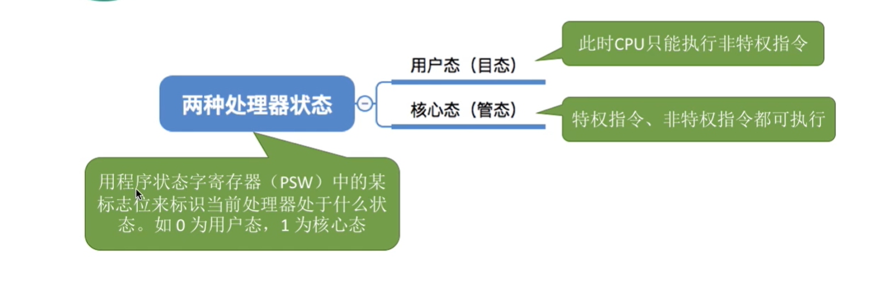
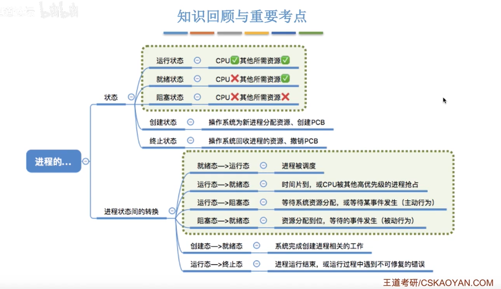
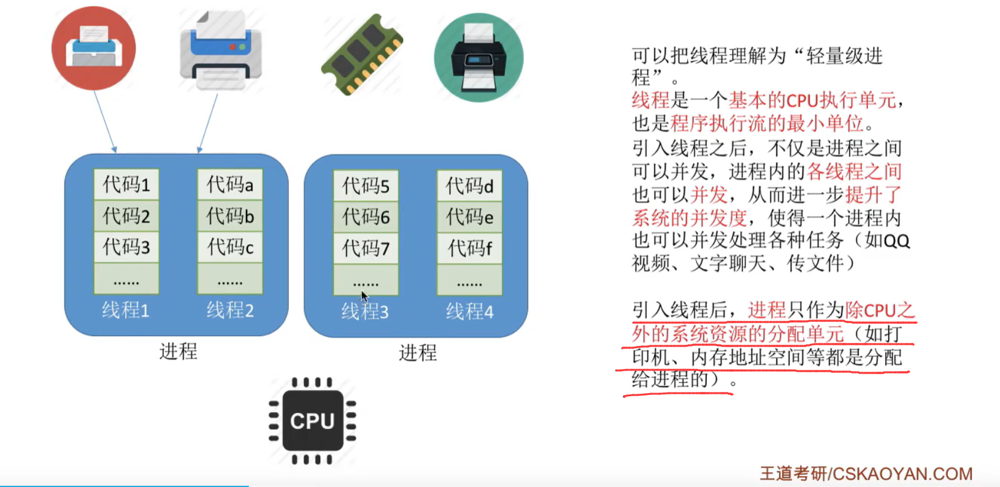
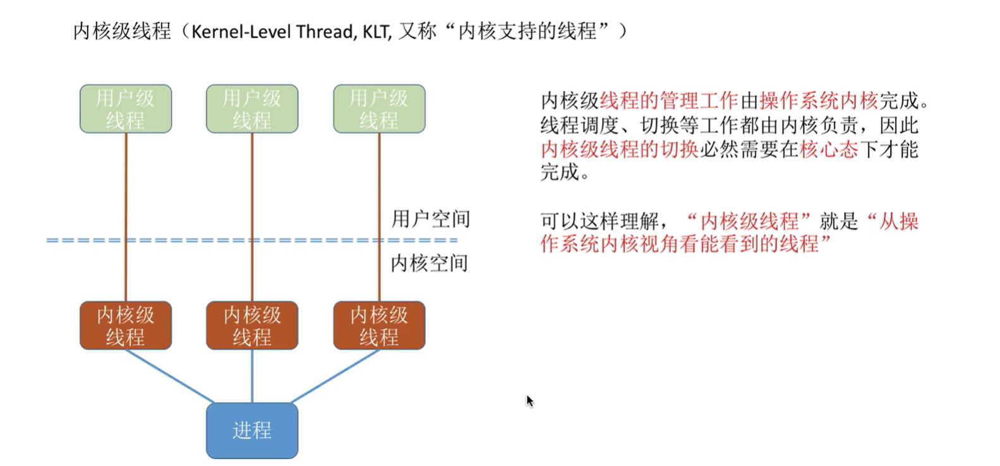
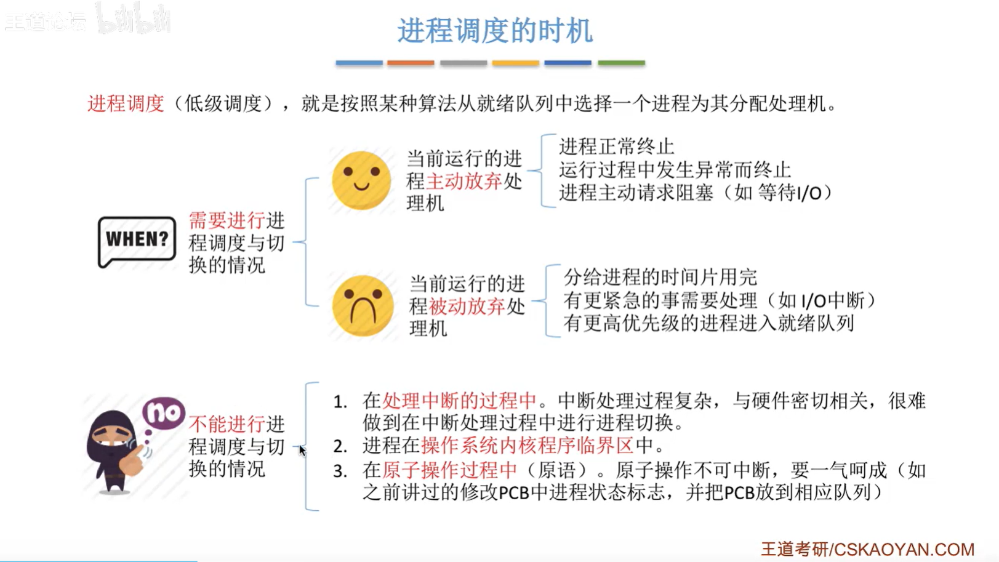

# 操作系统学习笔记

## 操作系统概念

### 操作系统的概念、功能和目标

#### 概念

#### 功能和目标

**向用户提供的服务：**

### 操作系统的特征

#### 并发

#### 共享

#### 虚拟

#### 异步

### 操作系统的发展和分类

#### 手工操作阶段

#### 单道批处理系统

#### 多道批处理系统

#### 分时操作系统

#### 实时操作系统

### ※操作系统的运行机制与体系结构

#### 运行机制

**两种指令、两种处理器状态、两种程序：**

+ **两种指令**

  

+ **两种处理器状态**

  

+ **两种程序**

  

#### 操作系统的内核

#### 操作系统的体系结构

### 中断和异常

#### 中断

##### 中断的概念和作用

##### 中断的分类

+ **第一种分类方式：**

  

+ **第二种分类方式：**

  

##### 外中断的处理过程

### 系统调用

#### 系统调用和库函数的区别

**实例解释：**

**陷入指令有的地方也称为访管指令**

## 进程

### 进程的定义、组成、组织方式和特征

#### 进程的定义

#### 进程的组成

+ **PCG**

  

#### 进程的组织

+ **链接方式**

  

  

+ **索引方式**

  

  

#### 进程的特征

### 进程的状态和状态间的转换

#### 进程的状态

+ **三种基本状态**

  

+ **另外两种状态**

  

  + **创建态**

    

  + **终止态**

    

#### 进程状态的转换

##### 补偿：进程的挂起态与七状态模型

### 进程控制

#### 什么是进程控制

 

#### 如何实现进程控制

##### 原语

**进程控制相关的原语**

### ※进程通信

#### 什么是进程通信

+ **共享空间**

  

+ **管道通信**

  

+ **消息传递**

  

### 线程概念和多线程模型

#### 线程带来的变化

#### 线程的属性

#### 线程的实现方式

+ **用户级线程**

  

+ **内核级线程**

  

+ **二者组合的方式**

  

#### 多线程模型

+ **多对一模型**

  

+ **一对一模型**

  

+ **多对多模型**

  

## 处理器调度

 

### 调度的三个层次

#### 高级调度

#### 中级调度

#### 低级调度

#### 总结

### 进程调度的时机、切换与过程、方式

#### 进程调度的时机

 

##### 内核程序临界区和临界区的区别

#### 进程调度的方式

#### 进程的切换与过程

### 调度算法的评估

#### CPU利用率

#### 系统吞吐量

#### 周转时间

#### 等待时间

#### 响应时间

### 调度算法（批处理系统）

#### 先来先服务算法（FCFS）

#### 短作业优先（SJF）/ 短进度优先（SPF）

##### 非抢占式

##### 抢占式（又称为最短剩余时间优先算法（SRTN））

#### 高响应比优先（HRRN）

