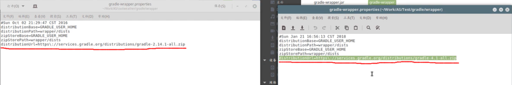

# 开源项目的寻找与学习

**[该文章总结于程序羊发布于b站的视频](https://www.bilibili.com/video/BV1y4411p74E/?spm_id_from=333.788.recommend_more_video.0)**

## 搜索

### 搜索平台

**Github**


### 搜索方法

```
常见限定符的使用：
in:name XXX		//搜索名字中包含XXX的仓库
stars:>XXX		//搜索stars数大于XXX的仓库
forks:>XXX		//搜索forks数大于XXX的仓库
in:readme XXX		//搜索readme中包含XXX的仓库 
in:description XXX		//搜索描述中有XXX的仓库
language:XXX		//搜索以XXX语言(java、C++等)编写的仓库
pushed:>XXXX-XX-XX		//搜索最后push(更新)的时间大于XXXX年XX月XX日
```


[更多限定符的使用可查看官方文档](https://docs.github.com/cn/free-pro-team@latest/github/searching-for-information-on-github/searching-for-repositories)


### 评价项目

+ **查看项目的stars数和forks数**
+ **查看项目的readme是否详细，包含技术点是否符合自己的需求**


## 弄懂一个开源项目步骤

### 了解项目

**了解项目是干什么的，自己有没有兴趣，包含哪些技术点**


### **把项目在本地跑起来**


+ **将项目git clone到本地**

  + 包含build.gradle就是用Gradle管理项目的

  + 包含pom.xml就是用Maven管理项目的

+ **在编译器中打开文件夹（如用Gradle管理，第一打开项目，会做各种下载、编译等操作，时间长的可能会需要好几个小时）(导入Android开源项目，[参考视频](https://www.bilibili.com/video/BV1AW411i76x?from=search&seid=3750676913278711973))**

  + 导入项目错误或缓慢，可能是开发工具的环境和我们本地的环境不一致**(一般有如下内容需要修改成和本地一样)**

    + 

    <center>上图build.gradle文件中gradle插件的版本不一致</center>

    + 

    <center>上图gradle/wrapper/gradle-wrapper.properties中依赖的url不一致</center>

    + 

      <center>上图compileSdkVersion、targetSdkVersion和buildToolsVersion需修改成和本地一样，修改完成并同步后，dependencies中第三排的compile可能会出错，若出错按照提示修改方法尝试即可</center>


### 阅读项目源码并调试

**通过阅读项目源码和调试功能，去理解每个功能是怎么实现的，每个功能每一步要经过的流程**


### 修改添加自定义功能和模块


