## 自己操作中使用过的命令

#### 登录（root用户下）

```
# login
login：输入用户名
Password：输入口令su
```


#### 普通用户切换到root用户并关机

```linux
$ su -
输入root用户密码
# shutdown -h now
```


#### root用户切换到已经登录的普通用户

```
# su - 普通用户名
```


## 第一章 绪论

### 微机

微型计算机称为微机，也称为个人计算机或PC。


### 基本硬件模块


### 处理器单元

处理器单元也称为中央处理单元或CPU，包含3个基本组成部分：

+ **算术逻辑单元（ALU）**

  

+ **寄存器**

  

+ **控制单元**

  


### 内存

内存一般有两种：

+ **随记存储器（RAM）**

  

+ **只读存储器（ROM）**

  


### 数据表示


### 性能指标

性能指标通常是针对每台计算机的组成部件、各部件间的通信能力和所有性能指标的综合测量。

+ **CPU速度**

  

+ **访问时间**

  

+ **通道速度**

  

+ **总体性能指标**

  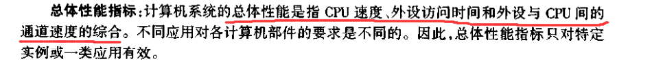


### 操作系统

操作系统的主要任务和功能


多核CPU可以最多“并行”处理和核数一样的进程，但其中的每个核任何时刻只有一个运行程序在占用它


#### 操作系统环境

介绍单任务、多任务、多用户、分时和批处理


#### 操作系统模型

**三层：**


#### 虚拟内存（页）


## 第二章 UNIX操作系统

### Unix初期


### Unix重写


**Unix操作系统有 2 个主要版本：**


**SVID**

AT&T的**UNIX标准**称为系统V用户接口定义(SVID, System V Interface Definition)


**POSIX**

其他一些UNIX操作系统和UNEX相关产品厂商联合开发了一个称为**计算环境中的可移植操作系统接口**(POSIX, Portable Operating System Interface for Computer Envimnments)。POSIX 在很大程度上是基于SVID的。


### 其他Unix系统


### Unix操作系统概要


#### Unix系统采用的是分层结构

+ **内核**

  

+ **常驻模块**

  

+ **工具层（shell）**

  

+ **虚拟计算机**

  

+ **进程**

  


### Unix的系统特性

**部分重点词：**

+ 系统工具：系统工具也称为命令


## 第三章 UNIX入门

### UNIX系统的登录和退出

#### 登录

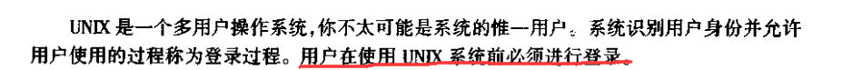


**输入用户名：**


**输入口令（密码）：**


**UNIX 系统通过显示命令提示符来表示可接受用户的命令输入。标准提示通常是一个美元符号S或百分号%，它会显示在每一行的第一个字符处**


#### 修改口令

+ **输入passwd后，输入旧口令**

  

+ **旧口令确认正确后，输入新口令：**

  

  两次输入的新口令相同，则UNIX系统将成功修改用户名口令

+ **口令格式限制：**

  


#### 退出系统

**在命令符下按组合键\[ Ctr-d](即同时按下Ctrl 键和字符键d)退出系统	**

**【注：用户只能在显示命令提示符时退出系统，而不能在进程执行过程中退出系统。**】


### 一些简单的UNIX命令

**UNIX把回车键解释为命令行的结束符。**

用户每输入一个UNIX命令，系统就执行相应的功能，然后显示一个新的命令提示符，表示可输入下一个命令。


#### 基本的命令行格式


m


+ **命令名：**

  

+ **命令选项：**

  

  

  eg.	`who -H`

+ **命令参数：**

  


#####  显示日期和时间:	date命令

+ `$ date`

  


##### 用户信息:	who命令

+ `$ who`

  

+ `$ who am i` / `who am I`

  

+ **其他命令：**

  

  


##### 显示日历：cal命令

+ `$ cal MM YYYY`

  

  


### UNIX帮助信息


#### learn 命令


#### help 命令


#### 使用电子手册：man命令


+ 输入`$ man cal`

  


### 更正键盘输入错误

+ **删除字符：[Back Space] / [Ctrl-h]**

  

+ **删除一行：[Ctrl-u]**

+ **中断程序运行：[Del] / [Ctrl-c]**

  

  

  


### 使用 shell 和系统工具

**shell是一个命令解释程序。UNIX命令由部分shell命令和系统工具组成，系统工具又是由shell查找和加载执行的可执行程序**


**shell的种类：**


+ **Bourne shell**

  

+ **Korn shell**

  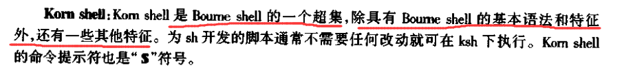

  

+ **C shell**

  


### 登录过程


+ **当UNIX系统完全启动后（init程序、getty程序）**

  

+ **用户输入用户名时（getty程序、login程序）**

  

  

  

+ **用户输入口令后（login程序、shell程序）**

  

  

+ **当用户退出系统**

  

  


## 第四章	Vi编辑器入门

### 什么是编辑器


+ **行编辑器**

  

+ **全屏编辑器**

  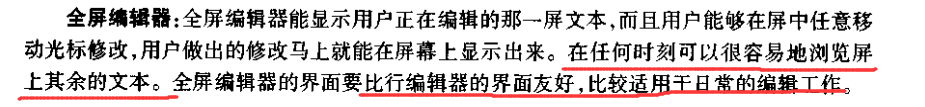


#### UNIX支持的编辑器


### vi编辑器

**vi有两个版本：**


#### vi的工作模式


+ **命令模式**

  

+ **文本输入模式**

  


**状态行：**


### 基本vi编辑器命令

#### 启动vi

**输入`vi 文件名`**


#### 退出vi（下面的命令模式中有讲解更多的退出方式）

按[Esc]，然后输入`:wq`


#### 文本输入模式


表4.2总结了**从vi的命令模式切换到文本输人模式**状态下的命令键**（按[Esc]键保证vi处于命令模式）**


**在文本输入模式下，使用空格键、[Tab]键、回退键和回车键**

和正常windows下的文本文档和word中的效果一样


#### 命令模式（注意以下所有命令只有在命令模式下才起作用）


##### **光标移动键**


##### 文本修改


**注意：**

+ **按r后，再按一个字符便会替换光标所在的字符，此时仍处于命令模式状态**
+ **而按R后，vi会进去文本输入模式，需要再按[Esc]返回到命令模式**


##### 搜索字符串：/和？的使用


##### 退出vi

**表4.5中前4个方法的使用，均为在命令行模式下，输入`：`后再输入对应的键，然后按回车，最后一个ZZ则只需要在命令行模式下直接连按即执行**


#### 存储缓冲区


### 基本命令总结


## 第五章	UNIX文件系统介绍

### 磁盘组织


### UNIX里的文件类型

**UNIX有三类文件：规则文件，目录文件，特殊文件**


### 目录详述


#### 用户主目录


#### 工作目录


#### 路径和路径名


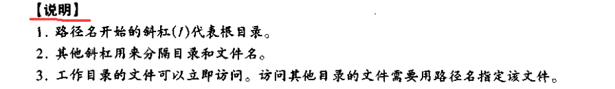


**相对路径名和绝对路径名：**


#### 使用文件和目录名


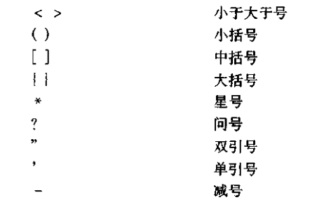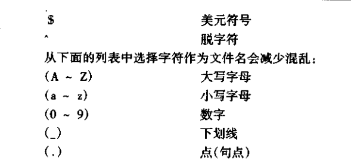


### 目录命令

#### 显示目录路径名：pwd命令


#### 改变工作目录：cd命令


#### 创建目录：mkdir命令


```linux
$ mkdir 子目录名 .................在当前工作目录创建一个新的子目录

$ mkdir memos/test ..................在memos目录下创建名为test的子目录

$ mkdir -p xx/yy/zz ...................创建目录xx；xx下创建目录yy;yy目录下创建目录zz
```


#### 删除目录：rmdir命令


#### 目录列表：ls命令


+ **`ls -l`**

  

  + **第一列：**

    

    

  + **其余列：**

    

+ **隐藏文件**

  


+ **使用多个选项**

  


### 显示文件内容

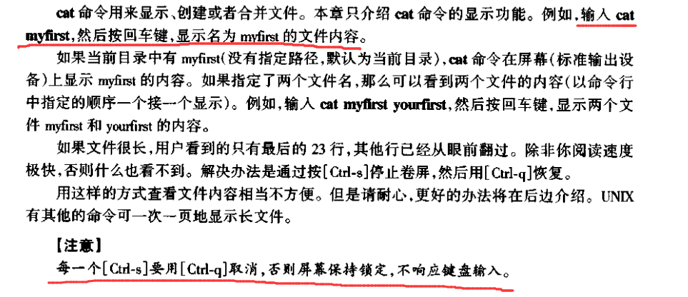


### 打印文件内容

#### 打印：lp命令


**同理一行命令中可以指定多个文件**


#### 取消打印请求


#### 获取打印机的状态：lpstat命令


### 删除文件：rm命令


### 基本命令总结


## 第六章 vi编辑器：高级使用

### 更多有关 vi 编辑器的知识


#### 调用 vi 编辑器

**vi 编辑器中新建文件**


**在 vi 中复制文件**


#### 使用 vi 调用选项

+ **只读选项：-R**

  

+ **命令选项：-c**

  


#### 编辑多文档


**编辑另一个文件：:e**


**读取另一个文件：:r**


**写入另一个文件：:w**

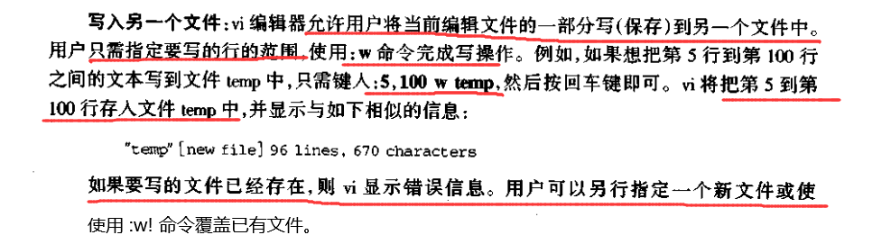


### 重排文本（剪切，复制，粘贴，清空）


#### 移动行：dd、p 或 P


#### 复制行：yy、p 或 P


### vi 操作符的域


**部分实例：**

+ `d0`

  

+ `dw`

  

+ `3dw`

  


**带域控制键的修改操作符 `c`**


+ **实例：**

  


### 在 vi 中使用缓冲区

**vi 中有两类临时缓冲区：数字编号缓冲区和命名缓冲区**


#### 数字编号缓冲区


+ 每次拾取文本到临时缓冲区中时，vi 必须将所有缓冲区中的内容依次后移一个缓冲区来空出缓冲区 1 ，接着将新内容放到缓冲区 1 中，后移过程如果缓冲区 9 中有内容将被舍弃。


#### 字母序缓冲区


### 光标定位键

+ **vi 翻页键**

  

+ `行号G`

  

+ [Ctrl - g]

  


### 定制 vi 编辑器

+ `set all`

  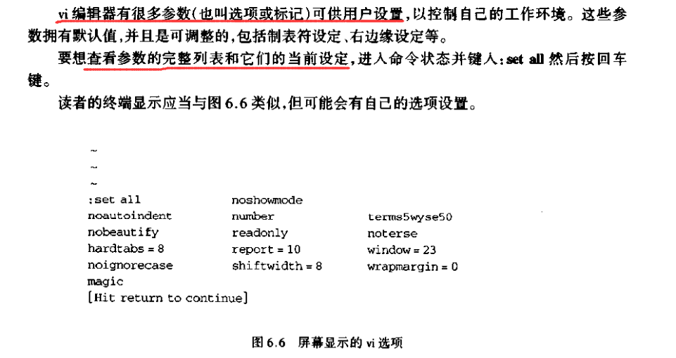


**set设置选项命令：**


+ 布尔选项

  

+ 数字式选项

  

+ 串选项

  


**set其他命名：**


#### 设置 vi 环境


**一些有用的 vi 参数：**


#### 行长度和行回绕


+ **wrapmargin：**

  


#### 缩写与宏


+ **缩写操作符（db）：**

  

  

+ **宏操作符（map）：**

  

  

  

  **实例：**

  


#### .exrc文件


**实例：**


### 最后的 vi 命令

#### 运行shell


#### 行连接


#### 搜索和替换


### 基本命名总结


## 第七章 UNIX文件系统（续）

### 读取文件


#### vi 编辑器的只读版：view命令


+ **读取文件：`pg`命令**

  

  

  

  

  **实例：**

  

+ **指定页和行数**

  


### shell 重定向


#### 输出重定向


**实例：**

+ **`>`**


+ **`>>`**

  


#### 输入重定向


**实例：**


**cat 命令和输入重定向结合**

+ **创建文件**

  

  **实例：**

  

  

+ **复制文件**

  **实例：**

  + 

  + 
  + 


### 文件格式化


+ **`pr`命令**

  

  **实例：**

  

  

  **pr选项：**

  

  


### 文件处理命令

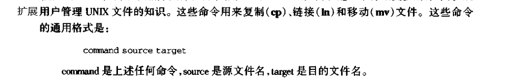


+ **复制文件：`cp`命令**

  

  

  + **cp选项：**

    

    

    

+ **移动文件：`mv`命令**

  

+ **链接文件：`ln`命令**

  


+ **计算字数：`wc`命令**

  

  + 

  + 

  + **wc选项：**

    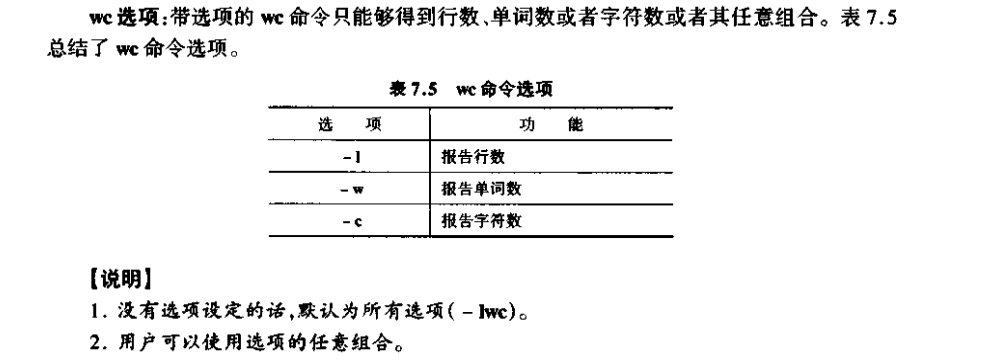


### 文件名置换

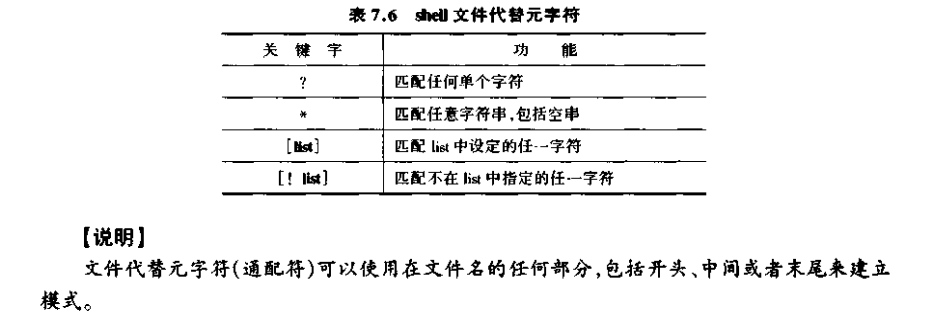

+ **`？`元字符**

  

+ **`*`元字符**

  

  

+ `[]`元字符

  

  

  

  


### 其他文件操作命令

+ **寻找文件：find命令**

  

  + **查找选项：**

    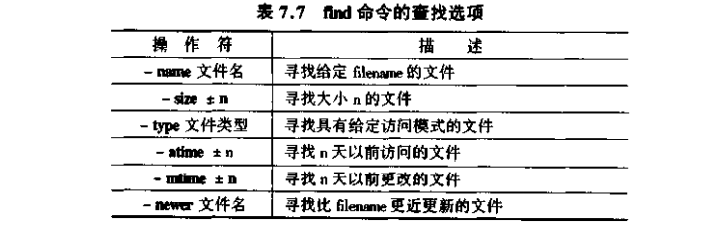

    

    

    

    

    

  + **动作选项**

    

    P135

+ **显示文件头部：`head`命令**

  

  

+ **显示文件的尾部：`tail`命令**

  

  

+ **选择文件的一部分：`cut`命令**

  

  **cut选项**

  

  

  

  

+ **链接文件：paste命令**

  

  

  

+ **另一个页面查看工具：more命令**

  


### UNIX内部：文件系统


#### UNIX磁盘结构


+ **主引导块**

  

+ **超级块**

  

+ **i 节点列表块**

  

+ **i 节点和目录**

  


#### 整体过程


+ `ls -i`

  


### 基本命令总结


## 第八章 探索 shell

### UNIX shell


**用户与操作系统通过shell进行通信**


#### shell的主要功能


**shell的主要特征：**


+ **显示信息：`echo`命令**

  

  

  

  + **消除元字符的特殊含义**

    

    + **反斜杠**

      

      

    + **双引号**

      

      

    + **单引号**

      

      


### shell变量


+ **环境变量**

  

+ **局部变量**

  


**显示和清除变量：set和unset命令**


**给变量赋值**


**显示shell变量的值**


**理解标准shell变量**


+ **HOME变量**

  

  

+ **IFS变量**

  

  

+ **MAIL变量**

  

+ **MAILCHECK变量**

  

+ **PATH变量**

  略P158~159


### 更多的元字符

P159

